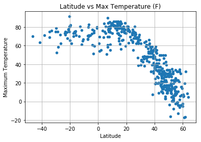
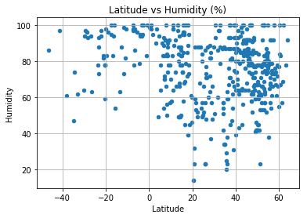
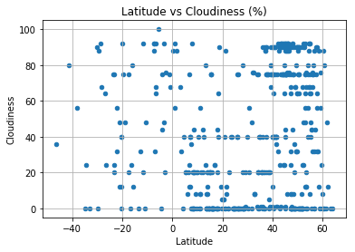
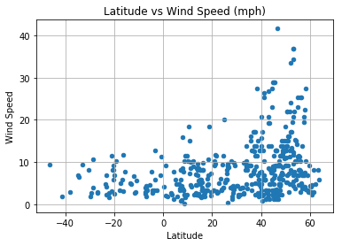

```python
# importing Dependencies
import csv
import matplotlib.pyplot as plt
import requests as req
import pandas as pd
import openweathermapy.core as ow
from citipy import citipy 
import random
```


```python
# apikey information
api_key = "25bc90a1196e6f153eece0bc0b0fc9eb"
url = "http://api.openweathermap.org/data/2.5/weather?"
units = "imperial"

```


```python
weather_json =[]

#reading the csv file
data_csv = "worldcities.csv"
num_lines = sum(1 for l in open(data_csv))

#randomly selecting 500 datas
size = int(num_lines / 93.4)
skip_idx = random.sample(range(1, num_lines), num_lines - size)
data = pd.read_csv(data_csv, skiprows=skip_idx)
for index, row in data.iterrows():
    latitude = data.iloc[index,2]
    longitude = data.iloc[index,3]
    query_url = f"{url}&units={units}&lat={latitude}&lon={longitude}&appid={api_key}"
    response = req.get(query_url)
    
    req_data = response.json()
    weather_json.append(req_data)
    print(response.url)   
```

    http://api.openweathermap.org/data/2.5/weather?&units=imperial&lat=40.0161111&lon=44.5186111&appid=25bc90a1196e6f153eece0bc0b0fc9eb
    http://api.openweathermap.org/data/2.5/weather?&units=imperial&lat=40.5688889&lon=45.231944399999996&appid=25bc90a1196e6f153eece0bc0b0fc9eb
    http://api.openweathermap.org/data/2.5/weather?&units=imperial&lat=39.201111100000006&lon=46.415&appid=25bc90a1196e6f153eece0bc0b0fc9eb
    http://api.openweathermap.org/data/2.5/weather?&units=imperial&lat=40.273055600000006&lon=45.1444444&appid=25bc90a1196e6f153eece0bc0b0fc9eb
    http://api.openweathermap.org/data/2.5/weather?&units=imperial&lat=40.218611100000004&lon=45.7694444&appid=25bc90a1196e6f153eece0bc0b0fc9eb
    http://api.openweathermap.org/data/2.5/weather?&units=imperial&lat=40.2666667&lon=44.656388899999996&appid=25bc90a1196e6f153eece0bc0b0fc9eb
    http://api.openweathermap.org/data/2.5/weather?&units=imperial&lat=12.266666699999998&lon=-69.1&appid=25bc90a1196e6f153eece0bc0b0fc9eb
    http://api.openweathermap.org/data/2.5/weather?&units=imperial&lat=-33.141559&lon=-59.309656999999994&appid=25bc90a1196e6f153eece0bc0b0fc9eb
    http://api.openweathermap.org/data/2.5/weather?&units=imperial&lat=48.299721999999996&lon=16.566667000000002&appid=25bc90a1196e6f153eece0bc0b0fc9eb
    http://api.openweathermap.org/data/2.5/weather?&units=imperial&lat=47.133333&lon=15.35&appid=25bc90a1196e6f153eece0bc0b0fc9eb
    http://api.openweathermap.org/data/2.5/weather?&units=imperial&lat=47.283056&lon=9.65&appid=25bc90a1196e6f153eece0bc0b0fc9eb
    http://api.openweathermap.org/data/2.5/weather?&units=imperial&lat=-30.296260999999998&lon=153.11351000000002&appid=25bc90a1196e6f153eece0bc0b0fc9eb
    http://api.openweathermap.org/data/2.5/weather?&units=imperial&lat=-20.312148999999998&lon=118.61058799999999&appid=25bc90a1196e6f153eece0bc0b0fc9eb
    http://api.openweathermap.org/data/2.5/weather?&units=imperial&lat=-38.159119&lon=145.931183&appid=25bc90a1196e6f153eece0bc0b0fc9eb
    http://api.openweathermap.org/data/2.5/weather?&units=imperial&lat=23.9208333&lon=90.7180556&appid=25bc90a1196e6f153eece0bc0b0fc9eb
    http://api.openweathermap.org/data/2.5/weather?&units=imperial&lat=24.45&lon=89.7166667&appid=25bc90a1196e6f153eece0bc0b0fc9eb
    http://api.openweathermap.org/data/2.5/weather?&units=imperial&lat=26.033333300000002&lon=88.4666667&appid=25bc90a1196e6f153eece0bc0b0fc9eb
    http://api.openweathermap.org/data/2.5/weather?&units=imperial&lat=50.666667&lon=5.1666669999999995&appid=25bc90a1196e6f153eece0bc0b0fc9eb
    http://api.openweathermap.org/data/2.5/weather?&units=imperial&lat=50.95&lon=4.55&appid=25bc90a1196e6f153eece0bc0b0fc9eb
    http://api.openweathermap.org/data/2.5/weather?&units=imperial&lat=50.716667&lon=3.833333&appid=25bc90a1196e6f153eece0bc0b0fc9eb
    http://api.openweathermap.org/data/2.5/weather?&units=imperial&lat=51.366667&lon=4.866667&appid=25bc90a1196e6f153eece0bc0b0fc9eb
    http://api.openweathermap.org/data/2.5/weather?&units=imperial&lat=50.133333&lon=5.35&appid=25bc90a1196e6f153eece0bc0b0fc9eb
    http://api.openweathermap.org/data/2.5/weather?&units=imperial&lat=50.583333&lon=5.866667&appid=25bc90a1196e6f153eece0bc0b0fc9eb
    http://api.openweathermap.org/data/2.5/weather?&units=imperial&lat=42.1333333&lon=24.9333333&appid=25bc90a1196e6f153eece0bc0b0fc9eb
    http://api.openweathermap.org/data/2.5/weather?&units=imperial&lat=-3.4763888999999994&lon=30.248611100000005&appid=25bc90a1196e6f153eece0bc0b0fc9eb
    http://api.openweathermap.org/data/2.5/weather?&units=imperial&lat=-17.65&lon=-62.8&appid=25bc90a1196e6f153eece0bc0b0fc9eb
    http://api.openweathermap.org/data/2.5/weather?&units=imperial&lat=-16.3666667&lon=-60.95&appid=25bc90a1196e6f153eece0bc0b0fc9eb
    http://api.openweathermap.org/data/2.5/weather?&units=imperial&lat=-22.1&lon=-56.516667000000005&appid=25bc90a1196e6f153eece0bc0b0fc9eb
    http://api.openweathermap.org/data/2.5/weather?&units=imperial&lat=-3.166667&lon=-41.866667&appid=25bc90a1196e6f153eece0bc0b0fc9eb
    http://api.openweathermap.org/data/2.5/weather?&units=imperial&lat=-23.3&lon=-47.133333&appid=25bc90a1196e6f153eece0bc0b0fc9eb
    http://api.openweathermap.org/data/2.5/weather?&units=imperial&lat=-6.65&lon=-35.783333&appid=25bc90a1196e6f153eece0bc0b0fc9eb
    http://api.openweathermap.org/data/2.5/weather?&units=imperial&lat=-29.683333&lon=-51.05&appid=25bc90a1196e6f153eece0bc0b0fc9eb
    http://api.openweathermap.org/data/2.5/weather?&units=imperial&lat=-23.616667&lon=-46.933333000000005&appid=25bc90a1196e6f153eece0bc0b0fc9eb
    http://api.openweathermap.org/data/2.5/weather?&units=imperial&lat=-0.716667&lon=-47.833333&appid=25bc90a1196e6f153eece0bc0b0fc9eb
    http://api.openweathermap.org/data/2.5/weather?&units=imperial&lat=-6.783333&lon=-43.016667&appid=25bc90a1196e6f153eece0bc0b0fc9eb
    http://api.openweathermap.org/data/2.5/weather?&units=imperial&lat=-28.7&lon=-49.3&appid=25bc90a1196e6f153eece0bc0b0fc9eb
    http://api.openweathermap.org/data/2.5/weather?&units=imperial&lat=-20.2484&lon=-43.8063&appid=25bc90a1196e6f153eece0bc0b0fc9eb
    http://api.openweathermap.org/data/2.5/weather?&units=imperial&lat=-23.316667000000002&lon=-45.966667&appid=25bc90a1196e6f153eece0bc0b0fc9eb
    http://api.openweathermap.org/data/2.5/weather?&units=imperial&lat=-7.283333&lon=-38.95&appid=25bc90a1196e6f153eece0bc0b0fc9eb
    http://api.openweathermap.org/data/2.5/weather?&units=imperial&lat=-21.15&lon=-51.1&appid=25bc90a1196e6f153eece0bc0b0fc9eb
    http://api.openweathermap.org/data/2.5/weather?&units=imperial&lat=-11.866667&lon=-40.466667&appid=25bc90a1196e6f153eece0bc0b0fc9eb
    http://api.openweathermap.org/data/2.5/weather?&units=imperial&lat=-13.433333&lon=-42.25&appid=25bc90a1196e6f153eece0bc0b0fc9eb
    http://api.openweathermap.org/data/2.5/weather?&units=imperial&lat=-5.45&lon=-39.716667&appid=25bc90a1196e6f153eece0bc0b0fc9eb
    http://api.openweathermap.org/data/2.5/weather?&units=imperial&lat=-23.2&lon=-49.383333&appid=25bc90a1196e6f153eece0bc0b0fc9eb
    http://api.openweathermap.org/data/2.5/weather?&units=imperial&lat=-17.35&lon=-44.933333000000005&appid=25bc90a1196e6f153eece0bc0b0fc9eb
    http://api.openweathermap.org/data/2.5/weather?&units=imperial&lat=-15.733332999999998&lon=-43.033333&appid=25bc90a1196e6f153eece0bc0b0fc9eb
    http://api.openweathermap.org/data/2.5/weather?&units=imperial&lat=-4.216667&lon=-38.716667&appid=25bc90a1196e6f153eece0bc0b0fc9eb
    http://api.openweathermap.org/data/2.5/weather?&units=imperial&lat=-22.016667&lon=-47.9&appid=25bc90a1196e6f153eece0bc0b0fc9eb
    http://api.openweathermap.org/data/2.5/weather?&units=imperial&lat=-16.716667&lon=-49.083333&appid=25bc90a1196e6f153eece0bc0b0fc9eb
    http://api.openweathermap.org/data/2.5/weather?&units=imperial&lat=43.833333&lon=-80.533333&appid=25bc90a1196e6f153eece0bc0b0fc9eb
    http://api.openweathermap.org/data/2.5/weather?&units=imperial&lat=48.4&lon=-71.68333299999999&appid=25bc90a1196e6f153eece0bc0b0fc9eb
    http://api.openweathermap.org/data/2.5/weather?&units=imperial&lat=48.8&lon=-79.2&appid=25bc90a1196e6f153eece0bc0b0fc9eb
    http://api.openweathermap.org/data/2.5/weather?&units=imperial&lat=45.95&lon=-73.583333&appid=25bc90a1196e6f153eece0bc0b0fc9eb
    http://api.openweathermap.org/data/2.5/weather?&units=imperial&lat=42.966667&lon=-82.4&appid=25bc90a1196e6f153eece0bc0b0fc9eb
    http://api.openweathermap.org/data/2.5/weather?&units=imperial&lat=55.283333&lon=-114.78333300000001&appid=25bc90a1196e6f153eece0bc0b0fc9eb
    http://api.openweathermap.org/data/2.5/weather?&units=imperial&lat=-7.3&lon=27.416666999999997&appid=25bc90a1196e6f153eece0bc0b0fc9eb
    http://api.openweathermap.org/data/2.5/weather?&units=imperial&lat=47.366429&lon=7.329005&appid=25bc90a1196e6f153eece0bc0b0fc9eb
    http://api.openweathermap.org/data/2.5/weather?&units=imperial&lat=47.25208&lon=8.77437&appid=25bc90a1196e6f153eece0bc0b0fc9eb
    http://api.openweathermap.org/data/2.5/weather?&units=imperial&lat=46.015621&lon=8.945343&appid=25bc90a1196e6f153eece0bc0b0fc9eb
    http://api.openweathermap.org/data/2.5/weather?&units=imperial&lat=47.31382&lon=7.925327&appid=25bc90a1196e6f153eece0bc0b0fc9eb
    http://api.openweathermap.org/data/2.5/weather?&units=imperial&lat=47.170881&lon=8.111132000000001&appid=25bc90a1196e6f153eece0bc0b0fc9eb
    http://api.openweathermap.org/data/2.5/weather?&units=imperial&lat=47.366667&lon=8.55&appid=25bc90a1196e6f153eece0bc0b0fc9eb
    http://api.openweathermap.org/data/2.5/weather?&units=imperial&lat=5.205148&lon=-4.414604&appid=25bc90a1196e6f153eece0bc0b0fc9eb
    http://api.openweathermap.org/data/2.5/weather?&units=imperial&lat=-34.7&lon=-71.05&appid=25bc90a1196e6f153eece0bc0b0fc9eb
    http://api.openweathermap.org/data/2.5/weather?&units=imperial&lat=5.883333299999999&lon=10.016666699999998&appid=25bc90a1196e6f153eece0bc0b0fc9eb
    http://api.openweathermap.org/data/2.5/weather?&units=imperial&lat=6.75&lon=11.816666699999999&appid=25bc90a1196e6f153eece0bc0b0fc9eb
    http://api.openweathermap.org/data/2.5/weather?&units=imperial&lat=3.65&lon=10.766666699999998&appid=25bc90a1196e6f153eece0bc0b0fc9eb
    http://api.openweathermap.org/data/2.5/weather?&units=imperial&lat=4.454444400000001&lon=9.9655556&appid=25bc90a1196e6f153eece0bc0b0fc9eb
    http://api.openweathermap.org/data/2.5/weather?&units=imperial&lat=32.940833000000005&lon=117.36083300000001&appid=25bc90a1196e6f153eece0bc0b0fc9eb
    http://api.openweathermap.org/data/2.5/weather?&units=imperial&lat=31.616111&lon=113.815556&appid=25bc90a1196e6f153eece0bc0b0fc9eb
    http://api.openweathermap.org/data/2.5/weather?&units=imperial&lat=32.266042999999996&lon=111.634759&appid=25bc90a1196e6f153eece0bc0b0fc9eb
    http://api.openweathermap.org/data/2.5/weather?&units=imperial&lat=30.65&lon=113.766667&appid=25bc90a1196e6f153eece0bc0b0fc9eb
    http://api.openweathermap.org/data/2.5/weather?&units=imperial&lat=32.385833&lon=111.667778&appid=25bc90a1196e6f153eece0bc0b0fc9eb
    http://api.openweathermap.org/data/2.5/weather?&units=imperial&lat=24.922707&lon=102.484959&appid=25bc90a1196e6f153eece0bc0b0fc9eb
    http://api.openweathermap.org/data/2.5/weather?&units=imperial&lat=24.516667&lon=103.766667&appid=25bc90a1196e6f153eece0bc0b0fc9eb
    http://api.openweathermap.org/data/2.5/weather?&units=imperial&lat=24.355&lon=102.542222&appid=25bc90a1196e6f153eece0bc0b0fc9eb
    http://api.openweathermap.org/data/2.5/weather?&units=imperial&lat=7.065278&lon=-73.854722&appid=25bc90a1196e6f153eece0bc0b0fc9eb
    http://api.openweathermap.org/data/2.5/weather?&units=imperial&lat=1.8399439999999998&lon=-76.968889&appid=25bc90a1196e6f153eece0bc0b0fc9eb
    http://api.openweathermap.org/data/2.5/weather?&units=imperial&lat=8.510637&lon=-73.447755&appid=25bc90a1196e6f153eece0bc0b0fc9eb
    http://api.openweathermap.org/data/2.5/weather?&units=imperial&lat=10.520664&lon=-74.185037&appid=25bc90a1196e6f153eece0bc0b0fc9eb
    http://api.openweathermap.org/data/2.5/weather?&units=imperial&lat=5.315691&lon=-75.79826&appid=25bc90a1196e6f153eece0bc0b0fc9eb
    http://api.openweathermap.org/data/2.5/weather?&units=imperial&lat=10.719722&lon=-74.682778&appid=25bc90a1196e6f153eece0bc0b0fc9eb
    http://api.openweathermap.org/data/2.5/weather?&units=imperial&lat=6.555733999999999&lon=-73.133088&appid=25bc90a1196e6f153eece0bc0b0fc9eb
    http://api.openweathermap.org/data/2.5/weather?&units=imperial&lat=6.647375&lon=-75.460305&appid=25bc90a1196e6f153eece0bc0b0fc9eb
    http://api.openweathermap.org/data/2.5/weather?&units=imperial&lat=1.033333&lon=-77.6&appid=25bc90a1196e6f153eece0bc0b0fc9eb
    http://api.openweathermap.org/data/2.5/weather?&units=imperial&lat=4.351111&lon=-72.456389&appid=25bc90a1196e6f153eece0bc0b0fc9eb
    http://api.openweathermap.org/data/2.5/weather?&units=imperial&lat=8.258014&lon=-76.149275&appid=25bc90a1196e6f153eece0bc0b0fc9eb
    http://api.openweathermap.org/data/2.5/weather?&units=imperial&lat=50.449220000000004&lon=13.717491&appid=25bc90a1196e6f153eece0bc0b0fc9eb
    http://api.openweathermap.org/data/2.5/weather?&units=imperial&lat=49.690165&lon=13.66891&appid=25bc90a1196e6f153eece0bc0b0fc9eb
    http://api.openweathermap.org/data/2.5/weather?&units=imperial&lat=49.936421&lon=14.708604000000001&appid=25bc90a1196e6f153eece0bc0b0fc9eb
    http://api.openweathermap.org/data/2.5/weather?&units=imperial&lat=50.178428000000004&lon=12.647147&appid=25bc90a1196e6f153eece0bc0b0fc9eb
    http://api.openweathermap.org/data/2.5/weather?&units=imperial&lat=49.979968&lon=12.864322&appid=25bc90a1196e6f153eece0bc0b0fc9eb
    http://api.openweathermap.org/data/2.5/weather?&units=imperial&lat=53.916667000000004&lon=10.7&appid=25bc90a1196e6f153eece0bc0b0fc9eb
    http://api.openweathermap.org/data/2.5/weather?&units=imperial&lat=51.983333&lon=9.116667&appid=25bc90a1196e6f153eece0bc0b0fc9eb
    http://api.openweathermap.org/data/2.5/weather?&units=imperial&lat=47.833333&lon=8.533333&appid=25bc90a1196e6f153eece0bc0b0fc9eb
    http://api.openweathermap.org/data/2.5/weather?&units=imperial&lat=51.9&lon=11.766667&appid=25bc90a1196e6f153eece0bc0b0fc9eb
    http://api.openweathermap.org/data/2.5/weather?&units=imperial&lat=48.883333&lon=11.183333&appid=25bc90a1196e6f153eece0bc0b0fc9eb
    http://api.openweathermap.org/data/2.5/weather?&units=imperial&lat=53.45&lon=7.8333330000000005&appid=25bc90a1196e6f153eece0bc0b0fc9eb
    http://api.openweathermap.org/data/2.5/weather?&units=imperial&lat=50.066666999999995&lon=8.466667&appid=25bc90a1196e6f153eece0bc0b0fc9eb
    http://api.openweathermap.org/data/2.5/weather?&units=imperial&lat=54.2&lon=9.1&appid=25bc90a1196e6f153eece0bc0b0fc9eb
    http://api.openweathermap.org/data/2.5/weather?&units=imperial&lat=50.983333&lon=13.866667000000001&appid=25bc90a1196e6f153eece0bc0b0fc9eb
    http://api.openweathermap.org/data/2.5/weather?&units=imperial&lat=51.65&lon=10.333333&appid=25bc90a1196e6f153eece0bc0b0fc9eb
    http://api.openweathermap.org/data/2.5/weather?&units=imperial&lat=52.333333&lon=8.75&appid=25bc90a1196e6f153eece0bc0b0fc9eb
    http://api.openweathermap.org/data/2.5/weather?&units=imperial&lat=49.45&lon=7.75&appid=25bc90a1196e6f153eece0bc0b0fc9eb
    http://api.openweathermap.org/data/2.5/weather?&units=imperial&lat=48.2&lon=11.333333&appid=25bc90a1196e6f153eece0bc0b0fc9eb
    http://api.openweathermap.org/data/2.5/weather?&units=imperial&lat=51.483333&lon=8.45&appid=25bc90a1196e6f153eece0bc0b0fc9eb
    http://api.openweathermap.org/data/2.5/weather?&units=imperial&lat=49.75&lon=6.633333&appid=25bc90a1196e6f153eece0bc0b0fc9eb
    http://api.openweathermap.org/data/2.5/weather?&units=imperial&lat=51.2&lon=8.533333&appid=25bc90a1196e6f153eece0bc0b0fc9eb
    http://api.openweathermap.org/data/2.5/weather?&units=imperial&lat=50.65&lon=10.65&appid=25bc90a1196e6f153eece0bc0b0fc9eb
    http://api.openweathermap.org/data/2.5/weather?&units=imperial&lat=56.694701&lon=9.493357000000001&appid=25bc90a1196e6f153eece0bc0b0fc9eb
    http://api.openweathermap.org/data/2.5/weather?&units=imperial&lat=55.68923&lon=11.847246&appid=25bc90a1196e6f153eece0bc0b0fc9eb
    http://api.openweathermap.org/data/2.5/weather?&units=imperial&lat=55.662115&lon=12.186975&appid=25bc90a1196e6f153eece0bc0b0fc9eb
    http://api.openweathermap.org/data/2.5/weather?&units=imperial&lat=56.068234&lon=12.557821&appid=25bc90a1196e6f153eece0bc0b0fc9eb
    http://api.openweathermap.org/data/2.5/weather?&units=imperial&lat=54.7655&lon=11.875085&appid=25bc90a1196e6f153eece0bc0b0fc9eb
    http://api.openweathermap.org/data/2.5/weather?&units=imperial&lat=54.910633999999995&lon=9.792843&appid=25bc90a1196e6f153eece0bc0b0fc9eb
    http://api.openweathermap.org/data/2.5/weather?&units=imperial&lat=34.1088889&lon=2.1019444&appid=25bc90a1196e6f153eece0bc0b0fc9eb
    http://api.openweathermap.org/data/2.5/weather?&units=imperial&lat=36.2675&lon=2.75&appid=25bc90a1196e6f153eece0bc0b0fc9eb
    http://api.openweathermap.org/data/2.5/weather?&units=imperial&lat=-1.05&lon=-80.45&appid=25bc90a1196e6f153eece0bc0b0fc9eb
    http://api.openweathermap.org/data/2.5/weather?&units=imperial&lat=58.145277799999995&lon=25.044166699999998&appid=25bc90a1196e6f153eece0bc0b0fc9eb
    http://api.openweathermap.org/data/2.5/weather?&units=imperial&lat=41.353534&lon=-1.643184&appid=25bc90a1196e6f153eece0bc0b0fc9eb
    http://api.openweathermap.org/data/2.5/weather?&units=imperial&lat=38.739751&lon=-0.439759&appid=25bc90a1196e6f153eece0bc0b0fc9eb
    http://api.openweathermap.org/data/2.5/weather?&units=imperial&lat=36.966297999999995&lon=-2.204491&appid=25bc90a1196e6f153eece0bc0b0fc9eb
    http://api.openweathermap.org/data/2.5/weather?&units=imperial&lat=28.064123&lon=-15.548098999999999&appid=25bc90a1196e6f153eece0bc0b0fc9eb
    http://api.openweathermap.org/data/2.5/weather?&units=imperial&lat=62.0666667&lon=-7.3&appid=25bc90a1196e6f153eece0bc0b0fc9eb
    http://api.openweathermap.org/data/2.5/weather?&units=imperial&lat=47.49181&lon=3.9147230000000004&appid=25bc90a1196e6f153eece0bc0b0fc9eb
    http://api.openweathermap.org/data/2.5/weather?&units=imperial&lat=50.492985&lon=2.96826&appid=25bc90a1196e6f153eece0bc0b0fc9eb
    http://api.openweathermap.org/data/2.5/weather?&units=imperial&lat=46.481235999999996&lon=3.979459&appid=25bc90a1196e6f153eece0bc0b0fc9eb
    http://api.openweathermap.org/data/2.5/weather?&units=imperial&lat=48.995532&lon=1.7408139999999999&appid=25bc90a1196e6f153eece0bc0b0fc9eb
    http://api.openweathermap.org/data/2.5/weather?&units=imperial&lat=47.817099&lon=6.364997&appid=25bc90a1196e6f153eece0bc0b0fc9eb
    http://api.openweathermap.org/data/2.5/weather?&units=imperial&lat=49.258998999999996&lon=2.437766&appid=25bc90a1196e6f153eece0bc0b0fc9eb
    http://api.openweathermap.org/data/2.5/weather?&units=imperial&lat=44.558378999999995&lon=4.750937&appid=25bc90a1196e6f153eece0bc0b0fc9eb
    http://api.openweathermap.org/data/2.5/weather?&units=imperial&lat=48.909238&lon=2.137539&appid=25bc90a1196e6f153eece0bc0b0fc9eb
    http://api.openweathermap.org/data/2.5/weather?&units=imperial&lat=46.583333&lon=0.333333&appid=25bc90a1196e6f153eece0bc0b0fc9eb
    http://api.openweathermap.org/data/2.5/weather?&units=imperial&lat=46.041786&lon=4.0496550000000004&appid=25bc90a1196e6f153eece0bc0b0fc9eb
    http://api.openweathermap.org/data/2.5/weather?&units=imperial&lat=48.510504&lon=-2.765927&appid=25bc90a1196e6f153eece0bc0b0fc9eb
    http://api.openweathermap.org/data/2.5/weather?&units=imperial&lat=47.911271&lon=1.8648330000000002&appid=25bc90a1196e6f153eece0bc0b0fc9eb
    http://api.openweathermap.org/data/2.5/weather?&units=imperial&lat=48.774128999999995&lon=2.017811&appid=25bc90a1196e6f153eece0bc0b0fc9eb
    http://api.openweathermap.org/data/2.5/weather?&units=imperial&lat=53.15&lon=-4.266667&appid=25bc90a1196e6f153eece0bc0b0fc9eb
    http://api.openweathermap.org/data/2.5/weather?&units=imperial&lat=57.533333&lon=-2.933333&appid=25bc90a1196e6f153eece0bc0b0fc9eb
    http://api.openweathermap.org/data/2.5/weather?&units=imperial&lat=56.333332999999996&lon=-3.25&appid=25bc90a1196e6f153eece0bc0b0fc9eb
    http://api.openweathermap.org/data/2.5/weather?&units=imperial&lat=57.683333&lon=-2.066667&appid=25bc90a1196e6f153eece0bc0b0fc9eb
    http://api.openweathermap.org/data/2.5/weather?&units=imperial&lat=55.933333&lon=-3.833333&appid=25bc90a1196e6f153eece0bc0b0fc9eb
    http://api.openweathermap.org/data/2.5/weather?&units=imperial&lat=52.8&lon=-2.1&appid=25bc90a1196e6f153eece0bc0b0fc9eb
    http://api.openweathermap.org/data/2.5/weather?&units=imperial&lat=54.9&lon=-5.033333&appid=25bc90a1196e6f153eece0bc0b0fc9eb
    http://api.openweathermap.org/data/2.5/weather?&units=imperial&lat=57.9&lon=-5.1666669999999995&appid=25bc90a1196e6f153eece0bc0b0fc9eb
    http://api.openweathermap.org/data/2.5/weather?&units=imperial&lat=58.433333&lon=-3.083333&appid=25bc90a1196e6f153eece0bc0b0fc9eb
    http://api.openweathermap.org/data/2.5/weather?&units=imperial&lat=41.631111100000005&lon=42.4152778&appid=25bc90a1196e6f153eece0bc0b0fc9eb
    http://api.openweathermap.org/data/2.5/weather?&units=imperial&lat=3.1666667&lon=-52.35&appid=25bc90a1196e6f153eece0bc0b0fc9eb
    http://api.openweathermap.org/data/2.5/weather?&units=imperial&lat=7.747222200000001&lon=-8.823888900000002&appid=25bc90a1196e6f153eece0bc0b0fc9eb
    http://api.openweathermap.org/data/2.5/weather?&units=imperial&lat=38.1333333&lon=23.85&appid=25bc90a1196e6f153eece0bc0b0fc9eb
    http://api.openweathermap.org/data/2.5/weather?&units=imperial&lat=37.6833333&lon=22.966666699999998&appid=25bc90a1196e6f153eece0bc0b0fc9eb
    http://api.openweathermap.org/data/2.5/weather?&units=imperial&lat=38.0166667&lon=23.8333333&appid=25bc90a1196e6f153eece0bc0b0fc9eb
    http://api.openweathermap.org/data/2.5/weather?&units=imperial&lat=36.95&lon=26.983333299999998&appid=25bc90a1196e6f153eece0bc0b0fc9eb
    http://api.openweathermap.org/data/2.5/weather?&units=imperial&lat=39.383888899999995&lon=20.1133333&appid=25bc90a1196e6f153eece0bc0b0fc9eb
    http://api.openweathermap.org/data/2.5/weather?&units=imperial&lat=39.1375&lon=20.958888899999998&appid=25bc90a1196e6f153eece0bc0b0fc9eb
    http://api.openweathermap.org/data/2.5/weather?&units=imperial&lat=40.2447222&lon=22.379722199999996&appid=25bc90a1196e6f153eece0bc0b0fc9eb
    http://api.openweathermap.org/data/2.5/weather?&units=imperial&lat=37.1166667&lon=25.2333333&appid=25bc90a1196e6f153eece0bc0b0fc9eb
    http://api.openweathermap.org/data/2.5/weather?&units=imperial&lat=39.2769444&lon=21.7330556&appid=25bc90a1196e6f153eece0bc0b0fc9eb
    http://api.openweathermap.org/data/2.5/weather?&units=imperial&lat=40.8166667&lon=22.4086111&appid=25bc90a1196e6f153eece0bc0b0fc9eb
    http://api.openweathermap.org/data/2.5/weather?&units=imperial&lat=39.3333333&lon=26.1833333&appid=25bc90a1196e6f153eece0bc0b0fc9eb
    http://api.openweathermap.org/data/2.5/weather?&units=imperial&lat=37.3166667&lon=23.15&appid=25bc90a1196e6f153eece0bc0b0fc9eb
    http://api.openweathermap.org/data/2.5/weather?&units=imperial&lat=39.4066667&lon=20.25&appid=25bc90a1196e6f153eece0bc0b0fc9eb
    http://api.openweathermap.org/data/2.5/weather?&units=imperial&lat=15.566667&lon=-89.81666700000001&appid=25bc90a1196e6f153eece0bc0b0fc9eb
    http://api.openweathermap.org/data/2.5/weather?&units=imperial&lat=14.533332999999999&lon=-91.31666700000001&appid=25bc90a1196e6f153eece0bc0b0fc9eb
    http://api.openweathermap.org/data/2.5/weather?&units=imperial&lat=14.833333300000001&lon=-88.5&appid=25bc90a1196e6f153eece0bc0b0fc9eb
    http://api.openweathermap.org/data/2.5/weather?&units=imperial&lat=14.133333300000002&lon=-87.1166667&appid=25bc90a1196e6f153eece0bc0b0fc9eb
    http://api.openweathermap.org/data/2.5/weather?&units=imperial&lat=15.083333300000001&lon=-87.8833333&appid=25bc90a1196e6f153eece0bc0b0fc9eb
    http://api.openweathermap.org/data/2.5/weather?&units=imperial&lat=14.3&lon=-89.0&appid=25bc90a1196e6f153eece0bc0b0fc9eb
    http://api.openweathermap.org/data/2.5/weather?&units=imperial&lat=15.016666699999998&lon=-88.0&appid=25bc90a1196e6f153eece0bc0b0fc9eb
    http://api.openweathermap.org/data/2.5/weather?&units=imperial&lat=43.55&lon=16.5&appid=25bc90a1196e6f153eece0bc0b0fc9eb
    http://api.openweathermap.org/data/2.5/weather?&units=imperial&lat=18.5108333&lon=-72.6338889&appid=25bc90a1196e6f153eece0bc0b0fc9eb
    http://api.openweathermap.org/data/2.5/weather?&units=imperial&lat=48.216667&lon=20.8&appid=25bc90a1196e6f153eece0bc0b0fc9eb
    http://api.openweathermap.org/data/2.5/weather?&units=imperial&lat=47.242005&lon=19.364667999999998&appid=25bc90a1196e6f153eece0bc0b0fc9eb
    http://api.openweathermap.org/data/2.5/weather?&units=imperial&lat=47.903827&lon=22.336302&appid=25bc90a1196e6f153eece0bc0b0fc9eb
    http://api.openweathermap.org/data/2.5/weather?&units=imperial&lat=48.25&lon=21.433332999999998&appid=25bc90a1196e6f153eece0bc0b0fc9eb
    http://api.openweathermap.org/data/2.5/weather?&units=imperial&lat=46.624171000000004&lon=19.951564&appid=25bc90a1196e6f153eece0bc0b0fc9eb
    http://api.openweathermap.org/data/2.5/weather?&units=imperial&lat=47.923235&lon=20.029716&appid=25bc90a1196e6f153eece0bc0b0fc9eb
    http://api.openweathermap.org/data/2.5/weather?&units=imperial&lat=-6.9517&lon=110.0676&appid=25bc90a1196e6f153eece0bc0b0fc9eb
    http://api.openweathermap.org/data/2.5/weather?&units=imperial&lat=-6.803889&lon=107.867222&appid=25bc90a1196e6f153eece0bc0b0fc9eb
    http://api.openweathermap.org/data/2.5/weather?&units=imperial&lat=53.156111100000004&lon=-6.914444400000001&appid=25bc90a1196e6f153eece0bc0b0fc9eb
    http://api.openweathermap.org/data/2.5/weather?&units=imperial&lat=53.221388899999994&lon=-6.995&appid=25bc90a1196e6f153eece0bc0b0fc9eb
    http://api.openweathermap.org/data/2.5/weather?&units=imperial&lat=52.2583333&lon=-7.1119444000000005&appid=25bc90a1196e6f153eece0bc0b0fc9eb
    http://api.openweathermap.org/data/2.5/weather?&units=imperial&lat=32.761666999999996&lon=34.971944&appid=25bc90a1196e6f153eece0bc0b0fc9eb
    http://api.openweathermap.org/data/2.5/weather?&units=imperial&lat=32.792124&lon=35.329840999999995&appid=25bc90a1196e6f153eece0bc0b0fc9eb
    http://api.openweathermap.org/data/2.5/weather?&units=imperial&lat=21.6&lon=73.0&appid=25bc90a1196e6f153eece0bc0b0fc9eb
    http://api.openweathermap.org/data/2.5/weather?&units=imperial&lat=26.45&lon=85.4&appid=25bc90a1196e6f153eece0bc0b0fc9eb
    http://api.openweathermap.org/data/2.5/weather?&units=imperial&lat=22.416667&lon=72.9&appid=25bc90a1196e6f153eece0bc0b0fc9eb
    http://api.openweathermap.org/data/2.5/weather?&units=imperial&lat=16.7&lon=78.93333299999999&appid=25bc90a1196e6f153eece0bc0b0fc9eb
    http://api.openweathermap.org/data/2.5/weather?&units=imperial&lat=28.433333&lon=77.31666700000001&appid=25bc90a1196e6f153eece0bc0b0fc9eb
    http://api.openweathermap.org/data/2.5/weather?&units=imperial&lat=27.983333000000002&lon=74.95&appid=25bc90a1196e6f153eece0bc0b0fc9eb
    http://api.openweathermap.org/data/2.5/weather?&units=imperial&lat=26.3&lon=87.25&appid=25bc90a1196e6f153eece0bc0b0fc9eb
    http://api.openweathermap.org/data/2.5/weather?&units=imperial&lat=27.5&lon=76.983333&appid=25bc90a1196e6f153eece0bc0b0fc9eb
    http://api.openweathermap.org/data/2.5/weather?&units=imperial&lat=17.483333&lon=78.81666700000001&appid=25bc90a1196e6f153eece0bc0b0fc9eb
    http://api.openweathermap.org/data/2.5/weather?&units=imperial&lat=26.25&lon=81.533333&appid=25bc90a1196e6f153eece0bc0b0fc9eb
    http://api.openweathermap.org/data/2.5/weather?&units=imperial&lat=26.583333000000003&lon=86.15&appid=25bc90a1196e6f153eece0bc0b0fc9eb
    http://api.openweathermap.org/data/2.5/weather?&units=imperial&lat=19.616667&lon=76.7&appid=25bc90a1196e6f153eece0bc0b0fc9eb
    http://api.openweathermap.org/data/2.5/weather?&units=imperial&lat=26.883333&lon=80.8&appid=25bc90a1196e6f153eece0bc0b0fc9eb
    http://api.openweathermap.org/data/2.5/weather?&units=imperial&lat=8.666667&lon=77.483333&appid=25bc90a1196e6f153eece0bc0b0fc9eb
    http://api.openweathermap.org/data/2.5/weather?&units=imperial&lat=24.0436&lon=78.3319&appid=25bc90a1196e6f153eece0bc0b0fc9eb
    http://api.openweathermap.org/data/2.5/weather?&units=imperial&lat=9.833333&lon=77.31666700000001&appid=25bc90a1196e6f153eece0bc0b0fc9eb
    http://api.openweathermap.org/data/2.5/weather?&units=imperial&lat=15.766667000000002&lon=76.2&appid=25bc90a1196e6f153eece0bc0b0fc9eb
    http://api.openweathermap.org/data/2.5/weather?&units=imperial&lat=24.55&lon=92.6&appid=25bc90a1196e6f153eece0bc0b0fc9eb
    http://api.openweathermap.org/data/2.5/weather?&units=imperial&lat=28.983333000000002&lon=76.3&appid=25bc90a1196e6f153eece0bc0b0fc9eb
    http://api.openweathermap.org/data/2.5/weather?&units=imperial&lat=29.083333000000003&lon=77.866667&appid=25bc90a1196e6f153eece0bc0b0fc9eb
    http://api.openweathermap.org/data/2.5/weather?&units=imperial&lat=18.033333&lon=78.43333299999999&appid=25bc90a1196e6f153eece0bc0b0fc9eb
    http://api.openweathermap.org/data/2.5/weather?&units=imperial&lat=22.2&lon=78.766667&appid=25bc90a1196e6f153eece0bc0b0fc9eb
    http://api.openweathermap.org/data/2.5/weather?&units=imperial&lat=25.333333&lon=84.416667&appid=25bc90a1196e6f153eece0bc0b0fc9eb
    http://api.openweathermap.org/data/2.5/weather?&units=imperial&lat=22.714167&lon=88.347778&appid=25bc90a1196e6f153eece0bc0b0fc9eb
    http://api.openweathermap.org/data/2.5/weather?&units=imperial&lat=18.1&lon=78.85&appid=25bc90a1196e6f153eece0bc0b0fc9eb
    http://api.openweathermap.org/data/2.5/weather?&units=imperial&lat=23.483333&lon=80.116667&appid=25bc90a1196e6f153eece0bc0b0fc9eb
    http://api.openweathermap.org/data/2.5/weather?&units=imperial&lat=14.616667000000001&lon=74.85&appid=25bc90a1196e6f153eece0bc0b0fc9eb
    http://api.openweathermap.org/data/2.5/weather?&units=imperial&lat=13.5&lon=75.06666700000001&appid=25bc90a1196e6f153eece0bc0b0fc9eb
    http://api.openweathermap.org/data/2.5/weather?&units=imperial&lat=20.816667000000002&lon=71.033333&appid=25bc90a1196e6f153eece0bc0b0fc9eb
    http://api.openweathermap.org/data/2.5/weather?&units=imperial&lat=21.233333&lon=72.866667&appid=25bc90a1196e6f153eece0bc0b0fc9eb
    http://api.openweathermap.org/data/2.5/weather?&units=imperial&lat=16.366667&lon=80.85&appid=25bc90a1196e6f153eece0bc0b0fc9eb
    http://api.openweathermap.org/data/2.5/weather?&units=imperial&lat=34.468611100000004&lon=41.9169444&appid=25bc90a1196e6f153eece0bc0b0fc9eb
    http://api.openweathermap.org/data/2.5/weather?&units=imperial&lat=28.221071999999996&lon=61.215818999999996&appid=25bc90a1196e6f153eece0bc0b0fc9eb
    http://api.openweathermap.org/data/2.5/weather?&units=imperial&lat=45.5&lon=8.933333&appid=25bc90a1196e6f153eece0bc0b0fc9eb
    http://api.openweathermap.org/data/2.5/weather?&units=imperial&lat=40.15&lon=18.066667000000002&appid=25bc90a1196e6f153eece0bc0b0fc9eb
    http://api.openweathermap.org/data/2.5/weather?&units=imperial&lat=40.733333&lon=14.933333&appid=25bc90a1196e6f153eece0bc0b0fc9eb
    http://api.openweathermap.org/data/2.5/weather?&units=imperial&lat=38.233333&lon=16.266667&appid=25bc90a1196e6f153eece0bc0b0fc9eb
    http://api.openweathermap.org/data/2.5/weather?&units=imperial&lat=45.55&lon=8.966667&appid=25bc90a1196e6f153eece0bc0b0fc9eb
    http://api.openweathermap.org/data/2.5/weather?&units=imperial&lat=40.45&lon=17.383333&appid=25bc90a1196e6f153eece0bc0b0fc9eb
    http://api.openweathermap.org/data/2.5/weather?&units=imperial&lat=43.216667&lon=13.166667000000002&appid=25bc90a1196e6f153eece0bc0b0fc9eb
    http://api.openweathermap.org/data/2.5/weather?&units=imperial&lat=45.506944&lon=12.029722&appid=25bc90a1196e6f153eece0bc0b0fc9eb
    http://api.openweathermap.org/data/2.5/weather?&units=imperial&lat=35.716667&lon=140.65&appid=25bc90a1196e6f153eece0bc0b0fc9eb
    http://api.openweathermap.org/data/2.5/weather?&units=imperial&lat=37.433333000000005&lon=140.583333&appid=25bc90a1196e6f153eece0bc0b0fc9eb
    http://api.openweathermap.org/data/2.5/weather?&units=imperial&lat=34.35&lon=135.7&appid=25bc90a1196e6f153eece0bc0b0fc9eb
    http://api.openweathermap.org/data/2.5/weather?&units=imperial&lat=31.616667&lon=130.4&appid=25bc90a1196e6f153eece0bc0b0fc9eb
    http://api.openweathermap.org/data/2.5/weather?&units=imperial&lat=37.65&lon=139.866667&appid=25bc90a1196e6f153eece0bc0b0fc9eb
    http://api.openweathermap.org/data/2.5/weather?&units=imperial&lat=34.733333&lon=135.816667&appid=25bc90a1196e6f153eece0bc0b0fc9eb
    http://api.openweathermap.org/data/2.5/weather?&units=imperial&lat=44.3525&lon=143.3525&appid=25bc90a1196e6f153eece0bc0b0fc9eb
    http://api.openweathermap.org/data/2.5/weather?&units=imperial&lat=35.066666999999995&lon=135.98333300000002&appid=25bc90a1196e6f153eece0bc0b0fc9eb
    http://api.openweathermap.org/data/2.5/weather?&units=imperial&lat=35.7&lon=138.45&appid=25bc90a1196e6f153eece0bc0b0fc9eb
    http://api.openweathermap.org/data/2.5/weather?&units=imperial&lat=34.1&lon=131.4&appid=25bc90a1196e6f153eece0bc0b0fc9eb
    http://api.openweathermap.org/data/2.5/weather?&units=imperial&lat=35.95&lon=136.183333&appid=25bc90a1196e6f153eece0bc0b0fc9eb
    http://api.openweathermap.org/data/2.5/weather?&units=imperial&lat=38.353611&lon=140.369722&appid=25bc90a1196e6f153eece0bc0b0fc9eb
    http://api.openweathermap.org/data/2.5/weather?&units=imperial&lat=35.786389&lon=139.467778&appid=25bc90a1196e6f153eece0bc0b0fc9eb
    http://api.openweathermap.org/data/2.5/weather?&units=imperial&lat=34.883333&lon=135.8&appid=25bc90a1196e6f153eece0bc0b0fc9eb
    http://api.openweathermap.org/data/2.5/weather?&units=imperial&lat=36.25&lon=138.98333300000002&appid=25bc90a1196e6f153eece0bc0b0fc9eb
    http://api.openweathermap.org/data/2.5/weather?&units=imperial&lat=0.3936111&lon=34.3052778&appid=25bc90a1196e6f153eece0bc0b0fc9eb
    http://api.openweathermap.org/data/2.5/weather?&units=imperial&lat=-3.2166667&lon=40.1166667&appid=25bc90a1196e6f153eece0bc0b0fc9eb
    http://api.openweathermap.org/data/2.5/weather?&units=imperial&lat=42.4833333&lon=78.4&appid=25bc90a1196e6f153eece0bc0b0fc9eb
    http://api.openweathermap.org/data/2.5/weather?&units=imperial&lat=7.2530556&lon=80.35055559999999&appid=25bc90a1196e6f153eece0bc0b0fc9eb
    http://api.openweathermap.org/data/2.5/weather?&units=imperial&lat=7.4716667&lon=80.6244444&appid=25bc90a1196e6f153eece0bc0b0fc9eb
    http://api.openweathermap.org/data/2.5/weather?&units=imperial&lat=-29.316666700000003&lon=27.483333299999998&appid=25bc90a1196e6f153eece0bc0b0fc9eb
    http://api.openweathermap.org/data/2.5/weather?&units=imperial&lat=54.9&lon=23.9&appid=25bc90a1196e6f153eece0bc0b0fc9eb
    http://api.openweathermap.org/data/2.5/weather?&units=imperial&lat=54.5166667&lon=24.8333333&appid=25bc90a1196e6f153eece0bc0b0fc9eb
    http://api.openweathermap.org/data/2.5/weather?&units=imperial&lat=55.3488889&lon=21.4830556&appid=25bc90a1196e6f153eece0bc0b0fc9eb
    http://api.openweathermap.org/data/2.5/weather?&units=imperial&lat=55.25&lon=24.75&appid=25bc90a1196e6f153eece0bc0b0fc9eb
    http://api.openweathermap.org/data/2.5/weather?&units=imperial&lat=49.5758333&lon=5.9838889&appid=25bc90a1196e6f153eece0bc0b0fc9eb
    http://api.openweathermap.org/data/2.5/weather?&units=imperial&lat=49.7875&lon=6.0694444&appid=25bc90a1196e6f153eece0bc0b0fc9eb
    http://api.openweathermap.org/data/2.5/weather?&units=imperial&lat=49.51694439999999&lon=6.065&appid=25bc90a1196e6f153eece0bc0b0fc9eb
    http://api.openweathermap.org/data/2.5/weather?&units=imperial&lat=49.6913889&lon=6.3883333&appid=25bc90a1196e6f153eece0bc0b0fc9eb
    http://api.openweathermap.org/data/2.5/weather?&units=imperial&lat=56.6166667&lon=25.716666699999998&appid=25bc90a1196e6f153eece0bc0b0fc9eb
    http://api.openweathermap.org/data/2.5/weather?&units=imperial&lat=57.3666667&lon=22.5833333&appid=25bc90a1196e6f153eece0bc0b0fc9eb
    http://api.openweathermap.org/data/2.5/weather?&units=imperial&lat=-16.1666667&lon=49.7666667&appid=25bc90a1196e6f153eece0bc0b0fc9eb
    http://api.openweathermap.org/data/2.5/weather?&units=imperial&lat=-20.05&lon=48.1166667&appid=25bc90a1196e6f153eece0bc0b0fc9eb
    http://api.openweathermap.org/data/2.5/weather?&units=imperial&lat=41.9236111&lon=20.9136111&appid=25bc90a1196e6f153eece0bc0b0fc9eb
    http://api.openweathermap.org/data/2.5/weather?&units=imperial&lat=35.905833&lon=14.488056&appid=25bc90a1196e6f153eece0bc0b0fc9eb
    http://api.openweathermap.org/data/2.5/weather?&units=imperial&lat=-20.2175&lon=57.5208333&appid=25bc90a1196e6f153eece0bc0b0fc9eb
    http://api.openweathermap.org/data/2.5/weather?&units=imperial&lat=-20.5166667&lon=57.5166667&appid=25bc90a1196e6f153eece0bc0b0fc9eb
    http://api.openweathermap.org/data/2.5/weather?&units=imperial&lat=28.466666999999998&lon=-107.3&appid=25bc90a1196e6f153eece0bc0b0fc9eb
    http://api.openweathermap.org/data/2.5/weather?&units=imperial&lat=30.366667&lon=-107.95&appid=25bc90a1196e6f153eece0bc0b0fc9eb
    http://api.openweathermap.org/data/2.5/weather?&units=imperial&lat=19.65&lon=-102.25&appid=25bc90a1196e6f153eece0bc0b0fc9eb
    http://api.openweathermap.org/data/2.5/weather?&units=imperial&lat=25.95&lon=-100.18333299999999&appid=25bc90a1196e6f153eece0bc0b0fc9eb
    http://api.openweathermap.org/data/2.5/weather?&units=imperial&lat=18.366667&lon=-95.8&appid=25bc90a1196e6f153eece0bc0b0fc9eb
    http://api.openweathermap.org/data/2.5/weather?&units=imperial&lat=20.633333&lon=-103.2&appid=25bc90a1196e6f153eece0bc0b0fc9eb
    http://api.openweathermap.org/data/2.5/weather?&units=imperial&lat=20.55&lon=-103.266667&appid=25bc90a1196e6f153eece0bc0b0fc9eb
    http://api.openweathermap.org/data/2.5/weather?&units=imperial&lat=25.816667000000002&lon=-100.583333&appid=25bc90a1196e6f153eece0bc0b0fc9eb
    http://api.openweathermap.org/data/2.5/weather?&units=imperial&lat=15.843611&lon=-96.326667&appid=25bc90a1196e6f153eece0bc0b0fc9eb
    http://api.openweathermap.org/data/2.5/weather?&units=imperial&lat=18.866667&lon=-99.18333299999999&appid=25bc90a1196e6f153eece0bc0b0fc9eb
    http://api.openweathermap.org/data/2.5/weather?&units=imperial&lat=25.866667&lon=-100.05&appid=25bc90a1196e6f153eece0bc0b0fc9eb
    http://api.openweathermap.org/data/2.5/weather?&units=imperial&lat=19.366667&lon=-97.616667&appid=25bc90a1196e6f153eece0bc0b0fc9eb
    http://api.openweathermap.org/data/2.5/weather?&units=imperial&lat=17.033333&lon=-97.93333299999999&appid=25bc90a1196e6f153eece0bc0b0fc9eb
    http://api.openweathermap.org/data/2.5/weather?&units=imperial&lat=21.016667&lon=-101.85&appid=25bc90a1196e6f153eece0bc0b0fc9eb
    http://api.openweathermap.org/data/2.5/weather?&units=imperial&lat=21.35&lon=-98.233333&appid=25bc90a1196e6f153eece0bc0b0fc9eb
    http://api.openweathermap.org/data/2.5/weather?&units=imperial&lat=21.683332999999998&lon=-100.56666700000001&appid=25bc90a1196e6f153eece0bc0b0fc9eb
    http://api.openweathermap.org/data/2.5/weather?&units=imperial&lat=51.853922&lon=4.538639&appid=25bc90a1196e6f153eece0bc0b0fc9eb
    http://api.openweathermap.org/data/2.5/weather?&units=imperial&lat=53.32724&lon=6.530143&appid=25bc90a1196e6f153eece0bc0b0fc9eb
    http://api.openweathermap.org/data/2.5/weather?&units=imperial&lat=52.094411&lon=5.241944&appid=25bc90a1196e6f153eece0bc0b0fc9eb
    http://api.openweathermap.org/data/2.5/weather?&units=imperial&lat=60.86666700000001&lon=8.566667&appid=25bc90a1196e6f153eece0bc0b0fc9eb
    http://api.openweathermap.org/data/2.5/weather?&units=imperial&lat=60.424721999999996&lon=5.476389&appid=25bc90a1196e6f153eece0bc0b0fc9eb
    http://api.openweathermap.org/data/2.5/weather?&units=imperial&lat=61.516667000000005&lon=5.716667&appid=25bc90a1196e6f153eece0bc0b0fc9eb
    http://api.openweathermap.org/data/2.5/weather?&units=imperial&lat=60.05&lon=10.883333&appid=25bc90a1196e6f153eece0bc0b0fc9eb
    http://api.openweathermap.org/data/2.5/weather?&units=imperial&lat=59.61083299999999&lon=10.405833&appid=25bc90a1196e6f153eece0bc0b0fc9eb
    http://api.openweathermap.org/data/2.5/weather?&units=imperial&lat=58.933333&lon=5.6&appid=25bc90a1196e6f153eece0bc0b0fc9eb
    http://api.openweathermap.org/data/2.5/weather?&units=imperial&lat=-41.383333&lon=173.116667&appid=25bc90a1196e6f153eece0bc0b0fc9eb
    http://api.openweathermap.org/data/2.5/weather?&units=imperial&lat=-46.333333&lon=168.85&appid=25bc90a1196e6f153eece0bc0b0fc9eb
    http://api.openweathermap.org/data/2.5/weather?&units=imperial&lat=8.566666699999999&lon=-79.9&appid=25bc90a1196e6f153eece0bc0b0fc9eb
    http://api.openweathermap.org/data/2.5/weather?&units=imperial&lat=8.483333300000002&lon=-82.7833333&appid=25bc90a1196e6f153eece0bc0b0fc9eb
    http://api.openweathermap.org/data/2.5/weather?&units=imperial&lat=8.0833333&lon=-80.8833333&appid=25bc90a1196e6f153eece0bc0b0fc9eb
    http://api.openweathermap.org/data/2.5/weather?&units=imperial&lat=7.7666667&lon=-80.2833333&appid=25bc90a1196e6f153eece0bc0b0fc9eb
    http://api.openweathermap.org/data/2.5/weather?&units=imperial&lat=-11.106666699999998&lon=-77.61027779999999&appid=25bc90a1196e6f153eece0bc0b0fc9eb
    http://api.openweathermap.org/data/2.5/weather?&units=imperial&lat=-10.7&lon=-77.7833333&appid=25bc90a1196e6f153eece0bc0b0fc9eb
    http://api.openweathermap.org/data/2.5/weather?&units=imperial&lat=-4.5772222000000005&lon=-81.2719444&appid=25bc90a1196e6f153eece0bc0b0fc9eb
    http://api.openweathermap.org/data/2.5/weather?&units=imperial&lat=11.2322&lon=123.7602&appid=25bc90a1196e6f153eece0bc0b0fc9eb
    http://api.openweathermap.org/data/2.5/weather?&units=imperial&lat=15.93&lon=120.582222&appid=25bc90a1196e6f153eece0bc0b0fc9eb
    http://api.openweathermap.org/data/2.5/weather?&units=imperial&lat=10.1476&lon=123.6953&appid=25bc90a1196e6f153eece0bc0b0fc9eb
    http://api.openweathermap.org/data/2.5/weather?&units=imperial&lat=16.3365&lon=119.9991&appid=25bc90a1196e6f153eece0bc0b0fc9eb
    http://api.openweathermap.org/data/2.5/weather?&units=imperial&lat=10.9465&lon=123.288&appid=25bc90a1196e6f153eece0bc0b0fc9eb
    http://api.openweathermap.org/data/2.5/weather?&units=imperial&lat=12.217744999999999&lon=123.53061000000001&appid=25bc90a1196e6f153eece0bc0b0fc9eb
    http://api.openweathermap.org/data/2.5/weather?&units=imperial&lat=15.426352&lon=120.72493200000001&appid=25bc90a1196e6f153eece0bc0b0fc9eb
    http://api.openweathermap.org/data/2.5/weather?&units=imperial&lat=7.176111&lon=125.69333300000001&appid=25bc90a1196e6f153eece0bc0b0fc9eb
    http://api.openweathermap.org/data/2.5/weather?&units=imperial&lat=13.3561&lon=121.1441&appid=25bc90a1196e6f153eece0bc0b0fc9eb
    http://api.openweathermap.org/data/2.5/weather?&units=imperial&lat=13.7815&lon=122.8767&appid=25bc90a1196e6f153eece0bc0b0fc9eb
    http://api.openweathermap.org/data/2.5/weather?&units=imperial&lat=17.933&lon=121.7155&appid=25bc90a1196e6f153eece0bc0b0fc9eb
    http://api.openweathermap.org/data/2.5/weather?&units=imperial&lat=11.0924&lon=123.9435&appid=25bc90a1196e6f153eece0bc0b0fc9eb
    http://api.openweathermap.org/data/2.5/weather?&units=imperial&lat=8.054444&lon=125.28388899999999&appid=25bc90a1196e6f153eece0bc0b0fc9eb
    http://api.openweathermap.org/data/2.5/weather?&units=imperial&lat=11.651111&lon=122.345&appid=25bc90a1196e6f153eece0bc0b0fc9eb
    http://api.openweathermap.org/data/2.5/weather?&units=imperial&lat=15.9419&lon=120.4478&appid=25bc90a1196e6f153eece0bc0b0fc9eb
    http://api.openweathermap.org/data/2.5/weather?&units=imperial&lat=9.6525&lon=123.3252&appid=25bc90a1196e6f153eece0bc0b0fc9eb
    http://api.openweathermap.org/data/2.5/weather?&units=imperial&lat=7.105556&lon=125.69444399999999&appid=25bc90a1196e6f153eece0bc0b0fc9eb
    http://api.openweathermap.org/data/2.5/weather?&units=imperial&lat=16.0248&lon=120.4547&appid=25bc90a1196e6f153eece0bc0b0fc9eb
    http://api.openweathermap.org/data/2.5/weather?&units=imperial&lat=13.925&lon=121.35611100000001&appid=25bc90a1196e6f153eece0bc0b0fc9eb
    http://api.openweathermap.org/data/2.5/weather?&units=imperial&lat=11.2306&lon=124.0138&appid=25bc90a1196e6f153eece0bc0b0fc9eb
    http://api.openweathermap.org/data/2.5/weather?&units=imperial&lat=12.479722&lon=122.01527800000001&appid=25bc90a1196e6f153eece0bc0b0fc9eb
    http://api.openweathermap.org/data/2.5/weather?&units=imperial&lat=14.1175&lon=121.12111100000001&appid=25bc90a1196e6f153eece0bc0b0fc9eb
    http://api.openweathermap.org/data/2.5/weather?&units=imperial&lat=15.350755&lon=121.047731&appid=25bc90a1196e6f153eece0bc0b0fc9eb
    http://api.openweathermap.org/data/2.5/weather?&units=imperial&lat=17.7905&lon=121.478&appid=25bc90a1196e6f153eece0bc0b0fc9eb
    http://api.openweathermap.org/data/2.5/weather?&units=imperial&lat=16.874956&lon=121.713342&appid=25bc90a1196e6f153eece0bc0b0fc9eb
    http://api.openweathermap.org/data/2.5/weather?&units=imperial&lat=13.9083&lon=122.0906&appid=25bc90a1196e6f153eece0bc0b0fc9eb
    http://api.openweathermap.org/data/2.5/weather?&units=imperial&lat=15.857222&lon=120.6&appid=25bc90a1196e6f153eece0bc0b0fc9eb
    http://api.openweathermap.org/data/2.5/weather?&units=imperial&lat=6.703889&lon=124.737222&appid=25bc90a1196e6f153eece0bc0b0fc9eb
    http://api.openweathermap.org/data/2.5/weather?&units=imperial&lat=7.656389&lon=123.46083300000001&appid=25bc90a1196e6f153eece0bc0b0fc9eb
    http://api.openweathermap.org/data/2.5/weather?&units=imperial&lat=15.330557999999998&lon=120.673231&appid=25bc90a1196e6f153eece0bc0b0fc9eb
    http://api.openweathermap.org/data/2.5/weather?&units=imperial&lat=9.192377&lon=117.814097&appid=25bc90a1196e6f153eece0bc0b0fc9eb
    http://api.openweathermap.org/data/2.5/weather?&units=imperial&lat=13.4164&lon=122.5164&appid=25bc90a1196e6f153eece0bc0b0fc9eb
    http://api.openweathermap.org/data/2.5/weather?&units=imperial&lat=16.2405&lon=119.98700000000001&appid=25bc90a1196e6f153eece0bc0b0fc9eb
    http://api.openweathermap.org/data/2.5/weather?&units=imperial&lat=9.1025&lon=123.1996&appid=25bc90a1196e6f153eece0bc0b0fc9eb
    http://api.openweathermap.org/data/2.5/weather?&units=imperial&lat=28.281004&lon=68.43875899999999&appid=25bc90a1196e6f153eece0bc0b0fc9eb
    http://api.openweathermap.org/data/2.5/weather?&units=imperial&lat=28.552204999999997&lon=70.468374&appid=25bc90a1196e6f153eece0bc0b0fc9eb
    http://api.openweathermap.org/data/2.5/weather?&units=imperial&lat=30.07537&lon=71.19212900000001&appid=25bc90a1196e6f153eece0bc0b0fc9eb
    http://api.openweathermap.org/data/2.5/weather?&units=imperial&lat=30.580278000000003&lon=66.996111&appid=25bc90a1196e6f153eece0bc0b0fc9eb
    http://api.openweathermap.org/data/2.5/weather?&units=imperial&lat=25.36157&lon=69.736241&appid=25bc90a1196e6f153eece0bc0b0fc9eb
    http://api.openweathermap.org/data/2.5/weather?&units=imperial&lat=54.36085&lon=18.658291000000002&appid=25bc90a1196e6f153eece0bc0b0fc9eb
    http://api.openweathermap.org/data/2.5/weather?&units=imperial&lat=51.882467999999996&lon=17.012255&appid=25bc90a1196e6f153eece0bc0b0fc9eb
    http://api.openweathermap.org/data/2.5/weather?&units=imperial&lat=50.640023&lon=20.305868&appid=25bc90a1196e6f153eece0bc0b0fc9eb
    http://api.openweathermap.org/data/2.5/weather?&units=imperial&lat=52.052902&lon=15.100954999999999&appid=25bc90a1196e6f153eece0bc0b0fc9eb
    http://api.openweathermap.org/data/2.5/weather?&units=imperial&lat=53.360935999999995&lon=20.426476&appid=25bc90a1196e6f153eece0bc0b0fc9eb
    http://api.openweathermap.org/data/2.5/weather?&units=imperial&lat=53.067489&lon=19.415666&appid=25bc90a1196e6f153eece0bc0b0fc9eb
    http://api.openweathermap.org/data/2.5/weather?&units=imperial&lat=-26.783333000000002&lon=-56.933333&appid=25bc90a1196e6f153eece0bc0b0fc9eb
    http://api.openweathermap.org/data/2.5/weather?&units=imperial&lat=-20.9833333&lon=55.6833333&appid=25bc90a1196e6f153eece0bc0b0fc9eb
    http://api.openweathermap.org/data/2.5/weather?&units=imperial&lat=47.033333&lon=23.75&appid=25bc90a1196e6f153eece0bc0b0fc9eb
    http://api.openweathermap.org/data/2.5/weather?&units=imperial&lat=45.7&lon=26.083333&appid=25bc90a1196e6f153eece0bc0b0fc9eb
    http://api.openweathermap.org/data/2.5/weather?&units=imperial&lat=45.25&lon=24.416667&appid=25bc90a1196e6f153eece0bc0b0fc9eb
    http://api.openweathermap.org/data/2.5/weather?&units=imperial&lat=46.233333&lon=22.9&appid=25bc90a1196e6f153eece0bc0b0fc9eb
    http://api.openweathermap.org/data/2.5/weather?&units=imperial&lat=45.420278&lon=21.9925&appid=25bc90a1196e6f153eece0bc0b0fc9eb
    http://api.openweathermap.org/data/2.5/weather?&units=imperial&lat=44.616667&lon=27.016666999999998&appid=25bc90a1196e6f153eece0bc0b0fc9eb
    http://api.openweathermap.org/data/2.5/weather?&units=imperial&lat=44.866667&lon=24.65&appid=25bc90a1196e6f153eece0bc0b0fc9eb
    http://api.openweathermap.org/data/2.5/weather?&units=imperial&lat=44.483333&lon=24.716667&appid=25bc90a1196e6f153eece0bc0b0fc9eb
    http://api.openweathermap.org/data/2.5/weather?&units=imperial&lat=44.65&lon=25.483333&appid=25bc90a1196e6f153eece0bc0b0fc9eb
    http://api.openweathermap.org/data/2.5/weather?&units=imperial&lat=47.733333&lon=26.15&appid=25bc90a1196e6f153eece0bc0b0fc9eb
    http://api.openweathermap.org/data/2.5/weather?&units=imperial&lat=44.2&lon=23.05&appid=25bc90a1196e6f153eece0bc0b0fc9eb
    http://api.openweathermap.org/data/2.5/weather?&units=imperial&lat=44.5&lon=23.95&appid=25bc90a1196e6f153eece0bc0b0fc9eb
    http://api.openweathermap.org/data/2.5/weather?&units=imperial&lat=44.216667&lon=24.983333&appid=25bc90a1196e6f153eece0bc0b0fc9eb
    http://api.openweathermap.org/data/2.5/weather?&units=imperial&lat=46.25&lon=27.9&appid=25bc90a1196e6f153eece0bc0b0fc9eb
    http://api.openweathermap.org/data/2.5/weather?&units=imperial&lat=45.983333&lon=27.05&appid=25bc90a1196e6f153eece0bc0b0fc9eb
    http://api.openweathermap.org/data/2.5/weather?&units=imperial&lat=45.187222&lon=21.779167&appid=25bc90a1196e6f153eece0bc0b0fc9eb
    http://api.openweathermap.org/data/2.5/weather?&units=imperial&lat=47.25&lon=23.016667&appid=25bc90a1196e6f153eece0bc0b0fc9eb
    http://api.openweathermap.org/data/2.5/weather?&units=imperial&lat=45.3&lon=28.15&appid=25bc90a1196e6f153eece0bc0b0fc9eb
    http://api.openweathermap.org/data/2.5/weather?&units=imperial&lat=45.383333&lon=26.55&appid=25bc90a1196e6f153eece0bc0b0fc9eb
    http://api.openweathermap.org/data/2.5/weather?&units=imperial&lat=45.133333&lon=25.633333&appid=25bc90a1196e6f153eece0bc0b0fc9eb
    http://api.openweathermap.org/data/2.5/weather?&units=imperial&lat=46.066666999999995&lon=27.116667&appid=25bc90a1196e6f153eece0bc0b0fc9eb
    http://api.openweathermap.org/data/2.5/weather?&units=imperial&lat=45.5&lon=27.816667&appid=25bc90a1196e6f153eece0bc0b0fc9eb
    http://api.openweathermap.org/data/2.5/weather?&units=imperial&lat=46.083333&lon=20.983333&appid=25bc90a1196e6f153eece0bc0b0fc9eb
    http://api.openweathermap.org/data/2.5/weather?&units=imperial&lat=45.216667&lon=27.433333&appid=25bc90a1196e6f153eece0bc0b0fc9eb
    http://api.openweathermap.org/data/2.5/weather?&units=imperial&lat=45.866667&lon=27.9&appid=25bc90a1196e6f153eece0bc0b0fc9eb
    http://api.openweathermap.org/data/2.5/weather?&units=imperial&lat=46.283333&lon=21.4&appid=25bc90a1196e6f153eece0bc0b0fc9eb
    http://api.openweathermap.org/data/2.5/weather?&units=imperial&lat=45.206111&lon=20.294444&appid=25bc90a1196e6f153eece0bc0b0fc9eb
    http://api.openweathermap.org/data/2.5/weather?&units=imperial&lat=44.756667&lon=21.513610999999997&appid=25bc90a1196e6f153eece0bc0b0fc9eb
    http://api.openweathermap.org/data/2.5/weather?&units=imperial&lat=44.882479&lon=39.191943&appid=25bc90a1196e6f153eece0bc0b0fc9eb
    http://api.openweathermap.org/data/2.5/weather?&units=imperial&lat=54.505030000000005&lon=37.067403000000006&appid=25bc90a1196e6f153eece0bc0b0fc9eb
    http://api.openweathermap.org/data/2.5/weather?&units=imperial&lat=52.4926&lon=82.7822&appid=25bc90a1196e6f153eece0bc0b0fc9eb
    http://api.openweathermap.org/data/2.5/weather?&units=imperial&lat=43.721944&lon=43.865833&appid=25bc90a1196e6f153eece0bc0b0fc9eb
    http://api.openweathermap.org/data/2.5/weather?&units=imperial&lat=53.066111&lon=105.51388899999999&appid=25bc90a1196e6f153eece0bc0b0fc9eb
    http://api.openweathermap.org/data/2.5/weather?&units=imperial&lat=61.67694399999999&lon=96.37916700000001&appid=25bc90a1196e6f153eece0bc0b0fc9eb
    http://api.openweathermap.org/data/2.5/weather?&units=imperial&lat=54.00945600000001&lon=33.958752000000004&appid=25bc90a1196e6f153eece0bc0b0fc9eb
    http://api.openweathermap.org/data/2.5/weather?&units=imperial&lat=53.053332999999995&lon=90.913889&appid=25bc90a1196e6f153eece0bc0b0fc9eb
    http://api.openweathermap.org/data/2.5/weather?&units=imperial&lat=49.016667&lon=131.7&appid=25bc90a1196e6f153eece0bc0b0fc9eb
    http://api.openweathermap.org/data/2.5/weather?&units=imperial&lat=57.828486&lon=50.748557&appid=25bc90a1196e6f153eece0bc0b0fc9eb
    http://api.openweathermap.org/data/2.5/weather?&units=imperial&lat=57.717742&lon=38.933411&appid=25bc90a1196e6f153eece0bc0b0fc9eb
    http://api.openweathermap.org/data/2.5/weather?&units=imperial&lat=53.3362&lon=78.3301&appid=25bc90a1196e6f153eece0bc0b0fc9eb
    http://api.openweathermap.org/data/2.5/weather?&units=imperial&lat=51.533333&lon=92.383333&appid=25bc90a1196e6f153eece0bc0b0fc9eb
    http://api.openweathermap.org/data/2.5/weather?&units=imperial&lat=56.767756000000006&lon=43.25135&appid=25bc90a1196e6f153eece0bc0b0fc9eb
    http://api.openweathermap.org/data/2.5/weather?&units=imperial&lat=60.351110999999996&lon=47.084167&appid=25bc90a1196e6f153eece0bc0b0fc9eb
    http://api.openweathermap.org/data/2.5/weather?&units=imperial&lat=42.820425&lon=44.681389&appid=25bc90a1196e6f153eece0bc0b0fc9eb
    http://api.openweathermap.org/data/2.5/weather?&units=imperial&lat=45.918889&lon=40.158889&appid=25bc90a1196e6f153eece0bc0b0fc9eb
    http://api.openweathermap.org/data/2.5/weather?&units=imperial&lat=44.862084&lon=40.07195&appid=25bc90a1196e6f153eece0bc0b0fc9eb
    http://api.openweathermap.org/data/2.5/weather?&units=imperial&lat=46.562222&lon=141.847222&appid=25bc90a1196e6f153eece0bc0b0fc9eb
    http://api.openweathermap.org/data/2.5/weather?&units=imperial&lat=50.316666999999995&lon=138.116667&appid=25bc90a1196e6f153eece0bc0b0fc9eb
    http://api.openweathermap.org/data/2.5/weather?&units=imperial&lat=54.98805600000001&lon=35.310833&appid=25bc90a1196e6f153eece0bc0b0fc9eb
    http://api.openweathermap.org/data/2.5/weather?&units=imperial&lat=55.509618&lon=47.491265999999996&appid=25bc90a1196e6f153eece0bc0b0fc9eb
    http://api.openweathermap.org/data/2.5/weather?&units=imperial&lat=56.934865&lon=41.091504&appid=25bc90a1196e6f153eece0bc0b0fc9eb
    http://api.openweathermap.org/data/2.5/weather?&units=imperial&lat=45.468993&lon=39.451364&appid=25bc90a1196e6f153eece0bc0b0fc9eb
    http://api.openweathermap.org/data/2.5/weather?&units=imperial&lat=43.023789&lon=47.294364&appid=25bc90a1196e6f153eece0bc0b0fc9eb
    http://api.openweathermap.org/data/2.5/weather?&units=imperial&lat=44.929336&lon=37.991166&appid=25bc90a1196e6f153eece0bc0b0fc9eb
    http://api.openweathermap.org/data/2.5/weather?&units=imperial&lat=53.3308&lon=87.2019&appid=25bc90a1196e6f153eece0bc0b0fc9eb
    http://api.openweathermap.org/data/2.5/weather?&units=imperial&lat=60.630815000000005&lon=47.251177&appid=25bc90a1196e6f153eece0bc0b0fc9eb
    http://api.openweathermap.org/data/2.5/weather?&units=imperial&lat=54.948111&lon=73.035312&appid=25bc90a1196e6f153eece0bc0b0fc9eb
    http://api.openweathermap.org/data/2.5/weather?&units=imperial&lat=58.362504&lon=40.684333&appid=25bc90a1196e6f153eece0bc0b0fc9eb
    http://api.openweathermap.org/data/2.5/weather?&units=imperial&lat=42.121666999999995&lon=47.833333&appid=25bc90a1196e6f153eece0bc0b0fc9eb
    http://api.openweathermap.org/data/2.5/weather?&units=imperial&lat=51.4128&lon=57.595&appid=25bc90a1196e6f153eece0bc0b0fc9eb
    http://api.openweathermap.org/data/2.5/weather?&units=imperial&lat=53.530412&lon=43.676635&appid=25bc90a1196e6f153eece0bc0b0fc9eb
    http://api.openweathermap.org/data/2.5/weather?&units=imperial&lat=56.0837&lon=86.2517&appid=25bc90a1196e6f153eece0bc0b0fc9eb
    http://api.openweathermap.org/data/2.5/weather?&units=imperial&lat=56.3703&lon=98.3543&appid=25bc90a1196e6f153eece0bc0b0fc9eb
    http://api.openweathermap.org/data/2.5/weather?&units=imperial&lat=55.888675&lon=37.024213&appid=25bc90a1196e6f153eece0bc0b0fc9eb
    http://api.openweathermap.org/data/2.5/weather?&units=imperial&lat=43.276004&lon=46.506968&appid=25bc90a1196e6f153eece0bc0b0fc9eb
    http://api.openweathermap.org/data/2.5/weather?&units=imperial&lat=59.927488000000004&lon=30.627645&appid=25bc90a1196e6f153eece0bc0b0fc9eb
    http://api.openweathermap.org/data/2.5/weather?&units=imperial&lat=45.093889000000004&lon=42.241667&appid=25bc90a1196e6f153eece0bc0b0fc9eb
    http://api.openweathermap.org/data/2.5/weather?&units=imperial&lat=45.343286&lon=39.076084&appid=25bc90a1196e6f153eece0bc0b0fc9eb
    http://api.openweathermap.org/data/2.5/weather?&units=imperial&lat=54.05&lon=122.9&appid=25bc90a1196e6f153eece0bc0b0fc9eb
    http://api.openweathermap.org/data/2.5/weather?&units=imperial&lat=56.131395&lon=46.015997&appid=25bc90a1196e6f153eece0bc0b0fc9eb
    http://api.openweathermap.org/data/2.5/weather?&units=imperial&lat=44.5455&lon=40.7933&appid=25bc90a1196e6f153eece0bc0b0fc9eb
    http://api.openweathermap.org/data/2.5/weather?&units=imperial&lat=45.211304999999996&lon=39.567058&appid=25bc90a1196e6f153eece0bc0b0fc9eb
    http://api.openweathermap.org/data/2.5/weather?&units=imperial&lat=59.218435&lon=57.433797999999996&appid=25bc90a1196e6f153eece0bc0b0fc9eb
    http://api.openweathermap.org/data/2.5/weather?&units=imperial&lat=56.8471&lon=105.2542&appid=25bc90a1196e6f153eece0bc0b0fc9eb
    http://api.openweathermap.org/data/2.5/weather?&units=imperial&lat=42.925&lon=133.047222&appid=25bc90a1196e6f153eece0bc0b0fc9eb
    http://api.openweathermap.org/data/2.5/weather?&units=imperial&lat=54.57864300000001&lon=33.183727000000005&appid=25bc90a1196e6f153eece0bc0b0fc9eb
    http://api.openweathermap.org/data/2.5/weather?&units=imperial&lat=53.28305600000001&lon=92.400278&appid=25bc90a1196e6f153eece0bc0b0fc9eb
    http://api.openweathermap.org/data/2.5/weather?&units=imperial&lat=45.114698&lon=37.418822999999996&appid=25bc90a1196e6f153eece0bc0b0fc9eb
    http://api.openweathermap.org/data/2.5/weather?&units=imperial&lat=52.4267&lon=31.7378&appid=25bc90a1196e6f153eece0bc0b0fc9eb
    http://api.openweathermap.org/data/2.5/weather?&units=imperial&lat=43.198859000000006&lon=46.812413&appid=25bc90a1196e6f153eece0bc0b0fc9eb
    http://api.openweathermap.org/data/2.5/weather?&units=imperial&lat=26.48522&lon=50.040455&appid=25bc90a1196e6f153eece0bc0b0fc9eb
    http://api.openweathermap.org/data/2.5/weather?&units=imperial&lat=16.152777800000003&lon=36.2041667&appid=25bc90a1196e6f153eece0bc0b0fc9eb
    http://api.openweathermap.org/data/2.5/weather?&units=imperial&lat=63.3&lon=18.716667&appid=25bc90a1196e6f153eece0bc0b0fc9eb
    http://api.openweathermap.org/data/2.5/weather?&units=imperial&lat=63.833332999999996&lon=20.25&appid=25bc90a1196e6f153eece0bc0b0fc9eb
    http://api.openweathermap.org/data/2.5/weather?&units=imperial&lat=59.11666700000001&lon=18.1&appid=25bc90a1196e6f153eece0bc0b0fc9eb
    http://api.openweathermap.org/data/2.5/weather?&units=imperial&lat=46.3366667&lon=15.4258333&appid=25bc90a1196e6f153eece0bc0b0fc9eb
    http://api.openweathermap.org/data/2.5/weather?&units=imperial&lat=46.220833299999995&lon=15.3138889&appid=25bc90a1196e6f153eece0bc0b0fc9eb
    http://api.openweathermap.org/data/2.5/weather?&units=imperial&lat=46.2333333&lon=14.166666699999999&appid=25bc90a1196e6f153eece0bc0b0fc9eb
    http://api.openweathermap.org/data/2.5/weather?&units=imperial&lat=13.7166667&lon=-88.9333333&appid=25bc90a1196e6f153eece0bc0b0fc9eb
    http://api.openweathermap.org/data/2.5/weather?&units=imperial&lat=13.676944400000002&lon=-89.27972220000001&appid=25bc90a1196e6f153eece0bc0b0fc9eb
    http://api.openweathermap.org/data/2.5/weather?&units=imperial&lat=14.637704000000001&lon=102.791383&appid=25bc90a1196e6f153eece0bc0b0fc9eb
    http://api.openweathermap.org/data/2.5/weather?&units=imperial&lat=15.180139000000002&lon=102.256945&appid=25bc90a1196e6f153eece0bc0b0fc9eb
    http://api.openweathermap.org/data/2.5/weather?&units=imperial&lat=8.35109&lon=100.201952&appid=25bc90a1196e6f153eece0bc0b0fc9eb
    http://api.openweathermap.org/data/2.5/weather?&units=imperial&lat=13.814110999999999&lon=102.072222&appid=25bc90a1196e6f153eece0bc0b0fc9eb
    http://api.openweathermap.org/data/2.5/weather?&units=imperial&lat=14.757626&lon=100.089925&appid=25bc90a1196e6f153eece0bc0b0fc9eb
    http://api.openweathermap.org/data/2.5/weather?&units=imperial&lat=40.1986111&lon=69.81&appid=25bc90a1196e6f153eece0bc0b0fc9eb
    http://api.openweathermap.org/data/2.5/weather?&units=imperial&lat=36.954423&lon=8.75801&appid=25bc90a1196e6f153eece0bc0b0fc9eb
    http://api.openweathermap.org/data/2.5/weather?&units=imperial&lat=-19.8&lon=-174.35&appid=25bc90a1196e6f153eece0bc0b0fc9eb
    http://api.openweathermap.org/data/2.5/weather?&units=imperial&lat=38.75071&lon=40.560354&appid=25bc90a1196e6f153eece0bc0b0fc9eb
    http://api.openweathermap.org/data/2.5/weather?&units=imperial&lat=40.549831&lon=42.001258&appid=25bc90a1196e6f153eece0bc0b0fc9eb
    http://api.openweathermap.org/data/2.5/weather?&units=imperial&lat=41.020833&lon=40.521944&appid=25bc90a1196e6f153eece0bc0b0fc9eb
    http://api.openweathermap.org/data/2.5/weather?&units=imperial&lat=39.913610999999996&lon=28.157778000000004&appid=25bc90a1196e6f153eece0bc0b0fc9eb
    http://api.openweathermap.org/data/2.5/weather?&units=imperial&lat=-7.4333333&lon=37.7&appid=25bc90a1196e6f153eece0bc0b0fc9eb
    http://api.openweathermap.org/data/2.5/weather?&units=imperial&lat=-2.7333333&lon=36.6833333&appid=25bc90a1196e6f153eece0bc0b0fc9eb
    http://api.openweathermap.org/data/2.5/weather?&units=imperial&lat=-4.2&lon=36.9333333&appid=25bc90a1196e6f153eece0bc0b0fc9eb
    http://api.openweathermap.org/data/2.5/weather?&units=imperial&lat=47.655501&lon=35.256489&appid=25bc90a1196e6f153eece0bc0b0fc9eb
    http://api.openweathermap.org/data/2.5/weather?&units=imperial&lat=47.567311&lon=35.785748&appid=25bc90a1196e6f153eece0bc0b0fc9eb
    http://api.openweathermap.org/data/2.5/weather?&units=imperial&lat=49.593727&lon=34.540733&appid=25bc90a1196e6f153eece0bc0b0fc9eb
    http://api.openweathermap.org/data/2.5/weather?&units=imperial&lat=49.22242&lon=31.887138&appid=25bc90a1196e6f153eece0bc0b0fc9eb
    http://api.openweathermap.org/data/2.5/weather?&units=imperial&lat=48.568178&lon=38.643516999999996&appid=25bc90a1196e6f153eece0bc0b0fc9eb
    http://api.openweathermap.org/data/2.5/weather?&units=imperial&lat=50.425867&lon=35.485015000000004&appid=25bc90a1196e6f153eece0bc0b0fc9eb
    http://api.openweathermap.org/data/2.5/weather?&units=imperial&lat=47.48746&lon=34.492351&appid=25bc90a1196e6f153eece0bc0b0fc9eb
    http://api.openweathermap.org/data/2.5/weather?&units=imperial&lat=48.990617&lon=30.988184000000004&appid=25bc90a1196e6f153eece0bc0b0fc9eb
    http://api.openweathermap.org/data/2.5/weather?&units=imperial&lat=0.9605556000000001&lon=30.796666700000003&appid=25bc90a1196e6f153eece0bc0b0fc9eb
    http://api.openweathermap.org/data/2.5/weather?&units=imperial&lat=37.595&lon=-120.95666670000001&appid=25bc90a1196e6f153eece0bc0b0fc9eb
    http://api.openweathermap.org/data/2.5/weather?&units=imperial&lat=34.1008333&lon=-117.76694440000001&appid=25bc90a1196e6f153eece0bc0b0fc9eb
    http://api.openweathermap.org/data/2.5/weather?&units=imperial&lat=36.203055600000006&lon=-119.08722220000001&appid=25bc90a1196e6f153eece0bc0b0fc9eb
    http://api.openweathermap.org/data/2.5/weather?&units=imperial&lat=37.3869444&lon=-120.7225&appid=25bc90a1196e6f153eece0bc0b0fc9eb
    http://api.openweathermap.org/data/2.5/weather?&units=imperial&lat=36.6844444&lon=-121.8011111&appid=25bc90a1196e6f153eece0bc0b0fc9eb
    http://api.openweathermap.org/data/2.5/weather?&units=imperial&lat=34.148055600000006&lon=-117.99805559999999&appid=25bc90a1196e6f153eece0bc0b0fc9eb
    http://api.openweathermap.org/data/2.5/weather?&units=imperial&lat=39.92055560000001&lon=-105.0861111&appid=25bc90a1196e6f153eece0bc0b0fc9eb
    http://api.openweathermap.org/data/2.5/weather?&units=imperial&lat=41.3525&lon=-73.0088889&appid=25bc90a1196e6f153eece0bc0b0fc9eb
    http://api.openweathermap.org/data/2.5/weather?&units=imperial&lat=26.0625&lon=-80.2333333&appid=25bc90a1196e6f153eece0bc0b0fc9eb
    http://api.openweathermap.org/data/2.5/weather?&units=imperial&lat=33.8125&lon=-84.6344444&appid=25bc90a1196e6f153eece0bc0b0fc9eb
    http://api.openweathermap.org/data/2.5/weather?&units=imperial&lat=41.542777799999996&lon=-87.68472220000001&appid=25bc90a1196e6f153eece0bc0b0fc9eb
    http://api.openweathermap.org/data/2.5/weather?&units=imperial&lat=40.1483333&lon=-89.3647222&appid=25bc90a1196e6f153eece0bc0b0fc9eb
    http://api.openweathermap.org/data/2.5/weather?&units=imperial&lat=41.6252778&lon=-87.7175&appid=25bc90a1196e6f153eece0bc0b0fc9eb
    http://api.openweathermap.org/data/2.5/weather?&units=imperial&lat=41.866111100000005&lon=-88.1069444&appid=25bc90a1196e6f153eece0bc0b0fc9eb
    http://api.openweathermap.org/data/2.5/weather?&units=imperial&lat=41.610555600000005&lon=-87.0641667&appid=25bc90a1196e6f153eece0bc0b0fc9eb
    http://api.openweathermap.org/data/2.5/weather?&units=imperial&lat=40.042777799999996&lon=-86.1275&appid=25bc90a1196e6f153eece0bc0b0fc9eb
    http://api.openweathermap.org/data/2.5/weather?&units=imperial&lat=39.023611100000004&lon=-94.69333329999999&appid=25bc90a1196e6f153eece0bc0b0fc9eb
    http://api.openweathermap.org/data/2.5/weather?&units=imperial&lat=44.1036111&lon=-69.1094444&appid=25bc90a1196e6f153eece0bc0b0fc9eb
    http://api.openweathermap.org/data/2.5/weather?&units=imperial&lat=39.1766667&lon=-77.19555559999999&appid=25bc90a1196e6f153eece0bc0b0fc9eb
    http://api.openweathermap.org/data/2.5/weather?&units=imperial&lat=42.9133333&lon=-85.70527779999999&appid=25bc90a1196e6f153eece0bc0b0fc9eb
    http://api.openweathermap.org/data/2.5/weather?&units=imperial&lat=45.305555600000005&lon=-93.79388890000001&appid=25bc90a1196e6f153eece0bc0b0fc9eb
    http://api.openweathermap.org/data/2.5/weather?&units=imperial&lat=38.5505556&lon=-90.3330556&appid=25bc90a1196e6f153eece0bc0b0fc9eb
    http://api.openweathermap.org/data/2.5/weather?&units=imperial&lat=43.2080556&lon=-71.53805559999999&appid=25bc90a1196e6f153eece0bc0b0fc9eb
    http://api.openweathermap.org/data/2.5/weather?&units=imperial&lat=43.2616667&lon=-70.86583329999999&appid=25bc90a1196e6f153eece0bc0b0fc9eb
    http://api.openweathermap.org/data/2.5/weather?&units=imperial&lat=40.8047222&lon=-73.3366667&appid=25bc90a1196e6f153eece0bc0b0fc9eb
    http://api.openweathermap.org/data/2.5/weather?&units=imperial&lat=40.9125&lon=-73.8375&appid=25bc90a1196e6f153eece0bc0b0fc9eb
    http://api.openweathermap.org/data/2.5/weather?&units=imperial&lat=41.1144444&lon=-83.1780556&appid=25bc90a1196e6f153eece0bc0b0fc9eb
    http://api.openweathermap.org/data/2.5/weather?&units=imperial&lat=39.9813889&lon=-75.3569444&appid=25bc90a1196e6f153eece0bc0b0fc9eb
    http://api.openweathermap.org/data/2.5/weather?&units=imperial&lat=18.4683333&lon=-66.1061111&appid=25bc90a1196e6f153eece0bc0b0fc9eb
    http://api.openweathermap.org/data/2.5/weather?&units=imperial&lat=18.1494444&lon=-65.4452778&appid=25bc90a1196e6f153eece0bc0b0fc9eb
    http://api.openweathermap.org/data/2.5/weather?&units=imperial&lat=33.993333299999996&lon=-81.0741667&appid=25bc90a1196e6f153eece0bc0b0fc9eb
    http://api.openweathermap.org/data/2.5/weather?&units=imperial&lat=35.4411111&lon=-89.7780556&appid=25bc90a1196e6f153eece0bc0b0fc9eb
    http://api.openweathermap.org/data/2.5/weather?&units=imperial&lat=29.3472222&lon=-99.14111109999999&appid=25bc90a1196e6f153eece0bc0b0fc9eb
    http://api.openweathermap.org/data/2.5/weather?&units=imperial&lat=37.59&lon=-77.55666670000001&appid=25bc90a1196e6f153eece0bc0b0fc9eb
    http://api.openweathermap.org/data/2.5/weather?&units=imperial&lat=47.7625&lon=-122.20416670000002&appid=25bc90a1196e6f153eece0bc0b0fc9eb
    http://api.openweathermap.org/data/2.5/weather?&units=imperial&lat=-34.4333333&lon=-57.4166667&appid=25bc90a1196e6f153eece0bc0b0fc9eb
    http://api.openweathermap.org/data/2.5/weather?&units=imperial&lat=41.3166667&lon=69.25&appid=25bc90a1196e6f153eece0bc0b0fc9eb
    http://api.openweathermap.org/data/2.5/weather?&units=imperial&lat=8.6219444&lon=-71.6505556&appid=25bc90a1196e6f153eece0bc0b0fc9eb
    http://api.openweathermap.org/data/2.5/weather?&units=imperial&lat=-12.906666699999999&lon=45.1913889&appid=25bc90a1196e6f153eece0bc0b0fc9eb
    http://api.openweathermap.org/data/2.5/weather?&units=imperial&lat=-26.673133&lon=27.926146999999997&appid=25bc90a1196e6f153eece0bc0b0fc9eb
    http://api.openweathermap.org/data/2.5/weather?&units=imperial&lat=-28.518046000000002&lon=27.009331&appid=25bc90a1196e6f153eece0bc0b0fc9eb
    http://api.openweathermap.org/data/2.5/weather?&units=imperial&lat=-11.733333300000002&lon=24.4333333&appid=25bc90a1196e6f153eece0bc0b0fc9eb
    http://api.openweathermap.org/data/2.5/weather?&units=imperial&lat=-19.033333300000002&lon=29.7833333&appid=25bc90a1196e6f153eece0bc0b0fc9eb


```python
weather_json
```


    [{'base': 'stations',
      'clouds': {'all': 92},
      'cod': 200,
      'coord': {'lat': 40.6, 'lon': 19.73},
      'dt': 1519950299,
      'id': 3186145,
      'main': {'grnd_level': 992.92,
       'humidity': 88,
       'pressure': 992.92,
       'sea_level': 1021.15,
       'temp': 43.37,
       'temp_max': 43.37,
       'temp_min': 43.37},
      'name': 'Ballsh',
      'rain': {'3h': 1.16},
      'sys': {'country': 'AL',
       'message': 0.0038,
       'sunrise': 1519967624,
       'sunset': 1520008399},
      'weather': [{'description': 'light rain',
        'icon': '10n',
        'id': 500,
        'main': 'Rain'}],
      'wind': {'deg': 146.5, 'speed': 7.31}},
     {'base': 'stations',
      'clouds': {'all': 92},
      'cod': 200,
      'coord': {'lat': 40.6, 'lon': 19.73},
      'dt': 1519950299,
      'id': 3186145,
      'main': {'grnd_level': 992.92,
       'humidity': 88,
       'pressure': 992.92,
       'sea_level': 1021.15,
       'temp': 43.37,
       'temp_max': 43.37,
       'temp_min': 43.37},
      'name': 'Ballsh',
      'rain': {'3h': 1.16},
      'sys': {'country': 'AL',
       'message': 0.0038,
       'sunrise': 1519967624,
       'sunset': 1520008399},
      'weather': [{'description': 'light rain',
        'icon': '10n',
        'id': 500,
        'main': 'Rain'}],
      'wind': {'deg': 146.5, 'speed': 7.31}},
     {'base': 'stations',
      'clouds': {'all': 92},
      'cod': 200,
      'coord': {'lat': 40.6, 'lon': 19.73},
      'dt': 1519950299,
      'id': 3186145,
      'main': {'grnd_level': 992.92,
       'humidity': 88,
       'pressure': 992.92,
       'sea_level': 1021.15,
       'temp': 43.37,
       'temp_max': 43.37,
       'temp_min': 43.37},
      'name': 'Ballsh',
      'rain': {'3h': 1.16},
      'sys': {'country': 'AL',
       'message': 0.0038,
       'sunrise': 1519967624,
       'sunset': 1520008399},
      'weather': [{'description': 'light rain',
        'icon': '10n',
        'id': 500,
        'main': 'Rain'}],
      'wind': {'deg': 146.5, 'speed': 7.31}},
     {'base': 'stations',
      'clouds': {'all': 92},
      'cod': 200,
      'coord': {'lat': 40.6, 'lon': 19.73},
      'dt': 1519950299,
      'id': 3186145,
      'main': {'grnd_level': 992.92,
       'humidity': 88,
       'pressure': 992.92,
       'sea_level': 1021.15,
       'temp': 43.37,
       'temp_max': 43.37,
       'temp_min': 43.37},
      'name': 'Ballsh',
      'rain': {'3h': 1.16},
      'sys': {'country': 'AL',
       'message': 0.0038,
       'sunrise': 1519967624,
       'sunset': 1520008399},
      'weather': [{'description': 'light rain',
        'icon': '10n',
        'id': 500,
        'main': 'Rain'}],
      'wind': {'deg': 146.5, 'speed': 7.31}},
     {'base': 'stations',
      'clouds': {'all': 92},
      'cod': 200,
      'coord': {'lat': 40.6, 'lon': 19.73},
      'dt': 1519950299,
      'id': 3186145,
      'main': {'grnd_level': 992.92,
       'humidity': 88,
       'pressure': 992.92,
       'sea_level': 1021.15,
       'temp': 43.37,
       'temp_max': 43.37,
       'temp_min': 43.37},
      'name': 'Ballsh',
      'rain': {'3h': 1.16},
      'sys': {'country': 'AL',
       'message': 0.0038,
       'sunrise': 1519967624,
       'sunset': 1520008399},
      'weather': [{'description': 'light rain',
        'icon': '10n',
        'id': 500,
        'main': 'Rain'}],
      'wind': {'deg': 146.5, 'speed': 7.31}},
     {'base': 'stations',
      'clouds': {'all': 92},
      'cod': 200,
      'coord': {'lat': 40.6, 'lon': 19.73},
      'dt': 1519950299,
      'id': 3186145,
      'main': {'grnd_level': 992.92,
       'humidity': 88,
       'pressure': 992.92,
       'sea_level': 1021.15,
       'temp': 43.37,
       'temp_max': 43.37,
       'temp_min': 43.37},
      'name': 'Ballsh',
      'rain': {'3h': 1.16},
      'sys': {'country': 'AL',
       'message': 0.0038,
       'sunrise': 1519967624,
       'sunset': 1520008399},
      'weather': [{'description': 'light rain',
        'icon': '10n',
        'id': 500,
        'main': 'Rain'}],
      'wind': {'deg': 146.5, 'speed': 7.31}},
     {'base': 'stations',
      'clouds': {'all': 92},
      'cod': 200,
      'coord': {'lat': 40.6, 'lon': 19.73},
      'dt': 1519950300,
      'id': 3186145,
      'main': {'grnd_level': 992.92,
       'humidity': 88,
       'pressure': 992.92,
       'sea_level': 1021.15,
       'temp': 43.37,
       'temp_max': 43.37,
       'temp_min': 43.37},
      'name': 'Ballsh',
      'rain': {'3h': 1.16},
      'sys': {'country': 'AL',
       'message': 0.004,
       'sunrise': 1519967624,
       'sunset': 1520008399},
      'weather': [{'description': 'light rain',
        'icon': '10n',
        'id': 500,
        'main': 'Rain'}],
      'wind': {'deg': 146.5, 'speed': 7.31}},
     {'base': 'stations',
      'clouds': {'all': 92},
      'cod': 200,
      'coord': {'lat': 40.6, 'lon': 19.73},
      'dt': 1519950300,
      'id': 3186145,
      'main': {'grnd_level': 992.92,
       'humidity': 88,
       'pressure': 992.92,
       'sea_level': 1021.15,
       'temp': 43.37,
       'temp_max': 43.37,
       'temp_min': 43.37},
      'name': 'Ballsh',
      'rain': {'3h': 1.16},
      'sys': {'country': 'AL',
       'message': 0.004,
       'sunrise': 1519967624,
       'sunset': 1520008399},
      'weather': [{'description': 'light rain',
        'icon': '10n',
        'id': 500,
        'main': 'Rain'}],
      'wind': {'deg': 146.5, 'speed': 7.31}},
     {'base': 'stations',
      'clouds': {'all': 92},
      'cod': 200,
      'coord': {'lat': 40.6, 'lon': 19.73},
      'dt': 1519950300,
      'id': 3186145,
      'main': {'grnd_level': 992.92,
       'humidity': 88,
       'pressure': 992.92,
       'sea_level': 1021.15,
       'temp': 43.37,
       'temp_max': 43.37,
       'temp_min': 43.37},
      'name': 'Ballsh',
      'rain': {'3h': 1.16},
      'sys': {'country': 'AL',
       'message': 0.004,
       'sunrise': 1519967624,
       'sunset': 1520008399},
      'weather': [{'description': 'light rain',
        'icon': '10n',
        'id': 500,
        'main': 'Rain'}],
      'wind': {'deg': 146.5, 'speed': 7.31}},
     {'base': 'stations',
      'clouds': {'all': 92},
      'cod': 200,
      'coord': {'lat': 40.6, 'lon': 19.73},
      'dt': 1519950300,
      'id': 3186145,
      'main': {'grnd_level': 992.92,
       'humidity': 88,
       'pressure': 992.92,
       'sea_level': 1021.15,
       'temp': 43.37,
       'temp_max': 43.37,
       'temp_min': 43.37},
      'name': 'Ballsh',
      'rain': {'3h': 1.16},
      'sys': {'country': 'AL',
       'message': 0.004,
       'sunrise': 1519967624,
       'sunset': 1520008399},
      'weather': [{'description': 'light rain',
        'icon': '10n',
        'id': 500,
        'main': 'Rain'}],
      'wind': {'deg': 146.5, 'speed': 7.31}},
     {'base': 'stations',
      'clouds': {'all': 92},
      'cod': 200,
      'coord': {'lat': 40.6, 'lon': 19.73},
      'dt': 1519950300,
      'id': 3186145,
      'main': {'grnd_level': 992.92,
       'humidity': 88,
       'pressure': 992.92,
       'sea_level': 1021.15,
       'temp': 43.37,
       'temp_max': 43.37,
       'temp_min': 43.37},
      'name': 'Ballsh',
      'rain': {'3h': 1.16},
      'sys': {'country': 'AL',
       'message': 0.004,
       'sunrise': 1519967624,
       'sunset': 1520008399},
      'weather': [{'description': 'light rain',
        'icon': '10n',
        'id': 500,
        'main': 'Rain'}],
      'wind': {'deg': 146.5, 'speed': 7.31}},
     {'base': 'stations',
      'clouds': {'all': 92},
      'cod': 200,
      'coord': {'lat': 40.6, 'lon': 19.73},
      'dt': 1519950300,
      'id': 3186145,
      'main': {'grnd_level': 992.92,
       'humidity': 88,
       'pressure': 992.92,
       'sea_level': 1021.15,
       'temp': 43.37,
       'temp_max': 43.37,
       'temp_min': 43.37},
      'name': 'Ballsh',
      'rain': {'3h': 1.16},
      'sys': {'country': 'AL',
       'message': 0.004,
       'sunrise': 1519967624,
       'sunset': 1520008399},
      'weather': [{'description': 'light rain',
        'icon': '10n',
        'id': 500,
        'main': 'Rain'}],
      'wind': {'deg': 146.5, 'speed': 7.31}},
     {'base': 'stations',
      'clouds': {'all': 92},
      'cod': 200,
      'coord': {'lat': 40.6, 'lon': 19.73},
      'dt': 1519950299,
      'id': 3186145,
      'main': {'grnd_level': 992.92,
       'humidity': 88,
       'pressure': 992.92,
       'sea_level': 1021.15,
       'temp': 43.37,
       'temp_max': 43.37,
       'temp_min': 43.37},
      'name': 'Ballsh',
      'rain': {'3h': 1.16},
      'sys': {'country': 'AL',
       'message': 0.0038,
       'sunrise': 1519967624,
       'sunset': 1520008399},
      'weather': [{'description': 'light rain',
        'icon': '10n',
        'id': 500,
        'main': 'Rain'}],
      'wind': {'deg': 146.5, 'speed': 7.31}},
     {'base': 'stations',
      'clouds': {'all': 92},
      'cod': 200,
      'coord': {'lat': 40.6, 'lon': 19.73},
      'dt': 1519950299,
      'id': 3186145,
      'main': {'grnd_level': 992.92,
       'humidity': 88,
       'pressure': 992.92,
       'sea_level': 1021.15,
       'temp': 43.37,
       'temp_max': 43.37,
       'temp_min': 43.37},
      'name': 'Ballsh',
      'rain': {'3h': 1.16},
      'sys': {'country': 'AL',
       'message': 0.0038,
       'sunrise': 1519967624,
       'sunset': 1520008399},
      'weather': [{'description': 'light rain',
        'icon': '10n',
        'id': 500,
        'main': 'Rain'}],
      'wind': {'deg': 146.5, 'speed': 7.31}},
     {'base': 'stations',
      'clouds': {'all': 92},
      'cod': 200,
      'coord': {'lat': 40.6, 'lon': 19.73},
      'dt': 1519950299,
      'id': 3186145,
      'main': {'grnd_level': 992.92,
       'humidity': 88,
       'pressure': 992.92,
       'sea_level': 1021.15,
       'temp': 43.37,
       'temp_max': 43.37,
       'temp_min': 43.37},
      'name': 'Ballsh',
      'rain': {'3h': 1.16},
      'sys': {'country': 'AL',
       'message': 0.0038,
       'sunrise': 1519967624,
       'sunset': 1520008399},
      'weather': [{'description': 'light rain',
        'icon': '10n',
        'id': 500,
        'main': 'Rain'}],
      'wind': {'deg': 146.5, 'speed': 7.31}},
     {'base': 'stations',
      'clouds': {'all': 92},
      'cod': 200,
      'coord': {'lat': 40.6, 'lon': 19.73},
      'dt': 1519950299,
      'id': 3186145,
      'main': {'grnd_level': 992.92,
       'humidity': 88,
       'pressure': 992.92,
       'sea_level': 1021.15,
       'temp': 43.37,
       'temp_max': 43.37,
       'temp_min': 43.37},
      'name': 'Ballsh',
      'rain': {'3h': 1.16},
      'sys': {'country': 'AL',
       'message': 0.0038,
       'sunrise': 1519967624,
       'sunset': 1520008399},
      'weather': [{'description': 'light rain',
        'icon': '10n',
        'id': 500,
        'main': 'Rain'}],
      'wind': {'deg': 146.5, 'speed': 7.31}},
     {'base': 'stations',
      'clouds': {'all': 92},
      'cod': 200,
      'coord': {'lat': 40.6, 'lon': 19.73},
      'dt': 1519950299,
      'id': 3186145,
      'main': {'grnd_level': 992.92,
       'humidity': 88,
       'pressure': 992.92,
       'sea_level': 1021.15,
       'temp': 43.37,
       'temp_max': 43.37,
       'temp_min': 43.37},
      'name': 'Ballsh',
      'rain': {'3h': 1.16},
      'sys': {'country': 'AL',
       'message': 0.0038,
       'sunrise': 1519967624,
       'sunset': 1520008399},
      'weather': [{'description': 'light rain',
        'icon': '10n',
        'id': 500,
        'main': 'Rain'}],
      'wind': {'deg': 146.5, 'speed': 7.31}},
     {'base': 'stations',
      'clouds': {'all': 92},
      'cod': 200,
      'coord': {'lat': 40.6, 'lon': 19.73},
      'dt': 1519950299,
      'id': 3186145,
      'main': {'grnd_level': 992.92,
       'humidity': 88,
       'pressure': 992.92,
       'sea_level': 1021.15,
       'temp': 43.37,
       'temp_max': 43.37,
       'temp_min': 43.37},
      'name': 'Ballsh',
      'rain': {'3h': 1.16},
      'sys': {'country': 'AL',
       'message': 0.0038,
       'sunrise': 1519967624,
       'sunset': 1520008399},
      'weather': [{'description': 'light rain',
        'icon': '10n',
        'id': 500,
        'main': 'Rain'}],
      'wind': {'deg': 146.5, 'speed': 7.31}},
     {'base': 'stations',
      'clouds': {'all': 92},
      'cod': 200,
      'coord': {'lat': 40.6, 'lon': 19.73},
      'dt': 1519950299,
      'id': 3186145,
      'main': {'grnd_level': 992.92,
       'humidity': 88,
       'pressure': 992.92,
       'sea_level': 1021.15,
       'temp': 43.37,
       'temp_max': 43.37,
       'temp_min': 43.37},
      'name': 'Ballsh',
      'rain': {'3h': 1.16},
      'sys': {'country': 'AL',
       'message': 0.0038,
       'sunrise': 1519967624,
       'sunset': 1520008399},
      'weather': [{'description': 'light rain',
        'icon': '10n',
        'id': 500,
        'main': 'Rain'}],
      'wind': {'deg': 146.5, 'speed': 7.31}},
     {'base': 'stations',
      'clouds': {'all': 92},
      'cod': 200,
      'coord': {'lat': 40.6, 'lon': 19.73},
      'dt': 1519950299,
      'id': 3186145,
      'main': {'grnd_level': 992.92,
       'humidity': 88,
       'pressure': 992.92,
       'sea_level': 1021.15,
       'temp': 43.37,
       'temp_max': 43.37,
       'temp_min': 43.37},
      'name': 'Ballsh',
      'rain': {'3h': 1.16},
      'sys': {'country': 'AL',
       'message': 0.0038,
       'sunrise': 1519967624,
       'sunset': 1520008399},
      'weather': [{'description': 'light rain',
        'icon': '10n',
        'id': 500,
        'main': 'Rain'}],
      'wind': {'deg': 146.5, 'speed': 7.31}},
     {'base': 'stations',
      'clouds': {'all': 92},
      'cod': 200,
      'coord': {'lat': 40.6, 'lon': 19.73},
      'dt': 1519950299,
      'id': 3186145,
      'main': {'grnd_level': 992.92,
       'humidity': 88,
       'pressure': 992.92,
       'sea_level': 1021.15,
       'temp': 43.37,
       'temp_max': 43.37,
       'temp_min': 43.37},
      'name': 'Ballsh',
      'rain': {'3h': 1.16},
      'sys': {'country': 'AL',
       'message': 0.0038,
       'sunrise': 1519967624,
       'sunset': 1520008399},
      'weather': [{'description': 'light rain',
        'icon': '10n',
        'id': 500,
        'main': 'Rain'}],
      'wind': {'deg': 146.5, 'speed': 7.31}},
     {'base': 'stations',
      'clouds': {'all': 92},
      'cod': 200,
      'coord': {'lat': 40.6, 'lon': 19.73},
      'dt': 1519950299,
      'id': 3186145,
      'main': {'grnd_level': 992.92,
       'humidity': 88,
       'pressure': 992.92,
       'sea_level': 1021.15,
       'temp': 43.37,
       'temp_max': 43.37,
       'temp_min': 43.37},
      'name': 'Ballsh',
      'rain': {'3h': 1.16},
      'sys': {'country': 'AL',
       'message': 0.0038,
       'sunrise': 1519967624,
       'sunset': 1520008399},
      'weather': [{'description': 'light rain',
        'icon': '10n',
        'id': 500,
        'main': 'Rain'}],
      'wind': {'deg': 146.5, 'speed': 7.31}},
     {'base': 'stations',
      'clouds': {'all': 92},
      'cod': 200,
      'coord': {'lat': 40.6, 'lon': 19.73},
      'dt': 1519950299,
      'id': 3186145,
      'main': {'grnd_level': 992.92,
       'humidity': 88,
       'pressure': 992.92,
       'sea_level': 1021.15,
       'temp': 43.37,
       'temp_max': 43.37,
       'temp_min': 43.37},
      'name': 'Ballsh',
      'rain': {'3h': 1.16},
      'sys': {'country': 'AL',
       'message': 0.0038,
       'sunrise': 1519967624,
       'sunset': 1520008399},
      'weather': [{'description': 'light rain',
        'icon': '10n',
        'id': 500,
        'main': 'Rain'}],
      'wind': {'deg': 146.5, 'speed': 7.31}},
     {'base': 'stations',
      'clouds': {'all': 92},
      'cod': 200,
      'coord': {'lat': 40.6, 'lon': 19.73},
      'dt': 1519950299,
      'id': 3186145,
      'main': {'grnd_level': 992.92,
       'humidity': 88,
       'pressure': 992.92,
       'sea_level': 1021.15,
       'temp': 43.37,
       'temp_max': 43.37,
       'temp_min': 43.37},
      'name': 'Ballsh',
      'rain': {'3h': 1.16},
      'sys': {'country': 'AL',
       'message': 0.0038,
       'sunrise': 1519967624,
       'sunset': 1520008399},
      'weather': [{'description': 'light rain',
        'icon': '10n',
        'id': 500,
        'main': 'Rain'}],
      'wind': {'deg': 146.5, 'speed': 7.31}},
     {'base': 'stations',
      'clouds': {'all': 92},
      'cod': 200,
      'coord': {'lat': 40.6, 'lon': 19.73},
      'dt': 1519950299,
      'id': 3186145,
      'main': {'grnd_level': 992.92,
       'humidity': 88,
       'pressure': 992.92,
       'sea_level': 1021.15,
       'temp': 43.37,
       'temp_max': 43.37,
       'temp_min': 43.37},
      'name': 'Ballsh',
      'rain': {'3h': 1.16},
      'sys': {'country': 'AL',
       'message': 0.0038,
       'sunrise': 1519967624,
       'sunset': 1520008399},
      'weather': [{'description': 'light rain',
        'icon': '10n',
        'id': 500,
        'main': 'Rain'}],
      'wind': {'deg': 146.5, 'speed': 7.31}},
     {'base': 'stations',
      'clouds': {'all': 92},
      'cod': 200,
      'coord': {'lat': 40.6, 'lon': 19.73},
      'dt': 1519950299,
      'id': 3186145,
      'main': {'grnd_level': 992.92,
       'humidity': 88,
       'pressure': 992.92,
       'sea_level': 1021.15,
       'temp': 43.37,
       'temp_max': 43.37,
       'temp_min': 43.37},
      'name': 'Ballsh',
      'rain': {'3h': 1.16},
      'sys': {'country': 'AL',
       'message': 0.0038,
       'sunrise': 1519967624,
       'sunset': 1520008399},
      'weather': [{'description': 'light rain',
        'icon': '10n',
        'id': 500,
        'main': 'Rain'}],
      'wind': {'deg': 146.5, 'speed': 7.31}},
     {'base': 'stations',
      'clouds': {'all': 92},
      'cod': 200,
      'coord': {'lat': 40.6, 'lon': 19.73},
      'dt': 1519950299,
      'id': 3186145,
      'main': {'grnd_level': 992.92,
       'humidity': 88,
       'pressure': 992.92,
       'sea_level': 1021.15,
       'temp': 43.37,
       'temp_max': 43.37,
       'temp_min': 43.37},
      'name': 'Ballsh',
      'rain': {'3h': 1.16},
      'sys': {'country': 'AL',
       'message': 0.0038,
       'sunrise': 1519967624,
       'sunset': 1520008399},
      'weather': [{'description': 'light rain',
        'icon': '10n',
        'id': 500,
        'main': 'Rain'}],
      'wind': {'deg': 146.5, 'speed': 7.31}},
     {'base': 'stations',
      'clouds': {'all': 92},
      'cod': 200,
      'coord': {'lat': 40.6, 'lon': 19.73},
      'dt': 1519950299,
      'id': 3186145,
      'main': {'grnd_level': 992.92,
       'humidity': 88,
       'pressure': 992.92,
       'sea_level': 1021.15,
       'temp': 43.37,
       'temp_max': 43.37,
       'temp_min': 43.37},
      'name': 'Ballsh',
      'rain': {'3h': 1.16},
      'sys': {'country': 'AL',
       'message': 0.0038,
       'sunrise': 1519967624,
       'sunset': 1520008399},
      'weather': [{'description': 'light rain',
        'icon': '10n',
        'id': 500,
        'main': 'Rain'}],
      'wind': {'deg': 146.5, 'speed': 7.31}},
     {'base': 'stations',
      'clouds': {'all': 92},
      'cod': 200,
      'coord': {'lat': 40.6, 'lon': 19.73},
      'dt': 1519950299,
      'id': 3186145,
      'main': {'grnd_level': 992.92,
       'humidity': 88,
       'pressure': 992.92,
       'sea_level': 1021.15,
       'temp': 43.37,
       'temp_max': 43.37,
       'temp_min': 43.37},
      'name': 'Ballsh',
      'rain': {'3h': 1.16},
      'sys': {'country': 'AL',
       'message': 0.0038,
       'sunrise': 1519967624,
       'sunset': 1520008399},
      'weather': [{'description': 'light rain',
        'icon': '10n',
        'id': 500,
        'main': 'Rain'}],
      'wind': {'deg': 146.5, 'speed': 7.31}},
     {'base': 'stations',
      'clouds': {'all': 92},
      'cod': 200,
      'coord': {'lat': 40.6, 'lon': 19.73},
      'dt': 1519950299,
      'id': 3186145,
      'main': {'grnd_level': 992.92,
       'humidity': 88,
       'pressure': 992.92,
       'sea_level': 1021.15,
       'temp': 43.37,
       'temp_max': 43.37,
       'temp_min': 43.37},
      'name': 'Ballsh',
      'rain': {'3h': 1.16},
      'sys': {'country': 'AL',
       'message': 0.0038,
       'sunrise': 1519967624,
       'sunset': 1520008399},
      'weather': [{'description': 'light rain',
        'icon': '10n',
        'id': 500,
        'main': 'Rain'}],
      'wind': {'deg': 146.5, 'speed': 7.31}},
     {'base': 'stations',
      'clouds': {'all': 92},
      'cod': 200,
      'coord': {'lat': 40.6, 'lon': 19.73},
      'dt': 1519950299,
      'id': 3186145,
      'main': {'grnd_level': 992.92,
       'humidity': 88,
       'pressure': 992.92,
       'sea_level': 1021.15,
       'temp': 43.37,
       'temp_max': 43.37,
       'temp_min': 43.37},
      'name': 'Ballsh',
      'rain': {'3h': 1.16},
      'sys': {'country': 'AL',
       'message': 0.0038,
       'sunrise': 1519967624,
       'sunset': 1520008399},
      'weather': [{'description': 'light rain',
        'icon': '10n',
        'id': 500,
        'main': 'Rain'}],
      'wind': {'deg': 146.5, 'speed': 7.31}},
     {'base': 'stations',
      'clouds': {'all': 92},
      'cod': 200,
      'coord': {'lat': 40.6, 'lon': 19.73},
      'dt': 1519950299,
      'id': 3186145,
      'main': {'grnd_level': 992.92,
       'humidity': 88,
       'pressure': 992.92,
       'sea_level': 1021.15,
       'temp': 43.37,
       'temp_max': 43.37,
       'temp_min': 43.37},
      'name': 'Ballsh',
      'rain': {'3h': 1.16},
      'sys': {'country': 'AL',
       'message': 0.0038,
       'sunrise': 1519967624,
       'sunset': 1520008399},
      'weather': [{'description': 'light rain',
        'icon': '10n',
        'id': 500,
        'main': 'Rain'}],
      'wind': {'deg': 146.5, 'speed': 7.31}},
     {'base': 'stations',
      'clouds': {'all': 92},
      'cod': 200,
      'coord': {'lat': 40.6, 'lon': 19.73},
      'dt': 1519950299,
      'id': 3186145,
      'main': {'grnd_level': 992.92,
       'humidity': 88,
       'pressure': 992.92,
       'sea_level': 1021.15,
       'temp': 43.37,
       'temp_max': 43.37,
       'temp_min': 43.37},
      'name': 'Ballsh',
      'rain': {'3h': 1.16},
      'sys': {'country': 'AL',
       'message': 0.0038,
       'sunrise': 1519967624,
       'sunset': 1520008399},
      'weather': [{'description': 'light rain',
        'icon': '10n',
        'id': 500,
        'main': 'Rain'}],
      'wind': {'deg': 146.5, 'speed': 7.31}},
     {'base': 'stations',
      'clouds': {'all': 92},
      'cod': 200,
      'coord': {'lat': 40.6, 'lon': 19.73},
      'dt': 1519950299,
      'id': 3186145,
      'main': {'grnd_level': 992.92,
       'humidity': 88,
       'pressure': 992.92,
       'sea_level': 1021.15,
       'temp': 43.37,
       'temp_max': 43.37,
       'temp_min': 43.37},
      'name': 'Ballsh',
      'rain': {'3h': 1.16},
      'sys': {'country': 'AL',
       'message': 0.0038,
       'sunrise': 1519967624,
       'sunset': 1520008399},
      'weather': [{'description': 'light rain',
        'icon': '10n',
        'id': 500,
        'main': 'Rain'}],
      'wind': {'deg': 146.5, 'speed': 7.31}},
     {'base': 'stations',
      'clouds': {'all': 92},
      'cod': 200,
      'coord': {'lat': 40.6, 'lon': 19.73},
      'dt': 1519950299,
      'id': 3186145,
      'main': {'grnd_level': 992.92,
       'humidity': 88,
       'pressure': 992.92,
       'sea_level': 1021.15,
       'temp': 43.37,
       'temp_max': 43.37,
       'temp_min': 43.37},
      'name': 'Ballsh',
      'rain': {'3h': 1.16},
      'sys': {'country': 'AL',
       'message': 0.0038,
       'sunrise': 1519967624,
       'sunset': 1520008399},
      'weather': [{'description': 'light rain',
        'icon': '10n',
        'id': 500,
        'main': 'Rain'}],
      'wind': {'deg': 146.5, 'speed': 7.31}},
     {'base': 'stations',
      'clouds': {'all': 92},
      'cod': 200,
      'coord': {'lat': 40.6, 'lon': 19.73},
      'dt': 1519950299,
      'id': 3186145,
      'main': {'grnd_level': 992.92,
       'humidity': 88,
       'pressure': 992.92,
       'sea_level': 1021.15,
       'temp': 43.37,
       'temp_max': 43.37,
       'temp_min': 43.37},
      'name': 'Ballsh',
      'rain': {'3h': 1.16},
      'sys': {'country': 'AL',
       'message': 0.0038,
       'sunrise': 1519967624,
       'sunset': 1520008399},
      'weather': [{'description': 'light rain',
        'icon': '10n',
        'id': 500,
        'main': 'Rain'}],
      'wind': {'deg': 146.5, 'speed': 7.31}},
     {'base': 'stations',
      'clouds': {'all': 92},
      'cod': 200,
      'coord': {'lat': 40.6, 'lon': 19.73},
      'dt': 1519950299,
      'id': 3186145,
      'main': {'grnd_level': 992.92,
       'humidity': 88,
       'pressure': 992.92,
       'sea_level': 1021.15,
       'temp': 43.37,
       'temp_max': 43.37,
       'temp_min': 43.37},
      'name': 'Ballsh',
      'rain': {'3h': 1.16},
      'sys': {'country': 'AL',
       'message': 0.0038,
       'sunrise': 1519967624,
       'sunset': 1520008399},
      'weather': [{'description': 'light rain',
        'icon': '10n',
        'id': 500,
        'main': 'Rain'}],
      'wind': {'deg': 146.5, 'speed': 7.31}},
     {'base': 'stations',
      'clouds': {'all': 92},
      'cod': 200,
      'coord': {'lat': 40.6, 'lon': 19.73},
      'dt': 1519950299,
      'id': 3186145,
      'main': {'grnd_level': 992.92,
       'humidity': 88,
       'pressure': 992.92,
       'sea_level': 1021.15,
       'temp': 43.37,
       'temp_max': 43.37,
       'temp_min': 43.37},
      'name': 'Ballsh',
      'rain': {'3h': 1.16},
      'sys': {'country': 'AL',
       'message': 0.0038,
       'sunrise': 1519967624,
       'sunset': 1520008399},
      'weather': [{'description': 'light rain',
        'icon': '10n',
        'id': 500,
        'main': 'Rain'}],
      'wind': {'deg': 146.5, 'speed': 7.31}},
     {'base': 'stations',
      'clouds': {'all': 92},
      'cod': 200,
      'coord': {'lat': 40.6, 'lon': 19.73},
      'dt': 1519950299,
      'id': 3186145,
      'main': {'grnd_level': 992.92,
       'humidity': 88,
       'pressure': 992.92,
       'sea_level': 1021.15,
       'temp': 43.37,
       'temp_max': 43.37,
       'temp_min': 43.37},
      'name': 'Ballsh',
      'rain': {'3h': 1.16},
      'sys': {'country': 'AL',
       'message': 0.0038,
       'sunrise': 1519967624,
       'sunset': 1520008399},
      'weather': [{'description': 'light rain',
        'icon': '10n',
        'id': 500,
        'main': 'Rain'}],
      'wind': {'deg': 146.5, 'speed': 7.31}},
     {'base': 'stations',
      'clouds': {'all': 92},
      'cod': 200,
      'coord': {'lat': 40.6, 'lon': 19.73},
      'dt': 1519950299,
      'id': 3186145,
      'main': {'grnd_level': 992.92,
       'humidity': 88,
       'pressure': 992.92,
       'sea_level': 1021.15,
       'temp': 43.37,
       'temp_max': 43.37,
       'temp_min': 43.37},
      'name': 'Ballsh',
      'rain': {'3h': 1.16},
      'sys': {'country': 'AL',
       'message': 0.0038,
       'sunrise': 1519967624,
       'sunset': 1520008399},
      'weather': [{'description': 'light rain',
        'icon': '10n',
        'id': 500,
        'main': 'Rain'}],
      'wind': {'deg': 146.5, 'speed': 7.31}},
     {'base': 'stations',
      'clouds': {'all': 92},
      'cod': 200,
      'coord': {'lat': 40.6, 'lon': 19.73},
      'dt': 1519950299,
      'id': 3186145,
      'main': {'grnd_level': 992.92,
       'humidity': 88,
       'pressure': 992.92,
       'sea_level': 1021.15,
       'temp': 43.37,
       'temp_max': 43.37,
       'temp_min': 43.37},
      'name': 'Ballsh',
      'rain': {'3h': 1.16},
      'sys': {'country': 'AL',
       'message': 0.0038,
       'sunrise': 1519967624,
       'sunset': 1520008399},
      'weather': [{'description': 'light rain',
        'icon': '10n',
        'id': 500,
        'main': 'Rain'}],
      'wind': {'deg': 146.5, 'speed': 7.31}},
     {'base': 'stations',
      'clouds': {'all': 92},
      'cod': 200,
      'coord': {'lat': 40.6, 'lon': 19.73},
      'dt': 1519950299,
      'id': 3186145,
      'main': {'grnd_level': 992.92,
       'humidity': 88,
       'pressure': 992.92,
       'sea_level': 1021.15,
       'temp': 43.37,
       'temp_max': 43.37,
       'temp_min': 43.37},
      'name': 'Ballsh',
      'rain': {'3h': 1.16},
      'sys': {'country': 'AL',
       'message': 0.0038,
       'sunrise': 1519967624,
       'sunset': 1520008399},
      'weather': [{'description': 'light rain',
        'icon': '10n',
        'id': 500,
        'main': 'Rain'}],
      'wind': {'deg': 146.5, 'speed': 7.31}},
     {'base': 'stations',
      'clouds': {'all': 92},
      'cod': 200,
      'coord': {'lat': 40.6, 'lon': 19.73},
      'dt': 1519950299,
      'id': 3186145,
      'main': {'grnd_level': 992.92,
       'humidity': 88,
       'pressure': 992.92,
       'sea_level': 1021.15,
       'temp': 43.37,
       'temp_max': 43.37,
       'temp_min': 43.37},
      'name': 'Ballsh',
      'rain': {'3h': 1.16},
      'sys': {'country': 'AL',
       'message': 0.0038,
       'sunrise': 1519967624,
       'sunset': 1520008399},
      'weather': [{'description': 'light rain',
        'icon': '10n',
        'id': 500,
        'main': 'Rain'}],
      'wind': {'deg': 146.5, 'speed': 7.31}},
     {'base': 'stations',
      'clouds': {'all': 92},
      'cod': 200,
      'coord': {'lat': 40.6, 'lon': 19.73},
      'dt': 1519950299,
      'id': 3186145,
      'main': {'grnd_level': 992.92,
       'humidity': 88,
       'pressure': 992.92,
       'sea_level': 1021.15,
       'temp': 43.37,
       'temp_max': 43.37,
       'temp_min': 43.37},
      'name': 'Ballsh',
      'rain': {'3h': 1.16},
      'sys': {'country': 'AL',
       'message': 0.0038,
       'sunrise': 1519967624,
       'sunset': 1520008399},
      'weather': [{'description': 'light rain',
        'icon': '10n',
        'id': 500,
        'main': 'Rain'}],
      'wind': {'deg': 146.5, 'speed': 7.31}},
     {'base': 'stations',
      'clouds': {'all': 92},
      'cod': 200,
      'coord': {'lat': 40.6, 'lon': 19.73},
      'dt': 1519950299,
      'id': 3186145,
      'main': {'grnd_level': 992.92,
       'humidity': 88,
       'pressure': 992.92,
       'sea_level': 1021.15,
       'temp': 43.37,
       'temp_max': 43.37,
       'temp_min': 43.37},
      'name': 'Ballsh',
      'rain': {'3h': 1.16},
      'sys': {'country': 'AL',
       'message': 0.0038,
       'sunrise': 1519967624,
       'sunset': 1520008399},
      'weather': [{'description': 'light rain',
        'icon': '10n',
        'id': 500,
        'main': 'Rain'}],
      'wind': {'deg': 146.5, 'speed': 7.31}},
     {'base': 'stations',
      'clouds': {'all': 92},
      'cod': 200,
      'coord': {'lat': 40.6, 'lon': 19.73},
      'dt': 1519950299,
      'id': 3186145,
      'main': {'grnd_level': 992.92,
       'humidity': 88,
       'pressure': 992.92,
       'sea_level': 1021.15,
       'temp': 43.37,
       'temp_max': 43.37,
       'temp_min': 43.37},
      'name': 'Ballsh',
      'rain': {'3h': 1.16},
      'sys': {'country': 'AL',
       'message': 0.0038,
       'sunrise': 1519967624,
       'sunset': 1520008399},
      'weather': [{'description': 'light rain',
        'icon': '10n',
        'id': 500,
        'main': 'Rain'}],
      'wind': {'deg': 146.5, 'speed': 7.31}},
     {'base': 'stations',
      'clouds': {'all': 92},
      'cod': 200,
      'coord': {'lat': 40.6, 'lon': 19.73},
      'dt': 1519950299,
      'id': 3186145,
      'main': {'grnd_level': 992.92,
       'humidity': 88,
       'pressure': 992.92,
       'sea_level': 1021.15,
       'temp': 43.37,
       'temp_max': 43.37,
       'temp_min': 43.37},
      'name': 'Ballsh',
      'rain': {'3h': 1.16},
      'sys': {'country': 'AL',
       'message': 0.0038,
       'sunrise': 1519967624,
       'sunset': 1520008399},
      'weather': [{'description': 'light rain',
        'icon': '10n',
        'id': 500,
        'main': 'Rain'}],
      'wind': {'deg': 146.5, 'speed': 7.31}},
     {'base': 'stations',
      'clouds': {'all': 92},
      'cod': 200,
      'coord': {'lat': 40.6, 'lon': 19.73},
      'dt': 1519950299,
      'id': 3186145,
      'main': {'grnd_level': 992.92,
       'humidity': 88,
       'pressure': 992.92,
       'sea_level': 1021.15,
       'temp': 43.37,
       'temp_max': 43.37,
       'temp_min': 43.37},
      'name': 'Ballsh',
      'rain': {'3h': 1.16},
      'sys': {'country': 'AL',
       'message': 0.0038,
       'sunrise': 1519967624,
       'sunset': 1520008399},
      'weather': [{'description': 'light rain',
        'icon': '10n',
        'id': 500,
        'main': 'Rain'}],
      'wind': {'deg': 146.5, 'speed': 7.31}},
     {'base': 'stations',
      'clouds': {'all': 92},
      'cod': 200,
      'coord': {'lat': 40.6, 'lon': 19.73},
      'dt': 1519950299,
      'id': 3186145,
      'main': {'grnd_level': 992.92,
       'humidity': 88,
       'pressure': 992.92,
       'sea_level': 1021.15,
       'temp': 43.37,
       'temp_max': 43.37,
       'temp_min': 43.37},
      'name': 'Ballsh',
      'rain': {'3h': 1.16},
      'sys': {'country': 'AL',
       'message': 0.0038,
       'sunrise': 1519967624,
       'sunset': 1520008399},
      'weather': [{'description': 'light rain',
        'icon': '10n',
        'id': 500,
        'main': 'Rain'}],
      'wind': {'deg': 146.5, 'speed': 7.31}},
     {'base': 'stations',
      'clouds': {'all': 92},
      'cod': 200,
      'coord': {'lat': 40.6, 'lon': 19.73},
      'dt': 1519950299,
      'id': 3186145,
      'main': {'grnd_level': 992.92,
       'humidity': 88,
       'pressure': 992.92,
       'sea_level': 1021.15,
       'temp': 43.37,
       'temp_max': 43.37,
       'temp_min': 43.37},
      'name': 'Ballsh',
      'rain': {'3h': 1.16},
      'sys': {'country': 'AL',
       'message': 0.0038,
       'sunrise': 1519967624,
       'sunset': 1520008399},
      'weather': [{'description': 'light rain',
        'icon': '10n',
        'id': 500,
        'main': 'Rain'}],
      'wind': {'deg': 146.5, 'speed': 7.31}},
     {'base': 'stations',
      'clouds': {'all': 92},
      'cod': 200,
      'coord': {'lat': 40.6, 'lon': 19.73},
      'dt': 1519950299,
      'id': 3186145,
      'main': {'grnd_level': 992.92,
       'humidity': 88,
       'pressure': 992.92,
       'sea_level': 1021.15,
       'temp': 43.37,
       'temp_max': 43.37,
       'temp_min': 43.37},
      'name': 'Ballsh',
      'rain': {'3h': 1.16},
      'sys': {'country': 'AL',
       'message': 0.0038,
       'sunrise': 1519967624,
       'sunset': 1520008399},
      'weather': [{'description': 'light rain',
        'icon': '10n',
        'id': 500,
        'main': 'Rain'}],
      'wind': {'deg': 146.5, 'speed': 7.31}},
     {'base': 'stations',
      'clouds': {'all': 92},
      'cod': 200,
      'coord': {'lat': 40.6, 'lon': 19.73},
      'dt': 1519950299,
      'id': 3186145,
      'main': {'grnd_level': 992.92,
       'humidity': 88,
       'pressure': 992.92,
       'sea_level': 1021.15,
       'temp': 43.37,
       'temp_max': 43.37,
       'temp_min': 43.37},
      'name': 'Ballsh',
      'rain': {'3h': 1.16},
      'sys': {'country': 'AL',
       'message': 0.0038,
       'sunrise': 1519967624,
       'sunset': 1520008399},
      'weather': [{'description': 'light rain',
        'icon': '10n',
        'id': 500,
        'main': 'Rain'}],
      'wind': {'deg': 146.5, 'speed': 7.31}},
     {'base': 'stations',
      'clouds': {'all': 92},
      'cod': 200,
      'coord': {'lat': 40.6, 'lon': 19.73},
      'dt': 1519950299,
      'id': 3186145,
      'main': {'grnd_level': 992.92,
       'humidity': 88,
       'pressure': 992.92,
       'sea_level': 1021.15,
       'temp': 43.37,
       'temp_max': 43.37,
       'temp_min': 43.37},
      'name': 'Ballsh',
      'rain': {'3h': 1.16},
      'sys': {'country': 'AL',
       'message': 0.0038,
       'sunrise': 1519967624,
       'sunset': 1520008399},
      'weather': [{'description': 'light rain',
        'icon': '10n',
        'id': 500,
        'main': 'Rain'}],
      'wind': {'deg': 146.5, 'speed': 7.31}},
     {'base': 'stations',
      'clouds': {'all': 92},
      'cod': 200,
      'coord': {'lat': 40.6, 'lon': 19.73},
      'dt': 1519950299,
      'id': 3186145,
      'main': {'grnd_level': 992.92,
       'humidity': 88,
       'pressure': 992.92,
       'sea_level': 1021.15,
       'temp': 43.37,
       'temp_max': 43.37,
       'temp_min': 43.37},
      'name': 'Ballsh',
      'rain': {'3h': 1.16},
      'sys': {'country': 'AL',
       'message': 0.0038,
       'sunrise': 1519967624,
       'sunset': 1520008399},
      'weather': [{'description': 'light rain',
        'icon': '10n',
        'id': 500,
        'main': 'Rain'}],
      'wind': {'deg': 146.5, 'speed': 7.31}},
     {'base': 'stations',
      'clouds': {'all': 92},
      'cod': 200,
      'coord': {'lat': 40.6, 'lon': 19.73},
      'dt': 1519950299,
      'id': 3186145,
      'main': {'grnd_level': 992.92,
       'humidity': 88,
       'pressure': 992.92,
       'sea_level': 1021.15,
       'temp': 43.37,
       'temp_max': 43.37,
       'temp_min': 43.37},
      'name': 'Ballsh',
      'rain': {'3h': 1.16},
      'sys': {'country': 'AL',
       'message': 0.0038,
       'sunrise': 1519967624,
       'sunset': 1520008399},
      'weather': [{'description': 'light rain',
        'icon': '10n',
        'id': 500,
        'main': 'Rain'}],
      'wind': {'deg': 146.5, 'speed': 7.31}},
     {'base': 'stations',
      'clouds': {'all': 92},
      'cod': 200,
      'coord': {'lat': 40.6, 'lon': 19.73},
      'dt': 1519950299,
      'id': 3186145,
      'main': {'grnd_level': 992.92,
       'humidity': 88,
       'pressure': 992.92,
       'sea_level': 1021.15,
       'temp': 43.37,
       'temp_max': 43.37,
       'temp_min': 43.37},
      'name': 'Ballsh',
      'rain': {'3h': 1.16},
      'sys': {'country': 'AL',
       'message': 0.0038,
       'sunrise': 1519967624,
       'sunset': 1520008399},
      'weather': [{'description': 'light rain',
        'icon': '10n',
        'id': 500,
        'main': 'Rain'}],
      'wind': {'deg': 146.5, 'speed': 7.31}},
     {'base': 'stations',
      'clouds': {'all': 92},
      'cod': 200,
      'coord': {'lat': 40.6, 'lon': 19.73},
      'dt': 1519950299,
      'id': 3186145,
      'main': {'grnd_level': 992.92,
       'humidity': 88,
       'pressure': 992.92,
       'sea_level': 1021.15,
       'temp': 43.37,
       'temp_max': 43.37,
       'temp_min': 43.37},
      'name': 'Ballsh',
      'rain': {'3h': 1.16},
      'sys': {'country': 'AL',
       'message': 0.0038,
       'sunrise': 1519967624,
       'sunset': 1520008399},
      'weather': [{'description': 'light rain',
        'icon': '10n',
        'id': 500,
        'main': 'Rain'}],
      'wind': {'deg': 146.5, 'speed': 7.31}},
     {'base': 'stations',
      'clouds': {'all': 92},
      'cod': 200,
      'coord': {'lat': 40.6, 'lon': 19.73},
      'dt': 1519950299,
      'id': 3186145,
      'main': {'grnd_level': 992.92,
       'humidity': 88,
       'pressure': 992.92,
       'sea_level': 1021.15,
       'temp': 43.37,
       'temp_max': 43.37,
       'temp_min': 43.37},
      'name': 'Ballsh',
      'rain': {'3h': 1.16},
      'sys': {'country': 'AL',
       'message': 0.0038,
       'sunrise': 1519967624,
       'sunset': 1520008399},
      'weather': [{'description': 'light rain',
        'icon': '10n',
        'id': 500,
        'main': 'Rain'}],
      'wind': {'deg': 146.5, 'speed': 7.31}},
     {'base': 'stations',
      'clouds': {'all': 92},
      'cod': 200,
      'coord': {'lat': 40.6, 'lon': 19.73},
      'dt': 1519950299,
      'id': 3186145,
      'main': {'grnd_level': 992.92,
       'humidity': 88,
       'pressure': 992.92,
       'sea_level': 1021.15,
       'temp': 43.37,
       'temp_max': 43.37,
       'temp_min': 43.37},
      'name': 'Ballsh',
      'rain': {'3h': 1.16},
      'sys': {'country': 'AL',
       'message': 0.0038,
       'sunrise': 1519967624,
       'sunset': 1520008399},
      'weather': [{'description': 'light rain',
        'icon': '10n',
        'id': 500,
        'main': 'Rain'}],
      'wind': {'deg': 146.5, 'speed': 7.31}},
     {'base': 'stations',
      'clouds': {'all': 92},
      'cod': 200,
      'coord': {'lat': 40.6, 'lon': 19.73},
      'dt': 1519950299,
      'id': 3186145,
      'main': {'grnd_level': 992.92,
       'humidity': 88,
       'pressure': 992.92,
       'sea_level': 1021.15,
       'temp': 43.37,
       'temp_max': 43.37,
       'temp_min': 43.37},
      'name': 'Ballsh',
      'rain': {'3h': 1.16},
      'sys': {'country': 'AL',
       'message': 0.0038,
       'sunrise': 1519967624,
       'sunset': 1520008399},
      'weather': [{'description': 'light rain',
        'icon': '10n',
        'id': 500,
        'main': 'Rain'}],
      'wind': {'deg': 146.5, 'speed': 7.31}},
     {'base': 'stations',
      'clouds': {'all': 92},
      'cod': 200,
      'coord': {'lat': 40.6, 'lon': 19.73},
      'dt': 1519950299,
      'id': 3186145,
      'main': {'grnd_level': 992.92,
       'humidity': 88,
       'pressure': 992.92,
       'sea_level': 1021.15,
       'temp': 43.37,
       'temp_max': 43.37,
       'temp_min': 43.37},
      'name': 'Ballsh',
      'rain': {'3h': 1.16},
      'sys': {'country': 'AL',
       'message': 0.0038,
       'sunrise': 1519967624,
       'sunset': 1520008399},
      'weather': [{'description': 'light rain',
        'icon': '10n',
        'id': 500,
        'main': 'Rain'}],
      'wind': {'deg': 146.5, 'speed': 7.31}},
     {'base': 'stations',
      'clouds': {'all': 92},
      'cod': 200,
      'coord': {'lat': 40.6, 'lon': 19.73},
      'dt': 1519950299,
      'id': 3186145,
      'main': {'grnd_level': 992.92,
       'humidity': 88,
       'pressure': 992.92,
       'sea_level': 1021.15,
       'temp': 43.37,
       'temp_max': 43.37,
       'temp_min': 43.37},
      'name': 'Ballsh',
      'rain': {'3h': 1.16},
      'sys': {'country': 'AL',
       'message': 0.0038,
       'sunrise': 1519967624,
       'sunset': 1520008399},
      'weather': [{'description': 'light rain',
        'icon': '10n',
        'id': 500,
        'main': 'Rain'}],
      'wind': {'deg': 146.5, 'speed': 7.31}},
     {'base': 'stations',
      'clouds': {'all': 92},
      'cod': 200,
      'coord': {'lat': 40.6, 'lon': 19.73},
      'dt': 1519950299,
      'id': 3186145,
      'main': {'grnd_level': 992.92,
       'humidity': 88,
       'pressure': 992.92,
       'sea_level': 1021.15,
       'temp': 43.37,
       'temp_max': 43.37,
       'temp_min': 43.37},
      'name': 'Ballsh',
      'rain': {'3h': 1.16},
      'sys': {'country': 'AL',
       'message': 0.0038,
       'sunrise': 1519967624,
       'sunset': 1520008399},
      'weather': [{'description': 'light rain',
        'icon': '10n',
        'id': 500,
        'main': 'Rain'}],
      'wind': {'deg': 146.5, 'speed': 7.31}},
     {'base': 'stations',
      'clouds': {'all': 92},
      'cod': 200,
      'coord': {'lat': 40.6, 'lon': 19.73},
      'dt': 1519950299,
      'id': 3186145,
      'main': {'grnd_level': 992.92,
       'humidity': 88,
       'pressure': 992.92,
       'sea_level': 1021.15,
       'temp': 43.37,
       'temp_max': 43.37,
       'temp_min': 43.37},
      'name': 'Ballsh',
      'rain': {'3h': 1.16},
      'sys': {'country': 'AL',
       'message': 0.0038,
       'sunrise': 1519967624,
       'sunset': 1520008399},
      'weather': [{'description': 'light rain',
        'icon': '10n',
        'id': 500,
        'main': 'Rain'}],
      'wind': {'deg': 146.5, 'speed': 7.31}},
     {'base': 'stations',
      'clouds': {'all': 92},
      'cod': 200,
      'coord': {'lat': 40.6, 'lon': 19.73},
      'dt': 1519950299,
      'id': 3186145,
      'main': {'grnd_level': 992.92,
       'humidity': 88,
       'pressure': 992.92,
       'sea_level': 1021.15,
       'temp': 43.37,
       'temp_max': 43.37,
       'temp_min': 43.37},
      'name': 'Ballsh',
      'rain': {'3h': 1.16},
      'sys': {'country': 'AL',
       'message': 0.0038,
       'sunrise': 1519967624,
       'sunset': 1520008399},
      'weather': [{'description': 'light rain',
        'icon': '10n',
        'id': 500,
        'main': 'Rain'}],
      'wind': {'deg': 146.5, 'speed': 7.31}},
     {'base': 'stations',
      'clouds': {'all': 92},
      'cod': 200,
      'coord': {'lat': 40.6, 'lon': 19.73},
      'dt': 1519950299,
      'id': 3186145,
      'main': {'grnd_level': 992.92,
       'humidity': 88,
       'pressure': 992.92,
       'sea_level': 1021.15,
       'temp': 43.37,
       'temp_max': 43.37,
       'temp_min': 43.37},
      'name': 'Ballsh',
      'rain': {'3h': 1.16},
      'sys': {'country': 'AL',
       'message': 0.0038,
       'sunrise': 1519967624,
       'sunset': 1520008399},
      'weather': [{'description': 'light rain',
        'icon': '10n',
        'id': 500,
        'main': 'Rain'}],
      'wind': {'deg': 146.5, 'speed': 7.31}},
     {'base': 'stations',
      'clouds': {'all': 92},
      'cod': 200,
      'coord': {'lat': 40.6, 'lon': 19.73},
      'dt': 1519950299,
      'id': 3186145,
      'main': {'grnd_level': 992.92,
       'humidity': 88,
       'pressure': 992.92,
       'sea_level': 1021.15,
       'temp': 43.37,
       'temp_max': 43.37,
       'temp_min': 43.37},
      'name': 'Ballsh',
      'rain': {'3h': 1.16},
      'sys': {'country': 'AL',
       'message': 0.0038,
       'sunrise': 1519967624,
       'sunset': 1520008399},
      'weather': [{'description': 'light rain',
        'icon': '10n',
        'id': 500,
        'main': 'Rain'}],
      'wind': {'deg': 146.5, 'speed': 7.31}},
     {'base': 'stations',
      'clouds': {'all': 92},
      'cod': 200,
      'coord': {'lat': 40.6, 'lon': 19.73},
      'dt': 1519950299,
      'id': 3186145,
      'main': {'grnd_level': 992.92,
       'humidity': 88,
       'pressure': 992.92,
       'sea_level': 1021.15,
       'temp': 43.37,
       'temp_max': 43.37,
       'temp_min': 43.37},
      'name': 'Ballsh',
      'rain': {'3h': 1.16},
      'sys': {'country': 'AL',
       'message': 0.0038,
       'sunrise': 1519967624,
       'sunset': 1520008399},
      'weather': [{'description': 'light rain',
        'icon': '10n',
        'id': 500,
        'main': 'Rain'}],
      'wind': {'deg': 146.5, 'speed': 7.31}},
     {'base': 'stations',
      'clouds': {'all': 92},
      'cod': 200,
      'coord': {'lat': 40.6, 'lon': 19.73},
      'dt': 1519950299,
      'id': 3186145,
      'main': {'grnd_level': 992.92,
       'humidity': 88,
       'pressure': 992.92,
       'sea_level': 1021.15,
       'temp': 43.37,
       'temp_max': 43.37,
       'temp_min': 43.37},
      'name': 'Ballsh',
      'rain': {'3h': 1.16},
      'sys': {'country': 'AL',
       'message': 0.0038,
       'sunrise': 1519967624,
       'sunset': 1520008399},
      'weather': [{'description': 'light rain',
        'icon': '10n',
        'id': 500,
        'main': 'Rain'}],
      'wind': {'deg': 146.5, 'speed': 7.31}},
     {'base': 'stations',
      'clouds': {'all': 92},
      'cod': 200,
      'coord': {'lat': 40.6, 'lon': 19.73},
      'dt': 1519950299,
      'id': 3186145,
      'main': {'grnd_level': 992.92,
       'humidity': 88,
       'pressure': 992.92,
       'sea_level': 1021.15,
       'temp': 43.37,
       'temp_max': 43.37,
       'temp_min': 43.37},
      'name': 'Ballsh',
      'rain': {'3h': 1.16},
      'sys': {'country': 'AL',
       'message': 0.0038,
       'sunrise': 1519967624,
       'sunset': 1520008399},
      'weather': [{'description': 'light rain',
        'icon': '10n',
        'id': 500,
        'main': 'Rain'}],
      'wind': {'deg': 146.5, 'speed': 7.31}},
     {'base': 'stations',
      'clouds': {'all': 92},
      'cod': 200,
      'coord': {'lat': 40.6, 'lon': 19.73},
      'dt': 1519950299,
      'id': 3186145,
      'main': {'grnd_level': 992.92,
       'humidity': 88,
       'pressure': 992.92,
       'sea_level': 1021.15,
       'temp': 43.37,
       'temp_max': 43.37,
       'temp_min': 43.37},
      'name': 'Ballsh',
      'rain': {'3h': 1.16},
      'sys': {'country': 'AL',
       'message': 0.0038,
       'sunrise': 1519967624,
       'sunset': 1520008399},
      'weather': [{'description': 'light rain',
        'icon': '10n',
        'id': 500,
        'main': 'Rain'}],
      'wind': {'deg': 146.5, 'speed': 7.31}},
     {'base': 'stations',
      'clouds': {'all': 92},
      'cod': 200,
      'coord': {'lat': 40.6, 'lon': 19.73},
      'dt': 1519950299,
      'id': 3186145,
      'main': {'grnd_level': 992.92,
       'humidity': 88,
       'pressure': 992.92,
       'sea_level': 1021.15,
       'temp': 43.37,
       'temp_max': 43.37,
       'temp_min': 43.37},
      'name': 'Ballsh',
      'rain': {'3h': 1.16},
      'sys': {'country': 'AL',
       'message': 0.0038,
       'sunrise': 1519967624,
       'sunset': 1520008399},
      'weather': [{'description': 'light rain',
        'icon': '10n',
        'id': 500,
        'main': 'Rain'}],
      'wind': {'deg': 146.5, 'speed': 7.31}},
     {'base': 'stations',
      'clouds': {'all': 92},
      'cod': 200,
      'coord': {'lat': 40.6, 'lon': 19.73},
      'dt': 1519950299,
      'id': 3186145,
      'main': {'grnd_level': 992.92,
       'humidity': 88,
       'pressure': 992.92,
       'sea_level': 1021.15,
       'temp': 43.37,
       'temp_max': 43.37,
       'temp_min': 43.37},
      'name': 'Ballsh',
      'rain': {'3h': 1.16},
      'sys': {'country': 'AL',
       'message': 0.0038,
       'sunrise': 1519967624,
       'sunset': 1520008399},
      'weather': [{'description': 'light rain',
        'icon': '10n',
        'id': 500,
        'main': 'Rain'}],
      'wind': {'deg': 146.5, 'speed': 7.31}},
     {'base': 'stations',
      'clouds': {'all': 92},
      'cod': 200,
      'coord': {'lat': 40.6, 'lon': 19.73},
      'dt': 1519950299,
      'id': 3186145,
      'main': {'grnd_level': 992.92,
       'humidity': 88,
       'pressure': 992.92,
       'sea_level': 1021.15,
       'temp': 43.37,
       'temp_max': 43.37,
       'temp_min': 43.37},
      'name': 'Ballsh',
      'rain': {'3h': 1.16},
      'sys': {'country': 'AL',
       'message': 0.0038,
       'sunrise': 1519967624,
       'sunset': 1520008399},
      'weather': [{'description': 'light rain',
        'icon': '10n',
        'id': 500,
        'main': 'Rain'}],
      'wind': {'deg': 146.5, 'speed': 7.31}},
     {'base': 'stations',
      'clouds': {'all': 92},
      'cod': 200,
      'coord': {'lat': 40.6, 'lon': 19.73},
      'dt': 1519950299,
      'id': 3186145,
      'main': {'grnd_level': 992.92,
       'humidity': 88,
       'pressure': 992.92,
       'sea_level': 1021.15,
       'temp': 43.37,
       'temp_max': 43.37,
       'temp_min': 43.37},
      'name': 'Ballsh',
      'rain': {'3h': 1.16},
      'sys': {'country': 'AL',
       'message': 0.0038,
       'sunrise': 1519967624,
       'sunset': 1520008399},
      'weather': [{'description': 'light rain',
        'icon': '10n',
        'id': 500,
        'main': 'Rain'}],
      'wind': {'deg': 146.5, 'speed': 7.31}},
     {'base': 'stations',
      'clouds': {'all': 92},
      'cod': 200,
      'coord': {'lat': 40.6, 'lon': 19.73},
      'dt': 1519950299,
      'id': 3186145,
      'main': {'grnd_level': 992.92,
       'humidity': 88,
       'pressure': 992.92,
       'sea_level': 1021.15,
       'temp': 43.37,
       'temp_max': 43.37,
       'temp_min': 43.37},
      'name': 'Ballsh',
      'rain': {'3h': 1.16},
      'sys': {'country': 'AL',
       'message': 0.0038,
       'sunrise': 1519967624,
       'sunset': 1520008399},
      'weather': [{'description': 'light rain',
        'icon': '10n',
        'id': 500,
        'main': 'Rain'}],
      'wind': {'deg': 146.5, 'speed': 7.31}},
     {'base': 'stations',
      'clouds': {'all': 92},
      'cod': 200,
      'coord': {'lat': 40.6, 'lon': 19.73},
      'dt': 1519950299,
      'id': 3186145,
      'main': {'grnd_level': 992.92,
       'humidity': 88,
       'pressure': 992.92,
       'sea_level': 1021.15,
       'temp': 43.37,
       'temp_max': 43.37,
       'temp_min': 43.37},
      'name': 'Ballsh',
      'rain': {'3h': 1.16},
      'sys': {'country': 'AL',
       'message': 0.0038,
       'sunrise': 1519967624,
       'sunset': 1520008399},
      'weather': [{'description': 'light rain',
        'icon': '10n',
        'id': 500,
        'main': 'Rain'}],
      'wind': {'deg': 146.5, 'speed': 7.31}},
     {'base': 'stations',
      'clouds': {'all': 92},
      'cod': 200,
      'coord': {'lat': 40.6, 'lon': 19.73},
      'dt': 1519950299,
      'id': 3186145,
      'main': {'grnd_level': 992.92,
       'humidity': 88,
       'pressure': 992.92,
       'sea_level': 1021.15,
       'temp': 43.37,
       'temp_max': 43.37,
       'temp_min': 43.37},
      'name': 'Ballsh',
      'rain': {'3h': 1.16},
      'sys': {'country': 'AL',
       'message': 0.0038,
       'sunrise': 1519967624,
       'sunset': 1520008399},
      'weather': [{'description': 'light rain',
        'icon': '10n',
        'id': 500,
        'main': 'Rain'}],
      'wind': {'deg': 146.5, 'speed': 7.31}},
     {'base': 'stations',
      'clouds': {'all': 92},
      'cod': 200,
      'coord': {'lat': 40.6, 'lon': 19.73},
      'dt': 1519950299,
      'id': 3186145,
      'main': {'grnd_level': 992.92,
       'humidity': 88,
       'pressure': 992.92,
       'sea_level': 1021.15,
       'temp': 43.37,
       'temp_max': 43.37,
       'temp_min': 43.37},
      'name': 'Ballsh',
      'rain': {'3h': 1.16},
      'sys': {'country': 'AL',
       'message': 0.0038,
       'sunrise': 1519967624,
       'sunset': 1520008399},
      'weather': [{'description': 'light rain',
        'icon': '10n',
        'id': 500,
        'main': 'Rain'}],
      'wind': {'deg': 146.5, 'speed': 7.31}},
     {'base': 'stations',
      'clouds': {'all': 92},
      'cod': 200,
      'coord': {'lat': 40.6, 'lon': 19.73},
      'dt': 1519950299,
      'id': 3186145,
      'main': {'grnd_level': 992.92,
       'humidity': 88,
       'pressure': 992.92,
       'sea_level': 1021.15,
       'temp': 43.37,
       'temp_max': 43.37,
       'temp_min': 43.37},
      'name': 'Ballsh',
      'rain': {'3h': 1.16},
      'sys': {'country': 'AL',
       'message': 0.0038,
       'sunrise': 1519967624,
       'sunset': 1520008399},
      'weather': [{'description': 'light rain',
        'icon': '10n',
        'id': 500,
        'main': 'Rain'}],
      'wind': {'deg': 146.5, 'speed': 7.31}},
     {'base': 'stations',
      'clouds': {'all': 92},
      'cod': 200,
      'coord': {'lat': 40.6, 'lon': 19.73},
      'dt': 1519950299,
      'id': 3186145,
      'main': {'grnd_level': 992.92,
       'humidity': 88,
       'pressure': 992.92,
       'sea_level': 1021.15,
       'temp': 43.37,
       'temp_max': 43.37,
       'temp_min': 43.37},
      'name': 'Ballsh',
      'rain': {'3h': 1.16},
      'sys': {'country': 'AL',
       'message': 0.0038,
       'sunrise': 1519967624,
       'sunset': 1520008399},
      'weather': [{'description': 'light rain',
        'icon': '10n',
        'id': 500,
        'main': 'Rain'}],
      'wind': {'deg': 146.5, 'speed': 7.31}},
     {'base': 'stations',
      'clouds': {'all': 92},
      'cod': 200,
      'coord': {'lat': 40.6, 'lon': 19.73},
      'dt': 1519950299,
      'id': 3186145,
      'main': {'grnd_level': 992.92,
       'humidity': 88,
       'pressure': 992.92,
       'sea_level': 1021.15,
       'temp': 43.37,
       'temp_max': 43.37,
       'temp_min': 43.37},
      'name': 'Ballsh',
      'rain': {'3h': 1.16},
      'sys': {'country': 'AL',
       'message': 0.0038,
       'sunrise': 1519967624,
       'sunset': 1520008399},
      'weather': [{'description': 'light rain',
        'icon': '10n',
        'id': 500,
        'main': 'Rain'}],
      'wind': {'deg': 146.5, 'speed': 7.31}},
     {'base': 'stations',
      'clouds': {'all': 92},
      'cod': 200,
      'coord': {'lat': 40.6, 'lon': 19.73},
      'dt': 1519950299,
      'id': 3186145,
      'main': {'grnd_level': 992.92,
       'humidity': 88,
       'pressure': 992.92,
       'sea_level': 1021.15,
       'temp': 43.37,
       'temp_max': 43.37,
       'temp_min': 43.37},
      'name': 'Ballsh',
      'rain': {'3h': 1.16},
      'sys': {'country': 'AL',
       'message': 0.0038,
       'sunrise': 1519967624,
       'sunset': 1520008399},
      'weather': [{'description': 'light rain',
        'icon': '10n',
        'id': 500,
        'main': 'Rain'}],
      'wind': {'deg': 146.5, 'speed': 7.31}},
     {'base': 'stations',
      'clouds': {'all': 92},
      'cod': 200,
      'coord': {'lat': 40.6, 'lon': 19.73},
      'dt': 1519950299,
      'id': 3186145,
      'main': {'grnd_level': 992.92,
       'humidity': 88,
       'pressure': 992.92,
       'sea_level': 1021.15,
       'temp': 43.37,
       'temp_max': 43.37,
       'temp_min': 43.37},
      'name': 'Ballsh',
      'rain': {'3h': 1.16},
      'sys': {'country': 'AL',
       'message': 0.0038,
       'sunrise': 1519967624,
       'sunset': 1520008399},
      'weather': [{'description': 'light rain',
        'icon': '10n',
        'id': 500,
        'main': 'Rain'}],
      'wind': {'deg': 146.5, 'speed': 7.31}},
     {'base': 'stations',
      'clouds': {'all': 92},
      'cod': 200,
      'coord': {'lat': 40.6, 'lon': 19.73},
      'dt': 1519950299,
      'id': 3186145,
      'main': {'grnd_level': 992.92,
       'humidity': 88,
       'pressure': 992.92,
       'sea_level': 1021.15,
       'temp': 43.37,
       'temp_max': 43.37,
       'temp_min': 43.37},
      'name': 'Ballsh',
      'rain': {'3h': 1.16},
      'sys': {'country': 'AL',
       'message': 0.0038,
       'sunrise': 1519967624,
       'sunset': 1520008399},
      'weather': [{'description': 'light rain',
        'icon': '10n',
        'id': 500,
        'main': 'Rain'}],
      'wind': {'deg': 146.5, 'speed': 7.31}},
     {'base': 'stations',
      'clouds': {'all': 92},
      'cod': 200,
      'coord': {'lat': 40.6, 'lon': 19.73},
      'dt': 1519950299,
      'id': 3186145,
      'main': {'grnd_level': 992.92,
       'humidity': 88,
       'pressure': 992.92,
       'sea_level': 1021.15,
       'temp': 43.37,
       'temp_max': 43.37,
       'temp_min': 43.37},
      'name': 'Ballsh',
      'rain': {'3h': 1.16},
      'sys': {'country': 'AL',
       'message': 0.0038,
       'sunrise': 1519967624,
       'sunset': 1520008399},
      'weather': [{'description': 'light rain',
        'icon': '10n',
        'id': 500,
        'main': 'Rain'}],
      'wind': {'deg': 146.5, 'speed': 7.31}},
     {'base': 'stations',
      'clouds': {'all': 92},
      'cod': 200,
      'coord': {'lat': 40.6, 'lon': 19.73},
      'dt': 1519950299,
      'id': 3186145,
      'main': {'grnd_level': 992.92,
       'humidity': 88,
       'pressure': 992.92,
       'sea_level': 1021.15,
       'temp': 43.37,
       'temp_max': 43.37,
       'temp_min': 43.37},
      'name': 'Ballsh',
      'rain': {'3h': 1.16},
      'sys': {'country': 'AL',
       'message': 0.0038,
       'sunrise': 1519967624,
       'sunset': 1520008399},
      'weather': [{'description': 'light rain',
        'icon': '10n',
        'id': 500,
        'main': 'Rain'}],
      'wind': {'deg': 146.5, 'speed': 7.31}},
     {'base': 'stations',
      'clouds': {'all': 92},
      'cod': 200,
      'coord': {'lat': 40.6, 'lon': 19.73},
      'dt': 1519950299,
      'id': 3186145,
      'main': {'grnd_level': 992.92,
       'humidity': 88,
       'pressure': 992.92,
       'sea_level': 1021.15,
       'temp': 43.37,
       'temp_max': 43.37,
       'temp_min': 43.37},
      'name': 'Ballsh',
      'rain': {'3h': 1.16},
      'sys': {'country': 'AL',
       'message': 0.0038,
       'sunrise': 1519967624,
       'sunset': 1520008399},
      'weather': [{'description': 'light rain',
        'icon': '10n',
        'id': 500,
        'main': 'Rain'}],
      'wind': {'deg': 146.5, 'speed': 7.31}},
     {'base': 'stations',
      'clouds': {'all': 92},
      'cod': 200,
      'coord': {'lat': 40.6, 'lon': 19.73},
      'dt': 1519950299,
      'id': 3186145,
      'main': {'grnd_level': 992.92,
       'humidity': 88,
       'pressure': 992.92,
       'sea_level': 1021.15,
       'temp': 43.37,
       'temp_max': 43.37,
       'temp_min': 43.37},
      'name': 'Ballsh',
      'rain': {'3h': 1.16},
      'sys': {'country': 'AL',
       'message': 0.0038,
       'sunrise': 1519967624,
       'sunset': 1520008399},
      'weather': [{'description': 'light rain',
        'icon': '10n',
        'id': 500,
        'main': 'Rain'}],
      'wind': {'deg': 146.5, 'speed': 7.31}},
     {'base': 'stations',
      'clouds': {'all': 92},
      'cod': 200,
      'coord': {'lat': 40.6, 'lon': 19.73},
      'dt': 1519950299,
      'id': 3186145,
      'main': {'grnd_level': 992.92,
       'humidity': 88,
       'pressure': 992.92,
       'sea_level': 1021.15,
       'temp': 43.37,
       'temp_max': 43.37,
       'temp_min': 43.37},
      'name': 'Ballsh',
      'rain': {'3h': 1.16},
      'sys': {'country': 'AL',
       'message': 0.0038,
       'sunrise': 1519967624,
       'sunset': 1520008399},
      'weather': [{'description': 'light rain',
        'icon': '10n',
        'id': 500,
        'main': 'Rain'}],
      'wind': {'deg': 146.5, 'speed': 7.31}},
     {'base': 'stations',
      'clouds': {'all': 92},
      'cod': 200,
      'coord': {'lat': 40.6, 'lon': 19.73},
      'dt': 1519950299,
      'id': 3186145,
      'main': {'grnd_level': 992.92,
       'humidity': 88,
       'pressure': 992.92,
       'sea_level': 1021.15,
       'temp': 43.37,
       'temp_max': 43.37,
       'temp_min': 43.37},
      'name': 'Ballsh',
      'rain': {'3h': 1.16},
      'sys': {'country': 'AL',
       'message': 0.0038,
       'sunrise': 1519967624,
       'sunset': 1520008399},
      'weather': [{'description': 'light rain',
        'icon': '10n',
        'id': 500,
        'main': 'Rain'}],
      'wind': {'deg': 146.5, 'speed': 7.31}},
     {'base': 'stations',
      'clouds': {'all': 92},
      'cod': 200,
      'coord': {'lat': 40.6, 'lon': 19.73},
      'dt': 1519950299,
      'id': 3186145,
      'main': {'grnd_level': 992.92,
       'humidity': 88,
       'pressure': 992.92,
       'sea_level': 1021.15,
       'temp': 43.37,
       'temp_max': 43.37,
       'temp_min': 43.37},
      'name': 'Ballsh',
      'rain': {'3h': 1.16},
      'sys': {'country': 'AL',
       'message': 0.0038,
       'sunrise': 1519967624,
       'sunset': 1520008399},
      'weather': [{'description': 'light rain',
        'icon': '10n',
        'id': 500,
        'main': 'Rain'}],
      'wind': {'deg': 146.5, 'speed': 7.31}},
     {'base': 'stations',
      'clouds': {'all': 92},
      'cod': 200,
      'coord': {'lat': 40.6, 'lon': 19.73},
      'dt': 1519950299,
      'id': 3186145,
      'main': {'grnd_level': 992.92,
       'humidity': 88,
       'pressure': 992.92,
       'sea_level': 1021.15,
       'temp': 43.37,
       'temp_max': 43.37,
       'temp_min': 43.37},
      'name': 'Ballsh',
      'rain': {'3h': 1.16},
      'sys': {'country': 'AL',
       'message': 0.0038,
       'sunrise': 1519967624,
       'sunset': 1520008399},
      'weather': [{'description': 'light rain',
        'icon': '10n',
        'id': 500,
        'main': 'Rain'}],
      'wind': {'deg': 146.5, 'speed': 7.31}},
     {'base': 'stations',
      'clouds': {'all': 92},
      'cod': 200,
      'coord': {'lat': 40.6, 'lon': 19.73},
      'dt': 1519950299,
      'id': 3186145,
      'main': {'grnd_level': 992.92,
       'humidity': 88,
       'pressure': 992.92,
       'sea_level': 1021.15,
       'temp': 43.37,
       'temp_max': 43.37,
       'temp_min': 43.37},
      'name': 'Ballsh',
      'rain': {'3h': 1.16},
      'sys': {'country': 'AL',
       'message': 0.0038,
       'sunrise': 1519967624,
       'sunset': 1520008399},
      'weather': [{'description': 'light rain',
        'icon': '10n',
        'id': 500,
        'main': 'Rain'}],
      'wind': {'deg': 146.5, 'speed': 7.31}},
     {'base': 'stations',
      'clouds': {'all': 92},
      'cod': 200,
      'coord': {'lat': 40.6, 'lon': 19.73},
      'dt': 1519950299,
      'id': 3186145,
      'main': {'grnd_level': 992.92,
       'humidity': 88,
       'pressure': 992.92,
       'sea_level': 1021.15,
       'temp': 43.37,
       'temp_max': 43.37,
       'temp_min': 43.37},
      'name': 'Ballsh',
      'rain': {'3h': 1.16},
      'sys': {'country': 'AL',
       'message': 0.0038,
       'sunrise': 1519967624,
       'sunset': 1520008399},
      'weather': [{'description': 'light rain',
        'icon': '10n',
        'id': 500,
        'main': 'Rain'}],
      'wind': {'deg': 146.5, 'speed': 7.31}},
     {'base': 'stations',
      'clouds': {'all': 92},
      'cod': 200,
      'coord': {'lat': 40.6, 'lon': 19.73},
      'dt': 1519950299,
      'id': 3186145,
      'main': {'grnd_level': 992.92,
       'humidity': 88,
       'pressure': 992.92,
       'sea_level': 1021.15,
       'temp': 43.37,
       'temp_max': 43.37,
       'temp_min': 43.37},
      'name': 'Ballsh',
      'rain': {'3h': 1.16},
      'sys': {'country': 'AL',
       'message': 0.0038,
       'sunrise': 1519967624,
       'sunset': 1520008399},
      'weather': [{'description': 'light rain',
        'icon': '10n',
        'id': 500,
        'main': 'Rain'}],
      'wind': {'deg': 146.5, 'speed': 7.31}},
     {'base': 'stations',
      'clouds': {'all': 92},
      'cod': 200,
      'coord': {'lat': 40.6, 'lon': 19.73},
      'dt': 1519950299,
      'id': 3186145,
      'main': {'grnd_level': 992.92,
       'humidity': 88,
       'pressure': 992.92,
       'sea_level': 1021.15,
       'temp': 43.37,
       'temp_max': 43.37,
       'temp_min': 43.37},
      'name': 'Ballsh',
      'rain': {'3h': 1.16},
      'sys': {'country': 'AL',
       'message': 0.0038,
       'sunrise': 1519967624,
       'sunset': 1520008399},
      'weather': [{'description': 'light rain',
        'icon': '10n',
        'id': 500,
        'main': 'Rain'}],
      'wind': {'deg': 146.5, 'speed': 7.31}},
     {'base': 'stations',
      'clouds': {'all': 92},
      'cod': 200,
      'coord': {'lat': 40.6, 'lon': 19.73},
      'dt': 1519950299,
      'id': 3186145,
      'main': {'grnd_level': 992.92,
       'humidity': 88,
       'pressure': 992.92,
       'sea_level': 1021.15,
       'temp': 43.37,
       'temp_max': 43.37,
       'temp_min': 43.37},
      'name': 'Ballsh',
      'rain': {'3h': 1.16},
      'sys': {'country': 'AL',
       'message': 0.0038,
       'sunrise': 1519967624,
       'sunset': 1520008399},
      'weather': [{'description': 'light rain',
        'icon': '10n',
        'id': 500,
        'main': 'Rain'}],
      'wind': {'deg': 146.5, 'speed': 7.31}},
     {'base': 'stations',
      'clouds': {'all': 92},
      'cod': 200,
      'coord': {'lat': 40.6, 'lon': 19.73},
      'dt': 1519950299,
      'id': 3186145,
      'main': {'grnd_level': 992.92,
       'humidity': 88,
       'pressure': 992.92,
       'sea_level': 1021.15,
       'temp': 43.37,
       'temp_max': 43.37,
       'temp_min': 43.37},
      'name': 'Ballsh',
      'rain': {'3h': 1.16},
      'sys': {'country': 'AL',
       'message': 0.0038,
       'sunrise': 1519967624,
       'sunset': 1520008399},
      'weather': [{'description': 'light rain',
        'icon': '10n',
        'id': 500,
        'main': 'Rain'}],
      'wind': {'deg': 146.5, 'speed': 7.31}},
     {'base': 'stations',
      'clouds': {'all': 92},
      'cod': 200,
      'coord': {'lat': 40.6, 'lon': 19.73},
      'dt': 1519950299,
      'id': 3186145,
      'main': {'grnd_level': 992.92,
       'humidity': 88,
       'pressure': 992.92,
       'sea_level': 1021.15,
       'temp': 43.37,
       'temp_max': 43.37,
       'temp_min': 43.37},
      'name': 'Ballsh',
      'rain': {'3h': 1.16},
      'sys': {'country': 'AL',
       'message': 0.0038,
       'sunrise': 1519967624,
       'sunset': 1520008399},
      'weather': [{'description': 'light rain',
        'icon': '10n',
        'id': 500,
        'main': 'Rain'}],
      'wind': {'deg': 146.5, 'speed': 7.31}},
     {'base': 'stations',
      'clouds': {'all': 92},
      'cod': 200,
      'coord': {'lat': 40.6, 'lon': 19.73},
      'dt': 1519950299,
      'id': 3186145,
      'main': {'grnd_level': 992.92,
       'humidity': 88,
       'pressure': 992.92,
       'sea_level': 1021.15,
       'temp': 43.37,
       'temp_max': 43.37,
       'temp_min': 43.37},
      'name': 'Ballsh',
      'rain': {'3h': 1.16},
      'sys': {'country': 'AL',
       'message': 0.0038,
       'sunrise': 1519967624,
       'sunset': 1520008399},
      'weather': [{'description': 'light rain',
        'icon': '10n',
        'id': 500,
        'main': 'Rain'}],
      'wind': {'deg': 146.5, 'speed': 7.31}},
     {'base': 'stations',
      'clouds': {'all': 92},
      'cod': 200,
      'coord': {'lat': 40.6, 'lon': 19.73},
      'dt': 1519950299,
      'id': 3186145,
      'main': {'grnd_level': 992.92,
       'humidity': 88,
       'pressure': 992.92,
       'sea_level': 1021.15,
       'temp': 43.37,
       'temp_max': 43.37,
       'temp_min': 43.37},
      'name': 'Ballsh',
      'rain': {'3h': 1.16},
      'sys': {'country': 'AL',
       'message': 0.0038,
       'sunrise': 1519967624,
       'sunset': 1520008399},
      'weather': [{'description': 'light rain',
        'icon': '10n',
        'id': 500,
        'main': 'Rain'}],
      'wind': {'deg': 146.5, 'speed': 7.31}},
     {'base': 'stations',
      'clouds': {'all': 92},
      'cod': 200,
      'coord': {'lat': 40.6, 'lon': 19.73},
      'dt': 1519950299,
      'id': 3186145,
      'main': {'grnd_level': 992.92,
       'humidity': 88,
       'pressure': 992.92,
       'sea_level': 1021.15,
       'temp': 43.37,
       'temp_max': 43.37,
       'temp_min': 43.37},
      'name': 'Ballsh',
      'rain': {'3h': 1.16},
      'sys': {'country': 'AL',
       'message': 0.0038,
       'sunrise': 1519967624,
       'sunset': 1520008399},
      'weather': [{'description': 'light rain',
        'icon': '10n',
        'id': 500,
        'main': 'Rain'}],
      'wind': {'deg': 146.5, 'speed': 7.31}},
     {'base': 'stations',
      'clouds': {'all': 92},
      'cod': 200,
      'coord': {'lat': 40.6, 'lon': 19.73},
      'dt': 1519950299,
      'id': 3186145,
      'main': {'grnd_level': 992.92,
       'humidity': 88,
       'pressure': 992.92,
       'sea_level': 1021.15,
       'temp': 43.37,
       'temp_max': 43.37,
       'temp_min': 43.37},
      'name': 'Ballsh',
      'rain': {'3h': 1.16},
      'sys': {'country': 'AL',
       'message': 0.0038,
       'sunrise': 1519967624,
       'sunset': 1520008399},
      'weather': [{'description': 'light rain',
        'icon': '10n',
        'id': 500,
        'main': 'Rain'}],
      'wind': {'deg': 146.5, 'speed': 7.31}},
     {'base': 'stations',
      'clouds': {'all': 92},
      'cod': 200,
      'coord': {'lat': 40.6, 'lon': 19.73},
      'dt': 1519950299,
      'id': 3186145,
      'main': {'grnd_level': 992.92,
       'humidity': 88,
       'pressure': 992.92,
       'sea_level': 1021.15,
       'temp': 43.37,
       'temp_max': 43.37,
       'temp_min': 43.37},
      'name': 'Ballsh',
      'rain': {'3h': 1.16},
      'sys': {'country': 'AL',
       'message': 0.0038,
       'sunrise': 1519967624,
       'sunset': 1520008399},
      'weather': [{'description': 'light rain',
        'icon': '10n',
        'id': 500,
        'main': 'Rain'}],
      'wind': {'deg': 146.5, 'speed': 7.31}},
     {'base': 'stations',
      'clouds': {'all': 92},
      'cod': 200,
      'coord': {'lat': 40.6, 'lon': 19.73},
      'dt': 1519950299,
      'id': 3186145,
      'main': {'grnd_level': 992.92,
       'humidity': 88,
       'pressure': 992.92,
       'sea_level': 1021.15,
       'temp': 43.37,
       'temp_max': 43.37,
       'temp_min': 43.37},
      'name': 'Ballsh',
      'rain': {'3h': 1.16},
      'sys': {'country': 'AL',
       'message': 0.0038,
       'sunrise': 1519967624,
       'sunset': 1520008399},
      'weather': [{'description': 'light rain',
        'icon': '10n',
        'id': 500,
        'main': 'Rain'}],
      'wind': {'deg': 146.5, 'speed': 7.31}},
     {'base': 'stations',
      'clouds': {'all': 92},
      'cod': 200,
      'coord': {'lat': 40.6, 'lon': 19.73},
      'dt': 1519950299,
      'id': 3186145,
      'main': {'grnd_level': 992.92,
       'humidity': 88,
       'pressure': 992.92,
       'sea_level': 1021.15,
       'temp': 43.37,
       'temp_max': 43.37,
       'temp_min': 43.37},
      'name': 'Ballsh',
      'rain': {'3h': 1.16},
      'sys': {'country': 'AL',
       'message': 0.0038,
       'sunrise': 1519967624,
       'sunset': 1520008399},
      'weather': [{'description': 'light rain',
        'icon': '10n',
        'id': 500,
        'main': 'Rain'}],
      'wind': {'deg': 146.5, 'speed': 7.31}},
     {'base': 'stations',
      'clouds': {'all': 92},
      'cod': 200,
      'coord': {'lat': 40.6, 'lon': 19.73},
      'dt': 1519950299,
      'id': 3186145,
      'main': {'grnd_level': 992.92,
       'humidity': 88,
       'pressure': 992.92,
       'sea_level': 1021.15,
       'temp': 43.37,
       'temp_max': 43.37,
       'temp_min': 43.37},
      'name': 'Ballsh',
      'rain': {'3h': 1.16},
      'sys': {'country': 'AL',
       'message': 0.0038,
       'sunrise': 1519967624,
       'sunset': 1520008399},
      'weather': [{'description': 'light rain',
        'icon': '10n',
        'id': 500,
        'main': 'Rain'}],
      'wind': {'deg': 146.5, 'speed': 7.31}},
     {'base': 'stations',
      'clouds': {'all': 92},
      'cod': 200,
      'coord': {'lat': 40.6, 'lon': 19.73},
      'dt': 1519950299,
      'id': 3186145,
      'main': {'grnd_level': 992.92,
       'humidity': 88,
       'pressure': 992.92,
       'sea_level': 1021.15,
       'temp': 43.37,
       'temp_max': 43.37,
       'temp_min': 43.37},
      'name': 'Ballsh',
      'rain': {'3h': 1.16},
      'sys': {'country': 'AL',
       'message': 0.0038,
       'sunrise': 1519967624,
       'sunset': 1520008399},
      'weather': [{'description': 'light rain',
        'icon': '10n',
        'id': 500,
        'main': 'Rain'}],
      'wind': {'deg': 146.5, 'speed': 7.31}},
     {'base': 'stations',
      'clouds': {'all': 92},
      'cod': 200,
      'coord': {'lat': 40.6, 'lon': 19.73},
      'dt': 1519950299,
      'id': 3186145,
      'main': {'grnd_level': 992.92,
       'humidity': 88,
       'pressure': 992.92,
       'sea_level': 1021.15,
       'temp': 43.37,
       'temp_max': 43.37,
       'temp_min': 43.37},
      'name': 'Ballsh',
      'rain': {'3h': 1.16},
      'sys': {'country': 'AL',
       'message': 0.0038,
       'sunrise': 1519967624,
       'sunset': 1520008399},
      'weather': [{'description': 'light rain',
        'icon': '10n',
        'id': 500,
        'main': 'Rain'}],
      'wind': {'deg': 146.5, 'speed': 7.31}},
     {'base': 'stations',
      'clouds': {'all': 92},
      'cod': 200,
      'coord': {'lat': 40.6, 'lon': 19.73},
      'dt': 1519950299,
      'id': 3186145,
      'main': {'grnd_level': 992.92,
       'humidity': 88,
       'pressure': 992.92,
       'sea_level': 1021.15,
       'temp': 43.37,
       'temp_max': 43.37,
       'temp_min': 43.37},
      'name': 'Ballsh',
      'rain': {'3h': 1.16},
      'sys': {'country': 'AL',
       'message': 0.0038,
       'sunrise': 1519967624,
       'sunset': 1520008399},
      'weather': [{'description': 'light rain',
        'icon': '10n',
        'id': 500,
        'main': 'Rain'}],
      'wind': {'deg': 146.5, 'speed': 7.31}},
     {'base': 'stations',
      'clouds': {'all': 92},
      'cod': 200,
      'coord': {'lat': 40.6, 'lon': 19.73},
      'dt': 1519950299,
      'id': 3186145,
      'main': {'grnd_level': 992.92,
       'humidity': 88,
       'pressure': 992.92,
       'sea_level': 1021.15,
       'temp': 43.37,
       'temp_max': 43.37,
       'temp_min': 43.37},
      'name': 'Ballsh',
      'rain': {'3h': 1.16},
      'sys': {'country': 'AL',
       'message': 0.0038,
       'sunrise': 1519967624,
       'sunset': 1520008399},
      'weather': [{'description': 'light rain',
        'icon': '10n',
        'id': 500,
        'main': 'Rain'}],
      'wind': {'deg': 146.5, 'speed': 7.31}},
     {'base': 'stations',
      'clouds': {'all': 92},
      'cod': 200,
      'coord': {'lat': 40.6, 'lon': 19.73},
      'dt': 1519950299,
      'id': 3186145,
      'main': {'grnd_level': 992.92,
       'humidity': 88,
       'pressure': 992.92,
       'sea_level': 1021.15,
       'temp': 43.37,
       'temp_max': 43.37,
       'temp_min': 43.37},
      'name': 'Ballsh',
      'rain': {'3h': 1.16},
      'sys': {'country': 'AL',
       'message': 0.0038,
       'sunrise': 1519967624,
       'sunset': 1520008399},
      'weather': [{'description': 'light rain',
        'icon': '10n',
        'id': 500,
        'main': 'Rain'}],
      'wind': {'deg': 146.5, 'speed': 7.31}},
     {'base': 'stations',
      'clouds': {'all': 92},
      'cod': 200,
      'coord': {'lat': 40.6, 'lon': 19.73},
      'dt': 1519950299,
      'id': 3186145,
      'main': {'grnd_level': 992.92,
       'humidity': 88,
       'pressure': 992.92,
       'sea_level': 1021.15,
       'temp': 43.37,
       'temp_max': 43.37,
       'temp_min': 43.37},
      'name': 'Ballsh',
      'rain': {'3h': 1.16},
      'sys': {'country': 'AL',
       'message': 0.0038,
       'sunrise': 1519967624,
       'sunset': 1520008399},
      'weather': [{'description': 'light rain',
        'icon': '10n',
        'id': 500,
        'main': 'Rain'}],
      'wind': {'deg': 146.5, 'speed': 7.31}},
     {'base': 'stations',
      'clouds': {'all': 92},
      'cod': 200,
      'coord': {'lat': 40.6, 'lon': 19.73},
      'dt': 1519950299,
      'id': 3186145,
      'main': {'grnd_level': 992.92,
       'humidity': 88,
       'pressure': 992.92,
       'sea_level': 1021.15,
       'temp': 43.37,
       'temp_max': 43.37,
       'temp_min': 43.37},
      'name': 'Ballsh',
      'rain': {'3h': 1.16},
      'sys': {'country': 'AL',
       'message': 0.0038,
       'sunrise': 1519967624,
       'sunset': 1520008399},
      'weather': [{'description': 'light rain',
        'icon': '10n',
        'id': 500,
        'main': 'Rain'}],
      'wind': {'deg': 146.5, 'speed': 7.31}},
     {'base': 'stations',
      'clouds': {'all': 92},
      'cod': 200,
      'coord': {'lat': 40.6, 'lon': 19.73},
      'dt': 1519950299,
      'id': 3186145,
      'main': {'grnd_level': 992.92,
       'humidity': 88,
       'pressure': 992.92,
       'sea_level': 1021.15,
       'temp': 43.37,
       'temp_max': 43.37,
       'temp_min': 43.37},
      'name': 'Ballsh',
      'rain': {'3h': 1.16},
      'sys': {'country': 'AL',
       'message': 0.0038,
       'sunrise': 1519967624,
       'sunset': 1520008399},
      'weather': [{'description': 'light rain',
        'icon': '10n',
        'id': 500,
        'main': 'Rain'}],
      'wind': {'deg': 146.5, 'speed': 7.31}},
     {'base': 'stations',
      'clouds': {'all': 92},
      'cod': 200,
      'coord': {'lat': 40.6, 'lon': 19.73},
      'dt': 1519950299,
      'id': 3186145,
      'main': {'grnd_level': 992.92,
       'humidity': 88,
       'pressure': 992.92,
       'sea_level': 1021.15,
       'temp': 43.37,
       'temp_max': 43.37,
       'temp_min': 43.37},
      'name': 'Ballsh',
      'rain': {'3h': 1.16},
      'sys': {'country': 'AL',
       'message': 0.0038,
       'sunrise': 1519967624,
       'sunset': 1520008399},
      'weather': [{'description': 'light rain',
        'icon': '10n',
        'id': 500,
        'main': 'Rain'}],
      'wind': {'deg': 146.5, 'speed': 7.31}},
     {'base': 'stations',
      'clouds': {'all': 92},
      'cod': 200,
      'coord': {'lat': 40.6, 'lon': 19.73},
      'dt': 1519950299,
      'id': 3186145,
      'main': {'grnd_level': 992.92,
       'humidity': 88,
       'pressure': 992.92,
       'sea_level': 1021.15,
       'temp': 43.37,
       'temp_max': 43.37,
       'temp_min': 43.37},
      'name': 'Ballsh',
      'rain': {'3h': 1.16},
      'sys': {'country': 'AL',
       'message': 0.0038,
       'sunrise': 1519967624,
       'sunset': 1520008399},
      'weather': [{'description': 'light rain',
        'icon': '10n',
        'id': 500,
        'main': 'Rain'}],
      'wind': {'deg': 146.5, 'speed': 7.31}},
     {'base': 'stations',
      'clouds': {'all': 92},
      'cod': 200,
      'coord': {'lat': 40.6, 'lon': 19.73},
      'dt': 1519950299,
      'id': 3186145,
      'main': {'grnd_level': 992.92,
       'humidity': 88,
       'pressure': 992.92,
       'sea_level': 1021.15,
       'temp': 43.37,
       'temp_max': 43.37,
       'temp_min': 43.37},
      'name': 'Ballsh',
      'rain': {'3h': 1.16},
      'sys': {'country': 'AL',
       'message': 0.0038,
       'sunrise': 1519967624,
       'sunset': 1520008399},
      'weather': [{'description': 'light rain',
        'icon': '10n',
        'id': 500,
        'main': 'Rain'}],
      'wind': {'deg': 146.5, 'speed': 7.31}},
     {'base': 'stations',
      'clouds': {'all': 92},
      'cod': 200,
      'coord': {'lat': 40.6, 'lon': 19.73},
      'dt': 1519950299,
      'id': 3186145,
      'main': {'grnd_level': 992.92,
       'humidity': 88,
       'pressure': 992.92,
       'sea_level': 1021.15,
       'temp': 43.37,
       'temp_max': 43.37,
       'temp_min': 43.37},
      'name': 'Ballsh',
      'rain': {'3h': 1.16},
      'sys': {'country': 'AL',
       'message': 0.0038,
       'sunrise': 1519967624,
       'sunset': 1520008399},
      'weather': [{'description': 'light rain',
        'icon': '10n',
        'id': 500,
        'main': 'Rain'}],
      'wind': {'deg': 146.5, 'speed': 7.31}},
     {'base': 'stations',
      'clouds': {'all': 92},
      'cod': 200,
      'coord': {'lat': 40.6, 'lon': 19.73},
      'dt': 1519950299,
      'id': 3186145,
      'main': {'grnd_level': 992.92,
       'humidity': 88,
       'pressure': 992.92,
       'sea_level': 1021.15,
       'temp': 43.37,
       'temp_max': 43.37,
       'temp_min': 43.37},
      'name': 'Ballsh',
      'rain': {'3h': 1.16},
      'sys': {'country': 'AL',
       'message': 0.0038,
       'sunrise': 1519967624,
       'sunset': 1520008399},
      'weather': [{'description': 'light rain',
        'icon': '10n',
        'id': 500,
        'main': 'Rain'}],
      'wind': {'deg': 146.5, 'speed': 7.31}},
     {'base': 'stations',
      'clouds': {'all': 92},
      'cod': 200,
      'coord': {'lat': 40.6, 'lon': 19.73},
      'dt': 1519950299,
      'id': 3186145,
      'main': {'grnd_level': 992.92,
       'humidity': 88,
       'pressure': 992.92,
       'sea_level': 1021.15,
       'temp': 43.37,
       'temp_max': 43.37,
       'temp_min': 43.37},
      'name': 'Ballsh',
      'rain': {'3h': 1.16},
      'sys': {'country': 'AL',
       'message': 0.0038,
       'sunrise': 1519967624,
       'sunset': 1520008399},
      'weather': [{'description': 'light rain',
        'icon': '10n',
        'id': 500,
        'main': 'Rain'}],
      'wind': {'deg': 146.5, 'speed': 7.31}},
     {'base': 'stations',
      'clouds': {'all': 92},
      'cod': 200,
      'coord': {'lat': 40.6, 'lon': 19.73},
      'dt': 1519950299,
      'id': 3186145,
      'main': {'grnd_level': 992.92,
       'humidity': 88,
       'pressure': 992.92,
       'sea_level': 1021.15,
       'temp': 43.37,
       'temp_max': 43.37,
       'temp_min': 43.37},
      'name': 'Ballsh',
      'rain': {'3h': 1.16},
      'sys': {'country': 'AL',
       'message': 0.0038,
       'sunrise': 1519967624,
       'sunset': 1520008399},
      'weather': [{'description': 'light rain',
        'icon': '10n',
        'id': 500,
        'main': 'Rain'}],
      'wind': {'deg': 146.5, 'speed': 7.31}},
     {'base': 'stations',
      'clouds': {'all': 92},
      'cod': 200,
      'coord': {'lat': 40.6, 'lon': 19.73},
      'dt': 1519950299,
      'id': 3186145,
      'main': {'grnd_level': 992.92,
       'humidity': 88,
       'pressure': 992.92,
       'sea_level': 1021.15,
       'temp': 43.37,
       'temp_max': 43.37,
       'temp_min': 43.37},
      'name': 'Ballsh',
      'rain': {'3h': 1.16},
      'sys': {'country': 'AL',
       'message': 0.0038,
       'sunrise': 1519967624,
       'sunset': 1520008399},
      'weather': [{'description': 'light rain',
        'icon': '10n',
        'id': 500,
        'main': 'Rain'}],
      'wind': {'deg': 146.5, 'speed': 7.31}},
     {'base': 'stations',
      'clouds': {'all': 92},
      'cod': 200,
      'coord': {'lat': 40.6, 'lon': 19.73},
      'dt': 1519950299,
      'id': 3186145,
      'main': {'grnd_level': 992.92,
       'humidity': 88,
       'pressure': 992.92,
       'sea_level': 1021.15,
       'temp': 43.37,
       'temp_max': 43.37,
       'temp_min': 43.37},
      'name': 'Ballsh',
      'rain': {'3h': 1.16},
      'sys': {'country': 'AL',
       'message': 0.0038,
       'sunrise': 1519967624,
       'sunset': 1520008399},
      'weather': [{'description': 'light rain',
        'icon': '10n',
        'id': 500,
        'main': 'Rain'}],
      'wind': {'deg': 146.5, 'speed': 7.31}},
     {'base': 'stations',
      'clouds': {'all': 92},
      'cod': 200,
      'coord': {'lat': 40.6, 'lon': 19.73},
      'dt': 1519950299,
      'id': 3186145,
      'main': {'grnd_level': 992.92,
       'humidity': 88,
       'pressure': 992.92,
       'sea_level': 1021.15,
       'temp': 43.37,
       'temp_max': 43.37,
       'temp_min': 43.37},
      'name': 'Ballsh',
      'rain': {'3h': 1.16},
      'sys': {'country': 'AL',
       'message': 0.0038,
       'sunrise': 1519967624,
       'sunset': 1520008399},
      'weather': [{'description': 'light rain',
        'icon': '10n',
        'id': 500,
        'main': 'Rain'}],
      'wind': {'deg': 146.5, 'speed': 7.31}},
     {'base': 'stations',
      'clouds': {'all': 92},
      'cod': 200,
      'coord': {'lat': 40.6, 'lon': 19.73},
      'dt': 1519950299,
      'id': 3186145,
      'main': {'grnd_level': 992.92,
       'humidity': 88,
       'pressure': 992.92,
       'sea_level': 1021.15,
       'temp': 43.37,
       'temp_max': 43.37,
       'temp_min': 43.37},
      'name': 'Ballsh',
      'rain': {'3h': 1.16},
      'sys': {'country': 'AL',
       'message': 0.0038,
       'sunrise': 1519967624,
       'sunset': 1520008399},
      'weather': [{'description': 'light rain',
        'icon': '10n',
        'id': 500,
        'main': 'Rain'}],
      'wind': {'deg': 146.5, 'speed': 7.31}},
     {'base': 'stations',
      'clouds': {'all': 92},
      'cod': 200,
      'coord': {'lat': 40.6, 'lon': 19.73},
      'dt': 1519950299,
      'id': 3186145,
      'main': {'grnd_level': 992.92,
       'humidity': 88,
       'pressure': 992.92,
       'sea_level': 1021.15,
       'temp': 43.37,
       'temp_max': 43.37,
       'temp_min': 43.37},
      'name': 'Ballsh',
      'rain': {'3h': 1.16},
      'sys': {'country': 'AL',
       'message': 0.0038,
       'sunrise': 1519967624,
       'sunset': 1520008399},
      'weather': [{'description': 'light rain',
        'icon': '10n',
        'id': 500,
        'main': 'Rain'}],
      'wind': {'deg': 146.5, 'speed': 7.31}},
     {'base': 'stations',
      'clouds': {'all': 92},
      'cod': 200,
      'coord': {'lat': 40.6, 'lon': 19.73},
      'dt': 1519950299,
      'id': 3186145,
      'main': {'grnd_level': 992.92,
       'humidity': 88,
       'pressure': 992.92,
       'sea_level': 1021.15,
       'temp': 43.37,
       'temp_max': 43.37,
       'temp_min': 43.37},
      'name': 'Ballsh',
      'rain': {'3h': 1.16},
      'sys': {'country': 'AL',
       'message': 0.0038,
       'sunrise': 1519967624,
       'sunset': 1520008399},
      'weather': [{'description': 'light rain',
        'icon': '10n',
        'id': 500,
        'main': 'Rain'}],
      'wind': {'deg': 146.5, 'speed': 7.31}},
     {'base': 'stations',
      'clouds': {'all': 92},
      'cod': 200,
      'coord': {'lat': 40.6, 'lon': 19.73},
      'dt': 1519950299,
      'id': 3186145,
      'main': {'grnd_level': 992.92,
       'humidity': 88,
       'pressure': 992.92,
       'sea_level': 1021.15,
       'temp': 43.37,
       'temp_max': 43.37,
       'temp_min': 43.37},
      'name': 'Ballsh',
      'rain': {'3h': 1.16},
      'sys': {'country': 'AL',
       'message': 0.0038,
       'sunrise': 1519967624,
       'sunset': 1520008399},
      'weather': [{'description': 'light rain',
        'icon': '10n',
        'id': 500,
        'main': 'Rain'}],
      'wind': {'deg': 146.5, 'speed': 7.31}},
     {'base': 'stations',
      'clouds': {'all': 92},
      'cod': 200,
      'coord': {'lat': 40.6, 'lon': 19.73},
      'dt': 1519950299,
      'id': 3186145,
      'main': {'grnd_level': 992.92,
       'humidity': 88,
       'pressure': 992.92,
       'sea_level': 1021.15,
       'temp': 43.37,
       'temp_max': 43.37,
       'temp_min': 43.37},
      'name': 'Ballsh',
      'rain': {'3h': 1.16},
      'sys': {'country': 'AL',
       'message': 0.0038,
       'sunrise': 1519967624,
       'sunset': 1520008399},
      'weather': [{'description': 'light rain',
        'icon': '10n',
        'id': 500,
        'main': 'Rain'}],
      'wind': {'deg': 146.5, 'speed': 7.31}},
     {'base': 'stations',
      'clouds': {'all': 92},
      'cod': 200,
      'coord': {'lat': 40.6, 'lon': 19.73},
      'dt': 1519950299,
      'id': 3186145,
      'main': {'grnd_level': 992.92,
       'humidity': 88,
       'pressure': 992.92,
       'sea_level': 1021.15,
       'temp': 43.37,
       'temp_max': 43.37,
       'temp_min': 43.37},
      'name': 'Ballsh',
      'rain': {'3h': 1.16},
      'sys': {'country': 'AL',
       'message': 0.0038,
       'sunrise': 1519967624,
       'sunset': 1520008399},
      'weather': [{'description': 'light rain',
        'icon': '10n',
        'id': 500,
        'main': 'Rain'}],
      'wind': {'deg': 146.5, 'speed': 7.31}},
     {'base': 'stations',
      'clouds': {'all': 92},
      'cod': 200,
      'coord': {'lat': 40.6, 'lon': 19.73},
      'dt': 1519950299,
      'id': 3186145,
      'main': {'grnd_level': 992.92,
       'humidity': 88,
       'pressure': 992.92,
       'sea_level': 1021.15,
       'temp': 43.37,
       'temp_max': 43.37,
       'temp_min': 43.37},
      'name': 'Ballsh',
      'rain': {'3h': 1.16},
      'sys': {'country': 'AL',
       'message': 0.0038,
       'sunrise': 1519967624,
       'sunset': 1520008399},
      'weather': [{'description': 'light rain',
        'icon': '10n',
        'id': 500,
        'main': 'Rain'}],
      'wind': {'deg': 146.5, 'speed': 7.31}},
     {'base': 'stations',
      'clouds': {'all': 92},
      'cod': 200,
      'coord': {'lat': 40.6, 'lon': 19.73},
      'dt': 1519950299,
      'id': 3186145,
      'main': {'grnd_level': 992.92,
       'humidity': 88,
       'pressure': 992.92,
       'sea_level': 1021.15,
       'temp': 43.37,
       'temp_max': 43.37,
       'temp_min': 43.37},
      'name': 'Ballsh',
      'rain': {'3h': 1.16},
      'sys': {'country': 'AL',
       'message': 0.0038,
       'sunrise': 1519967624,
       'sunset': 1520008399},
      'weather': [{'description': 'light rain',
        'icon': '10n',
        'id': 500,
        'main': 'Rain'}],
      'wind': {'deg': 146.5, 'speed': 7.31}},
     {'base': 'stations',
      'clouds': {'all': 92},
      'cod': 200,
      'coord': {'lat': 40.6, 'lon': 19.73},
      'dt': 1519950299,
      'id': 3186145,
      'main': {'grnd_level': 992.92,
       'humidity': 88,
       'pressure': 992.92,
       'sea_level': 1021.15,
       'temp': 43.37,
       'temp_max': 43.37,
       'temp_min': 43.37},
      'name': 'Ballsh',
      'rain': {'3h': 1.16},
      'sys': {'country': 'AL',
       'message': 0.0038,
       'sunrise': 1519967624,
       'sunset': 1520008399},
      'weather': [{'description': 'light rain',
        'icon': '10n',
        'id': 500,
        'main': 'Rain'}],
      'wind': {'deg': 146.5, 'speed': 7.31}},
     {'base': 'stations',
      'clouds': {'all': 92},
      'cod': 200,
      'coord': {'lat': 40.6, 'lon': 19.73},
      'dt': 1519950299,
      'id': 3186145,
      'main': {'grnd_level': 992.92,
       'humidity': 88,
       'pressure': 992.92,
       'sea_level': 1021.15,
       'temp': 43.37,
       'temp_max': 43.37,
       'temp_min': 43.37},
      'name': 'Ballsh',
      'rain': {'3h': 1.16},
      'sys': {'country': 'AL',
       'message': 0.0038,
       'sunrise': 1519967624,
       'sunset': 1520008399},
      'weather': [{'description': 'light rain',
        'icon': '10n',
        'id': 500,
        'main': 'Rain'}],
      'wind': {'deg': 146.5, 'speed': 7.31}},
     {'base': 'stations',
      'clouds': {'all': 92},
      'cod': 200,
      'coord': {'lat': 40.6, 'lon': 19.73},
      'dt': 1519950299,
      'id': 3186145,
      'main': {'grnd_level': 992.92,
       'humidity': 88,
       'pressure': 992.92,
       'sea_level': 1021.15,
       'temp': 43.37,
       'temp_max': 43.37,
       'temp_min': 43.37},
      'name': 'Ballsh',
      'rain': {'3h': 1.16},
      'sys': {'country': 'AL',
       'message': 0.0038,
       'sunrise': 1519967624,
       'sunset': 1520008399},
      'weather': [{'description': 'light rain',
        'icon': '10n',
        'id': 500,
        'main': 'Rain'}],
      'wind': {'deg': 146.5, 'speed': 7.31}},
     {'base': 'stations',
      'clouds': {'all': 92},
      'cod': 200,
      'coord': {'lat': 40.6, 'lon': 19.73},
      'dt': 1519950299,
      'id': 3186145,
      'main': {'grnd_level': 992.92,
       'humidity': 88,
       'pressure': 992.92,
       'sea_level': 1021.15,
       'temp': 43.37,
       'temp_max': 43.37,
       'temp_min': 43.37},
      'name': 'Ballsh',
      'rain': {'3h': 1.16},
      'sys': {'country': 'AL',
       'message': 0.0038,
       'sunrise': 1519967624,
       'sunset': 1520008399},
      'weather': [{'description': 'light rain',
        'icon': '10n',
        'id': 500,
        'main': 'Rain'}],
      'wind': {'deg': 146.5, 'speed': 7.31}},
     {'base': 'stations',
      'clouds': {'all': 92},
      'cod': 200,
      'coord': {'lat': 40.6, 'lon': 19.73},
      'dt': 1519950299,
      'id': 3186145,
      'main': {'grnd_level': 992.92,
       'humidity': 88,
       'pressure': 992.92,
       'sea_level': 1021.15,
       'temp': 43.37,
       'temp_max': 43.37,
       'temp_min': 43.37},
      'name': 'Ballsh',
      'rain': {'3h': 1.16},
      'sys': {'country': 'AL',
       'message': 0.0038,
       'sunrise': 1519967624,
       'sunset': 1520008399},
      'weather': [{'description': 'light rain',
        'icon': '10n',
        'id': 500,
        'main': 'Rain'}],
      'wind': {'deg': 146.5, 'speed': 7.31}},
     {'base': 'stations',
      'clouds': {'all': 92},
      'cod': 200,
      'coord': {'lat': 40.6, 'lon': 19.73},
      'dt': 1519950299,
      'id': 3186145,
      'main': {'grnd_level': 992.92,
       'humidity': 88,
       'pressure': 992.92,
       'sea_level': 1021.15,
       'temp': 43.37,
       'temp_max': 43.37,
       'temp_min': 43.37},
      'name': 'Ballsh',
      'rain': {'3h': 1.16},
      'sys': {'country': 'AL',
       'message': 0.0038,
       'sunrise': 1519967624,
       'sunset': 1520008399},
      'weather': [{'description': 'light rain',
        'icon': '10n',
        'id': 500,
        'main': 'Rain'}],
      'wind': {'deg': 146.5, 'speed': 7.31}},
     {'base': 'stations',
      'clouds': {'all': 92},
      'cod': 200,
      'coord': {'lat': 40.6, 'lon': 19.73},
      'dt': 1519950299,
      'id': 3186145,
      'main': {'grnd_level': 992.92,
       'humidity': 88,
       'pressure': 992.92,
       'sea_level': 1021.15,
       'temp': 43.37,
       'temp_max': 43.37,
       'temp_min': 43.37},
      'name': 'Ballsh',
      'rain': {'3h': 1.16},
      'sys': {'country': 'AL',
       'message': 0.0038,
       'sunrise': 1519967624,
       'sunset': 1520008399},
      'weather': [{'description': 'light rain',
        'icon': '10n',
        'id': 500,
        'main': 'Rain'}],
      'wind': {'deg': 146.5, 'speed': 7.31}},
     {'base': 'stations',
      'clouds': {'all': 92},
      'cod': 200,
      'coord': {'lat': 40.6, 'lon': 19.73},
      'dt': 1519950299,
      'id': 3186145,
      'main': {'grnd_level': 992.92,
       'humidity': 88,
       'pressure': 992.92,
       'sea_level': 1021.15,
       'temp': 43.37,
       'temp_max': 43.37,
       'temp_min': 43.37},
      'name': 'Ballsh',
      'rain': {'3h': 1.16},
      'sys': {'country': 'AL',
       'message': 0.0038,
       'sunrise': 1519967624,
       'sunset': 1520008399},
      'weather': [{'description': 'light rain',
        'icon': '10n',
        'id': 500,
        'main': 'Rain'}],
      'wind': {'deg': 146.5, 'speed': 7.31}},
     {'base': 'stations',
      'clouds': {'all': 92},
      'cod': 200,
      'coord': {'lat': 40.6, 'lon': 19.73},
      'dt': 1519950299,
      'id': 3186145,
      'main': {'grnd_level': 992.92,
       'humidity': 88,
       'pressure': 992.92,
       'sea_level': 1021.15,
       'temp': 43.37,
       'temp_max': 43.37,
       'temp_min': 43.37},
      'name': 'Ballsh',
      'rain': {'3h': 1.16},
      'sys': {'country': 'AL',
       'message': 0.0038,
       'sunrise': 1519967624,
       'sunset': 1520008399},
      'weather': [{'description': 'light rain',
        'icon': '10n',
        'id': 500,
        'main': 'Rain'}],
      'wind': {'deg': 146.5, 'speed': 7.31}},
     {'base': 'stations',
      'clouds': {'all': 92},
      'cod': 200,
      'coord': {'lat': 40.6, 'lon': 19.73},
      'dt': 1519950299,
      'id': 3186145,
      'main': {'grnd_level': 992.92,
       'humidity': 88,
       'pressure': 992.92,
       'sea_level': 1021.15,
       'temp': 43.37,
       'temp_max': 43.37,
       'temp_min': 43.37},
      'name': 'Ballsh',
      'rain': {'3h': 1.16},
      'sys': {'country': 'AL',
       'message': 0.0038,
       'sunrise': 1519967624,
       'sunset': 1520008399},
      'weather': [{'description': 'light rain',
        'icon': '10n',
        'id': 500,
        'main': 'Rain'}],
      'wind': {'deg': 146.5, 'speed': 7.31}},
     {'base': 'stations',
      'clouds': {'all': 92},
      'cod': 200,
      'coord': {'lat': 40.6, 'lon': 19.73},
      'dt': 1519950299,
      'id': 3186145,
      'main': {'grnd_level': 992.92,
       'humidity': 88,
       'pressure': 992.92,
       'sea_level': 1021.15,
       'temp': 43.37,
       'temp_max': 43.37,
       'temp_min': 43.37},
      'name': 'Ballsh',
      'rain': {'3h': 1.16},
      'sys': {'country': 'AL',
       'message': 0.0038,
       'sunrise': 1519967624,
       'sunset': 1520008399},
      'weather': [{'description': 'light rain',
        'icon': '10n',
        'id': 500,
        'main': 'Rain'}],
      'wind': {'deg': 146.5, 'speed': 7.31}},
     {'base': 'stations',
      'clouds': {'all': 92},
      'cod': 200,
      'coord': {'lat': 40.6, 'lon': 19.73},
      'dt': 1519950299,
      'id': 3186145,
      'main': {'grnd_level': 992.92,
       'humidity': 88,
       'pressure': 992.92,
       'sea_level': 1021.15,
       'temp': 43.37,
       'temp_max': 43.37,
       'temp_min': 43.37},
      'name': 'Ballsh',
      'rain': {'3h': 1.16},
      'sys': {'country': 'AL',
       'message': 0.0038,
       'sunrise': 1519967624,
       'sunset': 1520008399},
      'weather': [{'description': 'light rain',
        'icon': '10n',
        'id': 500,
        'main': 'Rain'}],
      'wind': {'deg': 146.5, 'speed': 7.31}},
     {'base': 'stations',
      'clouds': {'all': 92},
      'cod': 200,
      'coord': {'lat': 40.6, 'lon': 19.73},
      'dt': 1519950299,
      'id': 3186145,
      'main': {'grnd_level': 992.92,
       'humidity': 88,
       'pressure': 992.92,
       'sea_level': 1021.15,
       'temp': 43.37,
       'temp_max': 43.37,
       'temp_min': 43.37},
      'name': 'Ballsh',
      'rain': {'3h': 1.16},
      'sys': {'country': 'AL',
       'message': 0.0038,
       'sunrise': 1519967624,
       'sunset': 1520008399},
      'weather': [{'description': 'light rain',
        'icon': '10n',
        'id': 500,
        'main': 'Rain'}],
      'wind': {'deg': 146.5, 'speed': 7.31}},
     {'base': 'stations',
      'clouds': {'all': 92},
      'cod': 200,
      'coord': {'lat': 40.6, 'lon': 19.73},
      'dt': 1519950299,
      'id': 3186145,
      'main': {'grnd_level': 992.92,
       'humidity': 88,
       'pressure': 992.92,
       'sea_level': 1021.15,
       'temp': 43.37,
       'temp_max': 43.37,
       'temp_min': 43.37},
      'name': 'Ballsh',
      'rain': {'3h': 1.16},
      'sys': {'country': 'AL',
       'message': 0.0038,
       'sunrise': 1519967624,
       'sunset': 1520008399},
      'weather': [{'description': 'light rain',
        'icon': '10n',
        'id': 500,
        'main': 'Rain'}],
      'wind': {'deg': 146.5, 'speed': 7.31}},
     {'base': 'stations',
      'clouds': {'all': 92},
      'cod': 200,
      'coord': {'lat': 40.6, 'lon': 19.73},
      'dt': 1519950299,
      'id': 3186145,
      'main': {'grnd_level': 992.92,
       'humidity': 88,
       'pressure': 992.92,
       'sea_level': 1021.15,
       'temp': 43.37,
       'temp_max': 43.37,
       'temp_min': 43.37},
      'name': 'Ballsh',
      'rain': {'3h': 1.16},
      'sys': {'country': 'AL',
       'message': 0.0038,
       'sunrise': 1519967624,
       'sunset': 1520008399},
      'weather': [{'description': 'light rain',
        'icon': '10n',
        'id': 500,
        'main': 'Rain'}],
      'wind': {'deg': 146.5, 'speed': 7.31}},
     {'base': 'stations',
      'clouds': {'all': 92},
      'cod': 200,
      'coord': {'lat': 40.6, 'lon': 19.73},
      'dt': 1519950299,
      'id': 3186145,
      'main': {'grnd_level': 992.92,
       'humidity': 88,
       'pressure': 992.92,
       'sea_level': 1021.15,
       'temp': 43.37,
       'temp_max': 43.37,
       'temp_min': 43.37},
      'name': 'Ballsh',
      'rain': {'3h': 1.16},
      'sys': {'country': 'AL',
       'message': 0.0038,
       'sunrise': 1519967624,
       'sunset': 1520008399},
      'weather': [{'description': 'light rain',
        'icon': '10n',
        'id': 500,
        'main': 'Rain'}],
      'wind': {'deg': 146.5, 'speed': 7.31}},
     {'base': 'stations',
      'clouds': {'all': 92},
      'cod': 200,
      'coord': {'lat': 40.6, 'lon': 19.73},
      'dt': 1519950299,
      'id': 3186145,
      'main': {'grnd_level': 992.92,
       'humidity': 88,
       'pressure': 992.92,
       'sea_level': 1021.15,
       'temp': 43.37,
       'temp_max': 43.37,
       'temp_min': 43.37},
      'name': 'Ballsh',
      'rain': {'3h': 1.16},
      'sys': {'country': 'AL',
       'message': 0.0038,
       'sunrise': 1519967624,
       'sunset': 1520008399},
      'weather': [{'description': 'light rain',
        'icon': '10n',
        'id': 500,
        'main': 'Rain'}],
      'wind': {'deg': 146.5, 'speed': 7.31}},
     {'base': 'stations',
      'clouds': {'all': 92},
      'cod': 200,
      'coord': {'lat': 40.6, 'lon': 19.73},
      'dt': 1519950299,
      'id': 3186145,
      'main': {'grnd_level': 992.92,
       'humidity': 88,
       'pressure': 992.92,
       'sea_level': 1021.15,
       'temp': 43.37,
       'temp_max': 43.37,
       'temp_min': 43.37},
      'name': 'Ballsh',
      'rain': {'3h': 1.16},
      'sys': {'country': 'AL',
       'message': 0.0038,
       'sunrise': 1519967624,
       'sunset': 1520008399},
      'weather': [{'description': 'light rain',
        'icon': '10n',
        'id': 500,
        'main': 'Rain'}],
      'wind': {'deg': 146.5, 'speed': 7.31}},
     {'base': 'stations',
      'clouds': {'all': 92},
      'cod': 200,
      'coord': {'lat': 40.6, 'lon': 19.73},
      'dt': 1519950299,
      'id': 3186145,
      'main': {'grnd_level': 992.92,
       'humidity': 88,
       'pressure': 992.92,
       'sea_level': 1021.15,
       'temp': 43.37,
       'temp_max': 43.37,
       'temp_min': 43.37},
      'name': 'Ballsh',
      'rain': {'3h': 1.16},
      'sys': {'country': 'AL',
       'message': 0.0038,
       'sunrise': 1519967624,
       'sunset': 1520008399},
      'weather': [{'description': 'light rain',
        'icon': '10n',
        'id': 500,
        'main': 'Rain'}],
      'wind': {'deg': 146.5, 'speed': 7.31}},
     {'base': 'stations',
      'clouds': {'all': 92},
      'cod': 200,
      'coord': {'lat': 40.6, 'lon': 19.73},
      'dt': 1519950299,
      'id': 3186145,
      'main': {'grnd_level': 992.92,
       'humidity': 88,
       'pressure': 992.92,
       'sea_level': 1021.15,
       'temp': 43.37,
       'temp_max': 43.37,
       'temp_min': 43.37},
      'name': 'Ballsh',
      'rain': {'3h': 1.16},
      'sys': {'country': 'AL',
       'message': 0.0038,
       'sunrise': 1519967624,
       'sunset': 1520008399},
      'weather': [{'description': 'light rain',
        'icon': '10n',
        'id': 500,
        'main': 'Rain'}],
      'wind': {'deg': 146.5, 'speed': 7.31}},
     {'base': 'stations',
      'clouds': {'all': 92},
      'cod': 200,
      'coord': {'lat': 40.6, 'lon': 19.73},
      'dt': 1519950299,
      'id': 3186145,
      'main': {'grnd_level': 992.92,
       'humidity': 88,
       'pressure': 992.92,
       'sea_level': 1021.15,
       'temp': 43.37,
       'temp_max': 43.37,
       'temp_min': 43.37},
      'name': 'Ballsh',
      'rain': {'3h': 1.16},
      'sys': {'country': 'AL',
       'message': 0.0038,
       'sunrise': 1519967624,
       'sunset': 1520008399},
      'weather': [{'description': 'light rain',
        'icon': '10n',
        'id': 500,
        'main': 'Rain'}],
      'wind': {'deg': 146.5, 'speed': 7.31}},
     {'base': 'stations',
      'clouds': {'all': 92},
      'cod': 200,
      'coord': {'lat': 40.6, 'lon': 19.73},
      'dt': 1519950299,
      'id': 3186145,
      'main': {'grnd_level': 992.92,
       'humidity': 88,
       'pressure': 992.92,
       'sea_level': 1021.15,
       'temp': 43.37,
       'temp_max': 43.37,
       'temp_min': 43.37},
      'name': 'Ballsh',
      'rain': {'3h': 1.16},
      'sys': {'country': 'AL',
       'message': 0.0038,
       'sunrise': 1519967624,
       'sunset': 1520008399},
      'weather': [{'description': 'light rain',
        'icon': '10n',
        'id': 500,
        'main': 'Rain'}],
      'wind': {'deg': 146.5, 'speed': 7.31}},
     {'base': 'stations',
      'clouds': {'all': 92},
      'cod': 200,
      'coord': {'lat': 40.6, 'lon': 19.73},
      'dt': 1519950299,
      'id': 3186145,
      'main': {'grnd_level': 992.92,
       'humidity': 88,
       'pressure': 992.92,
       'sea_level': 1021.15,
       'temp': 43.37,
       'temp_max': 43.37,
       'temp_min': 43.37},
      'name': 'Ballsh',
      'rain': {'3h': 1.16},
      'sys': {'country': 'AL',
       'message': 0.0038,
       'sunrise': 1519967624,
       'sunset': 1520008399},
      'weather': [{'description': 'light rain',
        'icon': '10n',
        'id': 500,
        'main': 'Rain'}],
      'wind': {'deg': 146.5, 'speed': 7.31}},
     {'base': 'stations',
      'clouds': {'all': 92},
      'cod': 200,
      'coord': {'lat': 40.6, 'lon': 19.73},
      'dt': 1519950299,
      'id': 3186145,
      'main': {'grnd_level': 992.92,
       'humidity': 88,
       'pressure': 992.92,
       'sea_level': 1021.15,
       'temp': 43.37,
       'temp_max': 43.37,
       'temp_min': 43.37},
      'name': 'Ballsh',
      'rain': {'3h': 1.16},
      'sys': {'country': 'AL',
       'message': 0.0038,
       'sunrise': 1519967624,
       'sunset': 1520008399},
      'weather': [{'description': 'light rain',
        'icon': '10n',
        'id': 500,
        'main': 'Rain'}],
      'wind': {'deg': 146.5, 'speed': 7.31}},
     {'base': 'stations',
      'clouds': {'all': 92},
      'cod': 200,
      'coord': {'lat': 40.6, 'lon': 19.73},
      'dt': 1519950299,
      'id': 3186145,
      'main': {'grnd_level': 992.92,
       'humidity': 88,
       'pressure': 992.92,
       'sea_level': 1021.15,
       'temp': 43.37,
       'temp_max': 43.37,
       'temp_min': 43.37},
      'name': 'Ballsh',
      'rain': {'3h': 1.16},
      'sys': {'country': 'AL',
       'message': 0.0038,
       'sunrise': 1519967624,
       'sunset': 1520008399},
      'weather': [{'description': 'light rain',
        'icon': '10n',
        'id': 500,
        'main': 'Rain'}],
      'wind': {'deg': 146.5, 'speed': 7.31}},
     {'base': 'stations',
      'clouds': {'all': 92},
      'cod': 200,
      'coord': {'lat': 40.6, 'lon': 19.73},
      'dt': 1519950299,
      'id': 3186145,
      'main': {'grnd_level': 992.92,
       'humidity': 88,
       'pressure': 992.92,
       'sea_level': 1021.15,
       'temp': 43.37,
       'temp_max': 43.37,
       'temp_min': 43.37},
      'name': 'Ballsh',
      'rain': {'3h': 1.16},
      'sys': {'country': 'AL',
       'message': 0.0038,
       'sunrise': 1519967624,
       'sunset': 1520008399},
      'weather': [{'description': 'light rain',
        'icon': '10n',
        'id': 500,
        'main': 'Rain'}],
      'wind': {'deg': 146.5, 'speed': 7.31}},
     {'base': 'stations',
      'clouds': {'all': 92},
      'cod': 200,
      'coord': {'lat': 40.6, 'lon': 19.73},
      'dt': 1519950299,
      'id': 3186145,
      'main': {'grnd_level': 992.92,
       'humidity': 88,
       'pressure': 992.92,
       'sea_level': 1021.15,
       'temp': 43.37,
       'temp_max': 43.37,
       'temp_min': 43.37},
      'name': 'Ballsh',
      'rain': {'3h': 1.16},
      'sys': {'country': 'AL',
       'message': 0.0038,
       'sunrise': 1519967624,
       'sunset': 1520008399},
      'weather': [{'description': 'light rain',
        'icon': '10n',
        'id': 500,
        'main': 'Rain'}],
      'wind': {'deg': 146.5, 'speed': 7.31}},
     {'base': 'stations',
      'clouds': {'all': 92},
      'cod': 200,
      'coord': {'lat': 40.6, 'lon': 19.73},
      'dt': 1519950299,
      'id': 3186145,
      'main': {'grnd_level': 992.92,
       'humidity': 88,
       'pressure': 992.92,
       'sea_level': 1021.15,
       'temp': 43.37,
       'temp_max': 43.37,
       'temp_min': 43.37},
      'name': 'Ballsh',
      'rain': {'3h': 1.16},
      'sys': {'country': 'AL',
       'message': 0.0038,
       'sunrise': 1519967624,
       'sunset': 1520008399},
      'weather': [{'description': 'light rain',
        'icon': '10n',
        'id': 500,
        'main': 'Rain'}],
      'wind': {'deg': 146.5, 'speed': 7.31}},
     {'base': 'stations',
      'clouds': {'all': 92},
      'cod': 200,
      'coord': {'lat': 40.6, 'lon': 19.73},
      'dt': 1519950299,
      'id': 3186145,
      'main': {'grnd_level': 992.92,
       'humidity': 88,
       'pressure': 992.92,
       'sea_level': 1021.15,
       'temp': 43.37,
       'temp_max': 43.37,
       'temp_min': 43.37},
      'name': 'Ballsh',
      'rain': {'3h': 1.16},
      'sys': {'country': 'AL',
       'message': 0.0038,
       'sunrise': 1519967624,
       'sunset': 1520008399},
      'weather': [{'description': 'light rain',
        'icon': '10n',
        'id': 500,
        'main': 'Rain'}],
      'wind': {'deg': 146.5, 'speed': 7.31}},
     {'base': 'stations',
      'clouds': {'all': 92},
      'cod': 200,
      'coord': {'lat': 40.6, 'lon': 19.73},
      'dt': 1519950299,
      'id': 3186145,
      'main': {'grnd_level': 992.92,
       'humidity': 88,
       'pressure': 992.92,
       'sea_level': 1021.15,
       'temp': 43.37,
       'temp_max': 43.37,
       'temp_min': 43.37},
      'name': 'Ballsh',
      'rain': {'3h': 1.16},
      'sys': {'country': 'AL',
       'message': 0.0038,
       'sunrise': 1519967624,
       'sunset': 1520008399},
      'weather': [{'description': 'light rain',
        'icon': '10n',
        'id': 500,
        'main': 'Rain'}],
      'wind': {'deg': 146.5, 'speed': 7.31}},
     {'base': 'stations',
      'clouds': {'all': 92},
      'cod': 200,
      'coord': {'lat': 40.6, 'lon': 19.73},
      'dt': 1519950299,
      'id': 3186145,
      'main': {'grnd_level': 992.92,
       'humidity': 88,
       'pressure': 992.92,
       'sea_level': 1021.15,
       'temp': 43.37,
       'temp_max': 43.37,
       'temp_min': 43.37},
      'name': 'Ballsh',
      'rain': {'3h': 1.16},
      'sys': {'country': 'AL',
       'message': 0.0038,
       'sunrise': 1519967624,
       'sunset': 1520008399},
      'weather': [{'description': 'light rain',
        'icon': '10n',
        'id': 500,
        'main': 'Rain'}],
      'wind': {'deg': 146.5, 'speed': 7.31}},
     {'base': 'stations',
      'clouds': {'all': 92},
      'cod': 200,
      'coord': {'lat': 40.6, 'lon': 19.73},
      'dt': 1519950299,
      'id': 3186145,
      'main': {'grnd_level': 992.92,
       'humidity': 88,
       'pressure': 992.92,
       'sea_level': 1021.15,
       'temp': 43.37,
       'temp_max': 43.37,
       'temp_min': 43.37},
      'name': 'Ballsh',
      'rain': {'3h': 1.16},
      'sys': {'country': 'AL',
       'message': 0.0038,
       'sunrise': 1519967624,
       'sunset': 1520008399},
      'weather': [{'description': 'light rain',
        'icon': '10n',
        'id': 500,
        'main': 'Rain'}],
      'wind': {'deg': 146.5, 'speed': 7.31}},
     {'base': 'stations',
      'clouds': {'all': 92},
      'cod': 200,
      'coord': {'lat': 40.6, 'lon': 19.73},
      'dt': 1519950299,
      'id': 3186145,
      'main': {'grnd_level': 992.92,
       'humidity': 88,
       'pressure': 992.92,
       'sea_level': 1021.15,
       'temp': 43.37,
       'temp_max': 43.37,
       'temp_min': 43.37},
      'name': 'Ballsh',
      'rain': {'3h': 1.16},
      'sys': {'country': 'AL',
       'message': 0.0038,
       'sunrise': 1519967624,
       'sunset': 1520008399},
      'weather': [{'description': 'light rain',
        'icon': '10n',
        'id': 500,
        'main': 'Rain'}],
      'wind': {'deg': 146.5, 'speed': 7.31}},
     {'base': 'stations',
      'clouds': {'all': 92},
      'cod': 200,
      'coord': {'lat': 40.6, 'lon': 19.73},
      'dt': 1519950299,
      'id': 3186145,
      'main': {'grnd_level': 992.92,
       'humidity': 88,
       'pressure': 992.92,
       'sea_level': 1021.15,
       'temp': 43.37,
       'temp_max': 43.37,
       'temp_min': 43.37},
      'name': 'Ballsh',
      'rain': {'3h': 1.16},
      'sys': {'country': 'AL',
       'message': 0.0038,
       'sunrise': 1519967624,
       'sunset': 1520008399},
      'weather': [{'description': 'light rain',
        'icon': '10n',
        'id': 500,
        'main': 'Rain'}],
      'wind': {'deg': 146.5, 'speed': 7.31}},
     {'base': 'stations',
      'clouds': {'all': 92},
      'cod': 200,
      'coord': {'lat': 40.6, 'lon': 19.73},
      'dt': 1519950299,
      'id': 3186145,
      'main': {'grnd_level': 992.92,
       'humidity': 88,
       'pressure': 992.92,
       'sea_level': 1021.15,
       'temp': 43.37,
       'temp_max': 43.37,
       'temp_min': 43.37},
      'name': 'Ballsh',
      'rain': {'3h': 1.16},
      'sys': {'country': 'AL',
       'message': 0.0038,
       'sunrise': 1519967624,
       'sunset': 1520008399},
      'weather': [{'description': 'light rain',
        'icon': '10n',
        'id': 500,
        'main': 'Rain'}],
      'wind': {'deg': 146.5, 'speed': 7.31}},
     {'base': 'stations',
      'clouds': {'all': 92},
      'cod': 200,
      'coord': {'lat': 40.6, 'lon': 19.73},
      'dt': 1519950299,
      'id': 3186145,
      'main': {'grnd_level': 992.92,
       'humidity': 88,
       'pressure': 992.92,
       'sea_level': 1021.15,
       'temp': 43.37,
       'temp_max': 43.37,
       'temp_min': 43.37},
      'name': 'Ballsh',
      'rain': {'3h': 1.16},
      'sys': {'country': 'AL',
       'message': 0.0038,
       'sunrise': 1519967624,
       'sunset': 1520008399},
      'weather': [{'description': 'light rain',
        'icon': '10n',
        'id': 500,
        'main': 'Rain'}],
      'wind': {'deg': 146.5, 'speed': 7.31}},
     {'base': 'stations',
      'clouds': {'all': 92},
      'cod': 200,
      'coord': {'lat': 40.6, 'lon': 19.73},
      'dt': 1519950299,
      'id': 3186145,
      'main': {'grnd_level': 992.92,
       'humidity': 88,
       'pressure': 992.92,
       'sea_level': 1021.15,
       'temp': 43.37,
       'temp_max': 43.37,
       'temp_min': 43.37},
      'name': 'Ballsh',
      'rain': {'3h': 1.16},
      'sys': {'country': 'AL',
       'message': 0.0038,
       'sunrise': 1519967624,
       'sunset': 1520008399},
      'weather': [{'description': 'light rain',
        'icon': '10n',
        'id': 500,
        'main': 'Rain'}],
      'wind': {'deg': 146.5, 'speed': 7.31}},
     {'base': 'stations',
      'clouds': {'all': 92},
      'cod': 200,
      'coord': {'lat': 40.6, 'lon': 19.73},
      'dt': 1519950299,
      'id': 3186145,
      'main': {'grnd_level': 992.92,
       'humidity': 88,
       'pressure': 992.92,
       'sea_level': 1021.15,
       'temp': 43.37,
       'temp_max': 43.37,
       'temp_min': 43.37},
      'name': 'Ballsh',
      'rain': {'3h': 1.16},
      'sys': {'country': 'AL',
       'message': 0.0038,
       'sunrise': 1519967624,
       'sunset': 1520008399},
      'weather': [{'description': 'light rain',
        'icon': '10n',
        'id': 500,
        'main': 'Rain'}],
      'wind': {'deg': 146.5, 'speed': 7.31}},
     {'base': 'stations',
      'clouds': {'all': 92},
      'cod': 200,
      'coord': {'lat': 40.6, 'lon': 19.73},
      'dt': 1519950299,
      'id': 3186145,
      'main': {'grnd_level': 992.92,
       'humidity': 88,
       'pressure': 992.92,
       'sea_level': 1021.15,
       'temp': 43.37,
       'temp_max': 43.37,
       'temp_min': 43.37},
      'name': 'Ballsh',
      'rain': {'3h': 1.16},
      'sys': {'country': 'AL',
       'message': 0.0038,
       'sunrise': 1519967624,
       'sunset': 1520008399},
      'weather': [{'description': 'light rain',
        'icon': '10n',
        'id': 500,
        'main': 'Rain'}],
      'wind': {'deg': 146.5, 'speed': 7.31}},
     {'base': 'stations',
      'clouds': {'all': 92},
      'cod': 200,
      'coord': {'lat': 40.6, 'lon': 19.73},
      'dt': 1519950299,
      'id': 3186145,
      'main': {'grnd_level': 992.92,
       'humidity': 88,
       'pressure': 992.92,
       'sea_level': 1021.15,
       'temp': 43.37,
       'temp_max': 43.37,
       'temp_min': 43.37},
      'name': 'Ballsh',
      'rain': {'3h': 1.16},
      'sys': {'country': 'AL',
       'message': 0.0038,
       'sunrise': 1519967624,
       'sunset': 1520008399},
      'weather': [{'description': 'light rain',
        'icon': '10n',
        'id': 500,
        'main': 'Rain'}],
      'wind': {'deg': 146.5, 'speed': 7.31}},
     {'base': 'stations',
      'clouds': {'all': 92},
      'cod': 200,
      'coord': {'lat': 40.6, 'lon': 19.73},
      'dt': 1519950299,
      'id': 3186145,
      'main': {'grnd_level': 992.92,
       'humidity': 88,
       'pressure': 992.92,
       'sea_level': 1021.15,
       'temp': 43.37,
       'temp_max': 43.37,
       'temp_min': 43.37},
      'name': 'Ballsh',
      'rain': {'3h': 1.16},
      'sys': {'country': 'AL',
       'message': 0.0038,
       'sunrise': 1519967624,
       'sunset': 1520008399},
      'weather': [{'description': 'light rain',
        'icon': '10n',
        'id': 500,
        'main': 'Rain'}],
      'wind': {'deg': 146.5, 'speed': 7.31}},
     {'base': 'stations',
      'clouds': {'all': 92},
      'cod': 200,
      'coord': {'lat': 40.6, 'lon': 19.73},
      'dt': 1519950299,
      'id': 3186145,
      'main': {'grnd_level': 992.92,
       'humidity': 88,
       'pressure': 992.92,
       'sea_level': 1021.15,
       'temp': 43.37,
       'temp_max': 43.37,
       'temp_min': 43.37},
      'name': 'Ballsh',
      'rain': {'3h': 1.16},
      'sys': {'country': 'AL',
       'message': 0.0038,
       'sunrise': 1519967624,
       'sunset': 1520008399},
      'weather': [{'description': 'light rain',
        'icon': '10n',
        'id': 500,
        'main': 'Rain'}],
      'wind': {'deg': 146.5, 'speed': 7.31}},
     {'base': 'stations',
      'clouds': {'all': 92},
      'cod': 200,
      'coord': {'lat': 40.6, 'lon': 19.73},
      'dt': 1519950299,
      'id': 3186145,
      'main': {'grnd_level': 992.92,
       'humidity': 88,
       'pressure': 992.92,
       'sea_level': 1021.15,
       'temp': 43.37,
       'temp_max': 43.37,
       'temp_min': 43.37},
      'name': 'Ballsh',
      'rain': {'3h': 1.16},
      'sys': {'country': 'AL',
       'message': 0.0038,
       'sunrise': 1519967624,
       'sunset': 1520008399},
      'weather': [{'description': 'light rain',
        'icon': '10n',
        'id': 500,
        'main': 'Rain'}],
      'wind': {'deg': 146.5, 'speed': 7.31}},
     {'base': 'stations',
      'clouds': {'all': 92},
      'cod': 200,
      'coord': {'lat': 40.6, 'lon': 19.73},
      'dt': 1519950299,
      'id': 3186145,
      'main': {'grnd_level': 992.92,
       'humidity': 88,
       'pressure': 992.92,
       'sea_level': 1021.15,
       'temp': 43.37,
       'temp_max': 43.37,
       'temp_min': 43.37},
      'name': 'Ballsh',
      'rain': {'3h': 1.16},
      'sys': {'country': 'AL',
       'message': 0.0038,
       'sunrise': 1519967624,
       'sunset': 1520008399},
      'weather': [{'description': 'light rain',
        'icon': '10n',
        'id': 500,
        'main': 'Rain'}],
      'wind': {'deg': 146.5, 'speed': 7.31}},
     {'base': 'stations',
      'clouds': {'all': 92},
      'cod': 200,
      'coord': {'lat': 40.6, 'lon': 19.73},
      'dt': 1519950299,
      'id': 3186145,
      'main': {'grnd_level': 992.92,
       'humidity': 88,
       'pressure': 992.92,
       'sea_level': 1021.15,
       'temp': 43.37,
       'temp_max': 43.37,
       'temp_min': 43.37},
      'name': 'Ballsh',
      'rain': {'3h': 1.16},
      'sys': {'country': 'AL',
       'message': 0.0038,
       'sunrise': 1519967624,
       'sunset': 1520008399},
      'weather': [{'description': 'light rain',
        'icon': '10n',
        'id': 500,
        'main': 'Rain'}],
      'wind': {'deg': 146.5, 'speed': 7.31}},
     {'base': 'stations',
      'clouds': {'all': 92},
      'cod': 200,
      'coord': {'lat': 40.6, 'lon': 19.73},
      'dt': 1519950299,
      'id': 3186145,
      'main': {'grnd_level': 992.92,
       'humidity': 88,
       'pressure': 992.92,
       'sea_level': 1021.15,
       'temp': 43.37,
       'temp_max': 43.37,
       'temp_min': 43.37},
      'name': 'Ballsh',
      'rain': {'3h': 1.16},
      'sys': {'country': 'AL',
       'message': 0.0038,
       'sunrise': 1519967624,
       'sunset': 1520008399},
      'weather': [{'description': 'light rain',
        'icon': '10n',
        'id': 500,
        'main': 'Rain'}],
      'wind': {'deg': 146.5, 'speed': 7.31}},
     {'base': 'stations',
      'clouds': {'all': 92},
      'cod': 200,
      'coord': {'lat': 40.6, 'lon': 19.73},
      'dt': 1519950299,
      'id': 3186145,
      'main': {'grnd_level': 992.92,
       'humidity': 88,
       'pressure': 992.92,
       'sea_level': 1021.15,
       'temp': 43.37,
       'temp_max': 43.37,
       'temp_min': 43.37},
      'name': 'Ballsh',
      'rain': {'3h': 1.16},
      'sys': {'country': 'AL',
       'message': 0.0038,
       'sunrise': 1519967624,
       'sunset': 1520008399},
      'weather': [{'description': 'light rain',
        'icon': '10n',
        'id': 500,
        'main': 'Rain'}],
      'wind': {'deg': 146.5, 'speed': 7.31}},
     {'base': 'stations',
      'clouds': {'all': 92},
      'cod': 200,
      'coord': {'lat': 40.6, 'lon': 19.73},
      'dt': 1519950299,
      'id': 3186145,
      'main': {'grnd_level': 992.92,
       'humidity': 88,
       'pressure': 992.92,
       'sea_level': 1021.15,
       'temp': 43.37,
       'temp_max': 43.37,
       'temp_min': 43.37},
      'name': 'Ballsh',
      'rain': {'3h': 1.16},
      'sys': {'country': 'AL',
       'message': 0.0038,
       'sunrise': 1519967624,
       'sunset': 1520008399},
      'weather': [{'description': 'light rain',
        'icon': '10n',
        'id': 500,
        'main': 'Rain'}],
      'wind': {'deg': 146.5, 'speed': 7.31}},
     {'base': 'stations',
      'clouds': {'all': 92},
      'cod': 200,
      'coord': {'lat': 40.6, 'lon': 19.73},
      'dt': 1519950299,
      'id': 3186145,
      'main': {'grnd_level': 992.92,
       'humidity': 88,
       'pressure': 992.92,
       'sea_level': 1021.15,
       'temp': 43.37,
       'temp_max': 43.37,
       'temp_min': 43.37},
      'name': 'Ballsh',
      'rain': {'3h': 1.16},
      'sys': {'country': 'AL',
       'message': 0.0038,
       'sunrise': 1519967624,
       'sunset': 1520008399},
      'weather': [{'description': 'light rain',
        'icon': '10n',
        'id': 500,
        'main': 'Rain'}],
      'wind': {'deg': 146.5, 'speed': 7.31}},
     {'base': 'stations',
      'clouds': {'all': 92},
      'cod': 200,
      'coord': {'lat': 40.6, 'lon': 19.73},
      'dt': 1519950299,
      'id': 3186145,
      'main': {'grnd_level': 992.92,
       'humidity': 88,
       'pressure': 992.92,
       'sea_level': 1021.15,
       'temp': 43.37,
       'temp_max': 43.37,
       'temp_min': 43.37},
      'name': 'Ballsh',
      'rain': {'3h': 1.16},
      'sys': {'country': 'AL',
       'message': 0.0038,
       'sunrise': 1519967624,
       'sunset': 1520008399},
      'weather': [{'description': 'light rain',
        'icon': '10n',
        'id': 500,
        'main': 'Rain'}],
      'wind': {'deg': 146.5, 'speed': 7.31}},
     {'base': 'stations',
      'clouds': {'all': 92},
      'cod': 200,
      'coord': {'lat': 40.6, 'lon': 19.73},
      'dt': 1519950299,
      'id': 3186145,
      'main': {'grnd_level': 992.92,
       'humidity': 88,
       'pressure': 992.92,
       'sea_level': 1021.15,
       'temp': 43.37,
       'temp_max': 43.37,
       'temp_min': 43.37},
      'name': 'Ballsh',
      'rain': {'3h': 1.16},
      'sys': {'country': 'AL',
       'message': 0.0038,
       'sunrise': 1519967624,
       'sunset': 1520008399},
      'weather': [{'description': 'light rain',
        'icon': '10n',
        'id': 500,
        'main': 'Rain'}],
      'wind': {'deg': 146.5, 'speed': 7.31}},
     {'base': 'stations',
      'clouds': {'all': 92},
      'cod': 200,
      'coord': {'lat': 40.6, 'lon': 19.73},
      'dt': 1519950299,
      'id': 3186145,
      'main': {'grnd_level': 992.92,
       'humidity': 88,
       'pressure': 992.92,
       'sea_level': 1021.15,
       'temp': 43.37,
       'temp_max': 43.37,
       'temp_min': 43.37},
      'name': 'Ballsh',
      'rain': {'3h': 1.16},
      'sys': {'country': 'AL',
       'message': 0.0038,
       'sunrise': 1519967624,
       'sunset': 1520008399},
      'weather': [{'description': 'light rain',
        'icon': '10n',
        'id': 500,
        'main': 'Rain'}],
      'wind': {'deg': 146.5, 'speed': 7.31}},
     {'base': 'stations',
      'clouds': {'all': 92},
      'cod': 200,
      'coord': {'lat': 40.6, 'lon': 19.73},
      'dt': 1519950299,
      'id': 3186145,
      'main': {'grnd_level': 992.92,
       'humidity': 88,
       'pressure': 992.92,
       'sea_level': 1021.15,
       'temp': 43.37,
       'temp_max': 43.37,
       'temp_min': 43.37},
      'name': 'Ballsh',
      'rain': {'3h': 1.16},
      'sys': {'country': 'AL',
       'message': 0.0038,
       'sunrise': 1519967624,
       'sunset': 1520008399},
      'weather': [{'description': 'light rain',
        'icon': '10n',
        'id': 500,
        'main': 'Rain'}],
      'wind': {'deg': 146.5, 'speed': 7.31}},
     {'base': 'stations',
      'clouds': {'all': 92},
      'cod': 200,
      'coord': {'lat': 40.6, 'lon': 19.73},
      'dt': 1519950299,
      'id': 3186145,
      'main': {'grnd_level': 992.92,
       'humidity': 88,
       'pressure': 992.92,
       'sea_level': 1021.15,
       'temp': 43.37,
       'temp_max': 43.37,
       'temp_min': 43.37},
      'name': 'Ballsh',
      'rain': {'3h': 1.16},
      'sys': {'country': 'AL',
       'message': 0.0038,
       'sunrise': 1519967624,
       'sunset': 1520008399},
      'weather': [{'description': 'light rain',
        'icon': '10n',
        'id': 500,
        'main': 'Rain'}],
      'wind': {'deg': 146.5, 'speed': 7.31}},
     {'base': 'stations',
      'clouds': {'all': 92},
      'cod': 200,
      'coord': {'lat': 40.6, 'lon': 19.73},
      'dt': 1519950299,
      'id': 3186145,
      'main': {'grnd_level': 992.92,
       'humidity': 88,
       'pressure': 992.92,
       'sea_level': 1021.15,
       'temp': 43.37,
       'temp_max': 43.37,
       'temp_min': 43.37},
      'name': 'Ballsh',
      'rain': {'3h': 1.16},
      'sys': {'country': 'AL',
       'message': 0.0038,
       'sunrise': 1519967624,
       'sunset': 1520008399},
      'weather': [{'description': 'light rain',
        'icon': '10n',
        'id': 500,
        'main': 'Rain'}],
      'wind': {'deg': 146.5, 'speed': 7.31}},
     {'base': 'stations',
      'clouds': {'all': 92},
      'cod': 200,
      'coord': {'lat': 40.6, 'lon': 19.73},
      'dt': 1519950299,
      'id': 3186145,
      'main': {'grnd_level': 992.92,
       'humidity': 88,
       'pressure': 992.92,
       'sea_level': 1021.15,
       'temp': 43.37,
       'temp_max': 43.37,
       'temp_min': 43.37},
      'name': 'Ballsh',
      'rain': {'3h': 1.16},
      'sys': {'country': 'AL',
       'message': 0.0038,
       'sunrise': 1519967624,
       'sunset': 1520008399},
      'weather': [{'description': 'light rain',
        'icon': '10n',
        'id': 500,
        'main': 'Rain'}],
      'wind': {'deg': 146.5, 'speed': 7.31}},
     {'base': 'stations',
      'clouds': {'all': 92},
      'cod': 200,
      'coord': {'lat': 40.6, 'lon': 19.73},
      'dt': 1519950299,
      'id': 3186145,
      'main': {'grnd_level': 992.92,
       'humidity': 88,
       'pressure': 992.92,
       'sea_level': 1021.15,
       'temp': 43.37,
       'temp_max': 43.37,
       'temp_min': 43.37},
      'name': 'Ballsh',
      'rain': {'3h': 1.16},
      'sys': {'country': 'AL',
       'message': 0.0038,
       'sunrise': 1519967624,
       'sunset': 1520008399},
      'weather': [{'description': 'light rain',
        'icon': '10n',
        'id': 500,
        'main': 'Rain'}],
      'wind': {'deg': 146.5, 'speed': 7.31}},
     {'base': 'stations',
      'clouds': {'all': 92},
      'cod': 200,
      'coord': {'lat': 40.6, 'lon': 19.73},
      'dt': 1519950299,
      'id': 3186145,
      'main': {'grnd_level': 992.92,
       'humidity': 88,
       'pressure': 992.92,
       'sea_level': 1021.15,
       'temp': 43.37,
       'temp_max': 43.37,
       'temp_min': 43.37},
      'name': 'Ballsh',
      'rain': {'3h': 1.16},
      'sys': {'country': 'AL',
       'message': 0.0038,
       'sunrise': 1519967624,
       'sunset': 1520008399},
      'weather': [{'description': 'light rain',
        'icon': '10n',
        'id': 500,
        'main': 'Rain'}],
      'wind': {'deg': 146.5, 'speed': 7.31}},
     {'base': 'stations',
      'clouds': {'all': 92},
      'cod': 200,
      'coord': {'lat': 40.6, 'lon': 19.73},
      'dt': 1519950299,
      'id': 3186145,
      'main': {'grnd_level': 992.92,
       'humidity': 88,
       'pressure': 992.92,
       'sea_level': 1021.15,
       'temp': 43.37,
       'temp_max': 43.37,
       'temp_min': 43.37},
      'name': 'Ballsh',
      'rain': {'3h': 1.16},
      'sys': {'country': 'AL',
       'message': 0.0038,
       'sunrise': 1519967624,
       'sunset': 1520008399},
      'weather': [{'description': 'light rain',
        'icon': '10n',
        'id': 500,
        'main': 'Rain'}],
      'wind': {'deg': 146.5, 'speed': 7.31}},
     {'base': 'stations',
      'clouds': {'all': 92},
      'cod': 200,
      'coord': {'lat': 40.6, 'lon': 19.73},
      'dt': 1519950299,
      'id': 3186145,
      'main': {'grnd_level': 992.92,
       'humidity': 88,
       'pressure': 992.92,
       'sea_level': 1021.15,
       'temp': 43.37,
       'temp_max': 43.37,
       'temp_min': 43.37},
      'name': 'Ballsh',
      'rain': {'3h': 1.16},
      'sys': {'country': 'AL',
       'message': 0.0038,
       'sunrise': 1519967624,
       'sunset': 1520008399},
      'weather': [{'description': 'light rain',
        'icon': '10n',
        'id': 500,
        'main': 'Rain'}],
      'wind': {'deg': 146.5, 'speed': 7.31}},
     {'base': 'stations',
      'clouds': {'all': 92},
      'cod': 200,
      'coord': {'lat': 40.6, 'lon': 19.73},
      'dt': 1519950299,
      'id': 3186145,
      'main': {'grnd_level': 992.92,
       'humidity': 88,
       'pressure': 992.92,
       'sea_level': 1021.15,
       'temp': 43.37,
       'temp_max': 43.37,
       'temp_min': 43.37},
      'name': 'Ballsh',
      'rain': {'3h': 1.16},
      'sys': {'country': 'AL',
       'message': 0.0038,
       'sunrise': 1519967624,
       'sunset': 1520008399},
      'weather': [{'description': 'light rain',
        'icon': '10n',
        'id': 500,
        'main': 'Rain'}],
      'wind': {'deg': 146.5, 'speed': 7.31}},
     {'base': 'stations',
      'clouds': {'all': 92},
      'cod': 200,
      'coord': {'lat': 40.6, 'lon': 19.73},
      'dt': 1519950299,
      'id': 3186145,
      'main': {'grnd_level': 992.92,
       'humidity': 88,
       'pressure': 992.92,
       'sea_level': 1021.15,
       'temp': 43.37,
       'temp_max': 43.37,
       'temp_min': 43.37},
      'name': 'Ballsh',
      'rain': {'3h': 1.16},
      'sys': {'country': 'AL',
       'message': 0.0038,
       'sunrise': 1519967624,
       'sunset': 1520008399},
      'weather': [{'description': 'light rain',
        'icon': '10n',
        'id': 500,
        'main': 'Rain'}],
      'wind': {'deg': 146.5, 'speed': 7.31}},
     {'base': 'stations',
      'clouds': {'all': 92},
      'cod': 200,
      'coord': {'lat': 40.6, 'lon': 19.73},
      'dt': 1519950299,
      'id': 3186145,
      'main': {'grnd_level': 992.92,
       'humidity': 88,
       'pressure': 992.92,
       'sea_level': 1021.15,
       'temp': 43.37,
       'temp_max': 43.37,
       'temp_min': 43.37},
      'name': 'Ballsh',
      'rain': {'3h': 1.16},
      'sys': {'country': 'AL',
       'message': 0.0038,
       'sunrise': 1519967624,
       'sunset': 1520008399},
      'weather': [{'description': 'light rain',
        'icon': '10n',
        'id': 500,
        'main': 'Rain'}],
      'wind': {'deg': 146.5, 'speed': 7.31}},
     {'base': 'stations',
      'clouds': {'all': 92},
      'cod': 200,
      'coord': {'lat': 40.6, 'lon': 19.73},
      'dt': 1519950299,
      'id': 3186145,
      'main': {'grnd_level': 992.92,
       'humidity': 88,
       'pressure': 992.92,
       'sea_level': 1021.15,
       'temp': 43.37,
       'temp_max': 43.37,
       'temp_min': 43.37},
      'name': 'Ballsh',
      'rain': {'3h': 1.16},
      'sys': {'country': 'AL',
       'message': 0.0038,
       'sunrise': 1519967624,
       'sunset': 1520008399},
      'weather': [{'description': 'light rain',
        'icon': '10n',
        'id': 500,
        'main': 'Rain'}],
      'wind': {'deg': 146.5, 'speed': 7.31}},
     {'base': 'stations',
      'clouds': {'all': 92},
      'cod': 200,
      'coord': {'lat': 40.6, 'lon': 19.73},
      'dt': 1519950299,
      'id': 3186145,
      'main': {'grnd_level': 992.92,
       'humidity': 88,
       'pressure': 992.92,
       'sea_level': 1021.15,
       'temp': 43.37,
       'temp_max': 43.37,
       'temp_min': 43.37},
      'name': 'Ballsh',
      'rain': {'3h': 1.16},
      'sys': {'country': 'AL',
       'message': 0.0038,
       'sunrise': 1519967624,
       'sunset': 1520008399},
      'weather': [{'description': 'light rain',
        'icon': '10n',
        'id': 500,
        'main': 'Rain'}],
      'wind': {'deg': 146.5, 'speed': 7.31}},
     {'base': 'stations',
      'clouds': {'all': 92},
      'cod': 200,
      'coord': {'lat': 40.6, 'lon': 19.73},
      'dt': 1519950299,
      'id': 3186145,
      'main': {'grnd_level': 992.92,
       'humidity': 88,
       'pressure': 992.92,
       'sea_level': 1021.15,
       'temp': 43.37,
       'temp_max': 43.37,
       'temp_min': 43.37},
      'name': 'Ballsh',
      'rain': {'3h': 1.16},
      'sys': {'country': 'AL',
       'message': 0.0038,
       'sunrise': 1519967624,
       'sunset': 1520008399},
      'weather': [{'description': 'light rain',
        'icon': '10n',
        'id': 500,
        'main': 'Rain'}],
      'wind': {'deg': 146.5, 'speed': 7.31}},
     {'base': 'stations',
      'clouds': {'all': 92},
      'cod': 200,
      'coord': {'lat': 40.6, 'lon': 19.73},
      'dt': 1519950299,
      'id': 3186145,
      'main': {'grnd_level': 992.92,
       'humidity': 88,
       'pressure': 992.92,
       'sea_level': 1021.15,
       'temp': 43.37,
       'temp_max': 43.37,
       'temp_min': 43.37},
      'name': 'Ballsh',
      'rain': {'3h': 1.16},
      'sys': {'country': 'AL',
       'message': 0.0038,
       'sunrise': 1519967624,
       'sunset': 1520008399},
      'weather': [{'description': 'light rain',
        'icon': '10n',
        'id': 500,
        'main': 'Rain'}],
      'wind': {'deg': 146.5, 'speed': 7.31}},
     {'base': 'stations',
      'clouds': {'all': 92},
      'cod': 200,
      'coord': {'lat': 40.6, 'lon': 19.73},
      'dt': 1519950299,
      'id': 3186145,
      'main': {'grnd_level': 992.92,
       'humidity': 88,
       'pressure': 992.92,
       'sea_level': 1021.15,
       'temp': 43.37,
       'temp_max': 43.37,
       'temp_min': 43.37},
      'name': 'Ballsh',
      'rain': {'3h': 1.16},
      'sys': {'country': 'AL',
       'message': 0.0038,
       'sunrise': 1519967624,
       'sunset': 1520008399},
      'weather': [{'description': 'light rain',
        'icon': '10n',
        'id': 500,
        'main': 'Rain'}],
      'wind': {'deg': 146.5, 'speed': 7.31}},
     {'base': 'stations',
      'clouds': {'all': 92},
      'cod': 200,
      'coord': {'lat': 40.6, 'lon': 19.73},
      'dt': 1519950299,
      'id': 3186145,
      'main': {'grnd_level': 992.92,
       'humidity': 88,
       'pressure': 992.92,
       'sea_level': 1021.15,
       'temp': 43.37,
       'temp_max': 43.37,
       'temp_min': 43.37},
      'name': 'Ballsh',
      'rain': {'3h': 1.16},
      'sys': {'country': 'AL',
       'message': 0.0038,
       'sunrise': 1519967624,
       'sunset': 1520008399},
      'weather': [{'description': 'light rain',
        'icon': '10n',
        'id': 500,
        'main': 'Rain'}],
      'wind': {'deg': 146.5, 'speed': 7.31}},
     {'base': 'stations',
      'clouds': {'all': 92},
      'cod': 200,
      'coord': {'lat': 40.6, 'lon': 19.73},
      'dt': 1519950299,
      'id': 3186145,
      'main': {'grnd_level': 992.92,
       'humidity': 88,
       'pressure': 992.92,
       'sea_level': 1021.15,
       'temp': 43.37,
       'temp_max': 43.37,
       'temp_min': 43.37},
      'name': 'Ballsh',
      'rain': {'3h': 1.16},
      'sys': {'country': 'AL',
       'message': 0.0038,
       'sunrise': 1519967624,
       'sunset': 1520008399},
      'weather': [{'description': 'light rain',
        'icon': '10n',
        'id': 500,
        'main': 'Rain'}],
      'wind': {'deg': 146.5, 'speed': 7.31}},
     {'base': 'stations',
      'clouds': {'all': 92},
      'cod': 200,
      'coord': {'lat': 40.6, 'lon': 19.73},
      'dt': 1519950299,
      'id': 3186145,
      'main': {'grnd_level': 992.92,
       'humidity': 88,
       'pressure': 992.92,
       'sea_level': 1021.15,
       'temp': 43.37,
       'temp_max': 43.37,
       'temp_min': 43.37},
      'name': 'Ballsh',
      'rain': {'3h': 1.16},
      'sys': {'country': 'AL',
       'message': 0.0038,
       'sunrise': 1519967624,
       'sunset': 1520008399},
      'weather': [{'description': 'light rain',
        'icon': '10n',
        'id': 500,
        'main': 'Rain'}],
      'wind': {'deg': 146.5, 'speed': 7.31}},
     {'base': 'stations',
      'clouds': {'all': 92},
      'cod': 200,
      'coord': {'lat': 40.6, 'lon': 19.73},
      'dt': 1519950299,
      'id': 3186145,
      'main': {'grnd_level': 992.92,
       'humidity': 88,
       'pressure': 992.92,
       'sea_level': 1021.15,
       'temp': 43.37,
       'temp_max': 43.37,
       'temp_min': 43.37},
      'name': 'Ballsh',
      'rain': {'3h': 1.16},
      'sys': {'country': 'AL',
       'message': 0.0038,
       'sunrise': 1519967624,
       'sunset': 1520008399},
      'weather': [{'description': 'light rain',
        'icon': '10n',
        'id': 500,
        'main': 'Rain'}],
      'wind': {'deg': 146.5, 'speed': 7.31}},
     {'base': 'stations',
      'clouds': {'all': 92},
      'cod': 200,
      'coord': {'lat': 40.6, 'lon': 19.73},
      'dt': 1519950299,
      'id': 3186145,
      'main': {'grnd_level': 992.92,
       'humidity': 88,
       'pressure': 992.92,
       'sea_level': 1021.15,
       'temp': 43.37,
       'temp_max': 43.37,
       'temp_min': 43.37},
      'name': 'Ballsh',
      'rain': {'3h': 1.16},
      'sys': {'country': 'AL',
       'message': 0.0038,
       'sunrise': 1519967624,
       'sunset': 1520008399},
      'weather': [{'description': 'light rain',
        'icon': '10n',
        'id': 500,
        'main': 'Rain'}],
      'wind': {'deg': 146.5, 'speed': 7.31}},
     {'base': 'stations',
      'clouds': {'all': 92},
      'cod': 200,
      'coord': {'lat': 40.6, 'lon': 19.73},
      'dt': 1519950299,
      'id': 3186145,
      'main': {'grnd_level': 992.92,
       'humidity': 88,
       'pressure': 992.92,
       'sea_level': 1021.15,
       'temp': 43.37,
       'temp_max': 43.37,
       'temp_min': 43.37},
      'name': 'Ballsh',
      'rain': {'3h': 1.16},
      'sys': {'country': 'AL',
       'message': 0.0038,
       'sunrise': 1519967624,
       'sunset': 1520008399},
      'weather': [{'description': 'light rain',
        'icon': '10n',
        'id': 500,
        'main': 'Rain'}],
      'wind': {'deg': 146.5, 'speed': 7.31}},
     {'base': 'stations',
      'clouds': {'all': 92},
      'cod': 200,
      'coord': {'lat': 40.6, 'lon': 19.73},
      'dt': 1519950299,
      'id': 3186145,
      'main': {'grnd_level': 992.92,
       'humidity': 88,
       'pressure': 992.92,
       'sea_level': 1021.15,
       'temp': 43.37,
       'temp_max': 43.37,
       'temp_min': 43.37},
      'name': 'Ballsh',
      'rain': {'3h': 1.16},
      'sys': {'country': 'AL',
       'message': 0.0038,
       'sunrise': 1519967624,
       'sunset': 1520008399},
      'weather': [{'description': 'light rain',
        'icon': '10n',
        'id': 500,
        'main': 'Rain'}],
      'wind': {'deg': 146.5, 'speed': 7.31}},
     {'base': 'stations',
      'clouds': {'all': 92},
      'cod': 200,
      'coord': {'lat': 40.6, 'lon': 19.73},
      'dt': 1519950299,
      'id': 3186145,
      'main': {'grnd_level': 992.92,
       'humidity': 88,
       'pressure': 992.92,
       'sea_level': 1021.15,
       'temp': 43.37,
       'temp_max': 43.37,
       'temp_min': 43.37},
      'name': 'Ballsh',
      'rain': {'3h': 1.16},
      'sys': {'country': 'AL',
       'message': 0.0038,
       'sunrise': 1519967624,
       'sunset': 1520008399},
      'weather': [{'description': 'light rain',
        'icon': '10n',
        'id': 500,
        'main': 'Rain'}],
      'wind': {'deg': 146.5, 'speed': 7.31}},
     {'base': 'stations',
      'clouds': {'all': 92},
      'cod': 200,
      'coord': {'lat': 40.6, 'lon': 19.73},
      'dt': 1519950299,
      'id': 3186145,
      'main': {'grnd_level': 992.92,
       'humidity': 88,
       'pressure': 992.92,
       'sea_level': 1021.15,
       'temp': 43.37,
       'temp_max': 43.37,
       'temp_min': 43.37},
      'name': 'Ballsh',
      'rain': {'3h': 1.16},
      'sys': {'country': 'AL',
       'message': 0.0038,
       'sunrise': 1519967624,
       'sunset': 1520008399},
      'weather': [{'description': 'light rain',
        'icon': '10n',
        'id': 500,
        'main': 'Rain'}],
      'wind': {'deg': 146.5, 'speed': 7.31}},
     {'base': 'stations',
      'clouds': {'all': 92},
      'cod': 200,
      'coord': {'lat': 40.6, 'lon': 19.73},
      'dt': 1519950299,
      'id': 3186145,
      'main': {'grnd_level': 992.92,
       'humidity': 88,
       'pressure': 992.92,
       'sea_level': 1021.15,
       'temp': 43.37,
       'temp_max': 43.37,
       'temp_min': 43.37},
      'name': 'Ballsh',
      'rain': {'3h': 1.16},
      'sys': {'country': 'AL',
       'message': 0.0038,
       'sunrise': 1519967624,
       'sunset': 1520008399},
      'weather': [{'description': 'light rain',
        'icon': '10n',
        'id': 500,
        'main': 'Rain'}],
      'wind': {'deg': 146.5, 'speed': 7.31}},
     {'base': 'stations',
      'clouds': {'all': 92},
      'cod': 200,
      'coord': {'lat': 40.6, 'lon': 19.73},
      'dt': 1519950299,
      'id': 3186145,
      'main': {'grnd_level': 992.92,
       'humidity': 88,
       'pressure': 992.92,
       'sea_level': 1021.15,
       'temp': 43.37,
       'temp_max': 43.37,
       'temp_min': 43.37},
      'name': 'Ballsh',
      'rain': {'3h': 1.16},
      'sys': {'country': 'AL',
       'message': 0.0038,
       'sunrise': 1519967624,
       'sunset': 1520008399},
      'weather': [{'description': 'light rain',
        'icon': '10n',
        'id': 500,
        'main': 'Rain'}],
      'wind': {'deg': 146.5, 'speed': 7.31}},
     {'base': 'stations',
      'clouds': {'all': 92},
      'cod': 200,
      'coord': {'lat': 40.6, 'lon': 19.73},
      'dt': 1519950299,
      'id': 3186145,
      'main': {'grnd_level': 992.92,
       'humidity': 88,
       'pressure': 992.92,
       'sea_level': 1021.15,
       'temp': 43.37,
       'temp_max': 43.37,
       'temp_min': 43.37},
      'name': 'Ballsh',
      'rain': {'3h': 1.16},
      'sys': {'country': 'AL',
       'message': 0.0038,
       'sunrise': 1519967624,
       'sunset': 1520008399},
      'weather': [{'description': 'light rain',
        'icon': '10n',
        'id': 500,
        'main': 'Rain'}],
      'wind': {'deg': 146.5, 'speed': 7.31}},
     {'base': 'stations',
      'clouds': {'all': 92},
      'cod': 200,
      'coord': {'lat': 40.6, 'lon': 19.73},
      'dt': 1519950299,
      'id': 3186145,
      'main': {'grnd_level': 992.92,
       'humidity': 88,
       'pressure': 992.92,
       'sea_level': 1021.15,
       'temp': 43.37,
       'temp_max': 43.37,
       'temp_min': 43.37},
      'name': 'Ballsh',
      'rain': {'3h': 1.16},
      'sys': {'country': 'AL',
       'message': 0.0038,
       'sunrise': 1519967624,
       'sunset': 1520008399},
      'weather': [{'description': 'light rain',
        'icon': '10n',
        'id': 500,
        'main': 'Rain'}],
      'wind': {'deg': 146.5, 'speed': 7.31}},
     {'base': 'stations',
      'clouds': {'all': 92},
      'cod': 200,
      'coord': {'lat': 40.6, 'lon': 19.73},
      'dt': 1519950299,
      'id': 3186145,
      'main': {'grnd_level': 992.92,
       'humidity': 88,
       'pressure': 992.92,
       'sea_level': 1021.15,
       'temp': 43.37,
       'temp_max': 43.37,
       'temp_min': 43.37},
      'name': 'Ballsh',
      'rain': {'3h': 1.16},
      'sys': {'country': 'AL',
       'message': 0.0038,
       'sunrise': 1519967624,
       'sunset': 1520008399},
      'weather': [{'description': 'light rain',
        'icon': '10n',
        'id': 500,
        'main': 'Rain'}],
      'wind': {'deg': 146.5, 'speed': 7.31}},
     {'base': 'stations',
      'clouds': {'all': 92},
      'cod': 200,
      'coord': {'lat': 40.6, 'lon': 19.73},
      'dt': 1519950299,
      'id': 3186145,
      'main': {'grnd_level': 992.92,
       'humidity': 88,
       'pressure': 992.92,
       'sea_level': 1021.15,
       'temp': 43.37,
       'temp_max': 43.37,
       'temp_min': 43.37},
      'name': 'Ballsh',
      'rain': {'3h': 1.16},
      'sys': {'country': 'AL',
       'message': 0.0038,
       'sunrise': 1519967624,
       'sunset': 1520008399},
      'weather': [{'description': 'light rain',
        'icon': '10n',
        'id': 500,
        'main': 'Rain'}],
      'wind': {'deg': 146.5, 'speed': 7.31}},
     {'base': 'stations',
      'clouds': {'all': 92},
      'cod': 200,
      'coord': {'lat': 40.6, 'lon': 19.73},
      'dt': 1519950299,
      'id': 3186145,
      'main': {'grnd_level': 992.92,
       'humidity': 88,
       'pressure': 992.92,
       'sea_level': 1021.15,
       'temp': 43.37,
       'temp_max': 43.37,
       'temp_min': 43.37},
      'name': 'Ballsh',
      'rain': {'3h': 1.16},
      'sys': {'country': 'AL',
       'message': 0.0038,
       'sunrise': 1519967624,
       'sunset': 1520008399},
      'weather': [{'description': 'light rain',
        'icon': '10n',
        'id': 500,
        'main': 'Rain'}],
      'wind': {'deg': 146.5, 'speed': 7.31}},
     {'base': 'stations',
      'clouds': {'all': 92},
      'cod': 200,
      'coord': {'lat': 40.6, 'lon': 19.73},
      'dt': 1519950299,
      'id': 3186145,
      'main': {'grnd_level': 992.92,
       'humidity': 88,
       'pressure': 992.92,
       'sea_level': 1021.15,
       'temp': 43.37,
       'temp_max': 43.37,
       'temp_min': 43.37},
      'name': 'Ballsh',
      'rain': {'3h': 1.16},
      'sys': {'country': 'AL',
       'message': 0.0038,
       'sunrise': 1519967624,
       'sunset': 1520008399},
      'weather': [{'description': 'light rain',
        'icon': '10n',
        'id': 500,
        'main': 'Rain'}],
      'wind': {'deg': 146.5, 'speed': 7.31}},
     {'base': 'stations',
      'clouds': {'all': 92},
      'cod': 200,
      'coord': {'lat': 40.6, 'lon': 19.73},
      'dt': 1519950299,
      'id': 3186145,
      'main': {'grnd_level': 992.92,
       'humidity': 88,
       'pressure': 992.92,
       'sea_level': 1021.15,
       'temp': 43.37,
       'temp_max': 43.37,
       'temp_min': 43.37},
      'name': 'Ballsh',
      'rain': {'3h': 1.16},
      'sys': {'country': 'AL',
       'message': 0.0038,
       'sunrise': 1519967624,
       'sunset': 1520008399},
      'weather': [{'description': 'light rain',
        'icon': '10n',
        'id': 500,
        'main': 'Rain'}],
      'wind': {'deg': 146.5, 'speed': 7.31}},
     {'base': 'stations',
      'clouds': {'all': 92},
      'cod': 200,
      'coord': {'lat': 40.6, 'lon': 19.73},
      'dt': 1519950299,
      'id': 3186145,
      'main': {'grnd_level': 992.92,
       'humidity': 88,
       'pressure': 992.92,
       'sea_level': 1021.15,
       'temp': 43.37,
       'temp_max': 43.37,
       'temp_min': 43.37},
      'name': 'Ballsh',
      'rain': {'3h': 1.16},
      'sys': {'country': 'AL',
       'message': 0.0038,
       'sunrise': 1519967624,
       'sunset': 1520008399},
      'weather': [{'description': 'light rain',
        'icon': '10n',
        'id': 500,
        'main': 'Rain'}],
      'wind': {'deg': 146.5, 'speed': 7.31}},
     {'base': 'stations',
      'clouds': {'all': 92},
      'cod': 200,
      'coord': {'lat': 40.6, 'lon': 19.73},
      'dt': 1519950299,
      'id': 3186145,
      'main': {'grnd_level': 992.92,
       'humidity': 88,
       'pressure': 992.92,
       'sea_level': 1021.15,
       'temp': 43.37,
       'temp_max': 43.37,
       'temp_min': 43.37},
      'name': 'Ballsh',
      'rain': {'3h': 1.16},
      'sys': {'country': 'AL',
       'message': 0.0038,
       'sunrise': 1519967624,
       'sunset': 1520008399},
      'weather': [{'description': 'light rain',
        'icon': '10n',
        'id': 500,
        'main': 'Rain'}],
      'wind': {'deg': 146.5, 'speed': 7.31}},
     {'base': 'stations',
      'clouds': {'all': 92},
      'cod': 200,
      'coord': {'lat': 40.6, 'lon': 19.73},
      'dt': 1519950299,
      'id': 3186145,
      'main': {'grnd_level': 992.92,
       'humidity': 88,
       'pressure': 992.92,
       'sea_level': 1021.15,
       'temp': 43.37,
       'temp_max': 43.37,
       'temp_min': 43.37},
      'name': 'Ballsh',
      'rain': {'3h': 1.16},
      'sys': {'country': 'AL',
       'message': 0.0038,
       'sunrise': 1519967624,
       'sunset': 1520008399},
      'weather': [{'description': 'light rain',
        'icon': '10n',
        'id': 500,
        'main': 'Rain'}],
      'wind': {'deg': 146.5, 'speed': 7.31}},
     {'base': 'stations',
      'clouds': {'all': 92},
      'cod': 200,
      'coord': {'lat': 40.6, 'lon': 19.73},
      'dt': 1519950299,
      'id': 3186145,
      'main': {'grnd_level': 992.92,
       'humidity': 88,
       'pressure': 992.92,
       'sea_level': 1021.15,
       'temp': 43.37,
       'temp_max': 43.37,
       'temp_min': 43.37},
      'name': 'Ballsh',
      'rain': {'3h': 1.16},
      'sys': {'country': 'AL',
       'message': 0.0038,
       'sunrise': 1519967624,
       'sunset': 1520008399},
      'weather': [{'description': 'light rain',
        'icon': '10n',
        'id': 500,
        'main': 'Rain'}],
      'wind': {'deg': 146.5, 'speed': 7.31}},
     {'base': 'stations',
      'clouds': {'all': 92},
      'cod': 200,
      'coord': {'lat': 40.6, 'lon': 19.73},
      'dt': 1519950299,
      'id': 3186145,
      'main': {'grnd_level': 992.92,
       'humidity': 88,
       'pressure': 992.92,
       'sea_level': 1021.15,
       'temp': 43.37,
       'temp_max': 43.37,
       'temp_min': 43.37},
      'name': 'Ballsh',
      'rain': {'3h': 1.16},
      'sys': {'country': 'AL',
       'message': 0.0038,
       'sunrise': 1519967624,
       'sunset': 1520008399},
      'weather': [{'description': 'light rain',
        'icon': '10n',
        'id': 500,
        'main': 'Rain'}],
      'wind': {'deg': 146.5, 'speed': 7.31}},
     {'base': 'stations',
      'clouds': {'all': 92},
      'cod': 200,
      'coord': {'lat': 40.6, 'lon': 19.73},
      'dt': 1519950299,
      'id': 3186145,
      'main': {'grnd_level': 992.92,
       'humidity': 88,
       'pressure': 992.92,
       'sea_level': 1021.15,
       'temp': 43.37,
       'temp_max': 43.37,
       'temp_min': 43.37},
      'name': 'Ballsh',
      'rain': {'3h': 1.16},
      'sys': {'country': 'AL',
       'message': 0.0038,
       'sunrise': 1519967624,
       'sunset': 1520008399},
      'weather': [{'description': 'light rain',
        'icon': '10n',
        'id': 500,
        'main': 'Rain'}],
      'wind': {'deg': 146.5, 'speed': 7.31}},
     {'base': 'stations',
      'clouds': {'all': 92},
      'cod': 200,
      'coord': {'lat': 40.6, 'lon': 19.73},
      'dt': 1519950299,
      'id': 3186145,
      'main': {'grnd_level': 992.92,
       'humidity': 88,
       'pressure': 992.92,
       'sea_level': 1021.15,
       'temp': 43.37,
       'temp_max': 43.37,
       'temp_min': 43.37},
      'name': 'Ballsh',
      'rain': {'3h': 1.16},
      'sys': {'country': 'AL',
       'message': 0.0038,
       'sunrise': 1519967624,
       'sunset': 1520008399},
      'weather': [{'description': 'light rain',
        'icon': '10n',
        'id': 500,
        'main': 'Rain'}],
      'wind': {'deg': 146.5, 'speed': 7.31}},
     {'base': 'stations',
      'clouds': {'all': 92},
      'cod': 200,
      'coord': {'lat': 40.6, 'lon': 19.73},
      'dt': 1519950299,
      'id': 3186145,
      'main': {'grnd_level': 992.92,
       'humidity': 88,
       'pressure': 992.92,
       'sea_level': 1021.15,
       'temp': 43.37,
       'temp_max': 43.37,
       'temp_min': 43.37},
      'name': 'Ballsh',
      'rain': {'3h': 1.16},
      'sys': {'country': 'AL',
       'message': 0.0038,
       'sunrise': 1519967624,
       'sunset': 1520008399},
      'weather': [{'description': 'light rain',
        'icon': '10n',
        'id': 500,
        'main': 'Rain'}],
      'wind': {'deg': 146.5, 'speed': 7.31}},
     {'base': 'stations',
      'clouds': {'all': 92},
      'cod': 200,
      'coord': {'lat': 40.6, 'lon': 19.73},
      'dt': 1519950299,
      'id': 3186145,
      'main': {'grnd_level': 992.92,
       'humidity': 88,
       'pressure': 992.92,
       'sea_level': 1021.15,
       'temp': 43.37,
       'temp_max': 43.37,
       'temp_min': 43.37},
      'name': 'Ballsh',
      'rain': {'3h': 1.16},
      'sys': {'country': 'AL',
       'message': 0.0038,
       'sunrise': 1519967624,
       'sunset': 1520008399},
      'weather': [{'description': 'light rain',
        'icon': '10n',
        'id': 500,
        'main': 'Rain'}],
      'wind': {'deg': 146.5, 'speed': 7.31}},
     {'base': 'stations',
      'clouds': {'all': 92},
      'cod': 200,
      'coord': {'lat': 40.6, 'lon': 19.73},
      'dt': 1519950299,
      'id': 3186145,
      'main': {'grnd_level': 992.92,
       'humidity': 88,
       'pressure': 992.92,
       'sea_level': 1021.15,
       'temp': 43.37,
       'temp_max': 43.37,
       'temp_min': 43.37},
      'name': 'Ballsh',
      'rain': {'3h': 1.16},
      'sys': {'country': 'AL',
       'message': 0.0038,
       'sunrise': 1519967624,
       'sunset': 1520008399},
      'weather': [{'description': 'light rain',
        'icon': '10n',
        'id': 500,
        'main': 'Rain'}],
      'wind': {'deg': 146.5, 'speed': 7.31}},
     {'base': 'stations',
      'clouds': {'all': 92},
      'cod': 200,
      'coord': {'lat': 40.6, 'lon': 19.73},
      'dt': 1519950299,
      'id': 3186145,
      'main': {'grnd_level': 992.92,
       'humidity': 88,
       'pressure': 992.92,
       'sea_level': 1021.15,
       'temp': 43.37,
       'temp_max': 43.37,
       'temp_min': 43.37},
      'name': 'Ballsh',
      'rain': {'3h': 1.16},
      'sys': {'country': 'AL',
       'message': 0.0038,
       'sunrise': 1519967624,
       'sunset': 1520008399},
      'weather': [{'description': 'light rain',
        'icon': '10n',
        'id': 500,
        'main': 'Rain'}],
      'wind': {'deg': 146.5, 'speed': 7.31}},
     {'base': 'stations',
      'clouds': {'all': 92},
      'cod': 200,
      'coord': {'lat': 40.6, 'lon': 19.73},
      'dt': 1519950299,
      'id': 3186145,
      'main': {'grnd_level': 992.92,
       'humidity': 88,
       'pressure': 992.92,
       'sea_level': 1021.15,
       'temp': 43.37,
       'temp_max': 43.37,
       'temp_min': 43.37},
      'name': 'Ballsh',
      'rain': {'3h': 1.16},
      'sys': {'country': 'AL',
       'message': 0.0038,
       'sunrise': 1519967624,
       'sunset': 1520008399},
      'weather': [{'description': 'light rain',
        'icon': '10n',
        'id': 500,
        'main': 'Rain'}],
      'wind': {'deg': 146.5, 'speed': 7.31}},
     {'base': 'stations',
      'clouds': {'all': 92},
      'cod': 200,
      'coord': {'lat': 40.6, 'lon': 19.73},
      'dt': 1519950299,
      'id': 3186145,
      'main': {'grnd_level': 992.92,
       'humidity': 88,
       'pressure': 992.92,
       'sea_level': 1021.15,
       'temp': 43.37,
       'temp_max': 43.37,
       'temp_min': 43.37},
      'name': 'Ballsh',
      'rain': {'3h': 1.16},
      'sys': {'country': 'AL',
       'message': 0.0038,
       'sunrise': 1519967624,
       'sunset': 1520008399},
      'weather': [{'description': 'light rain',
        'icon': '10n',
        'id': 500,
        'main': 'Rain'}],
      'wind': {'deg': 146.5, 'speed': 7.31}},
     {'base': 'stations',
      'clouds': {'all': 92},
      'cod': 200,
      'coord': {'lat': 40.6, 'lon': 19.73},
      'dt': 1519950299,
      'id': 3186145,
      'main': {'grnd_level': 992.92,
       'humidity': 88,
       'pressure': 992.92,
       'sea_level': 1021.15,
       'temp': 43.37,
       'temp_max': 43.37,
       'temp_min': 43.37},
      'name': 'Ballsh',
      'rain': {'3h': 1.16},
      'sys': {'country': 'AL',
       'message': 0.0038,
       'sunrise': 1519967624,
       'sunset': 1520008399},
      'weather': [{'description': 'light rain',
        'icon': '10n',
        'id': 500,
        'main': 'Rain'}],
      'wind': {'deg': 146.5, 'speed': 7.31}},
     {'base': 'stations',
      'clouds': {'all': 92},
      'cod': 200,
      'coord': {'lat': 40.6, 'lon': 19.73},
      'dt': 1519950299,
      'id': 3186145,
      'main': {'grnd_level': 992.92,
       'humidity': 88,
       'pressure': 992.92,
       'sea_level': 1021.15,
       'temp': 43.37,
       'temp_max': 43.37,
       'temp_min': 43.37},
      'name': 'Ballsh',
      'rain': {'3h': 1.16},
      'sys': {'country': 'AL',
       'message': 0.0038,
       'sunrise': 1519967624,
       'sunset': 1520008399},
      'weather': [{'description': 'light rain',
        'icon': '10n',
        'id': 500,
        'main': 'Rain'}],
      'wind': {'deg': 146.5, 'speed': 7.31}},
     {'base': 'stations',
      'clouds': {'all': 92},
      'cod': 200,
      'coord': {'lat': 40.6, 'lon': 19.73},
      'dt': 1519950299,
      'id': 3186145,
      'main': {'grnd_level': 992.92,
       'humidity': 88,
       'pressure': 992.92,
       'sea_level': 1021.15,
       'temp': 43.37,
       'temp_max': 43.37,
       'temp_min': 43.37},
      'name': 'Ballsh',
      'rain': {'3h': 1.16},
      'sys': {'country': 'AL',
       'message': 0.0038,
       'sunrise': 1519967624,
       'sunset': 1520008399},
      'weather': [{'description': 'light rain',
        'icon': '10n',
        'id': 500,
        'main': 'Rain'}],
      'wind': {'deg': 146.5, 'speed': 7.31}},
     {'base': 'stations',
      'clouds': {'all': 92},
      'cod': 200,
      'coord': {'lat': 40.6, 'lon': 19.73},
      'dt': 1519950299,
      'id': 3186145,
      'main': {'grnd_level': 992.92,
       'humidity': 88,
       'pressure': 992.92,
       'sea_level': 1021.15,
       'temp': 43.37,
       'temp_max': 43.37,
       'temp_min': 43.37},
      'name': 'Ballsh',
      'rain': {'3h': 1.16},
      'sys': {'country': 'AL',
       'message': 0.0038,
       'sunrise': 1519967624,
       'sunset': 1520008399},
      'weather': [{'description': 'light rain',
        'icon': '10n',
        'id': 500,
        'main': 'Rain'}],
      'wind': {'deg': 146.5, 'speed': 7.31}},
     {'base': 'stations',
      'clouds': {'all': 92},
      'cod': 200,
      'coord': {'lat': 40.6, 'lon': 19.73},
      'dt': 1519950299,
      'id': 3186145,
      'main': {'grnd_level': 992.92,
       'humidity': 88,
       'pressure': 992.92,
       'sea_level': 1021.15,
       'temp': 43.37,
       'temp_max': 43.37,
       'temp_min': 43.37},
      'name': 'Ballsh',
      'rain': {'3h': 1.16},
      'sys': {'country': 'AL',
       'message': 0.0038,
       'sunrise': 1519967624,
       'sunset': 1520008399},
      'weather': [{'description': 'light rain',
        'icon': '10n',
        'id': 500,
        'main': 'Rain'}],
      'wind': {'deg': 146.5, 'speed': 7.31}},
     {'base': 'stations',
      'clouds': {'all': 92},
      'cod': 200,
      'coord': {'lat': 40.6, 'lon': 19.73},
      'dt': 1519950299,
      'id': 3186145,
      'main': {'grnd_level': 992.92,
       'humidity': 88,
       'pressure': 992.92,
       'sea_level': 1021.15,
       'temp': 43.37,
       'temp_max': 43.37,
       'temp_min': 43.37},
      'name': 'Ballsh',
      'rain': {'3h': 1.16},
      'sys': {'country': 'AL',
       'message': 0.0038,
       'sunrise': 1519967624,
       'sunset': 1520008399},
      'weather': [{'description': 'light rain',
        'icon': '10n',
        'id': 500,
        'main': 'Rain'}],
      'wind': {'deg': 146.5, 'speed': 7.31}},
     {'base': 'stations',
      'clouds': {'all': 92},
      'cod': 200,
      'coord': {'lat': 40.6, 'lon': 19.73},
      'dt': 1519950299,
      'id': 3186145,
      'main': {'grnd_level': 992.92,
       'humidity': 88,
       'pressure': 992.92,
       'sea_level': 1021.15,
       'temp': 43.37,
       'temp_max': 43.37,
       'temp_min': 43.37},
      'name': 'Ballsh',
      'rain': {'3h': 1.16},
      'sys': {'country': 'AL',
       'message': 0.0038,
       'sunrise': 1519967624,
       'sunset': 1520008399},
      'weather': [{'description': 'light rain',
        'icon': '10n',
        'id': 500,
        'main': 'Rain'}],
      'wind': {'deg': 146.5, 'speed': 7.31}},
     {'base': 'stations',
      'clouds': {'all': 92},
      'cod': 200,
      'coord': {'lat': 40.6, 'lon': 19.73},
      'dt': 1519950299,
      'id': 3186145,
      'main': {'grnd_level': 992.92,
       'humidity': 88,
       'pressure': 992.92,
       'sea_level': 1021.15,
       'temp': 43.37,
       'temp_max': 43.37,
       'temp_min': 43.37},
      'name': 'Ballsh',
      'rain': {'3h': 1.16},
      'sys': {'country': 'AL',
       'message': 0.0038,
       'sunrise': 1519967624,
       'sunset': 1520008399},
      'weather': [{'description': 'light rain',
        'icon': '10n',
        'id': 500,
        'main': 'Rain'}],
      'wind': {'deg': 146.5, 'speed': 7.31}},
     {'base': 'stations',
      'clouds': {'all': 92},
      'cod': 200,
      'coord': {'lat': 40.6, 'lon': 19.73},
      'dt': 1519950299,
      'id': 3186145,
      'main': {'grnd_level': 992.92,
       'humidity': 88,
       'pressure': 992.92,
       'sea_level': 1021.15,
       'temp': 43.37,
       'temp_max': 43.37,
       'temp_min': 43.37},
      'name': 'Ballsh',
      'rain': {'3h': 1.16},
      'sys': {'country': 'AL',
       'message': 0.0038,
       'sunrise': 1519967624,
       'sunset': 1520008399},
      'weather': [{'description': 'light rain',
        'icon': '10n',
        'id': 500,
        'main': 'Rain'}],
      'wind': {'deg': 146.5, 'speed': 7.31}},
     {'base': 'stations',
      'clouds': {'all': 92},
      'cod': 200,
      'coord': {'lat': 40.6, 'lon': 19.73},
      'dt': 1519950299,
      'id': 3186145,
      'main': {'grnd_level': 992.92,
       'humidity': 88,
       'pressure': 992.92,
       'sea_level': 1021.15,
       'temp': 43.37,
       'temp_max': 43.37,
       'temp_min': 43.37},
      'name': 'Ballsh',
      'rain': {'3h': 1.16},
      'sys': {'country': 'AL',
       'message': 0.0038,
       'sunrise': 1519967624,
       'sunset': 1520008399},
      'weather': [{'description': 'light rain',
        'icon': '10n',
        'id': 500,
        'main': 'Rain'}],
      'wind': {'deg': 146.5, 'speed': 7.31}},
     {'base': 'stations',
      'clouds': {'all': 92},
      'cod': 200,
      'coord': {'lat': 40.6, 'lon': 19.73},
      'dt': 1519950299,
      'id': 3186145,
      'main': {'grnd_level': 992.92,
       'humidity': 88,
       'pressure': 992.92,
       'sea_level': 1021.15,
       'temp': 43.37,
       'temp_max': 43.37,
       'temp_min': 43.37},
      'name': 'Ballsh',
      'rain': {'3h': 1.16},
      'sys': {'country': 'AL',
       'message': 0.0038,
       'sunrise': 1519967624,
       'sunset': 1520008399},
      'weather': [{'description': 'light rain',
        'icon': '10n',
        'id': 500,
        'main': 'Rain'}],
      'wind': {'deg': 146.5, 'speed': 7.31}},
     {'base': 'stations',
      'clouds': {'all': 92},
      'cod': 200,
      'coord': {'lat': 40.6, 'lon': 19.73},
      'dt': 1519950299,
      'id': 3186145,
      'main': {'grnd_level': 992.92,
       'humidity': 88,
       'pressure': 992.92,
       'sea_level': 1021.15,
       'temp': 43.37,
       'temp_max': 43.37,
       'temp_min': 43.37},
      'name': 'Ballsh',
      'rain': {'3h': 1.16},
      'sys': {'country': 'AL',
       'message': 0.0038,
       'sunrise': 1519967624,
       'sunset': 1520008399},
      'weather': [{'description': 'light rain',
        'icon': '10n',
        'id': 500,
        'main': 'Rain'}],
      'wind': {'deg': 146.5, 'speed': 7.31}},
     {'base': 'stations',
      'clouds': {'all': 92},
      'cod': 200,
      'coord': {'lat': 40.6, 'lon': 19.73},
      'dt': 1519950299,
      'id': 3186145,
      'main': {'grnd_level': 992.92,
       'humidity': 88,
       'pressure': 992.92,
       'sea_level': 1021.15,
       'temp': 43.37,
       'temp_max': 43.37,
       'temp_min': 43.37},
      'name': 'Ballsh',
      'rain': {'3h': 1.16},
      'sys': {'country': 'AL',
       'message': 0.0038,
       'sunrise': 1519967624,
       'sunset': 1520008399},
      'weather': [{'description': 'light rain',
        'icon': '10n',
        'id': 500,
        'main': 'Rain'}],
      'wind': {'deg': 146.5, 'speed': 7.31}},
     {'base': 'stations',
      'clouds': {'all': 92},
      'cod': 200,
      'coord': {'lat': 40.6, 'lon': 19.73},
      'dt': 1519950299,
      'id': 3186145,
      'main': {'grnd_level': 992.92,
       'humidity': 88,
       'pressure': 992.92,
       'sea_level': 1021.15,
       'temp': 43.37,
       'temp_max': 43.37,
       'temp_min': 43.37},
      'name': 'Ballsh',
      'rain': {'3h': 1.16},
      'sys': {'country': 'AL',
       'message': 0.0038,
       'sunrise': 1519967624,
       'sunset': 1520008399},
      'weather': [{'description': 'light rain',
        'icon': '10n',
        'id': 500,
        'main': 'Rain'}],
      'wind': {'deg': 146.5, 'speed': 7.31}},
     {'base': 'stations',
      'clouds': {'all': 92},
      'cod': 200,
      'coord': {'lat': 40.6, 'lon': 19.73},
      'dt': 1519950299,
      'id': 3186145,
      'main': {'grnd_level': 992.92,
       'humidity': 88,
       'pressure': 992.92,
       'sea_level': 1021.15,
       'temp': 43.37,
       'temp_max': 43.37,
       'temp_min': 43.37},
      'name': 'Ballsh',
      'rain': {'3h': 1.16},
      'sys': {'country': 'AL',
       'message': 0.0038,
       'sunrise': 1519967624,
       'sunset': 1520008399},
      'weather': [{'description': 'light rain',
        'icon': '10n',
        'id': 500,
        'main': 'Rain'}],
      'wind': {'deg': 146.5, 'speed': 7.31}},
     {'base': 'stations',
      'clouds': {'all': 92},
      'cod': 200,
      'coord': {'lat': 40.6, 'lon': 19.73},
      'dt': 1519950299,
      'id': 3186145,
      'main': {'grnd_level': 992.92,
       'humidity': 88,
       'pressure': 992.92,
       'sea_level': 1021.15,
       'temp': 43.37,
       'temp_max': 43.37,
       'temp_min': 43.37},
      'name': 'Ballsh',
      'rain': {'3h': 1.16},
      'sys': {'country': 'AL',
       'message': 0.0038,
       'sunrise': 1519967624,
       'sunset': 1520008399},
      'weather': [{'description': 'light rain',
        'icon': '10n',
        'id': 500,
        'main': 'Rain'}],
      'wind': {'deg': 146.5, 'speed': 7.31}},
     {'base': 'stations',
      'clouds': {'all': 92},
      'cod': 200,
      'coord': {'lat': 40.6, 'lon': 19.73},
      'dt': 1519950299,
      'id': 3186145,
      'main': {'grnd_level': 992.92,
       'humidity': 88,
       'pressure': 992.92,
       'sea_level': 1021.15,
       'temp': 43.37,
       'temp_max': 43.37,
       'temp_min': 43.37},
      'name': 'Ballsh',
      'rain': {'3h': 1.16},
      'sys': {'country': 'AL',
       'message': 0.0038,
       'sunrise': 1519967624,
       'sunset': 1520008399},
      'weather': [{'description': 'light rain',
        'icon': '10n',
        'id': 500,
        'main': 'Rain'}],
      'wind': {'deg': 146.5, 'speed': 7.31}},
     {'base': 'stations',
      'clouds': {'all': 92},
      'cod': 200,
      'coord': {'lat': 40.6, 'lon': 19.73},
      'dt': 1519950299,
      'id': 3186145,
      'main': {'grnd_level': 992.92,
       'humidity': 88,
       'pressure': 992.92,
       'sea_level': 1021.15,
       'temp': 43.37,
       'temp_max': 43.37,
       'temp_min': 43.37},
      'name': 'Ballsh',
      'rain': {'3h': 1.16},
      'sys': {'country': 'AL',
       'message': 0.0038,
       'sunrise': 1519967624,
       'sunset': 1520008399},
      'weather': [{'description': 'light rain',
        'icon': '10n',
        'id': 500,
        'main': 'Rain'}],
      'wind': {'deg': 146.5, 'speed': 7.31}},
     {'base': 'stations',
      'clouds': {'all': 92},
      'cod': 200,
      'coord': {'lat': 40.6, 'lon': 19.73},
      'dt': 1519950299,
      'id': 3186145,
      'main': {'grnd_level': 992.92,
       'humidity': 88,
       'pressure': 992.92,
       'sea_level': 1021.15,
       'temp': 43.37,
       'temp_max': 43.37,
       'temp_min': 43.37},
      'name': 'Ballsh',
      'rain': {'3h': 1.16},
      'sys': {'country': 'AL',
       'message': 0.0038,
       'sunrise': 1519967624,
       'sunset': 1520008399},
      'weather': [{'description': 'light rain',
        'icon': '10n',
        'id': 500,
        'main': 'Rain'}],
      'wind': {'deg': 146.5, 'speed': 7.31}},
     {'base': 'stations',
      'clouds': {'all': 92},
      'cod': 200,
      'coord': {'lat': 40.6, 'lon': 19.73},
      'dt': 1519950299,
      'id': 3186145,
      'main': {'grnd_level': 992.92,
       'humidity': 88,
       'pressure': 992.92,
       'sea_level': 1021.15,
       'temp': 43.37,
       'temp_max': 43.37,
       'temp_min': 43.37},
      'name': 'Ballsh',
      'rain': {'3h': 1.16},
      'sys': {'country': 'AL',
       'message': 0.0038,
       'sunrise': 1519967624,
       'sunset': 1520008399},
      'weather': [{'description': 'light rain',
        'icon': '10n',
        'id': 500,
        'main': 'Rain'}],
      'wind': {'deg': 146.5, 'speed': 7.31}},
     {'base': 'stations',
      'clouds': {'all': 92},
      'cod': 200,
      'coord': {'lat': 40.6, 'lon': 19.73},
      'dt': 1519950299,
      'id': 3186145,
      'main': {'grnd_level': 992.92,
       'humidity': 88,
       'pressure': 992.92,
       'sea_level': 1021.15,
       'temp': 43.37,
       'temp_max': 43.37,
       'temp_min': 43.37},
      'name': 'Ballsh',
      'rain': {'3h': 1.16},
      'sys': {'country': 'AL',
       'message': 0.0038,
       'sunrise': 1519967624,
       'sunset': 1520008399},
      'weather': [{'description': 'light rain',
        'icon': '10n',
        'id': 500,
        'main': 'Rain'}],
      'wind': {'deg': 146.5, 'speed': 7.31}},
     {'base': 'stations',
      'clouds': {'all': 92},
      'cod': 200,
      'coord': {'lat': 40.6, 'lon': 19.73},
      'dt': 1519950299,
      'id': 3186145,
      'main': {'grnd_level': 992.92,
       'humidity': 88,
       'pressure': 992.92,
       'sea_level': 1021.15,
       'temp': 43.37,
       'temp_max': 43.37,
       'temp_min': 43.37},
      'name': 'Ballsh',
      'rain': {'3h': 1.16},
      'sys': {'country': 'AL',
       'message': 0.0038,
       'sunrise': 1519967624,
       'sunset': 1520008399},
      'weather': [{'description': 'light rain',
        'icon': '10n',
        'id': 500,
        'main': 'Rain'}],
      'wind': {'deg': 146.5, 'speed': 7.31}},
     {'base': 'stations',
      'clouds': {'all': 92},
      'cod': 200,
      'coord': {'lat': 40.6, 'lon': 19.73},
      'dt': 1519950299,
      'id': 3186145,
      'main': {'grnd_level': 992.92,
       'humidity': 88,
       'pressure': 992.92,
       'sea_level': 1021.15,
       'temp': 43.37,
       'temp_max': 43.37,
       'temp_min': 43.37},
      'name': 'Ballsh',
      'rain': {'3h': 1.16},
      'sys': {'country': 'AL',
       'message': 0.0038,
       'sunrise': 1519967624,
       'sunset': 1520008399},
      'weather': [{'description': 'light rain',
        'icon': '10n',
        'id': 500,
        'main': 'Rain'}],
      'wind': {'deg': 146.5, 'speed': 7.31}},
     {'base': 'stations',
      'clouds': {'all': 92},
      'cod': 200,
      'coord': {'lat': 40.6, 'lon': 19.73},
      'dt': 1519950299,
      'id': 3186145,
      'main': {'grnd_level': 992.92,
       'humidity': 88,
       'pressure': 992.92,
       'sea_level': 1021.15,
       'temp': 43.37,
       'temp_max': 43.37,
       'temp_min': 43.37},
      'name': 'Ballsh',
      'rain': {'3h': 1.16},
      'sys': {'country': 'AL',
       'message': 0.0038,
       'sunrise': 1519967624,
       'sunset': 1520008399},
      'weather': [{'description': 'light rain',
        'icon': '10n',
        'id': 500,
        'main': 'Rain'}],
      'wind': {'deg': 146.5, 'speed': 7.31}},
     {'base': 'stations',
      'clouds': {'all': 92},
      'cod': 200,
      'coord': {'lat': 40.6, 'lon': 19.73},
      'dt': 1519950299,
      'id': 3186145,
      'main': {'grnd_level': 992.92,
       'humidity': 88,
       'pressure': 992.92,
       'sea_level': 1021.15,
       'temp': 43.37,
       'temp_max': 43.37,
       'temp_min': 43.37},
      'name': 'Ballsh',
      'rain': {'3h': 1.16},
      'sys': {'country': 'AL',
       'message': 0.0038,
       'sunrise': 1519967624,
       'sunset': 1520008399},
      'weather': [{'description': 'light rain',
        'icon': '10n',
        'id': 500,
        'main': 'Rain'}],
      'wind': {'deg': 146.5, 'speed': 7.31}},
     {'base': 'stations',
      'clouds': {'all': 92},
      'cod': 200,
      'coord': {'lat': 40.6, 'lon': 19.73},
      'dt': 1519950299,
      'id': 3186145,
      'main': {'grnd_level': 992.92,
       'humidity': 88,
       'pressure': 992.92,
       'sea_level': 1021.15,
       'temp': 43.37,
       'temp_max': 43.37,
       'temp_min': 43.37},
      'name': 'Ballsh',
      'rain': {'3h': 1.16},
      'sys': {'country': 'AL',
       'message': 0.0038,
       'sunrise': 1519967624,
       'sunset': 1520008399},
      'weather': [{'description': 'light rain',
        'icon': '10n',
        'id': 500,
        'main': 'Rain'}],
      'wind': {'deg': 146.5, 'speed': 7.31}},
     {'base': 'stations',
      'clouds': {'all': 92},
      'cod': 200,
      'coord': {'lat': 40.6, 'lon': 19.73},
      'dt': 1519950299,
      'id': 3186145,
      'main': {'grnd_level': 992.92,
       'humidity': 88,
       'pressure': 992.92,
       'sea_level': 1021.15,
       'temp': 43.37,
       'temp_max': 43.37,
       'temp_min': 43.37},
      'name': 'Ballsh',
      'rain': {'3h': 1.16},
      'sys': {'country': 'AL',
       'message': 0.0038,
       'sunrise': 1519967624,
       'sunset': 1520008399},
      'weather': [{'description': 'light rain',
        'icon': '10n',
        'id': 500,
        'main': 'Rain'}],
      'wind': {'deg': 146.5, 'speed': 7.31}},
     {'base': 'stations',
      'clouds': {'all': 92},
      'cod': 200,
      'coord': {'lat': 40.6, 'lon': 19.73},
      'dt': 1519950299,
      'id': 3186145,
      'main': {'grnd_level': 992.92,
       'humidity': 88,
       'pressure': 992.92,
       'sea_level': 1021.15,
       'temp': 43.37,
       'temp_max': 43.37,
       'temp_min': 43.37},
      'name': 'Ballsh',
      'rain': {'3h': 1.16},
      'sys': {'country': 'AL',
       'message': 0.0038,
       'sunrise': 1519967624,
       'sunset': 1520008399},
      'weather': [{'description': 'light rain',
        'icon': '10n',
        'id': 500,
        'main': 'Rain'}],
      'wind': {'deg': 146.5, 'speed': 7.31}},
     {'base': 'stations',
      'clouds': {'all': 92},
      'cod': 200,
      'coord': {'lat': 40.6, 'lon': 19.73},
      'dt': 1519950299,
      'id': 3186145,
      'main': {'grnd_level': 992.92,
       'humidity': 88,
       'pressure': 992.92,
       'sea_level': 1021.15,
       'temp': 43.37,
       'temp_max': 43.37,
       'temp_min': 43.37},
      'name': 'Ballsh',
      'rain': {'3h': 1.16},
      'sys': {'country': 'AL',
       'message': 0.0038,
       'sunrise': 1519967624,
       'sunset': 1520008399},
      'weather': [{'description': 'light rain',
        'icon': '10n',
        'id': 500,
        'main': 'Rain'}],
      'wind': {'deg': 146.5, 'speed': 7.31}},
     {'base': 'stations',
      'clouds': {'all': 92},
      'cod': 200,
      'coord': {'lat': 40.6, 'lon': 19.73},
      'dt': 1519950299,
      'id': 3186145,
      'main': {'grnd_level': 992.92,
       'humidity': 88,
       'pressure': 992.92,
       'sea_level': 1021.15,
       'temp': 43.37,
       'temp_max': 43.37,
       'temp_min': 43.37},
      'name': 'Ballsh',
      'rain': {'3h': 1.16},
      'sys': {'country': 'AL',
       'message': 0.0038,
       'sunrise': 1519967624,
       'sunset': 1520008399},
      'weather': [{'description': 'light rain',
        'icon': '10n',
        'id': 500,
        'main': 'Rain'}],
      'wind': {'deg': 146.5, 'speed': 7.31}},
     {'base': 'stations',
      'clouds': {'all': 92},
      'cod': 200,
      'coord': {'lat': 40.6, 'lon': 19.73},
      'dt': 1519950299,
      'id': 3186145,
      'main': {'grnd_level': 992.92,
       'humidity': 88,
       'pressure': 992.92,
       'sea_level': 1021.15,
       'temp': 43.37,
       'temp_max': 43.37,
       'temp_min': 43.37},
      'name': 'Ballsh',
      'rain': {'3h': 1.16},
      'sys': {'country': 'AL',
       'message': 0.0038,
       'sunrise': 1519967624,
       'sunset': 1520008399},
      'weather': [{'description': 'light rain',
        'icon': '10n',
        'id': 500,
        'main': 'Rain'}],
      'wind': {'deg': 146.5, 'speed': 7.31}},
     {'base': 'stations',
      'clouds': {'all': 92},
      'cod': 200,
      'coord': {'lat': 40.6, 'lon': 19.73},
      'dt': 1519950299,
      'id': 3186145,
      'main': {'grnd_level': 992.92,
       'humidity': 88,
       'pressure': 992.92,
       'sea_level': 1021.15,
       'temp': 43.37,
       'temp_max': 43.37,
       'temp_min': 43.37},
      'name': 'Ballsh',
      'rain': {'3h': 1.16},
      'sys': {'country': 'AL',
       'message': 0.0038,
       'sunrise': 1519967624,
       'sunset': 1520008399},
      'weather': [{'description': 'light rain',
        'icon': '10n',
        'id': 500,
        'main': 'Rain'}],
      'wind': {'deg': 146.5, 'speed': 7.31}},
     {'base': 'stations',
      'clouds': {'all': 92},
      'cod': 200,
      'coord': {'lat': 40.6, 'lon': 19.73},
      'dt': 1519950299,
      'id': 3186145,
      'main': {'grnd_level': 992.92,
       'humidity': 88,
       'pressure': 992.92,
       'sea_level': 1021.15,
       'temp': 43.37,
       'temp_max': 43.37,
       'temp_min': 43.37},
      'name': 'Ballsh',
      'rain': {'3h': 1.16},
      'sys': {'country': 'AL',
       'message': 0.0038,
       'sunrise': 1519967624,
       'sunset': 1520008399},
      'weather': [{'description': 'light rain',
        'icon': '10n',
        'id': 500,
        'main': 'Rain'}],
      'wind': {'deg': 146.5, 'speed': 7.31}},
     {'base': 'stations',
      'clouds': {'all': 92},
      'cod': 200,
      'coord': {'lat': 40.6, 'lon': 19.73},
      'dt': 1519950299,
      'id': 3186145,
      'main': {'grnd_level': 992.92,
       'humidity': 88,
       'pressure': 992.92,
       'sea_level': 1021.15,
       'temp': 43.37,
       'temp_max': 43.37,
       'temp_min': 43.37},
      'name': 'Ballsh',
      'rain': {'3h': 1.16},
      'sys': {'country': 'AL',
       'message': 0.0038,
       'sunrise': 1519967624,
       'sunset': 1520008399},
      'weather': [{'description': 'light rain',
        'icon': '10n',
        'id': 500,
        'main': 'Rain'}],
      'wind': {'deg': 146.5, 'speed': 7.31}},
     {'base': 'stations',
      'clouds': {'all': 92},
      'cod': 200,
      'coord': {'lat': 40.6, 'lon': 19.73},
      'dt': 1519950299,
      'id': 3186145,
      'main': {'grnd_level': 992.92,
       'humidity': 88,
       'pressure': 992.92,
       'sea_level': 1021.15,
       'temp': 43.37,
       'temp_max': 43.37,
       'temp_min': 43.37},
      'name': 'Ballsh',
      'rain': {'3h': 1.16},
      'sys': {'country': 'AL',
       'message': 0.0038,
       'sunrise': 1519967624,
       'sunset': 1520008399},
      'weather': [{'description': 'light rain',
        'icon': '10n',
        'id': 500,
        'main': 'Rain'}],
      'wind': {'deg': 146.5, 'speed': 7.31}},
     {'base': 'stations',
      'clouds': {'all': 92},
      'cod': 200,
      'coord': {'lat': 40.6, 'lon': 19.73},
      'dt': 1519950299,
      'id': 3186145,
      'main': {'grnd_level': 992.92,
       'humidity': 88,
       'pressure': 992.92,
       'sea_level': 1021.15,
       'temp': 43.37,
       'temp_max': 43.37,
       'temp_min': 43.37},
      'name': 'Ballsh',
      'rain': {'3h': 1.16},
      'sys': {'country': 'AL',
       'message': 0.0038,
       'sunrise': 1519967624,
       'sunset': 1520008399},
      'weather': [{'description': 'light rain',
        'icon': '10n',
        'id': 500,
        'main': 'Rain'}],
      'wind': {'deg': 146.5, 'speed': 7.31}},
     {'base': 'stations',
      'clouds': {'all': 92},
      'cod': 200,
      'coord': {'lat': 40.6, 'lon': 19.73},
      'dt': 1519950299,
      'id': 3186145,
      'main': {'grnd_level': 992.92,
       'humidity': 88,
       'pressure': 992.92,
       'sea_level': 1021.15,
       'temp': 43.37,
       'temp_max': 43.37,
       'temp_min': 43.37},
      'name': 'Ballsh',
      'rain': {'3h': 1.16},
      'sys': {'country': 'AL',
       'message': 0.0038,
       'sunrise': 1519967624,
       'sunset': 1520008399},
      'weather': [{'description': 'light rain',
        'icon': '10n',
        'id': 500,
        'main': 'Rain'}],
      'wind': {'deg': 146.5, 'speed': 7.31}},
     {'base': 'stations',
      'clouds': {'all': 92},
      'cod': 200,
      'coord': {'lat': 40.6, 'lon': 19.73},
      'dt': 1519950299,
      'id': 3186145,
      'main': {'grnd_level': 992.92,
       'humidity': 88,
       'pressure': 992.92,
       'sea_level': 1021.15,
       'temp': 43.37,
       'temp_max': 43.37,
       'temp_min': 43.37},
      'name': 'Ballsh',
      'rain': {'3h': 1.16},
      'sys': {'country': 'AL',
       'message': 0.0038,
       'sunrise': 1519967624,
       'sunset': 1520008399},
      'weather': [{'description': 'light rain',
        'icon': '10n',
        'id': 500,
        'main': 'Rain'}],
      'wind': {'deg': 146.5, 'speed': 7.31}},
     {'base': 'stations',
      'clouds': {'all': 92},
      'cod': 200,
      'coord': {'lat': 40.6, 'lon': 19.73},
      'dt': 1519950299,
      'id': 3186145,
      'main': {'grnd_level': 992.92,
       'humidity': 88,
       'pressure': 992.92,
       'sea_level': 1021.15,
       'temp': 43.37,
       'temp_max': 43.37,
       'temp_min': 43.37},
      'name': 'Ballsh',
      'rain': {'3h': 1.16},
      'sys': {'country': 'AL',
       'message': 0.0038,
       'sunrise': 1519967624,
       'sunset': 1520008399},
      'weather': [{'description': 'light rain',
        'icon': '10n',
        'id': 500,
        'main': 'Rain'}],
      'wind': {'deg': 146.5, 'speed': 7.31}},
     {'base': 'stations',
      'clouds': {'all': 92},
      'cod': 200,
      'coord': {'lat': 40.6, 'lon': 19.73},
      'dt': 1519950299,
      'id': 3186145,
      'main': {'grnd_level': 992.92,
       'humidity': 88,
       'pressure': 992.92,
       'sea_level': 1021.15,
       'temp': 43.37,
       'temp_max': 43.37,
       'temp_min': 43.37},
      'name': 'Ballsh',
      'rain': {'3h': 1.16},
      'sys': {'country': 'AL',
       'message': 0.0038,
       'sunrise': 1519967624,
       'sunset': 1520008399},
      'weather': [{'description': 'light rain',
        'icon': '10n',
        'id': 500,
        'main': 'Rain'}],
      'wind': {'deg': 146.5, 'speed': 7.31}},
     {'base': 'stations',
      'clouds': {'all': 92},
      'cod': 200,
      'coord': {'lat': 40.6, 'lon': 19.73},
      'dt': 1519950299,
      'id': 3186145,
      'main': {'grnd_level': 992.92,
       'humidity': 88,
       'pressure': 992.92,
       'sea_level': 1021.15,
       'temp': 43.37,
       'temp_max': 43.37,
       'temp_min': 43.37},
      'name': 'Ballsh',
      'rain': {'3h': 1.16},
      'sys': {'country': 'AL',
       'message': 0.0038,
       'sunrise': 1519967624,
       'sunset': 1520008399},
      'weather': [{'description': 'light rain',
        'icon': '10n',
        'id': 500,
        'main': 'Rain'}],
      'wind': {'deg': 146.5, 'speed': 7.31}},
     {'base': 'stations',
      'clouds': {'all': 92},
      'cod': 200,
      'coord': {'lat': 40.6, 'lon': 19.73},
      'dt': 1519950299,
      'id': 3186145,
      'main': {'grnd_level': 992.92,
       'humidity': 88,
       'pressure': 992.92,
       'sea_level': 1021.15,
       'temp': 43.37,
       'temp_max': 43.37,
       'temp_min': 43.37},
      'name': 'Ballsh',
      'rain': {'3h': 1.16},
      'sys': {'country': 'AL',
       'message': 0.0038,
       'sunrise': 1519967624,
       'sunset': 1520008399},
      'weather': [{'description': 'light rain',
        'icon': '10n',
        'id': 500,
        'main': 'Rain'}],
      'wind': {'deg': 146.5, 'speed': 7.31}},
     {'base': 'stations',
      'clouds': {'all': 92},
      'cod': 200,
      'coord': {'lat': 40.6, 'lon': 19.73},
      'dt': 1519950299,
      'id': 3186145,
      'main': {'grnd_level': 992.92,
       'humidity': 88,
       'pressure': 992.92,
       'sea_level': 1021.15,
       'temp': 43.37,
       'temp_max': 43.37,
       'temp_min': 43.37},
      'name': 'Ballsh',
      'rain': {'3h': 1.16},
      'sys': {'country': 'AL',
       'message': 0.0038,
       'sunrise': 1519967624,
       'sunset': 1520008399},
      'weather': [{'description': 'light rain',
        'icon': '10n',
        'id': 500,
        'main': 'Rain'}],
      'wind': {'deg': 146.5, 'speed': 7.31}},
     {'base': 'stations',
      'clouds': {'all': 92},
      'cod': 200,
      'coord': {'lat': 40.6, 'lon': 19.73},
      'dt': 1519950299,
      'id': 3186145,
      'main': {'grnd_level': 992.92,
       'humidity': 88,
       'pressure': 992.92,
       'sea_level': 1021.15,
       'temp': 43.37,
       'temp_max': 43.37,
       'temp_min': 43.37},
      'name': 'Ballsh',
      'rain': {'3h': 1.16},
      'sys': {'country': 'AL',
       'message': 0.0038,
       'sunrise': 1519967624,
       'sunset': 1520008399},
      'weather': [{'description': 'light rain',
        'icon': '10n',
        'id': 500,
        'main': 'Rain'}],
      'wind': {'deg': 146.5, 'speed': 7.31}},
     {'base': 'stations',
      'clouds': {'all': 92},
      'cod': 200,
      'coord': {'lat': 40.6, 'lon': 19.73},
      'dt': 1519950299,
      'id': 3186145,
      'main': {'grnd_level': 992.92,
       'humidity': 88,
       'pressure': 992.92,
       'sea_level': 1021.15,
       'temp': 43.37,
       'temp_max': 43.37,
       'temp_min': 43.37},
      'name': 'Ballsh',
      'rain': {'3h': 1.16},
      'sys': {'country': 'AL',
       'message': 0.0038,
       'sunrise': 1519967624,
       'sunset': 1520008399},
      'weather': [{'description': 'light rain',
        'icon': '10n',
        'id': 500,
        'main': 'Rain'}],
      'wind': {'deg': 146.5, 'speed': 7.31}},
     {'base': 'stations',
      'clouds': {'all': 92},
      'cod': 200,
      'coord': {'lat': 40.6, 'lon': 19.73},
      'dt': 1519950299,
      'id': 3186145,
      'main': {'grnd_level': 992.92,
       'humidity': 88,
       'pressure': 992.92,
       'sea_level': 1021.15,
       'temp': 43.37,
       'temp_max': 43.37,
       'temp_min': 43.37},
      'name': 'Ballsh',
      'rain': {'3h': 1.16},
      'sys': {'country': 'AL',
       'message': 0.0038,
       'sunrise': 1519967624,
       'sunset': 1520008399},
      'weather': [{'description': 'light rain',
        'icon': '10n',
        'id': 500,
        'main': 'Rain'}],
      'wind': {'deg': 146.5, 'speed': 7.31}},
     {'base': 'stations',
      'clouds': {'all': 92},
      'cod': 200,
      'coord': {'lat': 40.6, 'lon': 19.73},
      'dt': 1519950299,
      'id': 3186145,
      'main': {'grnd_level': 992.92,
       'humidity': 88,
       'pressure': 992.92,
       'sea_level': 1021.15,
       'temp': 43.37,
       'temp_max': 43.37,
       'temp_min': 43.37},
      'name': 'Ballsh',
      'rain': {'3h': 1.16},
      'sys': {'country': 'AL',
       'message': 0.0038,
       'sunrise': 1519967624,
       'sunset': 1520008399},
      'weather': [{'description': 'light rain',
        'icon': '10n',
        'id': 500,
        'main': 'Rain'}],
      'wind': {'deg': 146.5, 'speed': 7.31}},
     {'base': 'stations',
      'clouds': {'all': 92},
      'cod': 200,
      'coord': {'lat': 40.6, 'lon': 19.73},
      'dt': 1519950299,
      'id': 3186145,
      'main': {'grnd_level': 992.92,
       'humidity': 88,
       'pressure': 992.92,
       'sea_level': 1021.15,
       'temp': 43.37,
       'temp_max': 43.37,
       'temp_min': 43.37},
      'name': 'Ballsh',
      'rain': {'3h': 1.16},
      'sys': {'country': 'AL',
       'message': 0.0038,
       'sunrise': 1519967624,
       'sunset': 1520008399},
      'weather': [{'description': 'light rain',
        'icon': '10n',
        'id': 500,
        'main': 'Rain'}],
      'wind': {'deg': 146.5, 'speed': 7.31}},
     {'base': 'stations',
      'clouds': {'all': 92},
      'cod': 200,
      'coord': {'lat': 40.6, 'lon': 19.73},
      'dt': 1519950299,
      'id': 3186145,
      'main': {'grnd_level': 992.92,
       'humidity': 88,
       'pressure': 992.92,
       'sea_level': 1021.15,
       'temp': 43.37,
       'temp_max': 43.37,
       'temp_min': 43.37},
      'name': 'Ballsh',
      'rain': {'3h': 1.16},
      'sys': {'country': 'AL',
       'message': 0.0038,
       'sunrise': 1519967624,
       'sunset': 1520008399},
      'weather': [{'description': 'light rain',
        'icon': '10n',
        'id': 500,
        'main': 'Rain'}],
      'wind': {'deg': 146.5, 'speed': 7.31}},
     {'base': 'stations',
      'clouds': {'all': 92},
      'cod': 200,
      'coord': {'lat': 40.6, 'lon': 19.73},
      'dt': 1519950299,
      'id': 3186145,
      'main': {'grnd_level': 992.92,
       'humidity': 88,
       'pressure': 992.92,
       'sea_level': 1021.15,
       'temp': 43.37,
       'temp_max': 43.37,
       'temp_min': 43.37},
      'name': 'Ballsh',
      'rain': {'3h': 1.16},
      'sys': {'country': 'AL',
       'message': 0.0038,
       'sunrise': 1519967624,
       'sunset': 1520008399},
      'weather': [{'description': 'light rain',
        'icon': '10n',
        'id': 500,
        'main': 'Rain'}],
      'wind': {'deg': 146.5, 'speed': 7.31}},
     {'base': 'stations',
      'clouds': {'all': 92},
      'cod': 200,
      'coord': {'lat': 40.6, 'lon': 19.73},
      'dt': 1519950299,
      'id': 3186145,
      'main': {'grnd_level': 992.92,
       'humidity': 88,
       'pressure': 992.92,
       'sea_level': 1021.15,
       'temp': 43.37,
       'temp_max': 43.37,
       'temp_min': 43.37},
      'name': 'Ballsh',
      'rain': {'3h': 1.16},
      'sys': {'country': 'AL',
       'message': 0.0038,
       'sunrise': 1519967624,
       'sunset': 1520008399},
      'weather': [{'description': 'light rain',
        'icon': '10n',
        'id': 500,
        'main': 'Rain'}],
      'wind': {'deg': 146.5, 'speed': 7.31}},
     {'base': 'stations',
      'clouds': {'all': 92},
      'cod': 200,
      'coord': {'lat': 40.6, 'lon': 19.73},
      'dt': 1519950299,
      'id': 3186145,
      'main': {'grnd_level': 992.92,
       'humidity': 88,
       'pressure': 992.92,
       'sea_level': 1021.15,
       'temp': 43.37,
       'temp_max': 43.37,
       'temp_min': 43.37},
      'name': 'Ballsh',
      'rain': {'3h': 1.16},
      'sys': {'country': 'AL',
       'message': 0.0038,
       'sunrise': 1519967624,
       'sunset': 1520008399},
      'weather': [{'description': 'light rain',
        'icon': '10n',
        'id': 500,
        'main': 'Rain'}],
      'wind': {'deg': 146.5, 'speed': 7.31}},
     {'base': 'stations',
      'clouds': {'all': 92},
      'cod': 200,
      'coord': {'lat': 40.6, 'lon': 19.73},
      'dt': 1519950299,
      'id': 3186145,
      'main': {'grnd_level': 992.92,
       'humidity': 88,
       'pressure': 992.92,
       'sea_level': 1021.15,
       'temp': 43.37,
       'temp_max': 43.37,
       'temp_min': 43.37},
      'name': 'Ballsh',
      'rain': {'3h': 1.16},
      'sys': {'country': 'AL',
       'message': 0.0038,
       'sunrise': 1519967624,
       'sunset': 1520008399},
      'weather': [{'description': 'light rain',
        'icon': '10n',
        'id': 500,
        'main': 'Rain'}],
      'wind': {'deg': 146.5, 'speed': 7.31}},
     {'base': 'stations',
      'clouds': {'all': 92},
      'cod': 200,
      'coord': {'lat': 40.6, 'lon': 19.73},
      'dt': 1519950299,
      'id': 3186145,
      'main': {'grnd_level': 992.92,
       'humidity': 88,
       'pressure': 992.92,
       'sea_level': 1021.15,
       'temp': 43.37,
       'temp_max': 43.37,
       'temp_min': 43.37},
      'name': 'Ballsh',
      'rain': {'3h': 1.16},
      'sys': {'country': 'AL',
       'message': 0.0038,
       'sunrise': 1519967624,
       'sunset': 1520008399},
      'weather': [{'description': 'light rain',
        'icon': '10n',
        'id': 500,
        'main': 'Rain'}],
      'wind': {'deg': 146.5, 'speed': 7.31}},
     {'base': 'stations',
      'clouds': {'all': 92},
      'cod': 200,
      'coord': {'lat': 40.6, 'lon': 19.73},
      'dt': 1519950299,
      'id': 3186145,
      'main': {'grnd_level': 992.92,
       'humidity': 88,
       'pressure': 992.92,
       'sea_level': 1021.15,
       'temp': 43.37,
       'temp_max': 43.37,
       'temp_min': 43.37},
      'name': 'Ballsh',
      'rain': {'3h': 1.16},
      'sys': {'country': 'AL',
       'message': 0.0038,
       'sunrise': 1519967624,
       'sunset': 1520008399},
      'weather': [{'description': 'light rain',
        'icon': '10n',
        'id': 500,
        'main': 'Rain'}],
      'wind': {'deg': 146.5, 'speed': 7.31}},
     {'base': 'stations',
      'clouds': {'all': 92},
      'cod': 200,
      'coord': {'lat': 40.6, 'lon': 19.73},
      'dt': 1519950299,
      'id': 3186145,
      'main': {'grnd_level': 992.92,
       'humidity': 88,
       'pressure': 992.92,
       'sea_level': 1021.15,
       'temp': 43.37,
       'temp_max': 43.37,
       'temp_min': 43.37},
      'name': 'Ballsh',
      'rain': {'3h': 1.16},
      'sys': {'country': 'AL',
       'message': 0.0038,
       'sunrise': 1519967624,
       'sunset': 1520008399},
      'weather': [{'description': 'light rain',
        'icon': '10n',
        'id': 500,
        'main': 'Rain'}],
      'wind': {'deg': 146.5, 'speed': 7.31}},
     {'base': 'stations',
      'clouds': {'all': 92},
      'cod': 200,
      'coord': {'lat': 40.6, 'lon': 19.73},
      'dt': 1519950299,
      'id': 3186145,
      'main': {'grnd_level': 992.92,
       'humidity': 88,
       'pressure': 992.92,
       'sea_level': 1021.15,
       'temp': 43.37,
       'temp_max': 43.37,
       'temp_min': 43.37},
      'name': 'Ballsh',
      'rain': {'3h': 1.16},
      'sys': {'country': 'AL',
       'message': 0.0038,
       'sunrise': 1519967624,
       'sunset': 1520008399},
      'weather': [{'description': 'light rain',
        'icon': '10n',
        'id': 500,
        'main': 'Rain'}],
      'wind': {'deg': 146.5, 'speed': 7.31}},
     {'base': 'stations',
      'clouds': {'all': 92},
      'cod': 200,
      'coord': {'lat': 40.6, 'lon': 19.73},
      'dt': 1519950299,
      'id': 3186145,
      'main': {'grnd_level': 992.92,
       'humidity': 88,
       'pressure': 992.92,
       'sea_level': 1021.15,
       'temp': 43.37,
       'temp_max': 43.37,
       'temp_min': 43.37},
      'name': 'Ballsh',
      'rain': {'3h': 1.16},
      'sys': {'country': 'AL',
       'message': 0.0038,
       'sunrise': 1519967624,
       'sunset': 1520008399},
      'weather': [{'description': 'light rain',
        'icon': '10n',
        'id': 500,
        'main': 'Rain'}],
      'wind': {'deg': 146.5, 'speed': 7.31}},
     {'base': 'stations',
      'clouds': {'all': 92},
      'cod': 200,
      'coord': {'lat': 40.6, 'lon': 19.73},
      'dt': 1519950299,
      'id': 3186145,
      'main': {'grnd_level': 992.92,
       'humidity': 88,
       'pressure': 992.92,
       'sea_level': 1021.15,
       'temp': 43.37,
       'temp_max': 43.37,
       'temp_min': 43.37},
      'name': 'Ballsh',
      'rain': {'3h': 1.16},
      'sys': {'country': 'AL',
       'message': 0.0038,
       'sunrise': 1519967624,
       'sunset': 1520008399},
      'weather': [{'description': 'light rain',
        'icon': '10n',
        'id': 500,
        'main': 'Rain'}],
      'wind': {'deg': 146.5, 'speed': 7.31}},
     {'base': 'stations',
      'clouds': {'all': 92},
      'cod': 200,
      'coord': {'lat': 40.6, 'lon': 19.73},
      'dt': 1519950299,
      'id': 3186145,
      'main': {'grnd_level': 992.92,
       'humidity': 88,
       'pressure': 992.92,
       'sea_level': 1021.15,
       'temp': 43.37,
       'temp_max': 43.37,
       'temp_min': 43.37},
      'name': 'Ballsh',
      'rain': {'3h': 1.16},
      'sys': {'country': 'AL',
       'message': 0.0038,
       'sunrise': 1519967624,
       'sunset': 1520008399},
      'weather': [{'description': 'light rain',
        'icon': '10n',
        'id': 500,
        'main': 'Rain'}],
      'wind': {'deg': 146.5, 'speed': 7.31}},
     {'base': 'stations',
      'clouds': {'all': 92},
      'cod': 200,
      'coord': {'lat': 40.6, 'lon': 19.73},
      'dt': 1519950299,
      'id': 3186145,
      'main': {'grnd_level': 992.92,
       'humidity': 88,
       'pressure': 992.92,
       'sea_level': 1021.15,
       'temp': 43.37,
       'temp_max': 43.37,
       'temp_min': 43.37},
      'name': 'Ballsh',
      'rain': {'3h': 1.16},
      'sys': {'country': 'AL',
       'message': 0.0038,
       'sunrise': 1519967624,
       'sunset': 1520008399},
      'weather': [{'description': 'light rain',
        'icon': '10n',
        'id': 500,
        'main': 'Rain'}],
      'wind': {'deg': 146.5, 'speed': 7.31}},
     {'base': 'stations',
      'clouds': {'all': 92},
      'cod': 200,
      'coord': {'lat': 40.6, 'lon': 19.73},
      'dt': 1519950299,
      'id': 3186145,
      'main': {'grnd_level': 992.92,
       'humidity': 88,
       'pressure': 992.92,
       'sea_level': 1021.15,
       'temp': 43.37,
       'temp_max': 43.37,
       'temp_min': 43.37},
      'name': 'Ballsh',
      'rain': {'3h': 1.16},
      'sys': {'country': 'AL',
       'message': 0.0038,
       'sunrise': 1519967624,
       'sunset': 1520008399},
      'weather': [{'description': 'light rain',
        'icon': '10n',
        'id': 500,
        'main': 'Rain'}],
      'wind': {'deg': 146.5, 'speed': 7.31}},
     {'base': 'stations',
      'clouds': {'all': 92},
      'cod': 200,
      'coord': {'lat': 40.6, 'lon': 19.73},
      'dt': 1519950299,
      'id': 3186145,
      'main': {'grnd_level': 992.92,
       'humidity': 88,
       'pressure': 992.92,
       'sea_level': 1021.15,
       'temp': 43.37,
       'temp_max': 43.37,
       'temp_min': 43.37},
      'name': 'Ballsh',
      'rain': {'3h': 1.16},
      'sys': {'country': 'AL',
       'message': 0.0038,
       'sunrise': 1519967624,
       'sunset': 1520008399},
      'weather': [{'description': 'light rain',
        'icon': '10n',
        'id': 500,
        'main': 'Rain'}],
      'wind': {'deg': 146.5, 'speed': 7.31}},
     {'base': 'stations',
      'clouds': {'all': 92},
      'cod': 200,
      'coord': {'lat': 40.6, 'lon': 19.73},
      'dt': 1519950299,
      'id': 3186145,
      'main': {'grnd_level': 992.92,
       'humidity': 88,
       'pressure': 992.92,
       'sea_level': 1021.15,
       'temp': 43.37,
       'temp_max': 43.37,
       'temp_min': 43.37},
      'name': 'Ballsh',
      'rain': {'3h': 1.16},
      'sys': {'country': 'AL',
       'message': 0.0038,
       'sunrise': 1519967624,
       'sunset': 1520008399},
      'weather': [{'description': 'light rain',
        'icon': '10n',
        'id': 500,
        'main': 'Rain'}],
      'wind': {'deg': 146.5, 'speed': 7.31}},
     {'base': 'stations',
      'clouds': {'all': 92},
      'cod': 200,
      'coord': {'lat': 40.6, 'lon': 19.73},
      'dt': 1519950299,
      'id': 3186145,
      'main': {'grnd_level': 992.92,
       'humidity': 88,
       'pressure': 992.92,
       'sea_level': 1021.15,
       'temp': 43.37,
       'temp_max': 43.37,
       'temp_min': 43.37},
      'name': 'Ballsh',
      'rain': {'3h': 1.16},
      'sys': {'country': 'AL',
       'message': 0.0038,
       'sunrise': 1519967624,
       'sunset': 1520008399},
      'weather': [{'description': 'light rain',
        'icon': '10n',
        'id': 500,
        'main': 'Rain'}],
      'wind': {'deg': 146.5, 'speed': 7.31}},
     {'base': 'stations',
      'clouds': {'all': 92},
      'cod': 200,
      'coord': {'lat': 40.6, 'lon': 19.73},
      'dt': 1519950299,
      'id': 3186145,
      'main': {'grnd_level': 992.92,
       'humidity': 88,
       'pressure': 992.92,
       'sea_level': 1021.15,
       'temp': 43.37,
       'temp_max': 43.37,
       'temp_min': 43.37},
      'name': 'Ballsh',
      'rain': {'3h': 1.16},
      'sys': {'country': 'AL',
       'message': 0.0038,
       'sunrise': 1519967624,
       'sunset': 1520008399},
      'weather': [{'description': 'light rain',
        'icon': '10n',
        'id': 500,
        'main': 'Rain'}],
      'wind': {'deg': 146.5, 'speed': 7.31}},
     {'base': 'stations',
      'clouds': {'all': 92},
      'cod': 200,
      'coord': {'lat': 40.6, 'lon': 19.73},
      'dt': 1519950299,
      'id': 3186145,
      'main': {'grnd_level': 992.92,
       'humidity': 88,
       'pressure': 992.92,
       'sea_level': 1021.15,
       'temp': 43.37,
       'temp_max': 43.37,
       'temp_min': 43.37},
      'name': 'Ballsh',
      'rain': {'3h': 1.16},
      'sys': {'country': 'AL',
       'message': 0.0038,
       'sunrise': 1519967624,
       'sunset': 1520008399},
      'weather': [{'description': 'light rain',
        'icon': '10n',
        'id': 500,
        'main': 'Rain'}],
      'wind': {'deg': 146.5, 'speed': 7.31}},
     {'base': 'stations',
      'clouds': {'all': 92},
      'cod': 200,
      'coord': {'lat': 40.6, 'lon': 19.73},
      'dt': 1519950299,
      'id': 3186145,
      'main': {'grnd_level': 992.92,
       'humidity': 88,
       'pressure': 992.92,
       'sea_level': 1021.15,
       'temp': 43.37,
       'temp_max': 43.37,
       'temp_min': 43.37},
      'name': 'Ballsh',
      'rain': {'3h': 1.16},
      'sys': {'country': 'AL',
       'message': 0.0038,
       'sunrise': 1519967624,
       'sunset': 1520008399},
      'weather': [{'description': 'light rain',
        'icon': '10n',
        'id': 500,
        'main': 'Rain'}],
      'wind': {'deg': 146.5, 'speed': 7.31}},
     {'base': 'stations',
      'clouds': {'all': 92},
      'cod': 200,
      'coord': {'lat': 40.6, 'lon': 19.73},
      'dt': 1519950299,
      'id': 3186145,
      'main': {'grnd_level': 992.92,
       'humidity': 88,
       'pressure': 992.92,
       'sea_level': 1021.15,
       'temp': 43.37,
       'temp_max': 43.37,
       'temp_min': 43.37},
      'name': 'Ballsh',
      'rain': {'3h': 1.16},
      'sys': {'country': 'AL',
       'message': 0.0038,
       'sunrise': 1519967624,
       'sunset': 1520008399},
      'weather': [{'description': 'light rain',
        'icon': '10n',
        'id': 500,
        'main': 'Rain'}],
      'wind': {'deg': 146.5, 'speed': 7.31}},
     {'base': 'stations',
      'clouds': {'all': 92},
      'cod': 200,
      'coord': {'lat': 40.6, 'lon': 19.73},
      'dt': 1519950299,
      'id': 3186145,
      'main': {'grnd_level': 992.92,
       'humidity': 88,
       'pressure': 992.92,
       'sea_level': 1021.15,
       'temp': 43.37,
       'temp_max': 43.37,
       'temp_min': 43.37},
      'name': 'Ballsh',
      'rain': {'3h': 1.16},
      'sys': {'country': 'AL',
       'message': 0.0038,
       'sunrise': 1519967624,
       'sunset': 1520008399},
      'weather': [{'description': 'light rain',
        'icon': '10n',
        'id': 500,
        'main': 'Rain'}],
      'wind': {'deg': 146.5, 'speed': 7.31}},
     {'base': 'stations',
      'clouds': {'all': 92},
      'cod': 200,
      'coord': {'lat': 40.6, 'lon': 19.73},
      'dt': 1519950299,
      'id': 3186145,
      'main': {'grnd_level': 992.92,
       'humidity': 88,
       'pressure': 992.92,
       'sea_level': 1021.15,
       'temp': 43.37,
       'temp_max': 43.37,
       'temp_min': 43.37},
      'name': 'Ballsh',
      'rain': {'3h': 1.16},
      'sys': {'country': 'AL',
       'message': 0.0038,
       'sunrise': 1519967624,
       'sunset': 1520008399},
      'weather': [{'description': 'light rain',
        'icon': '10n',
        'id': 500,
        'main': 'Rain'}],
      'wind': {'deg': 146.5, 'speed': 7.31}},
     {'base': 'stations',
      'clouds': {'all': 92},
      'cod': 200,
      'coord': {'lat': 40.6, 'lon': 19.73},
      'dt': 1519950299,
      'id': 3186145,
      'main': {'grnd_level': 992.92,
       'humidity': 88,
       'pressure': 992.92,
       'sea_level': 1021.15,
       'temp': 43.37,
       'temp_max': 43.37,
       'temp_min': 43.37},
      'name': 'Ballsh',
      'rain': {'3h': 1.16},
      'sys': {'country': 'AL',
       'message': 0.0038,
       'sunrise': 1519967624,
       'sunset': 1520008399},
      'weather': [{'description': 'light rain',
        'icon': '10n',
        'id': 500,
        'main': 'Rain'}],
      'wind': {'deg': 146.5, 'speed': 7.31}},
     {'base': 'stations',
      'clouds': {'all': 92},
      'cod': 200,
      'coord': {'lat': 40.6, 'lon': 19.73},
      'dt': 1519950299,
      'id': 3186145,
      'main': {'grnd_level': 992.92,
       'humidity': 88,
       'pressure': 992.92,
       'sea_level': 1021.15,
       'temp': 43.37,
       'temp_max': 43.37,
       'temp_min': 43.37},
      'name': 'Ballsh',
      'rain': {'3h': 1.16},
      'sys': {'country': 'AL',
       'message': 0.0038,
       'sunrise': 1519967624,
       'sunset': 1520008399},
      'weather': [{'description': 'light rain',
        'icon': '10n',
        'id': 500,
        'main': 'Rain'}],
      'wind': {'deg': 146.5, 'speed': 7.31}},
     {'base': 'stations',
      'clouds': {'all': 92},
      'cod': 200,
      'coord': {'lat': 40.6, 'lon': 19.73},
      'dt': 1519950299,
      'id': 3186145,
      'main': {'grnd_level': 992.92,
       'humidity': 88,
       'pressure': 992.92,
       'sea_level': 1021.15,
       'temp': 43.37,
       'temp_max': 43.37,
       'temp_min': 43.37},
      'name': 'Ballsh',
      'rain': {'3h': 1.16},
      'sys': {'country': 'AL',
       'message': 0.0038,
       'sunrise': 1519967624,
       'sunset': 1520008399},
      'weather': [{'description': 'light rain',
        'icon': '10n',
        'id': 500,
        'main': 'Rain'}],
      'wind': {'deg': 146.5, 'speed': 7.31}},
     {'base': 'stations',
      'clouds': {'all': 92},
      'cod': 200,
      'coord': {'lat': 40.6, 'lon': 19.73},
      'dt': 1519950299,
      'id': 3186145,
      'main': {'grnd_level': 992.92,
       'humidity': 88,
       'pressure': 992.92,
       'sea_level': 1021.15,
       'temp': 43.37,
       'temp_max': 43.37,
       'temp_min': 43.37},
      'name': 'Ballsh',
      'rain': {'3h': 1.16},
      'sys': {'country': 'AL',
       'message': 0.0038,
       'sunrise': 1519967624,
       'sunset': 1520008399},
      'weather': [{'description': 'light rain',
        'icon': '10n',
        'id': 500,
        'main': 'Rain'}],
      'wind': {'deg': 146.5, 'speed': 7.31}},
     {'base': 'stations',
      'clouds': {'all': 92},
      'cod': 200,
      'coord': {'lat': 40.6, 'lon': 19.73},
      'dt': 1519950299,
      'id': 3186145,
      'main': {'grnd_level': 992.92,
       'humidity': 88,
       'pressure': 992.92,
       'sea_level': 1021.15,
       'temp': 43.37,
       'temp_max': 43.37,
       'temp_min': 43.37},
      'name': 'Ballsh',
      'rain': {'3h': 1.16},
      'sys': {'country': 'AL',
       'message': 0.0038,
       'sunrise': 1519967624,
       'sunset': 1520008399},
      'weather': [{'description': 'light rain',
        'icon': '10n',
        'id': 500,
        'main': 'Rain'}],
      'wind': {'deg': 146.5, 'speed': 7.31}},
     {'base': 'stations',
      'clouds': {'all': 92},
      'cod': 200,
      'coord': {'lat': 40.6, 'lon': 19.73},
      'dt': 1519950299,
      'id': 3186145,
      'main': {'grnd_level': 992.92,
       'humidity': 88,
       'pressure': 992.92,
       'sea_level': 1021.15,
       'temp': 43.37,
       'temp_max': 43.37,
       'temp_min': 43.37},
      'name': 'Ballsh',
      'rain': {'3h': 1.16},
      'sys': {'country': 'AL',
       'message': 0.0038,
       'sunrise': 1519967624,
       'sunset': 1520008399},
      'weather': [{'description': 'light rain',
        'icon': '10n',
        'id': 500,
        'main': 'Rain'}],
      'wind': {'deg': 146.5, 'speed': 7.31}},
     {'base': 'stations',
      'clouds': {'all': 92},
      'cod': 200,
      'coord': {'lat': 40.6, 'lon': 19.73},
      'dt': 1519950299,
      'id': 3186145,
      'main': {'grnd_level': 992.92,
       'humidity': 88,
       'pressure': 992.92,
       'sea_level': 1021.15,
       'temp': 43.37,
       'temp_max': 43.37,
       'temp_min': 43.37},
      'name': 'Ballsh',
      'rain': {'3h': 1.16},
      'sys': {'country': 'AL',
       'message': 0.0038,
       'sunrise': 1519967624,
       'sunset': 1520008399},
      'weather': [{'description': 'light rain',
        'icon': '10n',
        'id': 500,
        'main': 'Rain'}],
      'wind': {'deg': 146.5, 'speed': 7.31}},
     {'base': 'stations',
      'clouds': {'all': 92},
      'cod': 200,
      'coord': {'lat': 40.6, 'lon': 19.73},
      'dt': 1519950299,
      'id': 3186145,
      'main': {'grnd_level': 992.92,
       'humidity': 88,
       'pressure': 992.92,
       'sea_level': 1021.15,
       'temp': 43.37,
       'temp_max': 43.37,
       'temp_min': 43.37},
      'name': 'Ballsh',
      'rain': {'3h': 1.16},
      'sys': {'country': 'AL',
       'message': 0.0038,
       'sunrise': 1519967624,
       'sunset': 1520008399},
      'weather': [{'description': 'light rain',
        'icon': '10n',
        'id': 500,
        'main': 'Rain'}],
      'wind': {'deg': 146.5, 'speed': 7.31}},
     {'base': 'stations',
      'clouds': {'all': 92},
      'cod': 200,
      'coord': {'lat': 40.6, 'lon': 19.73},
      'dt': 1519950299,
      'id': 3186145,
      'main': {'grnd_level': 992.92,
       'humidity': 88,
       'pressure': 992.92,
       'sea_level': 1021.15,
       'temp': 43.37,
       'temp_max': 43.37,
       'temp_min': 43.37},
      'name': 'Ballsh',
      'rain': {'3h': 1.16},
      'sys': {'country': 'AL',
       'message': 0.0038,
       'sunrise': 1519967624,
       'sunset': 1520008399},
      'weather': [{'description': 'light rain',
        'icon': '10n',
        'id': 500,
        'main': 'Rain'}],
      'wind': {'deg': 146.5, 'speed': 7.31}},
     {'base': 'stations',
      'clouds': {'all': 92},
      'cod': 200,
      'coord': {'lat': 40.6, 'lon': 19.73},
      'dt': 1519950299,
      'id': 3186145,
      'main': {'grnd_level': 992.92,
       'humidity': 88,
       'pressure': 992.92,
       'sea_level': 1021.15,
       'temp': 43.37,
       'temp_max': 43.37,
       'temp_min': 43.37},
      'name': 'Ballsh',
      'rain': {'3h': 1.16},
      'sys': {'country': 'AL',
       'message': 0.0038,
       'sunrise': 1519967624,
       'sunset': 1520008399},
      'weather': [{'description': 'light rain',
        'icon': '10n',
        'id': 500,
        'main': 'Rain'}],
      'wind': {'deg': 146.5, 'speed': 7.31}},
     {'base': 'stations',
      'clouds': {'all': 92},
      'cod': 200,
      'coord': {'lat': 40.6, 'lon': 19.73},
      'dt': 1519950299,
      'id': 3186145,
      'main': {'grnd_level': 992.92,
       'humidity': 88,
       'pressure': 992.92,
       'sea_level': 1021.15,
       'temp': 43.37,
       'temp_max': 43.37,
       'temp_min': 43.37},
      'name': 'Ballsh',
      'rain': {'3h': 1.16},
      'sys': {'country': 'AL',
       'message': 0.0038,
       'sunrise': 1519967624,
       'sunset': 1520008399},
      'weather': [{'description': 'light rain',
        'icon': '10n',
        'id': 500,
        'main': 'Rain'}],
      'wind': {'deg': 146.5, 'speed': 7.31}},
     {'base': 'stations',
      'clouds': {'all': 92},
      'cod': 200,
      'coord': {'lat': 40.6, 'lon': 19.73},
      'dt': 1519950299,
      'id': 3186145,
      'main': {'grnd_level': 992.92,
       'humidity': 88,
       'pressure': 992.92,
       'sea_level': 1021.15,
       'temp': 43.37,
       'temp_max': 43.37,
       'temp_min': 43.37},
      'name': 'Ballsh',
      'rain': {'3h': 1.16},
      'sys': {'country': 'AL',
       'message': 0.0038,
       'sunrise': 1519967624,
       'sunset': 1520008399},
      'weather': [{'description': 'light rain',
        'icon': '10n',
        'id': 500,
        'main': 'Rain'}],
      'wind': {'deg': 146.5, 'speed': 7.31}},
     {'base': 'stations',
      'clouds': {'all': 92},
      'cod': 200,
      'coord': {'lat': 40.6, 'lon': 19.73},
      'dt': 1519950299,
      'id': 3186145,
      'main': {'grnd_level': 992.92,
       'humidity': 88,
       'pressure': 992.92,
       'sea_level': 1021.15,
       'temp': 43.37,
       'temp_max': 43.37,
       'temp_min': 43.37},
      'name': 'Ballsh',
      'rain': {'3h': 1.16},
      'sys': {'country': 'AL',
       'message': 0.0038,
       'sunrise': 1519967624,
       'sunset': 1520008399},
      'weather': [{'description': 'light rain',
        'icon': '10n',
        'id': 500,
        'main': 'Rain'}],
      'wind': {'deg': 146.5, 'speed': 7.31}},
     {'base': 'stations',
      'clouds': {'all': 92},
      'cod': 200,
      'coord': {'lat': 40.6, 'lon': 19.73},
      'dt': 1519950299,
      'id': 3186145,
      'main': {'grnd_level': 992.92,
       'humidity': 88,
       'pressure': 992.92,
       'sea_level': 1021.15,
       'temp': 43.37,
       'temp_max': 43.37,
       'temp_min': 43.37},
      'name': 'Ballsh',
      'rain': {'3h': 1.16},
      'sys': {'country': 'AL',
       'message': 0.0038,
       'sunrise': 1519967624,
       'sunset': 1520008399},
      'weather': [{'description': 'light rain',
        'icon': '10n',
        'id': 500,
        'main': 'Rain'}],
      'wind': {'deg': 146.5, 'speed': 7.31}},
     {'base': 'stations',
      'clouds': {'all': 92},
      'cod': 200,
      'coord': {'lat': 40.6, 'lon': 19.73},
      'dt': 1519950299,
      'id': 3186145,
      'main': {'grnd_level': 992.92,
       'humidity': 88,
       'pressure': 992.92,
       'sea_level': 1021.15,
       'temp': 43.37,
       'temp_max': 43.37,
       'temp_min': 43.37},
      'name': 'Ballsh',
      'rain': {'3h': 1.16},
      'sys': {'country': 'AL',
       'message': 0.0038,
       'sunrise': 1519967624,
       'sunset': 1520008399},
      'weather': [{'description': 'light rain',
        'icon': '10n',
        'id': 500,
        'main': 'Rain'}],
      'wind': {'deg': 146.5, 'speed': 7.31}},
     {'base': 'stations',
      'clouds': {'all': 92},
      'cod': 200,
      'coord': {'lat': 40.6, 'lon': 19.73},
      'dt': 1519950299,
      'id': 3186145,
      'main': {'grnd_level': 992.92,
       'humidity': 88,
       'pressure': 992.92,
       'sea_level': 1021.15,
       'temp': 43.37,
       'temp_max': 43.37,
       'temp_min': 43.37},
      'name': 'Ballsh',
      'rain': {'3h': 1.16},
      'sys': {'country': 'AL',
       'message': 0.0038,
       'sunrise': 1519967624,
       'sunset': 1520008399},
      'weather': [{'description': 'light rain',
        'icon': '10n',
        'id': 500,
        'main': 'Rain'}],
      'wind': {'deg': 146.5, 'speed': 7.31}},
     {'base': 'stations',
      'clouds': {'all': 92},
      'cod': 200,
      'coord': {'lat': 40.6, 'lon': 19.73},
      'dt': 1519950299,
      'id': 3186145,
      'main': {'grnd_level': 992.92,
       'humidity': 88,
       'pressure': 992.92,
       'sea_level': 1021.15,
       'temp': 43.37,
       'temp_max': 43.37,
       'temp_min': 43.37},
      'name': 'Ballsh',
      'rain': {'3h': 1.16},
      'sys': {'country': 'AL',
       'message': 0.0038,
       'sunrise': 1519967624,
       'sunset': 1520008399},
      'weather': [{'description': 'light rain',
        'icon': '10n',
        'id': 500,
        'main': 'Rain'}],
      'wind': {'deg': 146.5, 'speed': 7.31}},
     {'base': 'stations',
      'clouds': {'all': 92},
      'cod': 200,
      'coord': {'lat': 40.6, 'lon': 19.73},
      'dt': 1519950299,
      'id': 3186145,
      'main': {'grnd_level': 992.92,
       'humidity': 88,
       'pressure': 992.92,
       'sea_level': 1021.15,
       'temp': 43.37,
       'temp_max': 43.37,
       'temp_min': 43.37},
      'name': 'Ballsh',
      'rain': {'3h': 1.16},
      'sys': {'country': 'AL',
       'message': 0.0038,
       'sunrise': 1519967624,
       'sunset': 1520008399},
      'weather': [{'description': 'light rain',
        'icon': '10n',
        'id': 500,
        'main': 'Rain'}],
      'wind': {'deg': 146.5, 'speed': 7.31}},
     {'base': 'stations',
      'clouds': {'all': 92},
      'cod': 200,
      'coord': {'lat': 40.6, 'lon': 19.73},
      'dt': 1519950299,
      'id': 3186145,
      'main': {'grnd_level': 992.92,
       'humidity': 88,
       'pressure': 992.92,
       'sea_level': 1021.15,
       'temp': 43.37,
       'temp_max': 43.37,
       'temp_min': 43.37},
      'name': 'Ballsh',
      'rain': {'3h': 1.16},
      'sys': {'country': 'AL',
       'message': 0.0038,
       'sunrise': 1519967624,
       'sunset': 1520008399},
      'weather': [{'description': 'light rain',
        'icon': '10n',
        'id': 500,
        'main': 'Rain'}],
      'wind': {'deg': 146.5, 'speed': 7.31}},
     {'base': 'stations',
      'clouds': {'all': 92},
      'cod': 200,
      'coord': {'lat': 40.6, 'lon': 19.73},
      'dt': 1519950299,
      'id': 3186145,
      'main': {'grnd_level': 992.92,
       'humidity': 88,
       'pressure': 992.92,
       'sea_level': 1021.15,
       'temp': 43.37,
       'temp_max': 43.37,
       'temp_min': 43.37},
      'name': 'Ballsh',
      'rain': {'3h': 1.16},
      'sys': {'country': 'AL',
       'message': 0.0038,
       'sunrise': 1519967624,
       'sunset': 1520008399},
      'weather': [{'description': 'light rain',
        'icon': '10n',
        'id': 500,
        'main': 'Rain'}],
      'wind': {'deg': 146.5, 'speed': 7.31}},
     {'base': 'stations',
      'clouds': {'all': 92},
      'cod': 200,
      'coord': {'lat': 40.6, 'lon': 19.73},
      'dt': 1519950299,
      'id': 3186145,
      'main': {'grnd_level': 992.92,
       'humidity': 88,
       'pressure': 992.92,
       'sea_level': 1021.15,
       'temp': 43.37,
       'temp_max': 43.37,
       'temp_min': 43.37},
      'name': 'Ballsh',
      'rain': {'3h': 1.16},
      'sys': {'country': 'AL',
       'message': 0.0038,
       'sunrise': 1519967624,
       'sunset': 1520008399},
      'weather': [{'description': 'light rain',
        'icon': '10n',
        'id': 500,
        'main': 'Rain'}],
      'wind': {'deg': 146.5, 'speed': 7.31}},
     {'base': 'stations',
      'clouds': {'all': 92},
      'cod': 200,
      'coord': {'lat': 40.6, 'lon': 19.73},
      'dt': 1519950299,
      'id': 3186145,
      'main': {'grnd_level': 992.92,
       'humidity': 88,
       'pressure': 992.92,
       'sea_level': 1021.15,
       'temp': 43.37,
       'temp_max': 43.37,
       'temp_min': 43.37},
      'name': 'Ballsh',
      'rain': {'3h': 1.16},
      'sys': {'country': 'AL',
       'message': 0.0038,
       'sunrise': 1519967624,
       'sunset': 1520008399},
      'weather': [{'description': 'light rain',
        'icon': '10n',
        'id': 500,
        'main': 'Rain'}],
      'wind': {'deg': 146.5, 'speed': 7.31}},
     {'base': 'stations',
      'clouds': {'all': 92},
      'cod': 200,
      'coord': {'lat': 40.6, 'lon': 19.73},
      'dt': 1519950299,
      'id': 3186145,
      'main': {'grnd_level': 992.92,
       'humidity': 88,
       'pressure': 992.92,
       'sea_level': 1021.15,
       'temp': 43.37,
       'temp_max': 43.37,
       'temp_min': 43.37},
      'name': 'Ballsh',
      'rain': {'3h': 1.16},
      'sys': {'country': 'AL',
       'message': 0.0038,
       'sunrise': 1519967624,
       'sunset': 1520008399},
      'weather': [{'description': 'light rain',
        'icon': '10n',
        'id': 500,
        'main': 'Rain'}],
      'wind': {'deg': 146.5, 'speed': 7.31}},
     {'base': 'stations',
      'clouds': {'all': 92},
      'cod': 200,
      'coord': {'lat': 40.6, 'lon': 19.73},
      'dt': 1519950299,
      'id': 3186145,
      'main': {'grnd_level': 992.92,
       'humidity': 88,
       'pressure': 992.92,
       'sea_level': 1021.15,
       'temp': 43.37,
       'temp_max': 43.37,
       'temp_min': 43.37},
      'name': 'Ballsh',
      'rain': {'3h': 1.16},
      'sys': {'country': 'AL',
       'message': 0.0038,
       'sunrise': 1519967624,
       'sunset': 1520008399},
      'weather': [{'description': 'light rain',
        'icon': '10n',
        'id': 500,
        'main': 'Rain'}],
      'wind': {'deg': 146.5, 'speed': 7.31}},
     {'base': 'stations',
      'clouds': {'all': 92},
      'cod': 200,
      'coord': {'lat': 40.6, 'lon': 19.73},
      'dt': 1519950299,
      'id': 3186145,
      'main': {'grnd_level': 992.92,
       'humidity': 88,
       'pressure': 992.92,
       'sea_level': 1021.15,
       'temp': 43.37,
       'temp_max': 43.37,
       'temp_min': 43.37},
      'name': 'Ballsh',
      'rain': {'3h': 1.16},
      'sys': {'country': 'AL',
       'message': 0.0038,
       'sunrise': 1519967624,
       'sunset': 1520008399},
      'weather': [{'description': 'light rain',
        'icon': '10n',
        'id': 500,
        'main': 'Rain'}],
      'wind': {'deg': 146.5, 'speed': 7.31}},
     {'base': 'stations',
      'clouds': {'all': 92},
      'cod': 200,
      'coord': {'lat': 40.6, 'lon': 19.73},
      'dt': 1519950299,
      'id': 3186145,
      'main': {'grnd_level': 992.92,
       'humidity': 88,
       'pressure': 992.92,
       'sea_level': 1021.15,
       'temp': 43.37,
       'temp_max': 43.37,
       'temp_min': 43.37},
      'name': 'Ballsh',
      'rain': {'3h': 1.16},
      'sys': {'country': 'AL',
       'message': 0.0038,
       'sunrise': 1519967624,
       'sunset': 1520008399},
      'weather': [{'description': 'light rain',
        'icon': '10n',
        'id': 500,
        'main': 'Rain'}],
      'wind': {'deg': 146.5, 'speed': 7.31}},
     {'base': 'stations',
      'clouds': {'all': 92},
      'cod': 200,
      'coord': {'lat': 40.6, 'lon': 19.73},
      'dt': 1519950299,
      'id': 3186145,
      'main': {'grnd_level': 992.92,
       'humidity': 88,
       'pressure': 992.92,
       'sea_level': 1021.15,
       'temp': 43.37,
       'temp_max': 43.37,
       'temp_min': 43.37},
      'name': 'Ballsh',
      'rain': {'3h': 1.16},
      'sys': {'country': 'AL',
       'message': 0.0038,
       'sunrise': 1519967624,
       'sunset': 1520008399},
      'weather': [{'description': 'light rain',
        'icon': '10n',
        'id': 500,
        'main': 'Rain'}],
      'wind': {'deg': 146.5, 'speed': 7.31}},
     {'base': 'stations',
      'clouds': {'all': 92},
      'cod': 200,
      'coord': {'lat': 40.6, 'lon': 19.73},
      'dt': 1519950299,
      'id': 3186145,
      'main': {'grnd_level': 992.92,
       'humidity': 88,
       'pressure': 992.92,
       'sea_level': 1021.15,
       'temp': 43.37,
       'temp_max': 43.37,
       'temp_min': 43.37},
      'name': 'Ballsh',
      'rain': {'3h': 1.16},
      'sys': {'country': 'AL',
       'message': 0.0038,
       'sunrise': 1519967624,
       'sunset': 1520008399},
      'weather': [{'description': 'light rain',
        'icon': '10n',
        'id': 500,
        'main': 'Rain'}],
      'wind': {'deg': 146.5, 'speed': 7.31}},
     {'base': 'stations',
      'clouds': {'all': 92},
      'cod': 200,
      'coord': {'lat': 40.6, 'lon': 19.73},
      'dt': 1519950299,
      'id': 3186145,
      'main': {'grnd_level': 992.92,
       'humidity': 88,
       'pressure': 992.92,
       'sea_level': 1021.15,
       'temp': 43.37,
       'temp_max': 43.37,
       'temp_min': 43.37},
      'name': 'Ballsh',
      'rain': {'3h': 1.16},
      'sys': {'country': 'AL',
       'message': 0.0038,
       'sunrise': 1519967624,
       'sunset': 1520008399},
      'weather': [{'description': 'light rain',
        'icon': '10n',
        'id': 500,
        'main': 'Rain'}],
      'wind': {'deg': 146.5, 'speed': 7.31}},
     {'base': 'stations',
      'clouds': {'all': 92},
      'cod': 200,
      'coord': {'lat': 40.6, 'lon': 19.73},
      'dt': 1519950299,
      'id': 3186145,
      'main': {'grnd_level': 992.92,
       'humidity': 88,
       'pressure': 992.92,
       'sea_level': 1021.15,
       'temp': 43.37,
       'temp_max': 43.37,
       'temp_min': 43.37},
      'name': 'Ballsh',
      'rain': {'3h': 1.16},
      'sys': {'country': 'AL',
       'message': 0.0038,
       'sunrise': 1519967624,
       'sunset': 1520008399},
      'weather': [{'description': 'light rain',
        'icon': '10n',
        'id': 500,
        'main': 'Rain'}],
      'wind': {'deg': 146.5, 'speed': 7.31}},
     {'base': 'stations',
      'clouds': {'all': 92},
      'cod': 200,
      'coord': {'lat': 40.6, 'lon': 19.73},
      'dt': 1519950299,
      'id': 3186145,
      'main': {'grnd_level': 992.92,
       'humidity': 88,
       'pressure': 992.92,
       'sea_level': 1021.15,
       'temp': 43.37,
       'temp_max': 43.37,
       'temp_min': 43.37},
      'name': 'Ballsh',
      'rain': {'3h': 1.16},
      'sys': {'country': 'AL',
       'message': 0.0038,
       'sunrise': 1519967624,
       'sunset': 1520008399},
      'weather': [{'description': 'light rain',
        'icon': '10n',
        'id': 500,
        'main': 'Rain'}],
      'wind': {'deg': 146.5, 'speed': 7.31}},
     {'base': 'stations',
      'clouds': {'all': 92},
      'cod': 200,
      'coord': {'lat': 40.6, 'lon': 19.73},
      'dt': 1519950299,
      'id': 3186145,
      'main': {'grnd_level': 992.92,
       'humidity': 88,
       'pressure': 992.92,
       'sea_level': 1021.15,
       'temp': 43.37,
       'temp_max': 43.37,
       'temp_min': 43.37},
      'name': 'Ballsh',
      'rain': {'3h': 1.16},
      'sys': {'country': 'AL',
       'message': 0.0038,
       'sunrise': 1519967624,
       'sunset': 1520008399},
      'weather': [{'description': 'light rain',
        'icon': '10n',
        'id': 500,
        'main': 'Rain'}],
      'wind': {'deg': 146.5, 'speed': 7.31}},
     {'base': 'stations',
      'clouds': {'all': 92},
      'cod': 200,
      'coord': {'lat': 40.6, 'lon': 19.73},
      'dt': 1519950299,
      'id': 3186145,
      'main': {'grnd_level': 992.92,
       'humidity': 88,
       'pressure': 992.92,
       'sea_level': 1021.15,
       'temp': 43.37,
       'temp_max': 43.37,
       'temp_min': 43.37},
      'name': 'Ballsh',
      'rain': {'3h': 1.16},
      'sys': {'country': 'AL',
       'message': 0.0038,
       'sunrise': 1519967624,
       'sunset': 1520008399},
      'weather': [{'description': 'light rain',
        'icon': '10n',
        'id': 500,
        'main': 'Rain'}],
      'wind': {'deg': 146.5, 'speed': 7.31}},
     {'base': 'stations',
      'clouds': {'all': 92},
      'cod': 200,
      'coord': {'lat': 40.6, 'lon': 19.73},
      'dt': 1519950299,
      'id': 3186145,
      'main': {'grnd_level': 992.92,
       'humidity': 88,
       'pressure': 992.92,
       'sea_level': 1021.15,
       'temp': 43.37,
       'temp_max': 43.37,
       'temp_min': 43.37},
      'name': 'Ballsh',
      'rain': {'3h': 1.16},
      'sys': {'country': 'AL',
       'message': 0.0038,
       'sunrise': 1519967624,
       'sunset': 1520008399},
      'weather': [{'description': 'light rain',
        'icon': '10n',
        'id': 500,
        'main': 'Rain'}],
      'wind': {'deg': 146.5, 'speed': 7.31}},
     {'base': 'stations',
      'clouds': {'all': 92},
      'cod': 200,
      'coord': {'lat': 40.6, 'lon': 19.73},
      'dt': 1519950299,
      'id': 3186145,
      'main': {'grnd_level': 992.92,
       'humidity': 88,
       'pressure': 992.92,
       'sea_level': 1021.15,
       'temp': 43.37,
       'temp_max': 43.37,
       'temp_min': 43.37},
      'name': 'Ballsh',
      'rain': {'3h': 1.16},
      'sys': {'country': 'AL',
       'message': 0.0038,
       'sunrise': 1519967624,
       'sunset': 1520008399},
      'weather': [{'description': 'light rain',
        'icon': '10n',
        'id': 500,
        'main': 'Rain'}],
      'wind': {'deg': 146.5, 'speed': 7.31}},
     {'base': 'stations',
      'clouds': {'all': 92},
      'cod': 200,
      'coord': {'lat': 40.6, 'lon': 19.73},
      'dt': 1519950299,
      'id': 3186145,
      'main': {'grnd_level': 992.92,
       'humidity': 88,
       'pressure': 992.92,
       'sea_level': 1021.15,
       'temp': 43.37,
       'temp_max': 43.37,
       'temp_min': 43.37},
      'name': 'Ballsh',
      'rain': {'3h': 1.16},
      'sys': {'country': 'AL',
       'message': 0.0038,
       'sunrise': 1519967624,
       'sunset': 1520008399},
      'weather': [{'description': 'light rain',
        'icon': '10n',
        'id': 500,
        'main': 'Rain'}],
      'wind': {'deg': 146.5, 'speed': 7.31}},
     {'base': 'stations',
      'clouds': {'all': 92},
      'cod': 200,
      'coord': {'lat': 40.6, 'lon': 19.73},
      'dt': 1519950299,
      'id': 3186145,
      'main': {'grnd_level': 992.92,
       'humidity': 88,
       'pressure': 992.92,
       'sea_level': 1021.15,
       'temp': 43.37,
       'temp_max': 43.37,
       'temp_min': 43.37},
      'name': 'Ballsh',
      'rain': {'3h': 1.16},
      'sys': {'country': 'AL',
       'message': 0.0038,
       'sunrise': 1519967624,
       'sunset': 1520008399},
      'weather': [{'description': 'light rain',
        'icon': '10n',
        'id': 500,
        'main': 'Rain'}],
      'wind': {'deg': 146.5, 'speed': 7.31}},
     {'base': 'stations',
      'clouds': {'all': 92},
      'cod': 200,
      'coord': {'lat': 40.6, 'lon': 19.73},
      'dt': 1519950299,
      'id': 3186145,
      'main': {'grnd_level': 992.92,
       'humidity': 88,
       'pressure': 992.92,
       'sea_level': 1021.15,
       'temp': 43.37,
       'temp_max': 43.37,
       'temp_min': 43.37},
      'name': 'Ballsh',
      'rain': {'3h': 1.16},
      'sys': {'country': 'AL',
       'message': 0.0038,
       'sunrise': 1519967624,
       'sunset': 1520008399},
      'weather': [{'description': 'light rain',
        'icon': '10n',
        'id': 500,
        'main': 'Rain'}],
      'wind': {'deg': 146.5, 'speed': 7.31}},
     {'base': 'stations',
      'clouds': {'all': 92},
      'cod': 200,
      'coord': {'lat': 40.6, 'lon': 19.73},
      'dt': 1519950299,
      'id': 3186145,
      'main': {'grnd_level': 992.92,
       'humidity': 88,
       'pressure': 992.92,
       'sea_level': 1021.15,
       'temp': 43.37,
       'temp_max': 43.37,
       'temp_min': 43.37},
      'name': 'Ballsh',
      'rain': {'3h': 1.16},
      'sys': {'country': 'AL',
       'message': 0.0038,
       'sunrise': 1519967624,
       'sunset': 1520008399},
      'weather': [{'description': 'light rain',
        'icon': '10n',
        'id': 500,
        'main': 'Rain'}],
      'wind': {'deg': 146.5, 'speed': 7.31}},
     {'base': 'stations',
      'clouds': {'all': 92},
      'cod': 200,
      'coord': {'lat': 40.6, 'lon': 19.73},
      'dt': 1519950299,
      'id': 3186145,
      'main': {'grnd_level': 992.92,
       'humidity': 88,
       'pressure': 992.92,
       'sea_level': 1021.15,
       'temp': 43.37,
       'temp_max': 43.37,
       'temp_min': 43.37},
      'name': 'Ballsh',
      'rain': {'3h': 1.16},
      'sys': {'country': 'AL',
       'message': 0.0038,
       'sunrise': 1519967624,
       'sunset': 1520008399},
      'weather': [{'description': 'light rain',
        'icon': '10n',
        'id': 500,
        'main': 'Rain'}],
      'wind': {'deg': 146.5, 'speed': 7.31}},
     {'base': 'stations',
      'clouds': {'all': 92},
      'cod': 200,
      'coord': {'lat': 40.6, 'lon': 19.73},
      'dt': 1519950299,
      'id': 3186145,
      'main': {'grnd_level': 992.92,
       'humidity': 88,
       'pressure': 992.92,
       'sea_level': 1021.15,
       'temp': 43.37,
       'temp_max': 43.37,
       'temp_min': 43.37},
      'name': 'Ballsh',
      'rain': {'3h': 1.16},
      'sys': {'country': 'AL',
       'message': 0.0038,
       'sunrise': 1519967624,
       'sunset': 1520008399},
      'weather': [{'description': 'light rain',
        'icon': '10n',
        'id': 500,
        'main': 'Rain'}],
      'wind': {'deg': 146.5, 'speed': 7.31}},
     {'base': 'stations',
      'clouds': {'all': 92},
      'cod': 200,
      'coord': {'lat': 40.6, 'lon': 19.73},
      'dt': 1519950299,
      'id': 3186145,
      'main': {'grnd_level': 992.92,
       'humidity': 88,
       'pressure': 992.92,
       'sea_level': 1021.15,
       'temp': 43.37,
       'temp_max': 43.37,
       'temp_min': 43.37},
      'name': 'Ballsh',
      'rain': {'3h': 1.16},
      'sys': {'country': 'AL',
       'message': 0.0038,
       'sunrise': 1519967624,
       'sunset': 1520008399},
      'weather': [{'description': 'light rain',
        'icon': '10n',
        'id': 500,
        'main': 'Rain'}],
      'wind': {'deg': 146.5, 'speed': 7.31}},
     {'base': 'stations',
      'clouds': {'all': 92},
      'cod': 200,
      'coord': {'lat': 40.6, 'lon': 19.73},
      'dt': 1519950299,
      'id': 3186145,
      'main': {'grnd_level': 992.92,
       'humidity': 88,
       'pressure': 992.92,
       'sea_level': 1021.15,
       'temp': 43.37,
       'temp_max': 43.37,
       'temp_min': 43.37},
      'name': 'Ballsh',
      'rain': {'3h': 1.16},
      'sys': {'country': 'AL',
       'message': 0.0038,
       'sunrise': 1519967624,
       'sunset': 1520008399},
      'weather': [{'description': 'light rain',
        'icon': '10n',
        'id': 500,
        'main': 'Rain'}],
      'wind': {'deg': 146.5, 'speed': 7.31}},
     {'base': 'stations',
      'clouds': {'all': 92},
      'cod': 200,
      'coord': {'lat': 40.6, 'lon': 19.73},
      'dt': 1519950299,
      'id': 3186145,
      'main': {'grnd_level': 992.92,
       'humidity': 88,
       'pressure': 992.92,
       'sea_level': 1021.15,
       'temp': 43.37,
       'temp_max': 43.37,
       'temp_min': 43.37},
      'name': 'Ballsh',
      'rain': {'3h': 1.16},
      'sys': {'country': 'AL',
       'message': 0.0038,
       'sunrise': 1519967624,
       'sunset': 1520008399},
      'weather': [{'description': 'light rain',
        'icon': '10n',
        'id': 500,
        'main': 'Rain'}],
      'wind': {'deg': 146.5, 'speed': 7.31}},
     {'base': 'stations',
      'clouds': {'all': 92},
      'cod': 200,
      'coord': {'lat': 40.6, 'lon': 19.73},
      'dt': 1519950299,
      'id': 3186145,
      'main': {'grnd_level': 992.92,
       'humidity': 88,
       'pressure': 992.92,
       'sea_level': 1021.15,
       'temp': 43.37,
       'temp_max': 43.37,
       'temp_min': 43.37},
      'name': 'Ballsh',
      'rain': {'3h': 1.16},
      'sys': {'country': 'AL',
       'message': 0.0038,
       'sunrise': 1519967624,
       'sunset': 1520008399},
      'weather': [{'description': 'light rain',
        'icon': '10n',
        'id': 500,
        'main': 'Rain'}],
      'wind': {'deg': 146.5, 'speed': 7.31}},
     {'base': 'stations',
      'clouds': {'all': 92},
      'cod': 200,
      'coord': {'lat': 40.6, 'lon': 19.73},
      'dt': 1519950299,
      'id': 3186145,
      'main': {'grnd_level': 992.92,
       'humidity': 88,
       'pressure': 992.92,
       'sea_level': 1021.15,
       'temp': 43.37,
       'temp_max': 43.37,
       'temp_min': 43.37},
      'name': 'Ballsh',
      'rain': {'3h': 1.16},
      'sys': {'country': 'AL',
       'message': 0.0038,
       'sunrise': 1519967624,
       'sunset': 1520008399},
      'weather': [{'description': 'light rain',
        'icon': '10n',
        'id': 500,
        'main': 'Rain'}],
      'wind': {'deg': 146.5, 'speed': 7.31}},
     {'base': 'stations',
      'clouds': {'all': 92},
      'cod': 200,
      'coord': {'lat': 40.6, 'lon': 19.73},
      'dt': 1519950299,
      'id': 3186145,
      'main': {'grnd_level': 992.92,
       'humidity': 88,
       'pressure': 992.92,
       'sea_level': 1021.15,
       'temp': 43.37,
       'temp_max': 43.37,
       'temp_min': 43.37},
      'name': 'Ballsh',
      'rain': {'3h': 1.16},
      'sys': {'country': 'AL',
       'message': 0.0038,
       'sunrise': 1519967624,
       'sunset': 1520008399},
      'weather': [{'description': 'light rain',
        'icon': '10n',
        'id': 500,
        'main': 'Rain'}],
      'wind': {'deg': 146.5, 'speed': 7.31}},
     {'base': 'stations',
      'clouds': {'all': 92},
      'cod': 200,
      'coord': {'lat': 40.6, 'lon': 19.73},
      'dt': 1519950299,
      'id': 3186145,
      'main': {'grnd_level': 992.92,
       'humidity': 88,
       'pressure': 992.92,
       'sea_level': 1021.15,
       'temp': 43.37,
       'temp_max': 43.37,
       'temp_min': 43.37},
      'name': 'Ballsh',
      'rain': {'3h': 1.16},
      'sys': {'country': 'AL',
       'message': 0.0038,
       'sunrise': 1519967624,
       'sunset': 1520008399},
      'weather': [{'description': 'light rain',
        'icon': '10n',
        'id': 500,
        'main': 'Rain'}],
      'wind': {'deg': 146.5, 'speed': 7.31}},
     {'base': 'stations',
      'clouds': {'all': 92},
      'cod': 200,
      'coord': {'lat': 40.6, 'lon': 19.73},
      'dt': 1519950299,
      'id': 3186145,
      'main': {'grnd_level': 992.92,
       'humidity': 88,
       'pressure': 992.92,
       'sea_level': 1021.15,
       'temp': 43.37,
       'temp_max': 43.37,
       'temp_min': 43.37},
      'name': 'Ballsh',
      'rain': {'3h': 1.16},
      'sys': {'country': 'AL',
       'message': 0.0038,
       'sunrise': 1519967624,
       'sunset': 1520008399},
      'weather': [{'description': 'light rain',
        'icon': '10n',
        'id': 500,
        'main': 'Rain'}],
      'wind': {'deg': 146.5, 'speed': 7.31}},
     {'base': 'stations',
      'clouds': {'all': 92},
      'cod': 200,
      'coord': {'lat': 40.6, 'lon': 19.73},
      'dt': 1519950299,
      'id': 3186145,
      'main': {'grnd_level': 992.92,
       'humidity': 88,
       'pressure': 992.92,
       'sea_level': 1021.15,
       'temp': 43.37,
       'temp_max': 43.37,
       'temp_min': 43.37},
      'name': 'Ballsh',
      'rain': {'3h': 1.16},
      'sys': {'country': 'AL',
       'message': 0.0038,
       'sunrise': 1519967624,
       'sunset': 1520008399},
      'weather': [{'description': 'light rain',
        'icon': '10n',
        'id': 500,
        'main': 'Rain'}],
      'wind': {'deg': 146.5, 'speed': 7.31}},
     {'base': 'stations',
      'clouds': {'all': 92},
      'cod': 200,
      'coord': {'lat': 40.6, 'lon': 19.73},
      'dt': 1519950299,
      'id': 3186145,
      'main': {'grnd_level': 992.92,
       'humidity': 88,
       'pressure': 992.92,
       'sea_level': 1021.15,
       'temp': 43.37,
       'temp_max': 43.37,
       'temp_min': 43.37},
      'name': 'Ballsh',
      'rain': {'3h': 1.16},
      'sys': {'country': 'AL',
       'message': 0.0038,
       'sunrise': 1519967624,
       'sunset': 1520008399},
      'weather': [{'description': 'light rain',
        'icon': '10n',
        'id': 500,
        'main': 'Rain'}],
      'wind': {'deg': 146.5, 'speed': 7.31}},
     {'base': 'stations',
      'clouds': {'all': 92},
      'cod': 200,
      'coord': {'lat': 40.6, 'lon': 19.73},
      'dt': 1519950299,
      'id': 3186145,
      'main': {'grnd_level': 992.92,
       'humidity': 88,
       'pressure': 992.92,
       'sea_level': 1021.15,
       'temp': 43.37,
       'temp_max': 43.37,
       'temp_min': 43.37},
      'name': 'Ballsh',
      'rain': {'3h': 1.16},
      'sys': {'country': 'AL',
       'message': 0.0038,
       'sunrise': 1519967624,
       'sunset': 1520008399},
      'weather': [{'description': 'light rain',
        'icon': '10n',
        'id': 500,
        'main': 'Rain'}],
      'wind': {'deg': 146.5, 'speed': 7.31}},
     {'base': 'stations',
      'clouds': {'all': 92},
      'cod': 200,
      'coord': {'lat': 40.6, 'lon': 19.73},
      'dt': 1519950299,
      'id': 3186145,
      'main': {'grnd_level': 992.92,
       'humidity': 88,
       'pressure': 992.92,
       'sea_level': 1021.15,
       'temp': 43.37,
       'temp_max': 43.37,
       'temp_min': 43.37},
      'name': 'Ballsh',
      'rain': {'3h': 1.16},
      'sys': {'country': 'AL',
       'message': 0.0038,
       'sunrise': 1519967624,
       'sunset': 1520008399},
      'weather': [{'description': 'light rain',
        'icon': '10n',
        'id': 500,
        'main': 'Rain'}],
      'wind': {'deg': 146.5, 'speed': 7.31}},
     {'base': 'stations',
      'clouds': {'all': 92},
      'cod': 200,
      'coord': {'lat': 40.6, 'lon': 19.73},
      'dt': 1519950299,
      'id': 3186145,
      'main': {'grnd_level': 992.92,
       'humidity': 88,
       'pressure': 992.92,
       'sea_level': 1021.15,
       'temp': 43.37,
       'temp_max': 43.37,
       'temp_min': 43.37},
      'name': 'Ballsh',
      'rain': {'3h': 1.16},
      'sys': {'country': 'AL',
       'message': 0.0038,
       'sunrise': 1519967624,
       'sunset': 1520008399},
      'weather': [{'description': 'light rain',
        'icon': '10n',
        'id': 500,
        'main': 'Rain'}],
      'wind': {'deg': 146.5, 'speed': 7.31}},
     {'base': 'stations',
      'clouds': {'all': 92},
      'cod': 200,
      'coord': {'lat': 40.6, 'lon': 19.73},
      'dt': 1519950299,
      'id': 3186145,
      'main': {'grnd_level': 992.92,
       'humidity': 88,
       'pressure': 992.92,
       'sea_level': 1021.15,
       'temp': 43.37,
       'temp_max': 43.37,
       'temp_min': 43.37},
      'name': 'Ballsh',
      'rain': {'3h': 1.16},
      'sys': {'country': 'AL',
       'message': 0.0038,
       'sunrise': 1519967624,
       'sunset': 1520008399},
      'weather': [{'description': 'light rain',
        'icon': '10n',
        'id': 500,
        'main': 'Rain'}],
      'wind': {'deg': 146.5, 'speed': 7.31}},
     {'base': 'stations',
      'clouds': {'all': 92},
      'cod': 200,
      'coord': {'lat': 40.6, 'lon': 19.73},
      'dt': 1519950299,
      'id': 3186145,
      'main': {'grnd_level': 992.92,
       'humidity': 88,
       'pressure': 992.92,
       'sea_level': 1021.15,
       'temp': 43.37,
       'temp_max': 43.37,
       'temp_min': 43.37},
      'name': 'Ballsh',
      'rain': {'3h': 1.16},
      'sys': {'country': 'AL',
       'message': 0.0038,
       'sunrise': 1519967624,
       'sunset': 1520008399},
      'weather': [{'description': 'light rain',
        'icon': '10n',
        'id': 500,
        'main': 'Rain'}],
      'wind': {'deg': 146.5, 'speed': 7.31}},
     {'base': 'stations',
      'clouds': {'all': 92},
      'cod': 200,
      'coord': {'lat': 40.6, 'lon': 19.73},
      'dt': 1519950299,
      'id': 3186145,
      'main': {'grnd_level': 992.92,
       'humidity': 88,
       'pressure': 992.92,
       'sea_level': 1021.15,
       'temp': 43.37,
       'temp_max': 43.37,
       'temp_min': 43.37},
      'name': 'Ballsh',
      'rain': {'3h': 1.16},
      'sys': {'country': 'AL',
       'message': 0.0038,
       'sunrise': 1519967624,
       'sunset': 1520008399},
      'weather': [{'description': 'light rain',
        'icon': '10n',
        'id': 500,
        'main': 'Rain'}],
      'wind': {'deg': 146.5, 'speed': 7.31}},
     {'base': 'stations',
      'clouds': {'all': 92},
      'cod': 200,
      'coord': {'lat': 40.6, 'lon': 19.73},
      'dt': 1519950299,
      'id': 3186145,
      'main': {'grnd_level': 992.92,
       'humidity': 88,
       'pressure': 992.92,
       'sea_level': 1021.15,
       'temp': 43.37,
       'temp_max': 43.37,
       'temp_min': 43.37},
      'name': 'Ballsh',
      'rain': {'3h': 1.16},
      'sys': {'country': 'AL',
       'message': 0.0038,
       'sunrise': 1519967624,
       'sunset': 1520008399},
      'weather': [{'description': 'light rain',
        'icon': '10n',
        'id': 500,
        'main': 'Rain'}],
      'wind': {'deg': 146.5, 'speed': 7.31}},
     {'base': 'stations',
      'clouds': {'all': 92},
      'cod': 200,
      'coord': {'lat': 40.6, 'lon': 19.73},
      'dt': 1519950299,
      'id': 3186145,
      'main': {'grnd_level': 992.92,
       'humidity': 88,
       'pressure': 992.92,
       'sea_level': 1021.15,
       'temp': 43.37,
       'temp_max': 43.37,
       'temp_min': 43.37},
      'name': 'Ballsh',
      'rain': {'3h': 1.16},
      'sys': {'country': 'AL',
       'message': 0.0038,
       'sunrise': 1519967624,
       'sunset': 1520008399},
      'weather': [{'description': 'light rain',
        'icon': '10n',
        'id': 500,
        'main': 'Rain'}],
      'wind': {'deg': 146.5, 'speed': 7.31}},
     {'base': 'stations',
      'clouds': {'all': 92},
      'cod': 200,
      'coord': {'lat': 40.6, 'lon': 19.73},
      'dt': 1519950299,
      'id': 3186145,
      'main': {'grnd_level': 992.92,
       'humidity': 88,
       'pressure': 992.92,
       'sea_level': 1021.15,
       'temp': 43.37,
       'temp_max': 43.37,
       'temp_min': 43.37},
      'name': 'Ballsh',
      'rain': {'3h': 1.16},
      'sys': {'country': 'AL',
       'message': 0.0038,
       'sunrise': 1519967624,
       'sunset': 1520008399},
      'weather': [{'description': 'light rain',
        'icon': '10n',
        'id': 500,
        'main': 'Rain'}],
      'wind': {'deg': 146.5, 'speed': 7.31}},
     {'base': 'stations',
      'clouds': {'all': 92},
      'cod': 200,
      'coord': {'lat': 40.6, 'lon': 19.73},
      'dt': 1519950299,
      'id': 3186145,
      'main': {'grnd_level': 992.92,
       'humidity': 88,
       'pressure': 992.92,
       'sea_level': 1021.15,
       'temp': 43.37,
       'temp_max': 43.37,
       'temp_min': 43.37},
      'name': 'Ballsh',
      'rain': {'3h': 1.16},
      'sys': {'country': 'AL',
       'message': 0.0038,
       'sunrise': 1519967624,
       'sunset': 1520008399},
      'weather': [{'description': 'light rain',
        'icon': '10n',
        'id': 500,
        'main': 'Rain'}],
      'wind': {'deg': 146.5, 'speed': 7.31}},
     {'base': 'stations',
      'clouds': {'all': 92},
      'cod': 200,
      'coord': {'lat': 40.6, 'lon': 19.73},
      'dt': 1519950299,
      'id': 3186145,
      'main': {'grnd_level': 992.92,
       'humidity': 88,
       'pressure': 992.92,
       'sea_level': 1021.15,
       'temp': 43.37,
       'temp_max': 43.37,
       'temp_min': 43.37},
      'name': 'Ballsh',
      'rain': {'3h': 1.16},
      'sys': {'country': 'AL',
       'message': 0.0038,
       'sunrise': 1519967624,
       'sunset': 1520008399},
      'weather': [{'description': 'light rain',
        'icon': '10n',
        'id': 500,
        'main': 'Rain'}],
      'wind': {'deg': 146.5, 'speed': 7.31}},
     {'base': 'stations',
      'clouds': {'all': 92},
      'cod': 200,
      'coord': {'lat': 40.6, 'lon': 19.73},
      'dt': 1519950299,
      'id': 3186145,
      'main': {'grnd_level': 992.92,
       'humidity': 88,
       'pressure': 992.92,
       'sea_level': 1021.15,
       'temp': 43.37,
       'temp_max': 43.37,
       'temp_min': 43.37},
      'name': 'Ballsh',
      'rain': {'3h': 1.16},
      'sys': {'country': 'AL',
       'message': 0.0038,
       'sunrise': 1519967624,
       'sunset': 1520008399},
      'weather': [{'description': 'light rain',
        'icon': '10n',
        'id': 500,
        'main': 'Rain'}],
      'wind': {'deg': 146.5, 'speed': 7.31}},
     {'base': 'stations',
      'clouds': {'all': 92},
      'cod': 200,
      'coord': {'lat': 40.6, 'lon': 19.73},
      'dt': 1519950299,
      'id': 3186145,
      'main': {'grnd_level': 992.92,
       'humidity': 88,
       'pressure': 992.92,
       'sea_level': 1021.15,
       'temp': 43.37,
       'temp_max': 43.37,
       'temp_min': 43.37},
      'name': 'Ballsh',
      'rain': {'3h': 1.16},
      'sys': {'country': 'AL',
       'message': 0.0038,
       'sunrise': 1519967624,
       'sunset': 1520008399},
      'weather': [{'description': 'light rain',
        'icon': '10n',
        'id': 500,
        'main': 'Rain'}],
      'wind': {'deg': 146.5, 'speed': 7.31}},
     {'base': 'stations',
      'clouds': {'all': 92},
      'cod': 200,
      'coord': {'lat': 40.6, 'lon': 19.73},
      'dt': 1519950299,
      'id': 3186145,
      'main': {'grnd_level': 992.92,
       'humidity': 88,
       'pressure': 992.92,
       'sea_level': 1021.15,
       'temp': 43.37,
       'temp_max': 43.37,
       'temp_min': 43.37},
      'name': 'Ballsh',
      'rain': {'3h': 1.16},
      'sys': {'country': 'AL',
       'message': 0.0038,
       'sunrise': 1519967624,
       'sunset': 1520008399},
      'weather': [{'description': 'light rain',
        'icon': '10n',
        'id': 500,
        'main': 'Rain'}],
      'wind': {'deg': 146.5, 'speed': 7.31}},
     {'base': 'stations',
      'clouds': {'all': 92},
      'cod': 200,
      'coord': {'lat': 40.6, 'lon': 19.73},
      'dt': 1519950299,
      'id': 3186145,
      'main': {'grnd_level': 992.92,
       'humidity': 88,
       'pressure': 992.92,
       'sea_level': 1021.15,
       'temp': 43.37,
       'temp_max': 43.37,
       'temp_min': 43.37},
      'name': 'Ballsh',
      'rain': {'3h': 1.16},
      'sys': {'country': 'AL',
       'message': 0.0038,
       'sunrise': 1519967624,
       'sunset': 1520008399},
      'weather': [{'description': 'light rain',
        'icon': '10n',
        'id': 500,
        'main': 'Rain'}],
      'wind': {'deg': 146.5, 'speed': 7.31}},
     {'base': 'stations',
      'clouds': {'all': 92},
      'cod': 200,
      'coord': {'lat': 40.6, 'lon': 19.73},
      'dt': 1519950299,
      'id': 3186145,
      'main': {'grnd_level': 992.92,
       'humidity': 88,
       'pressure': 992.92,
       'sea_level': 1021.15,
       'temp': 43.37,
       'temp_max': 43.37,
       'temp_min': 43.37},
      'name': 'Ballsh',
      'rain': {'3h': 1.16},
      'sys': {'country': 'AL',
       'message': 0.0038,
       'sunrise': 1519967624,
       'sunset': 1520008399},
      'weather': [{'description': 'light rain',
        'icon': '10n',
        'id': 500,
        'main': 'Rain'}],
      'wind': {'deg': 146.5, 'speed': 7.31}},
     {'base': 'stations',
      'clouds': {'all': 92},
      'cod': 200,
      'coord': {'lat': 40.6, 'lon': 19.73},
      'dt': 1519950299,
      'id': 3186145,
      'main': {'grnd_level': 992.92,
       'humidity': 88,
       'pressure': 992.92,
       'sea_level': 1021.15,
       'temp': 43.37,
       'temp_max': 43.37,
       'temp_min': 43.37},
      'name': 'Ballsh',
      'rain': {'3h': 1.16},
      'sys': {'country': 'AL',
       'message': 0.0038,
       'sunrise': 1519967624,
       'sunset': 1520008399},
      'weather': [{'description': 'light rain',
        'icon': '10n',
        'id': 500,
        'main': 'Rain'}],
      'wind': {'deg': 146.5, 'speed': 7.31}},
     {'base': 'stations',
      'clouds': {'all': 92},
      'cod': 200,
      'coord': {'lat': 40.6, 'lon': 19.73},
      'dt': 1519950299,
      'id': 3186145,
      'main': {'grnd_level': 992.92,
       'humidity': 88,
       'pressure': 992.92,
       'sea_level': 1021.15,
       'temp': 43.37,
       'temp_max': 43.37,
       'temp_min': 43.37},
      'name': 'Ballsh',
      'rain': {'3h': 1.16},
      'sys': {'country': 'AL',
       'message': 0.0038,
       'sunrise': 1519967624,
       'sunset': 1520008399},
      'weather': [{'description': 'light rain',
        'icon': '10n',
        'id': 500,
        'main': 'Rain'}],
      'wind': {'deg': 146.5, 'speed': 7.31}},
     {'base': 'stations',
      'clouds': {'all': 92},
      'cod': 200,
      'coord': {'lat': 40.6, 'lon': 19.73},
      'dt': 1519950299,
      'id': 3186145,
      'main': {'grnd_level': 992.92,
       'humidity': 88,
       'pressure': 992.92,
       'sea_level': 1021.15,
       'temp': 43.37,
       'temp_max': 43.37,
       'temp_min': 43.37},
      'name': 'Ballsh',
      'rain': {'3h': 1.16},
      'sys': {'country': 'AL',
       'message': 0.0038,
       'sunrise': 1519967624,
       'sunset': 1520008399},
      'weather': [{'description': 'light rain',
        'icon': '10n',
        'id': 500,
        'main': 'Rain'}],
      'wind': {'deg': 146.5, 'speed': 7.31}},
     {'base': 'stations',
      'clouds': {'all': 92},
      'cod': 200,
      'coord': {'lat': 40.6, 'lon': 19.73},
      'dt': 1519950299,
      'id': 3186145,
      'main': {'grnd_level': 992.92,
       'humidity': 88,
       'pressure': 992.92,
       'sea_level': 1021.15,
       'temp': 43.37,
       'temp_max': 43.37,
       'temp_min': 43.37},
      'name': 'Ballsh',
      'rain': {'3h': 1.16},
      'sys': {'country': 'AL',
       'message': 0.0038,
       'sunrise': 1519967624,
       'sunset': 1520008399},
      'weather': [{'description': 'light rain',
        'icon': '10n',
        'id': 500,
        'main': 'Rain'}],
      'wind': {'deg': 146.5, 'speed': 7.31}},
     {'base': 'stations',
      'clouds': {'all': 92},
      'cod': 200,
      'coord': {'lat': 40.6, 'lon': 19.73},
      'dt': 1519950299,
      'id': 3186145,
      'main': {'grnd_level': 992.92,
       'humidity': 88,
       'pressure': 992.92,
       'sea_level': 1021.15,
       'temp': 43.37,
       'temp_max': 43.37,
       'temp_min': 43.37},
      'name': 'Ballsh',
      'rain': {'3h': 1.16},
      'sys': {'country': 'AL',
       'message': 0.0038,
       'sunrise': 1519967624,
       'sunset': 1520008399},
      'weather': [{'description': 'light rain',
        'icon': '10n',
        'id': 500,
        'main': 'Rain'}],
      'wind': {'deg': 146.5, 'speed': 7.31}},
     {'base': 'stations',
      'clouds': {'all': 92},
      'cod': 200,
      'coord': {'lat': 40.6, 'lon': 19.73},
      'dt': 1519950299,
      'id': 3186145,
      'main': {'grnd_level': 992.92,
       'humidity': 88,
       'pressure': 992.92,
       'sea_level': 1021.15,
       'temp': 43.37,
       'temp_max': 43.37,
       'temp_min': 43.37},
      'name': 'Ballsh',
      'rain': {'3h': 1.16},
      'sys': {'country': 'AL',
       'message': 0.0038,
       'sunrise': 1519967624,
       'sunset': 1520008399},
      'weather': [{'description': 'light rain',
        'icon': '10n',
        'id': 500,
        'main': 'Rain'}],
      'wind': {'deg': 146.5, 'speed': 7.31}},
     {'base': 'stations',
      'clouds': {'all': 92},
      'cod': 200,
      'coord': {'lat': 40.6, 'lon': 19.73},
      'dt': 1519950299,
      'id': 3186145,
      'main': {'grnd_level': 992.92,
       'humidity': 88,
       'pressure': 992.92,
       'sea_level': 1021.15,
       'temp': 43.37,
       'temp_max': 43.37,
       'temp_min': 43.37},
      'name': 'Ballsh',
      'rain': {'3h': 1.16},
      'sys': {'country': 'AL',
       'message': 0.0038,
       'sunrise': 1519967624,
       'sunset': 1520008399},
      'weather': [{'description': 'light rain',
        'icon': '10n',
        'id': 500,
        'main': 'Rain'}],
      'wind': {'deg': 146.5, 'speed': 7.31}},
     {'base': 'stations',
      'clouds': {'all': 92},
      'cod': 200,
      'coord': {'lat': 40.6, 'lon': 19.73},
      'dt': 1519950299,
      'id': 3186145,
      'main': {'grnd_level': 992.92,
       'humidity': 88,
       'pressure': 992.92,
       'sea_level': 1021.15,
       'temp': 43.37,
       'temp_max': 43.37,
       'temp_min': 43.37},
      'name': 'Ballsh',
      'rain': {'3h': 1.16},
      'sys': {'country': 'AL',
       'message': 0.0038,
       'sunrise': 1519967624,
       'sunset': 1520008399},
      'weather': [{'description': 'light rain',
        'icon': '10n',
        'id': 500,
        'main': 'Rain'}],
      'wind': {'deg': 146.5, 'speed': 7.31}},
     {'base': 'stations',
      'clouds': {'all': 92},
      'cod': 200,
      'coord': {'lat': 40.6, 'lon': 19.73},
      'dt': 1519950299,
      'id': 3186145,
      'main': {'grnd_level': 992.92,
       'humidity': 88,
       'pressure': 992.92,
       'sea_level': 1021.15,
       'temp': 43.37,
       'temp_max': 43.37,
       'temp_min': 43.37},
      'name': 'Ballsh',
      'rain': {'3h': 1.16},
      'sys': {'country': 'AL',
       'message': 0.0038,
       'sunrise': 1519967624,
       'sunset': 1520008399},
      'weather': [{'description': 'light rain',
        'icon': '10n',
        'id': 500,
        'main': 'Rain'}],
      'wind': {'deg': 146.5, 'speed': 7.31}},
     {'base': 'stations',
      'clouds': {'all': 92},
      'cod': 200,
      'coord': {'lat': 40.6, 'lon': 19.73},
      'dt': 1519950299,
      'id': 3186145,
      'main': {'grnd_level': 992.92,
       'humidity': 88,
       'pressure': 992.92,
       'sea_level': 1021.15,
       'temp': 43.37,
       'temp_max': 43.37,
       'temp_min': 43.37},
      'name': 'Ballsh',
      'rain': {'3h': 1.16},
      'sys': {'country': 'AL',
       'message': 0.0038,
       'sunrise': 1519967624,
       'sunset': 1520008399},
      'weather': [{'description': 'light rain',
        'icon': '10n',
        'id': 500,
        'main': 'Rain'}],
      'wind': {'deg': 146.5, 'speed': 7.31}},
     {'base': 'stations',
      'clouds': {'all': 92},
      'cod': 200,
      'coord': {'lat': 40.6, 'lon': 19.73},
      'dt': 1519950299,
      'id': 3186145,
      'main': {'grnd_level': 992.92,
       'humidity': 88,
       'pressure': 992.92,
       'sea_level': 1021.15,
       'temp': 43.37,
       'temp_max': 43.37,
       'temp_min': 43.37},
      'name': 'Ballsh',
      'rain': {'3h': 1.16},
      'sys': {'country': 'AL',
       'message': 0.0038,
       'sunrise': 1519967624,
       'sunset': 1520008399},
      'weather': [{'description': 'light rain',
        'icon': '10n',
        'id': 500,
        'main': 'Rain'}],
      'wind': {'deg': 146.5, 'speed': 7.31}},
     {'base': 'stations',
      'clouds': {'all': 92},
      'cod': 200,
      'coord': {'lat': 40.6, 'lon': 19.73},
      'dt': 1519950299,
      'id': 3186145,
      'main': {'grnd_level': 992.92,
       'humidity': 88,
       'pressure': 992.92,
       'sea_level': 1021.15,
       'temp': 43.37,
       'temp_max': 43.37,
       'temp_min': 43.37},
      'name': 'Ballsh',
      'rain': {'3h': 1.16},
      'sys': {'country': 'AL',
       'message': 0.0038,
       'sunrise': 1519967624,
       'sunset': 1520008399},
      'weather': [{'description': 'light rain',
        'icon': '10n',
        'id': 500,
        'main': 'Rain'}],
      'wind': {'deg': 146.5, 'speed': 7.31}},
     {'base': 'stations',
      'clouds': {'all': 92},
      'cod': 200,
      'coord': {'lat': 40.6, 'lon': 19.73},
      'dt': 1519950299,
      'id': 3186145,
      'main': {'grnd_level': 992.92,
       'humidity': 88,
       'pressure': 992.92,
       'sea_level': 1021.15,
       'temp': 43.37,
       'temp_max': 43.37,
       'temp_min': 43.37},
      'name': 'Ballsh',
      'rain': {'3h': 1.16},
      'sys': {'country': 'AL',
       'message': 0.0038,
       'sunrise': 1519967624,
       'sunset': 1520008399},
      'weather': [{'description': 'light rain',
        'icon': '10n',
        'id': 500,
        'main': 'Rain'}],
      'wind': {'deg': 146.5, 'speed': 7.31}},
     {'base': 'stations',
      'clouds': {'all': 92},
      'cod': 200,
      'coord': {'lat': 40.6, 'lon': 19.73},
      'dt': 1519950299,
      'id': 3186145,
      'main': {'grnd_level': 992.92,
       'humidity': 88,
       'pressure': 992.92,
       'sea_level': 1021.15,
       'temp': 43.37,
       'temp_max': 43.37,
       'temp_min': 43.37},
      'name': 'Ballsh',
      'rain': {'3h': 1.16},
      'sys': {'country': 'AL',
       'message': 0.0038,
       'sunrise': 1519967624,
       'sunset': 1520008399},
      'weather': [{'description': 'light rain',
        'icon': '10n',
        'id': 500,
        'main': 'Rain'}],
      'wind': {'deg': 146.5, 'speed': 7.31}},
     {'base': 'stations',
      'clouds': {'all': 92},
      'cod': 200,
      'coord': {'lat': 40.6, 'lon': 19.73},
      'dt': 1519950299,
      'id': 3186145,
      'main': {'grnd_level': 992.92,
       'humidity': 88,
       'pressure': 992.92,
       'sea_level': 1021.15,
       'temp': 43.37,
       'temp_max': 43.37,
       'temp_min': 43.37},
      'name': 'Ballsh',
      'rain': {'3h': 1.16},
      'sys': {'country': 'AL',
       'message': 0.0038,
       'sunrise': 1519967624,
       'sunset': 1520008399},
      'weather': [{'description': 'light rain',
        'icon': '10n',
        'id': 500,
        'main': 'Rain'}],
      'wind': {'deg': 146.5, 'speed': 7.31}},
     {'base': 'stations',
      'clouds': {'all': 92},
      'cod': 200,
      'coord': {'lat': 40.6, 'lon': 19.73},
      'dt': 1519950299,
      'id': 3186145,
      'main': {'grnd_level': 992.92,
       'humidity': 88,
       'pressure': 992.92,
       'sea_level': 1021.15,
       'temp': 43.37,
       'temp_max': 43.37,
       'temp_min': 43.37},
      'name': 'Ballsh',
      'rain': {'3h': 1.16},
      'sys': {'country': 'AL',
       'message': 0.0038,
       'sunrise': 1519967624,
       'sunset': 1520008399},
      'weather': [{'description': 'light rain',
        'icon': '10n',
        'id': 500,
        'main': 'Rain'}],
      'wind': {'deg': 146.5, 'speed': 7.31}},
     {'base': 'stations',
      'clouds': {'all': 92},
      'cod': 200,
      'coord': {'lat': 40.6, 'lon': 19.73},
      'dt': 1519950299,
      'id': 3186145,
      'main': {'grnd_level': 992.92,
       'humidity': 88,
       'pressure': 992.92,
       'sea_level': 1021.15,
       'temp': 43.37,
       'temp_max': 43.37,
       'temp_min': 43.37},
      'name': 'Ballsh',
      'rain': {'3h': 1.16},
      'sys': {'country': 'AL',
       'message': 0.0038,
       'sunrise': 1519967624,
       'sunset': 1520008399},
      'weather': [{'description': 'light rain',
        'icon': '10n',
        'id': 500,
        'main': 'Rain'}],
      'wind': {'deg': 146.5, 'speed': 7.31}},
     {'base': 'stations',
      'clouds': {'all': 92},
      'cod': 200,
      'coord': {'lat': 40.6, 'lon': 19.73},
      'dt': 1519950299,
      'id': 3186145,
      'main': {'grnd_level': 992.92,
       'humidity': 88,
       'pressure': 992.92,
       'sea_level': 1021.15,
       'temp': 43.37,
       'temp_max': 43.37,
       'temp_min': 43.37},
      'name': 'Ballsh',
      'rain': {'3h': 1.16},
      'sys': {'country': 'AL',
       'message': 0.0038,
       'sunrise': 1519967624,
       'sunset': 1520008399},
      'weather': [{'description': 'light rain',
        'icon': '10n',
        'id': 500,
        'main': 'Rain'}],
      'wind': {'deg': 146.5, 'speed': 7.31}},
     {'base': 'stations',
      'clouds': {'all': 92},
      'cod': 200,
      'coord': {'lat': 40.6, 'lon': 19.73},
      'dt': 1519950299,
      'id': 3186145,
      'main': {'grnd_level': 992.92,
       'humidity': 88,
       'pressure': 992.92,
       'sea_level': 1021.15,
       'temp': 43.37,
       'temp_max': 43.37,
       'temp_min': 43.37},
      'name': 'Ballsh',
      'rain': {'3h': 1.16},
      'sys': {'country': 'AL',
       'message': 0.0038,
       'sunrise': 1519967624,
       'sunset': 1520008399},
      'weather': [{'description': 'light rain',
        'icon': '10n',
        'id': 500,
        'main': 'Rain'}],
      'wind': {'deg': 146.5, 'speed': 7.31}},
     {'base': 'stations',
      'clouds': {'all': 92},
      'cod': 200,
      'coord': {'lat': 40.6, 'lon': 19.73},
      'dt': 1519950299,
      'id': 3186145,
      'main': {'grnd_level': 992.92,
       'humidity': 88,
       'pressure': 992.92,
       'sea_level': 1021.15,
       'temp': 43.37,
       'temp_max': 43.37,
       'temp_min': 43.37},
      'name': 'Ballsh',
      'rain': {'3h': 1.16},
      'sys': {'country': 'AL',
       'message': 0.0038,
       'sunrise': 1519967624,
       'sunset': 1520008399},
      'weather': [{'description': 'light rain',
        'icon': '10n',
        'id': 500,
        'main': 'Rain'}],
      'wind': {'deg': 146.5, 'speed': 7.31}},
     {'base': 'stations',
      'clouds': {'all': 92},
      'cod': 200,
      'coord': {'lat': 40.6, 'lon': 19.73},
      'dt': 1519950299,
      'id': 3186145,
      'main': {'grnd_level': 992.92,
       'humidity': 88,
       'pressure': 992.92,
       'sea_level': 1021.15,
       'temp': 43.37,
       'temp_max': 43.37,
       'temp_min': 43.37},
      'name': 'Ballsh',
      'rain': {'3h': 1.16},
      'sys': {'country': 'AL',
       'message': 0.0038,
       'sunrise': 1519967624,
       'sunset': 1520008399},
      'weather': [{'description': 'light rain',
        'icon': '10n',
        'id': 500,
        'main': 'Rain'}],
      'wind': {'deg': 146.5, 'speed': 7.31}},
     {'base': 'stations',
      'clouds': {'all': 92},
      'cod': 200,
      'coord': {'lat': 40.6, 'lon': 19.73},
      'dt': 1519950299,
      'id': 3186145,
      'main': {'grnd_level': 992.92,
       'humidity': 88,
       'pressure': 992.92,
       'sea_level': 1021.15,
       'temp': 43.37,
       'temp_max': 43.37,
       'temp_min': 43.37},
      'name': 'Ballsh',
      'rain': {'3h': 1.16},
      'sys': {'country': 'AL',
       'message': 0.0038,
       'sunrise': 1519967624,
       'sunset': 1520008399},
      'weather': [{'description': 'light rain',
        'icon': '10n',
        'id': 500,
        'main': 'Rain'}],
      'wind': {'deg': 146.5, 'speed': 7.31}},
     {'base': 'stations',
      'clouds': {'all': 92},
      'cod': 200,
      'coord': {'lat': 40.6, 'lon': 19.73},
      'dt': 1519950299,
      'id': 3186145,
      'main': {'grnd_level': 992.92,
       'humidity': 88,
       'pressure': 992.92,
       'sea_level': 1021.15,
       'temp': 43.37,
       'temp_max': 43.37,
       'temp_min': 43.37},
      'name': 'Ballsh',
      'rain': {'3h': 1.16},
      'sys': {'country': 'AL',
       'message': 0.0038,
       'sunrise': 1519967624,
       'sunset': 1520008399},
      'weather': [{'description': 'light rain',
        'icon': '10n',
        'id': 500,
        'main': 'Rain'}],
      'wind': {'deg': 146.5, 'speed': 7.31}},
     {'base': 'stations',
      'clouds': {'all': 92},
      'cod': 200,
      'coord': {'lat': 40.6, 'lon': 19.73},
      'dt': 1519950299,
      'id': 3186145,
      'main': {'grnd_level': 992.92,
       'humidity': 88,
       'pressure': 992.92,
       'sea_level': 1021.15,
       'temp': 43.37,
       'temp_max': 43.37,
       'temp_min': 43.37},
      'name': 'Ballsh',
      'rain': {'3h': 1.16},
      'sys': {'country': 'AL',
       'message': 0.0038,
       'sunrise': 1519967624,
       'sunset': 1520008399},
      'weather': [{'description': 'light rain',
        'icon': '10n',
        'id': 500,
        'main': 'Rain'}],
      'wind': {'deg': 146.5, 'speed': 7.31}},
     {'base': 'stations',
      'clouds': {'all': 92},
      'cod': 200,
      'coord': {'lat': 40.6, 'lon': 19.73},
      'dt': 1519950299,
      'id': 3186145,
      'main': {'grnd_level': 992.92,
       'humidity': 88,
       'pressure': 992.92,
       'sea_level': 1021.15,
       'temp': 43.37,
       'temp_max': 43.37,
       'temp_min': 43.37},
      'name': 'Ballsh',
      'rain': {'3h': 1.16},
      'sys': {'country': 'AL',
       'message': 0.0038,
       'sunrise': 1519967624,
       'sunset': 1520008399},
      'weather': [{'description': 'light rain',
        'icon': '10n',
        'id': 500,
        'main': 'Rain'}],
      'wind': {'deg': 146.5, 'speed': 7.31}},
     {'base': 'stations',
      'clouds': {'all': 92},
      'cod': 200,
      'coord': {'lat': 40.6, 'lon': 19.73},
      'dt': 1519950299,
      'id': 3186145,
      'main': {'grnd_level': 992.92,
       'humidity': 88,
       'pressure': 992.92,
       'sea_level': 1021.15,
       'temp': 43.37,
       'temp_max': 43.37,
       'temp_min': 43.37},
      'name': 'Ballsh',
      'rain': {'3h': 1.16},
      'sys': {'country': 'AL',
       'message': 0.0038,
       'sunrise': 1519967624,
       'sunset': 1520008399},
      'weather': [{'description': 'light rain',
        'icon': '10n',
        'id': 500,
        'main': 'Rain'}],
      'wind': {'deg': 146.5, 'speed': 7.31}},
     {'base': 'stations',
      'clouds': {'all': 92},
      'cod': 200,
      'coord': {'lat': 40.6, 'lon': 19.73},
      'dt': 1519950299,
      'id': 3186145,
      'main': {'grnd_level': 992.92,
       'humidity': 88,
       'pressure': 992.92,
       'sea_level': 1021.15,
       'temp': 43.37,
       'temp_max': 43.37,
       'temp_min': 43.37},
      'name': 'Ballsh',
      'rain': {'3h': 1.16},
      'sys': {'country': 'AL',
       'message': 0.0038,
       'sunrise': 1519967624,
       'sunset': 1520008399},
      'weather': [{'description': 'light rain',
        'icon': '10n',
        'id': 500,
        'main': 'Rain'}],
      'wind': {'deg': 146.5, 'speed': 7.31}},
     {'base': 'stations',
      'clouds': {'all': 92},
      'cod': 200,
      'coord': {'lat': 40.6, 'lon': 19.73},
      'dt': 1519950299,
      'id': 3186145,
      'main': {'grnd_level': 992.92,
       'humidity': 88,
       'pressure': 992.92,
       'sea_level': 1021.15,
       'temp': 43.37,
       'temp_max': 43.37,
       'temp_min': 43.37},
      'name': 'Ballsh',
      'rain': {'3h': 1.16},
      'sys': {'country': 'AL',
       'message': 0.0038,
       'sunrise': 1519967624,
       'sunset': 1520008399},
      'weather': [{'description': 'light rain',
        'icon': '10n',
        'id': 500,
        'main': 'Rain'}],
      'wind': {'deg': 146.5, 'speed': 7.31}},
     {'base': 'stations',
      'clouds': {'all': 92},
      'cod': 200,
      'coord': {'lat': 40.6, 'lon': 19.73},
      'dt': 1519950299,
      'id': 3186145,
      'main': {'grnd_level': 992.92,
       'humidity': 88,
       'pressure': 992.92,
       'sea_level': 1021.15,
       'temp': 43.37,
       'temp_max': 43.37,
       'temp_min': 43.37},
      'name': 'Ballsh',
      'rain': {'3h': 1.16},
      'sys': {'country': 'AL',
       'message': 0.0038,
       'sunrise': 1519967624,
       'sunset': 1520008399},
      'weather': [{'description': 'light rain',
        'icon': '10n',
        'id': 500,
        'main': 'Rain'}],
      'wind': {'deg': 146.5, 'speed': 7.31}},
     {'base': 'stations',
      'clouds': {'all': 92},
      'cod': 200,
      'coord': {'lat': 40.6, 'lon': 19.73},
      'dt': 1519950299,
      'id': 3186145,
      'main': {'grnd_level': 992.92,
       'humidity': 88,
       'pressure': 992.92,
       'sea_level': 1021.15,
       'temp': 43.37,
       'temp_max': 43.37,
       'temp_min': 43.37},
      'name': 'Ballsh',
      'rain': {'3h': 1.16},
      'sys': {'country': 'AL',
       'message': 0.0038,
       'sunrise': 1519967624,
       'sunset': 1520008399},
      'weather': [{'description': 'light rain',
        'icon': '10n',
        'id': 500,
        'main': 'Rain'}],
      'wind': {'deg': 146.5, 'speed': 7.31}},
     {'base': 'stations',
      'clouds': {'all': 92},
      'cod': 200,
      'coord': {'lat': 40.6, 'lon': 19.73},
      'dt': 1519950299,
      'id': 3186145,
      'main': {'grnd_level': 992.92,
       'humidity': 88,
       'pressure': 992.92,
       'sea_level': 1021.15,
       'temp': 43.37,
       'temp_max': 43.37,
       'temp_min': 43.37},
      'name': 'Ballsh',
      'rain': {'3h': 1.16},
      'sys': {'country': 'AL',
       'message': 0.0038,
       'sunrise': 1519967624,
       'sunset': 1520008399},
      'weather': [{'description': 'light rain',
        'icon': '10n',
        'id': 500,
        'main': 'Rain'}],
      'wind': {'deg': 146.5, 'speed': 7.31}},
     {'base': 'stations',
      'clouds': {'all': 92},
      'cod': 200,
      'coord': {'lat': 40.6, 'lon': 19.73},
      'dt': 1519950299,
      'id': 3186145,
      'main': {'grnd_level': 992.92,
       'humidity': 88,
       'pressure': 992.92,
       'sea_level': 1021.15,
       'temp': 43.37,
       'temp_max': 43.37,
       'temp_min': 43.37},
      'name': 'Ballsh',
      'rain': {'3h': 1.16},
      'sys': {'country': 'AL',
       'message': 0.0038,
       'sunrise': 1519967624,
       'sunset': 1520008399},
      'weather': [{'description': 'light rain',
        'icon': '10n',
        'id': 500,
        'main': 'Rain'}],
      'wind': {'deg': 146.5, 'speed': 7.31}},
     {'base': 'stations',
      'clouds': {'all': 92},
      'cod': 200,
      'coord': {'lat': 40.6, 'lon': 19.73},
      'dt': 1519950299,
      'id': 3186145,
      'main': {'grnd_level': 992.92,
       'humidity': 88,
       'pressure': 992.92,
       'sea_level': 1021.15,
       'temp': 43.37,
       'temp_max': 43.37,
       'temp_min': 43.37},
      'name': 'Ballsh',
      'rain': {'3h': 1.16},
      'sys': {'country': 'AL',
       'message': 0.0038,
       'sunrise': 1519967624,
       'sunset': 1520008399},
      'weather': [{'description': 'light rain',
        'icon': '10n',
        'id': 500,
        'main': 'Rain'}],
      'wind': {'deg': 146.5, 'speed': 7.31}},
     {'base': 'stations',
      'clouds': {'all': 92},
      'cod': 200,
      'coord': {'lat': 40.6, 'lon': 19.73},
      'dt': 1519950299,
      'id': 3186145,
      'main': {'grnd_level': 992.92,
       'humidity': 88,
       'pressure': 992.92,
       'sea_level': 1021.15,
       'temp': 43.37,
       'temp_max': 43.37,
       'temp_min': 43.37},
      'name': 'Ballsh',
      'rain': {'3h': 1.16},
      'sys': {'country': 'AL',
       'message': 0.0038,
       'sunrise': 1519967624,
       'sunset': 1520008399},
      'weather': [{'description': 'light rain',
        'icon': '10n',
        'id': 500,
        'main': 'Rain'}],
      'wind': {'deg': 146.5, 'speed': 7.31}},
     {'base': 'stations',
      'clouds': {'all': 92},
      'cod': 200,
      'coord': {'lat': 40.6, 'lon': 19.73},
      'dt': 1519950299,
      'id': 3186145,
      'main': {'grnd_level': 992.92,
       'humidity': 88,
       'pressure': 992.92,
       'sea_level': 1021.15,
       'temp': 43.37,
       'temp_max': 43.37,
       'temp_min': 43.37},
      'name': 'Ballsh',
      'rain': {'3h': 1.16},
      'sys': {'country': 'AL',
       'message': 0.0038,
       'sunrise': 1519967624,
       'sunset': 1520008399},
      'weather': [{'description': 'light rain',
        'icon': '10n',
        'id': 500,
        'main': 'Rain'}],
      'wind': {'deg': 146.5, 'speed': 7.31}},
     {'base': 'stations',
      'clouds': {'all': 92},
      'cod': 200,
      'coord': {'lat': 40.6, 'lon': 19.73},
      'dt': 1519950299,
      'id': 3186145,
      'main': {'grnd_level': 992.92,
       'humidity': 88,
       'pressure': 992.92,
       'sea_level': 1021.15,
       'temp': 43.37,
       'temp_max': 43.37,
       'temp_min': 43.37},
      'name': 'Ballsh',
      'rain': {'3h': 1.16},
      'sys': {'country': 'AL',
       'message': 0.0038,
       'sunrise': 1519967624,
       'sunset': 1520008399},
      'weather': [{'description': 'light rain',
        'icon': '10n',
        'id': 500,
        'main': 'Rain'}],
      'wind': {'deg': 146.5, 'speed': 7.31}},
     {'base': 'stations',
      'clouds': {'all': 92},
      'cod': 200,
      'coord': {'lat': 40.6, 'lon': 19.73},
      'dt': 1519950299,
      'id': 3186145,
      'main': {'grnd_level': 992.92,
       'humidity': 88,
       'pressure': 992.92,
       'sea_level': 1021.15,
       'temp': 43.37,
       'temp_max': 43.37,
       'temp_min': 43.37},
      'name': 'Ballsh',
      'rain': {'3h': 1.16},
      'sys': {'country': 'AL',
       'message': 0.0038,
       'sunrise': 1519967624,
       'sunset': 1520008399},
      'weather': [{'description': 'light rain',
        'icon': '10n',
        'id': 500,
        'main': 'Rain'}],
      'wind': {'deg': 146.5, 'speed': 7.31}},
     {'base': 'stations',
      'clouds': {'all': 92},
      'cod': 200,
      'coord': {'lat': 40.6, 'lon': 19.73},
      'dt': 1519950299,
      'id': 3186145,
      'main': {'grnd_level': 992.92,
       'humidity': 88,
       'pressure': 992.92,
       'sea_level': 1021.15,
       'temp': 43.37,
       'temp_max': 43.37,
       'temp_min': 43.37},
      'name': 'Ballsh',
      'rain': {'3h': 1.16},
      'sys': {'country': 'AL',
       'message': 0.0038,
       'sunrise': 1519967624,
       'sunset': 1520008399},
      'weather': [{'description': 'light rain',
        'icon': '10n',
        'id': 500,
        'main': 'Rain'}],
      'wind': {'deg': 146.5, 'speed': 7.31}},
     {'base': 'stations',
      'clouds': {'all': 92},
      'cod': 200,
      'coord': {'lat': 40.6, 'lon': 19.73},
      'dt': 1519950299,
      'id': 3186145,
      'main': {'grnd_level': 992.92,
       'humidity': 88,
       'pressure': 992.92,
       'sea_level': 1021.15,
       'temp': 43.37,
       'temp_max': 43.37,
       'temp_min': 43.37},
      'name': 'Ballsh',
      'rain': {'3h': 1.16},
      'sys': {'country': 'AL',
       'message': 0.0038,
       'sunrise': 1519967624,
       'sunset': 1520008399},
      'weather': [{'description': 'light rain',
        'icon': '10n',
        'id': 500,
        'main': 'Rain'}],
      'wind': {'deg': 146.5, 'speed': 7.31}},
     {'base': 'stations',
      'clouds': {'all': 92},
      'cod': 200,
      'coord': {'lat': 40.6, 'lon': 19.73},
      'dt': 1519950299,
      'id': 3186145,
      'main': {'grnd_level': 992.92,
       'humidity': 88,
       'pressure': 992.92,
       'sea_level': 1021.15,
       'temp': 43.37,
       'temp_max': 43.37,
       'temp_min': 43.37},
      'name': 'Ballsh',
      'rain': {'3h': 1.16},
      'sys': {'country': 'AL',
       'message': 0.0038,
       'sunrise': 1519967624,
       'sunset': 1520008399},
      'weather': [{'description': 'light rain',
        'icon': '10n',
        'id': 500,
        'main': 'Rain'}],
      'wind': {'deg': 146.5, 'speed': 7.31}},
     {'base': 'stations',
      'clouds': {'all': 92},
      'cod': 200,
      'coord': {'lat': 40.6, 'lon': 19.73},
      'dt': 1519950299,
      'id': 3186145,
      'main': {'grnd_level': 992.92,
       'humidity': 88,
       'pressure': 992.92,
       'sea_level': 1021.15,
       'temp': 43.37,
       'temp_max': 43.37,
       'temp_min': 43.37},
      'name': 'Ballsh',
      'rain': {'3h': 1.16},
      'sys': {'country': 'AL',
       'message': 0.0038,
       'sunrise': 1519967624,
       'sunset': 1520008399},
      'weather': [{'description': 'light rain',
        'icon': '10n',
        'id': 500,
        'main': 'Rain'}],
      'wind': {'deg': 146.5, 'speed': 7.31}},
     {'base': 'stations',
      'clouds': {'all': 92},
      'cod': 200,
      'coord': {'lat': 40.6, 'lon': 19.73},
      'dt': 1519950299,
      'id': 3186145,
      'main': {'grnd_level': 992.92,
       'humidity': 88,
       'pressure': 992.92,
       'sea_level': 1021.15,
       'temp': 43.37,
       'temp_max': 43.37,
       'temp_min': 43.37},
      'name': 'Ballsh',
      'rain': {'3h': 1.16},
      'sys': {'country': 'AL',
       'message': 0.0038,
       'sunrise': 1519967624,
       'sunset': 1520008399},
      'weather': [{'description': 'light rain',
        'icon': '10n',
        'id': 500,
        'main': 'Rain'}],
      'wind': {'deg': 146.5, 'speed': 7.31}},
     {'base': 'stations',
      'clouds': {'all': 92},
      'cod': 200,
      'coord': {'lat': 40.6, 'lon': 19.73},
      'dt': 1519950299,
      'id': 3186145,
      'main': {'grnd_level': 992.92,
       'humidity': 88,
       'pressure': 992.92,
       'sea_level': 1021.15,
       'temp': 43.37,
       'temp_max': 43.37,
       'temp_min': 43.37},
      'name': 'Ballsh',
      'rain': {'3h': 1.16},
      'sys': {'country': 'AL',
       'message': 0.0038,
       'sunrise': 1519967624,
       'sunset': 1520008399},
      'weather': [{'description': 'light rain',
        'icon': '10n',
        'id': 500,
        'main': 'Rain'}],
      'wind': {'deg': 146.5, 'speed': 7.31}},
     {'base': 'stations',
      'clouds': {'all': 92},
      'cod': 200,
      'coord': {'lat': 40.6, 'lon': 19.73},
      'dt': 1519950299,
      'id': 3186145,
      'main': {'grnd_level': 992.92,
       'humidity': 88,
       'pressure': 992.92,
       'sea_level': 1021.15,
       'temp': 43.37,
       'temp_max': 43.37,
       'temp_min': 43.37},
      'name': 'Ballsh',
      'rain': {'3h': 1.16},
      'sys': {'country': 'AL',
       'message': 0.0038,
       'sunrise': 1519967624,
       'sunset': 1520008399},
      'weather': [{'description': 'light rain',
        'icon': '10n',
        'id': 500,
        'main': 'Rain'}],
      'wind': {'deg': 146.5, 'speed': 7.31}},
     {'base': 'stations',
      'clouds': {'all': 92},
      'cod': 200,
      'coord': {'lat': 40.6, 'lon': 19.73},
      'dt': 1519950299,
      'id': 3186145,
      'main': {'grnd_level': 992.92,
       'humidity': 88,
       'pressure': 992.92,
       'sea_level': 1021.15,
       'temp': 43.37,
       'temp_max': 43.37,
       'temp_min': 43.37},
      'name': 'Ballsh',
      'rain': {'3h': 1.16},
      'sys': {'country': 'AL',
       'message': 0.0038,
       'sunrise': 1519967624,
       'sunset': 1520008399},
      'weather': [{'description': 'light rain',
        'icon': '10n',
        'id': 500,
        'main': 'Rain'}],
      'wind': {'deg': 146.5, 'speed': 7.31}},
     {'base': 'stations',
      'clouds': {'all': 92},
      'cod': 200,
      'coord': {'lat': 40.6, 'lon': 19.73},
      'dt': 1519950299,
      'id': 3186145,
      'main': {'grnd_level': 992.92,
       'humidity': 88,
       'pressure': 992.92,
       'sea_level': 1021.15,
       'temp': 43.37,
       'temp_max': 43.37,
       'temp_min': 43.37},
      'name': 'Ballsh',
      'rain': {'3h': 1.16},
      'sys': {'country': 'AL',
       'message': 0.0038,
       'sunrise': 1519967624,
       'sunset': 1520008399},
      'weather': [{'description': 'light rain',
        'icon': '10n',
        'id': 500,
        'main': 'Rain'}],
      'wind': {'deg': 146.5, 'speed': 7.31}},
     {'base': 'stations',
      'clouds': {'all': 92},
      'cod': 200,
      'coord': {'lat': 40.6, 'lon': 19.73},
      'dt': 1519950299,
      'id': 3186145,
      'main': {'grnd_level': 992.92,
       'humidity': 88,
       'pressure': 992.92,
       'sea_level': 1021.15,
       'temp': 43.37,
       'temp_max': 43.37,
       'temp_min': 43.37},
      'name': 'Ballsh',
      'rain': {'3h': 1.16},
      'sys': {'country': 'AL',
       'message': 0.0038,
       'sunrise': 1519967624,
       'sunset': 1520008399},
      'weather': [{'description': 'light rain',
        'icon': '10n',
        'id': 500,
        'main': 'Rain'}],
      'wind': {'deg': 146.5, 'speed': 7.31}},
     {'base': 'stations',
      'clouds': {'all': 92},
      'cod': 200,
      'coord': {'lat': 40.6, 'lon': 19.73},
      'dt': 1519950299,
      'id': 3186145,
      'main': {'grnd_level': 992.92,
       'humidity': 88,
       'pressure': 992.92,
       'sea_level': 1021.15,
       'temp': 43.37,
       'temp_max': 43.37,
       'temp_min': 43.37},
      'name': 'Ballsh',
      'rain': {'3h': 1.16},
      'sys': {'country': 'AL',
       'message': 0.0038,
       'sunrise': 1519967624,
       'sunset': 1520008399},
      'weather': [{'description': 'light rain',
        'icon': '10n',
        'id': 500,
        'main': 'Rain'}],
      'wind': {'deg': 146.5, 'speed': 7.31}},
     {'base': 'stations',
      'clouds': {'all': 92},
      'cod': 200,
      'coord': {'lat': 40.6, 'lon': 19.73},
      'dt': 1519950299,
      'id': 3186145,
      'main': {'grnd_level': 992.92,
       'humidity': 88,
       'pressure': 992.92,
       'sea_level': 1021.15,
       'temp': 43.37,
       'temp_max': 43.37,
       'temp_min': 43.37},
      'name': 'Ballsh',
      'rain': {'3h': 1.16},
      'sys': {'country': 'AL',
       'message': 0.0038,
       'sunrise': 1519967624,
       'sunset': 1520008399},
      'weather': [{'description': 'light rain',
        'icon': '10n',
        'id': 500,
        'main': 'Rain'}],
      'wind': {'deg': 146.5, 'speed': 7.31}},
     {'base': 'stations',
      'clouds': {'all': 92},
      'cod': 200,
      'coord': {'lat': 40.6, 'lon': 19.73},
      'dt': 1519950299,
      'id': 3186145,
      'main': {'grnd_level': 992.92,
       'humidity': 88,
       'pressure': 992.92,
       'sea_level': 1021.15,
       'temp': 43.37,
       'temp_max': 43.37,
       'temp_min': 43.37},
      'name': 'Ballsh',
      'rain': {'3h': 1.16},
      'sys': {'country': 'AL',
       'message': 0.0038,
       'sunrise': 1519967624,
       'sunset': 1520008399},
      'weather': [{'description': 'light rain',
        'icon': '10n',
        'id': 500,
        'main': 'Rain'}],
      'wind': {'deg': 146.5, 'speed': 7.31}},
     {'base': 'stations',
      'clouds': {'all': 92},
      'cod': 200,
      'coord': {'lat': 40.6, 'lon': 19.73},
      'dt': 1519950299,
      'id': 3186145,
      'main': {'grnd_level': 992.92,
       'humidity': 88,
       'pressure': 992.92,
       'sea_level': 1021.15,
       'temp': 43.37,
       'temp_max': 43.37,
       'temp_min': 43.37},
      'name': 'Ballsh',
      'rain': {'3h': 1.16},
      'sys': {'country': 'AL',
       'message': 0.0038,
       'sunrise': 1519967624,
       'sunset': 1520008399},
      'weather': [{'description': 'light rain',
        'icon': '10n',
        'id': 500,
        'main': 'Rain'}],
      'wind': {'deg': 146.5, 'speed': 7.31}},
     {'base': 'stations',
      'clouds': {'all': 92},
      'cod': 200,
      'coord': {'lat': 40.6, 'lon': 19.73},
      'dt': 1519950299,
      'id': 3186145,
      'main': {'grnd_level': 992.92,
       'humidity': 88,
       'pressure': 992.92,
       'sea_level': 1021.15,
       'temp': 43.37,
       'temp_max': 43.37,
       'temp_min': 43.37},
      'name': 'Ballsh',
      'rain': {'3h': 1.16},
      'sys': {'country': 'AL',
       'message': 0.0038,
       'sunrise': 1519967624,
       'sunset': 1520008399},
      'weather': [{'description': 'light rain',
        'icon': '10n',
        'id': 500,
        'main': 'Rain'}],
      'wind': {'deg': 146.5, 'speed': 7.31}},
     {'base': 'stations',
      'clouds': {'all': 92},
      'cod': 200,
      'coord': {'lat': 40.6, 'lon': 19.73},
      'dt': 1519950299,
      'id': 3186145,
      'main': {'grnd_level': 992.92,
       'humidity': 88,
       'pressure': 992.92,
       'sea_level': 1021.15,
       'temp': 43.37,
       'temp_max': 43.37,
       'temp_min': 43.37},
      'name': 'Ballsh',
      'rain': {'3h': 1.16},
      'sys': {'country': 'AL',
       'message': 0.0038,
       'sunrise': 1519967624,
       'sunset': 1520008399},
      'weather': [{'description': 'light rain',
        'icon': '10n',
        'id': 500,
        'main': 'Rain'}],
      'wind': {'deg': 146.5, 'speed': 7.31}},
     {'base': 'stations',
      'clouds': {'all': 92},
      'cod': 200,
      'coord': {'lat': 40.6, 'lon': 19.73},
      'dt': 1519950299,
      'id': 3186145,
      'main': {'grnd_level': 992.92,
       'humidity': 88,
       'pressure': 992.92,
       'sea_level': 1021.15,
       'temp': 43.37,
       'temp_max': 43.37,
       'temp_min': 43.37},
      'name': 'Ballsh',
      'rain': {'3h': 1.16},
      'sys': {'country': 'AL',
       'message': 0.0038,
       'sunrise': 1519967624,
       'sunset': 1520008399},
      'weather': [{'description': 'light rain',
        'icon': '10n',
        'id': 500,
        'main': 'Rain'}],
      'wind': {'deg': 146.5, 'speed': 7.31}},
     {'base': 'stations',
      'clouds': {'all': 92},
      'cod': 200,
      'coord': {'lat': 40.6, 'lon': 19.73},
      'dt': 1519950299,
      'id': 3186145,
      'main': {'grnd_level': 992.92,
       'humidity': 88,
       'pressure': 992.92,
       'sea_level': 1021.15,
       'temp': 43.37,
       'temp_max': 43.37,
       'temp_min': 43.37},
      'name': 'Ballsh',
      'rain': {'3h': 1.16},
      'sys': {'country': 'AL',
       'message': 0.0038,
       'sunrise': 1519967624,
       'sunset': 1520008399},
      'weather': [{'description': 'light rain',
        'icon': '10n',
        'id': 500,
        'main': 'Rain'}],
      'wind': {'deg': 146.5, 'speed': 7.31}},
     {'base': 'stations',
      'clouds': {'all': 92},
      'cod': 200,
      'coord': {'lat': 40.6, 'lon': 19.73},
      'dt': 1519950299,
      'id': 3186145,
      'main': {'grnd_level': 992.92,
       'humidity': 88,
       'pressure': 992.92,
       'sea_level': 1021.15,
       'temp': 43.37,
       'temp_max': 43.37,
       'temp_min': 43.37},
      'name': 'Ballsh',
      'rain': {'3h': 1.16},
      'sys': {'country': 'AL',
       'message': 0.0038,
       'sunrise': 1519967624,
       'sunset': 1520008399},
      'weather': [{'description': 'light rain',
        'icon': '10n',
        'id': 500,
        'main': 'Rain'}],
      'wind': {'deg': 146.5, 'speed': 7.31}},
     {'base': 'stations',
      'clouds': {'all': 92},
      'cod': 200,
      'coord': {'lat': 40.6, 'lon': 19.73},
      'dt': 1519950299,
      'id': 3186145,
      'main': {'grnd_level': 992.92,
       'humidity': 88,
       'pressure': 992.92,
       'sea_level': 1021.15,
       'temp': 43.37,
       'temp_max': 43.37,
       'temp_min': 43.37},
      'name': 'Ballsh',
      'rain': {'3h': 1.16},
      'sys': {'country': 'AL',
       'message': 0.0038,
       'sunrise': 1519967624,
       'sunset': 1520008399},
      'weather': [{'description': 'light rain',
        'icon': '10n',
        'id': 500,
        'main': 'Rain'}],
      'wind': {'deg': 146.5, 'speed': 7.31}},
     {'base': 'stations',
      'clouds': {'all': 92},
      'cod': 200,
      'coord': {'lat': 40.6, 'lon': 19.73},
      'dt': 1519950299,
      'id': 3186145,
      'main': {'grnd_level': 992.92,
       'humidity': 88,
       'pressure': 992.92,
       'sea_level': 1021.15,
       'temp': 43.37,
       'temp_max': 43.37,
       'temp_min': 43.37},
      'name': 'Ballsh',
      'rain': {'3h': 1.16},
      'sys': {'country': 'AL',
       'message': 0.0038,
       'sunrise': 1519967624,
       'sunset': 1520008399},
      'weather': [{'description': 'light rain',
        'icon': '10n',
        'id': 500,
        'main': 'Rain'}],
      'wind': {'deg': 146.5, 'speed': 7.31}},
     {'base': 'stations',
      'clouds': {'all': 92},
      'cod': 200,
      'coord': {'lat': 40.6, 'lon': 19.73},
      'dt': 1519950299,
      'id': 3186145,
      'main': {'grnd_level': 992.92,
       'humidity': 88,
       'pressure': 992.92,
       'sea_level': 1021.15,
       'temp': 43.37,
       'temp_max': 43.37,
       'temp_min': 43.37},
      'name': 'Ballsh',
      'rain': {'3h': 1.16},
      'sys': {'country': 'AL',
       'message': 0.0038,
       'sunrise': 1519967624,
       'sunset': 1520008399},
      'weather': [{'description': 'light rain',
        'icon': '10n',
        'id': 500,
        'main': 'Rain'}],
      'wind': {'deg': 146.5, 'speed': 7.31}},
     {'base': 'stations',
      'clouds': {'all': 92},
      'cod': 200,
      'coord': {'lat': 40.6, 'lon': 19.73},
      'dt': 1519950299,
      'id': 3186145,
      'main': {'grnd_level': 992.92,
       'humidity': 88,
       'pressure': 992.92,
       'sea_level': 1021.15,
       'temp': 43.37,
       'temp_max': 43.37,
       'temp_min': 43.37},
      'name': 'Ballsh',
      'rain': {'3h': 1.16},
      'sys': {'country': 'AL',
       'message': 0.0038,
       'sunrise': 1519967624,
       'sunset': 1520008399},
      'weather': [{'description': 'light rain',
        'icon': '10n',
        'id': 500,
        'main': 'Rain'}],
      'wind': {'deg': 146.5, 'speed': 7.31}},
     {'base': 'stations',
      'clouds': {'all': 92},
      'cod': 200,
      'coord': {'lat': 40.6, 'lon': 19.73},
      'dt': 1519950299,
      'id': 3186145,
      'main': {'grnd_level': 992.92,
       'humidity': 88,
       'pressure': 992.92,
       'sea_level': 1021.15,
       'temp': 43.37,
       'temp_max': 43.37,
       'temp_min': 43.37},
      'name': 'Ballsh',
      'rain': {'3h': 1.16},
      'sys': {'country': 'AL',
       'message': 0.0038,
       'sunrise': 1519967624,
       'sunset': 1520008399},
      'weather': [{'description': 'light rain',
        'icon': '10n',
        'id': 500,
        'main': 'Rain'}],
      'wind': {'deg': 146.5, 'speed': 7.31}},
     {'base': 'stations',
      'clouds': {'all': 92},
      'cod': 200,
      'coord': {'lat': 40.6, 'lon': 19.73},
      'dt': 1519950299,
      'id': 3186145,
      'main': {'grnd_level': 992.92,
       'humidity': 88,
       'pressure': 992.92,
       'sea_level': 1021.15,
       'temp': 43.37,
       'temp_max': 43.37,
       'temp_min': 43.37},
      'name': 'Ballsh',
      'rain': {'3h': 1.16},
      'sys': {'country': 'AL',
       'message': 0.0038,
       'sunrise': 1519967624,
       'sunset': 1520008399},
      'weather': [{'description': 'light rain',
        'icon': '10n',
        'id': 500,
        'main': 'Rain'}],
      'wind': {'deg': 146.5, 'speed': 7.31}},
     {'base': 'stations',
      'clouds': {'all': 92},
      'cod': 200,
      'coord': {'lat': 40.6, 'lon': 19.73},
      'dt': 1519950299,
      'id': 3186145,
      'main': {'grnd_level': 992.92,
       'humidity': 88,
       'pressure': 992.92,
       'sea_level': 1021.15,
       'temp': 43.37,
       'temp_max': 43.37,
       'temp_min': 43.37},
      'name': 'Ballsh',
      'rain': {'3h': 1.16},
      'sys': {'country': 'AL',
       'message': 0.0038,
       'sunrise': 1519967624,
       'sunset': 1520008399},
      'weather': [{'description': 'light rain',
        'icon': '10n',
        'id': 500,
        'main': 'Rain'}],
      'wind': {'deg': 146.5, 'speed': 7.31}},
     {'base': 'stations',
      'clouds': {'all': 92},
      'cod': 200,
      'coord': {'lat': 40.6, 'lon': 19.73},
      'dt': 1519950299,
      'id': 3186145,
      'main': {'grnd_level': 992.92,
       'humidity': 88,
       'pressure': 992.92,
       'sea_level': 1021.15,
       'temp': 43.37,
       'temp_max': 43.37,
       'temp_min': 43.37},
      'name': 'Ballsh',
      'rain': {'3h': 1.16},
      'sys': {'country': 'AL',
       'message': 0.0038,
       'sunrise': 1519967624,
       'sunset': 1520008399},
      'weather': [{'description': 'light rain',
        'icon': '10n',
        'id': 500,
        'main': 'Rain'}],
      'wind': {'deg': 146.5, 'speed': 7.31}},
     {'base': 'stations',
      'clouds': {'all': 92},
      'cod': 200,
      'coord': {'lat': 40.6, 'lon': 19.73},
      'dt': 1519950299,
      'id': 3186145,
      'main': {'grnd_level': 992.92,
       'humidity': 88,
       'pressure': 992.92,
       'sea_level': 1021.15,
       'temp': 43.37,
       'temp_max': 43.37,
       'temp_min': 43.37},
      'name': 'Ballsh',
      'rain': {'3h': 1.16},
      'sys': {'country': 'AL',
       'message': 0.0038,
       'sunrise': 1519967624,
       'sunset': 1520008399},
      'weather': [{'description': 'light rain',
        'icon': '10n',
        'id': 500,
        'main': 'Rain'}],
      'wind': {'deg': 146.5, 'speed': 7.31}},
     {'base': 'stations',
      'clouds': {'all': 92},
      'cod': 200,
      'coord': {'lat': 40.6, 'lon': 19.73},
      'dt': 1519950299,
      'id': 3186145,
      'main': {'grnd_level': 992.92,
       'humidity': 88,
       'pressure': 992.92,
       'sea_level': 1021.15,
       'temp': 43.37,
       'temp_max': 43.37,
       'temp_min': 43.37},
      'name': 'Ballsh',
      'rain': {'3h': 1.16},
      'sys': {'country': 'AL',
       'message': 0.0038,
       'sunrise': 1519967624,
       'sunset': 1520008399},
      'weather': [{'description': 'light rain',
        'icon': '10n',
        'id': 500,
        'main': 'Rain'}],
      'wind': {'deg': 146.5, 'speed': 7.31}},
     {'base': 'stations',
      'clouds': {'all': 92},
      'cod': 200,
      'coord': {'lat': 40.6, 'lon': 19.73},
      'dt': 1519950299,
      'id': 3186145,
      'main': {'grnd_level': 992.92,
       'humidity': 88,
       'pressure': 992.92,
       'sea_level': 1021.15,
       'temp': 43.37,
       'temp_max': 43.37,
       'temp_min': 43.37},
      'name': 'Ballsh',
      'rain': {'3h': 1.16},
      'sys': {'country': 'AL',
       'message': 0.0038,
       'sunrise': 1519967624,
       'sunset': 1520008399},
      'weather': [{'description': 'light rain',
        'icon': '10n',
        'id': 500,
        'main': 'Rain'}],
      'wind': {'deg': 146.5, 'speed': 7.31}},
     {'base': 'stations',
      'clouds': {'all': 92},
      'cod': 200,
      'coord': {'lat': 40.6, 'lon': 19.73},
      'dt': 1519950299,
      'id': 3186145,
      'main': {'grnd_level': 992.92,
       'humidity': 88,
       'pressure': 992.92,
       'sea_level': 1021.15,
       'temp': 43.37,
       'temp_max': 43.37,
       'temp_min': 43.37},
      'name': 'Ballsh',
      'rain': {'3h': 1.16},
      'sys': {'country': 'AL',
       'message': 0.0038,
       'sunrise': 1519967624,
       'sunset': 1520008399},
      'weather': [{'description': 'light rain',
        'icon': '10n',
        'id': 500,
        'main': 'Rain'}],
      'wind': {'deg': 146.5, 'speed': 7.31}},
     {'base': 'stations',
      'clouds': {'all': 92},
      'cod': 200,
      'coord': {'lat': 40.6, 'lon': 19.73},
      'dt': 1519950299,
      'id': 3186145,
      'main': {'grnd_level': 992.92,
       'humidity': 88,
       'pressure': 992.92,
       'sea_level': 1021.15,
       'temp': 43.37,
       'temp_max': 43.37,
       'temp_min': 43.37},
      'name': 'Ballsh',
      'rain': {'3h': 1.16},
      'sys': {'country': 'AL',
       'message': 0.0038,
       'sunrise': 1519967624,
       'sunset': 1520008399},
      'weather': [{'description': 'light rain',
        'icon': '10n',
        'id': 500,
        'main': 'Rain'}],
      'wind': {'deg': 146.5, 'speed': 7.31}},
     {'base': 'stations',
      'clouds': {'all': 92},
      'cod': 200,
      'coord': {'lat': 40.6, 'lon': 19.73},
      'dt': 1519950299,
      'id': 3186145,
      'main': {'grnd_level': 992.92,
       'humidity': 88,
       'pressure': 992.92,
       'sea_level': 1021.15,
       'temp': 43.37,
       'temp_max': 43.37,
       'temp_min': 43.37},
      'name': 'Ballsh',
      'rain': {'3h': 1.16},
      'sys': {'country': 'AL',
       'message': 0.0038,
       'sunrise': 1519967624,
       'sunset': 1520008399},
      'weather': [{'description': 'light rain',
        'icon': '10n',
        'id': 500,
        'main': 'Rain'}],
      'wind': {'deg': 146.5, 'speed': 7.31}},
     {'base': 'stations',
      'clouds': {'all': 92},
      'cod': 200,
      'coord': {'lat': 40.6, 'lon': 19.73},
      'dt': 1519950299,
      'id': 3186145,
      'main': {'grnd_level': 992.92,
       'humidity': 88,
       'pressure': 992.92,
       'sea_level': 1021.15,
       'temp': 43.37,
       'temp_max': 43.37,
       'temp_min': 43.37},
      'name': 'Ballsh',
      'rain': {'3h': 1.16},
      'sys': {'country': 'AL',
       'message': 0.0038,
       'sunrise': 1519967624,
       'sunset': 1520008399},
      'weather': [{'description': 'light rain',
        'icon': '10n',
        'id': 500,
        'main': 'Rain'}],
      'wind': {'deg': 146.5, 'speed': 7.31}},
     {'base': 'stations',
      'clouds': {'all': 92},
      'cod': 200,
      'coord': {'lat': 40.6, 'lon': 19.73},
      'dt': 1519950299,
      'id': 3186145,
      'main': {'grnd_level': 992.92,
       'humidity': 88,
       'pressure': 992.92,
       'sea_level': 1021.15,
       'temp': 43.37,
       'temp_max': 43.37,
       'temp_min': 43.37},
      'name': 'Ballsh',
      'rain': {'3h': 1.16},
      'sys': {'country': 'AL',
       'message': 0.0038,
       'sunrise': 1519967624,
       'sunset': 1520008399},
      'weather': [{'description': 'light rain',
        'icon': '10n',
        'id': 500,
        'main': 'Rain'}],
      'wind': {'deg': 146.5, 'speed': 7.31}},
     {'base': 'stations',
      'clouds': {'all': 92},
      'cod': 200,
      'coord': {'lat': 40.6, 'lon': 19.73},
      'dt': 1519950299,
      'id': 3186145,
      'main': {'grnd_level': 992.92,
       'humidity': 88,
       'pressure': 992.92,
       'sea_level': 1021.15,
       'temp': 43.37,
       'temp_max': 43.37,
       'temp_min': 43.37},
      'name': 'Ballsh',
      'rain': {'3h': 1.16},
      'sys': {'country': 'AL',
       'message': 0.0038,
       'sunrise': 1519967624,
       'sunset': 1520008399},
      'weather': [{'description': 'light rain',
        'icon': '10n',
        'id': 500,
        'main': 'Rain'}],
      'wind': {'deg': 146.5, 'speed': 7.31}},
     {'base': 'stations',
      'clouds': {'all': 92},
      'cod': 200,
      'coord': {'lat': 40.6, 'lon': 19.73},
      'dt': 1519950299,
      'id': 3186145,
      'main': {'grnd_level': 992.92,
       'humidity': 88,
       'pressure': 992.92,
       'sea_level': 1021.15,
       'temp': 43.37,
       'temp_max': 43.37,
       'temp_min': 43.37},
      'name': 'Ballsh',
      'rain': {'3h': 1.16},
      'sys': {'country': 'AL',
       'message': 0.0038,
       'sunrise': 1519967624,
       'sunset': 1520008399},
      'weather': [{'description': 'light rain',
        'icon': '10n',
        'id': 500,
        'main': 'Rain'}],
      'wind': {'deg': 146.5, 'speed': 7.31}},
     {'base': 'stations',
      'clouds': {'all': 92},
      'cod': 200,
      'coord': {'lat': 40.6, 'lon': 19.73},
      'dt': 1519950299,
      'id': 3186145,
      'main': {'grnd_level': 992.92,
       'humidity': 88,
       'pressure': 992.92,
       'sea_level': 1021.15,
       'temp': 43.37,
       'temp_max': 43.37,
       'temp_min': 43.37},
      'name': 'Ballsh',
      'rain': {'3h': 1.16},
      'sys': {'country': 'AL',
       'message': 0.0038,
       'sunrise': 1519967624,
       'sunset': 1520008399},
      'weather': [{'description': 'light rain',
        'icon': '10n',
        'id': 500,
        'main': 'Rain'}],
      'wind': {'deg': 146.5, 'speed': 7.31}},
     {'base': 'stations',
      'clouds': {'all': 92},
      'cod': 200,
      'coord': {'lat': 40.6, 'lon': 19.73},
      'dt': 1519950299,
      'id': 3186145,
      'main': {'grnd_level': 992.92,
       'humidity': 88,
       'pressure': 992.92,
       'sea_level': 1021.15,
       'temp': 43.37,
       'temp_max': 43.37,
       'temp_min': 43.37},
      'name': 'Ballsh',
      'rain': {'3h': 1.16},
      'sys': {'country': 'AL',
       'message': 0.0038,
       'sunrise': 1519967624,
       'sunset': 1520008399},
      'weather': [{'description': 'light rain',
        'icon': '10n',
        'id': 500,
        'main': 'Rain'}],
      'wind': {'deg': 146.5, 'speed': 7.31}},
     {'base': 'stations',
      'clouds': {'all': 92},
      'cod': 200,
      'coord': {'lat': 40.6, 'lon': 19.73},
      'dt': 1519950299,
      'id': 3186145,
      'main': {'grnd_level': 992.92,
       'humidity': 88,
       'pressure': 992.92,
       'sea_level': 1021.15,
       'temp': 43.37,
       'temp_max': 43.37,
       'temp_min': 43.37},
      'name': 'Ballsh',
      'rain': {'3h': 1.16},
      'sys': {'country': 'AL',
       'message': 0.0038,
       'sunrise': 1519967624,
       'sunset': 1520008399},
      'weather': [{'description': 'light rain',
        'icon': '10n',
        'id': 500,
        'main': 'Rain'}],
      'wind': {'deg': 146.5, 'speed': 7.31}},
     {'base': 'stations',
      'clouds': {'all': 92},
      'cod': 200,
      'coord': {'lat': 40.6, 'lon': 19.73},
      'dt': 1519950299,
      'id': 3186145,
      'main': {'grnd_level': 992.92,
       'humidity': 88,
       'pressure': 992.92,
       'sea_level': 1021.15,
       'temp': 43.37,
       'temp_max': 43.37,
       'temp_min': 43.37},
      'name': 'Ballsh',
      'rain': {'3h': 1.16},
      'sys': {'country': 'AL',
       'message': 0.0038,
       'sunrise': 1519967624,
       'sunset': 1520008399},
      'weather': [{'description': 'light rain',
        'icon': '10n',
        'id': 500,
        'main': 'Rain'}],
      'wind': {'deg': 146.5, 'speed': 7.31}},
     {'base': 'stations',
      'clouds': {'all': 92},
      'cod': 200,
      'coord': {'lat': 40.6, 'lon': 19.73},
      'dt': 1519950299,
      'id': 3186145,
      'main': {'grnd_level': 992.92,
       'humidity': 88,
       'pressure': 992.92,
       'sea_level': 1021.15,
       'temp': 43.37,
       'temp_max': 43.37,
       'temp_min': 43.37},
      'name': 'Ballsh',
      'rain': {'3h': 1.16},
      'sys': {'country': 'AL',
       'message': 0.0038,
       'sunrise': 1519967624,
       'sunset': 1520008399},
      'weather': [{'description': 'light rain',
        'icon': '10n',
        'id': 500,
        'main': 'Rain'}],
      'wind': {'deg': 146.5, 'speed': 7.31}},
     {'base': 'stations',
      'clouds': {'all': 92},
      'cod': 200,
      'coord': {'lat': 40.6, 'lon': 19.73},
      'dt': 1519950299,
      'id': 3186145,
      'main': {'grnd_level': 992.92,
       'humidity': 88,
       'pressure': 992.92,
       'sea_level': 1021.15,
       'temp': 43.37,
       'temp_max': 43.37,
       'temp_min': 43.37},
      'name': 'Ballsh',
      'rain': {'3h': 1.16},
      'sys': {'country': 'AL',
       'message': 0.0038,
       'sunrise': 1519967624,
       'sunset': 1520008399},
      'weather': [{'description': 'light rain',
        'icon': '10n',
        'id': 500,
        'main': 'Rain'}],
      'wind': {'deg': 146.5, 'speed': 7.31}},
     {'base': 'stations',
      'clouds': {'all': 92},
      'cod': 200,
      'coord': {'lat': 40.6, 'lon': 19.73},
      'dt': 1519950299,
      'id': 3186145,
      'main': {'grnd_level': 992.92,
       'humidity': 88,
       'pressure': 992.92,
       'sea_level': 1021.15,
       'temp': 43.37,
       'temp_max': 43.37,
       'temp_min': 43.37},
      'name': 'Ballsh',
      'rain': {'3h': 1.16},
      'sys': {'country': 'AL',
       'message': 0.0038,
       'sunrise': 1519967624,
       'sunset': 1520008399},
      'weather': [{'description': 'light rain',
        'icon': '10n',
        'id': 500,
        'main': 'Rain'}],
      'wind': {'deg': 146.5, 'speed': 7.31}},
     {'base': 'stations',
      'clouds': {'all': 92},
      'cod': 200,
      'coord': {'lat': 40.6, 'lon': 19.73},
      'dt': 1519950299,
      'id': 3186145,
      'main': {'grnd_level': 992.92,
       'humidity': 88,
       'pressure': 992.92,
       'sea_level': 1021.15,
       'temp': 43.37,
       'temp_max': 43.37,
       'temp_min': 43.37},
      'name': 'Ballsh',
      'rain': {'3h': 1.16},
      'sys': {'country': 'AL',
       'message': 0.0038,
       'sunrise': 1519967624,
       'sunset': 1520008399},
      'weather': [{'description': 'light rain',
        'icon': '10n',
        'id': 500,
        'main': 'Rain'}],
      'wind': {'deg': 146.5, 'speed': 7.31}},
     {'base': 'stations',
      'clouds': {'all': 92},
      'cod': 200,
      'coord': {'lat': 40.6, 'lon': 19.73},
      'dt': 1519950299,
      'id': 3186145,
      'main': {'grnd_level': 992.92,
       'humidity': 88,
       'pressure': 992.92,
       'sea_level': 1021.15,
       'temp': 43.37,
       'temp_max': 43.37,
       'temp_min': 43.37},
      'name': 'Ballsh',
      'rain': {'3h': 1.16},
      'sys': {'country': 'AL',
       'message': 0.0038,
       'sunrise': 1519967624,
       'sunset': 1520008399},
      'weather': [{'description': 'light rain',
        'icon': '10n',
        'id': 500,
        'main': 'Rain'}],
      'wind': {'deg': 146.5, 'speed': 7.31}},
     {'base': 'stations',
      'clouds': {'all': 92},
      'cod': 200,
      'coord': {'lat': 40.6, 'lon': 19.73},
      'dt': 1519950299,
      'id': 3186145,
      'main': {'grnd_level': 992.92,
       'humidity': 88,
       'pressure': 992.92,
       'sea_level': 1021.15,
       'temp': 43.37,
       'temp_max': 43.37,
       'temp_min': 43.37},
      'name': 'Ballsh',
      'rain': {'3h': 1.16},
      'sys': {'country': 'AL',
       'message': 0.0038,
       'sunrise': 1519967624,
       'sunset': 1520008399},
      'weather': [{'description': 'light rain',
        'icon': '10n',
        'id': 500,
        'main': 'Rain'}],
      'wind': {'deg': 146.5, 'speed': 7.31}},
     {'base': 'stations',
      'clouds': {'all': 92},
      'cod': 200,
      'coord': {'lat': 40.6, 'lon': 19.73},
      'dt': 1519950299,
      'id': 3186145,
      'main': {'grnd_level': 992.92,
       'humidity': 88,
       'pressure': 992.92,
       'sea_level': 1021.15,
       'temp': 43.37,
       'temp_max': 43.37,
       'temp_min': 43.37},
      'name': 'Ballsh',
      'rain': {'3h': 1.16},
      'sys': {'country': 'AL',
       'message': 0.0038,
       'sunrise': 1519967624,
       'sunset': 1520008399},
      'weather': [{'description': 'light rain',
        'icon': '10n',
        'id': 500,
        'main': 'Rain'}],
      'wind': {'deg': 146.5, 'speed': 7.31}},
     {'base': 'stations',
      'clouds': {'all': 92},
      'cod': 200,
      'coord': {'lat': 40.6, 'lon': 19.73},
      'dt': 1519950299,
      'id': 3186145,
      'main': {'grnd_level': 992.92,
       'humidity': 88,
       'pressure': 992.92,
       'sea_level': 1021.15,
       'temp': 43.37,
       'temp_max': 43.37,
       'temp_min': 43.37},
      'name': 'Ballsh',
      'rain': {'3h': 1.16},
      'sys': {'country': 'AL',
       'message': 0.0038,
       'sunrise': 1519967624,
       'sunset': 1520008399},
      'weather': [{'description': 'light rain',
        'icon': '10n',
        'id': 500,
        'main': 'Rain'}],
      'wind': {'deg': 146.5, 'speed': 7.31}},
     {'base': 'stations',
      'clouds': {'all': 92},
      'cod': 200,
      'coord': {'lat': 40.6, 'lon': 19.73},
      'dt': 1519950299,
      'id': 3186145,
      'main': {'grnd_level': 992.92,
       'humidity': 88,
       'pressure': 992.92,
       'sea_level': 1021.15,
       'temp': 43.37,
       'temp_max': 43.37,
       'temp_min': 43.37},
      'name': 'Ballsh',
      'rain': {'3h': 1.16},
      'sys': {'country': 'AL',
       'message': 0.0038,
       'sunrise': 1519967624,
       'sunset': 1520008399},
      'weather': [{'description': 'light rain',
        'icon': '10n',
        'id': 500,
        'main': 'Rain'}],
      'wind': {'deg': 146.5, 'speed': 7.31}},
     {'base': 'stations',
      'clouds': {'all': 92},
      'cod': 200,
      'coord': {'lat': 40.6, 'lon': 19.73},
      'dt': 1519950299,
      'id': 3186145,
      'main': {'grnd_level': 992.92,
       'humidity': 88,
       'pressure': 992.92,
       'sea_level': 1021.15,
       'temp': 43.37,
       'temp_max': 43.37,
       'temp_min': 43.37},
      'name': 'Ballsh',
      'rain': {'3h': 1.16},
      'sys': {'country': 'AL',
       'message': 0.0038,
       'sunrise': 1519967624,
       'sunset': 1520008399},
      'weather': [{'description': 'light rain',
        'icon': '10n',
        'id': 500,
        'main': 'Rain'}],
      'wind': {'deg': 146.5, 'speed': 7.31}},
     {'base': 'stations',
      'clouds': {'all': 92},
      'cod': 200,
      'coord': {'lat': 40.6, 'lon': 19.73},
      'dt': 1519950299,
      'id': 3186145,
      'main': {'grnd_level': 992.92,
       'humidity': 88,
       'pressure': 992.92,
       'sea_level': 1021.15,
       'temp': 43.37,
       'temp_max': 43.37,
       'temp_min': 43.37},
      'name': 'Ballsh',
      'rain': {'3h': 1.16},
      'sys': {'country': 'AL',
       'message': 0.0038,
       'sunrise': 1519967624,
       'sunset': 1520008399},
      'weather': [{'description': 'light rain',
        'icon': '10n',
        'id': 500,
        'main': 'Rain'}],
      'wind': {'deg': 146.5, 'speed': 7.31}},
     {'base': 'stations',
      'clouds': {'all': 92},
      'cod': 200,
      'coord': {'lat': 40.6, 'lon': 19.73},
      'dt': 1519950299,
      'id': 3186145,
      'main': {'grnd_level': 992.92,
       'humidity': 88,
       'pressure': 992.92,
       'sea_level': 1021.15,
       'temp': 43.37,
       'temp_max': 43.37,
       'temp_min': 43.37},
      'name': 'Ballsh',
      'rain': {'3h': 1.16},
      'sys': {'country': 'AL',
       'message': 0.0038,
       'sunrise': 1519967624,
       'sunset': 1520008399},
      'weather': [{'description': 'light rain',
        'icon': '10n',
        'id': 500,
        'main': 'Rain'}],
      'wind': {'deg': 146.5, 'speed': 7.31}},
     {'base': 'stations',
      'clouds': {'all': 92},
      'cod': 200,
      'coord': {'lat': 40.6, 'lon': 19.73},
      'dt': 1519950299,
      'id': 3186145,
      'main': {'grnd_level': 992.92,
       'humidity': 88,
       'pressure': 992.92,
       'sea_level': 1021.15,
       'temp': 43.37,
       'temp_max': 43.37,
       'temp_min': 43.37},
      'name': 'Ballsh',
      'rain': {'3h': 1.16},
      'sys': {'country': 'AL',
       'message': 0.0038,
       'sunrise': 1519967624,
       'sunset': 1520008399},
      'weather': [{'description': 'light rain',
        'icon': '10n',
        'id': 500,
        'main': 'Rain'}],
      'wind': {'deg': 146.5, 'speed': 7.31}},
     {'base': 'stations',
      'clouds': {'all': 92},
      'cod': 200,
      'coord': {'lat': 40.6, 'lon': 19.73},
      'dt': 1519950299,
      'id': 3186145,
      'main': {'grnd_level': 992.92,
       'humidity': 88,
       'pressure': 992.92,
       'sea_level': 1021.15,
       'temp': 43.37,
       'temp_max': 43.37,
       'temp_min': 43.37},
      'name': 'Ballsh',
      'rain': {'3h': 1.16},
      'sys': {'country': 'AL',
       'message': 0.0038,
       'sunrise': 1519967624,
       'sunset': 1520008399},
      'weather': [{'description': 'light rain',
        'icon': '10n',
        'id': 500,
        'main': 'Rain'}],
      'wind': {'deg': 146.5, 'speed': 7.31}},
     {'base': 'stations',
      'clouds': {'all': 92},
      'cod': 200,
      'coord': {'lat': 40.6, 'lon': 19.73},
      'dt': 1519950299,
      'id': 3186145,
      'main': {'grnd_level': 992.92,
       'humidity': 88,
       'pressure': 992.92,
       'sea_level': 1021.15,
       'temp': 43.37,
       'temp_max': 43.37,
       'temp_min': 43.37},
      'name': 'Ballsh',
      'rain': {'3h': 1.16},
      'sys': {'country': 'AL',
       'message': 0.0038,
       'sunrise': 1519967624,
       'sunset': 1520008399},
      'weather': [{'description': 'light rain',
        'icon': '10n',
        'id': 500,
        'main': 'Rain'}],
      'wind': {'deg': 146.5, 'speed': 7.31}},
     {'base': 'stations',
      'clouds': {'all': 92},
      'cod': 200,
      'coord': {'lat': 40.6, 'lon': 19.73},
      'dt': 1519950299,
      'id': 3186145,
      'main': {'grnd_level': 992.92,
       'humidity': 88,
       'pressure': 992.92,
       'sea_level': 1021.15,
       'temp': 43.37,
       'temp_max': 43.37,
       'temp_min': 43.37},
      'name': 'Ballsh',
      'rain': {'3h': 1.16},
      'sys': {'country': 'AL',
       'message': 0.0038,
       'sunrise': 1519967624,
       'sunset': 1520008399},
      'weather': [{'description': 'light rain',
        'icon': '10n',
        'id': 500,
        'main': 'Rain'}],
      'wind': {'deg': 146.5, 'speed': 7.31}},
     {'base': 'stations',
      'clouds': {'all': 92},
      'cod': 200,
      'coord': {'lat': 40.6, 'lon': 19.73},
      'dt': 1519950299,
      'id': 3186145,
      'main': {'grnd_level': 992.92,
       'humidity': 88,
       'pressure': 992.92,
       'sea_level': 1021.15,
       'temp': 43.37,
       'temp_max': 43.37,
       'temp_min': 43.37},
      'name': 'Ballsh',
      'rain': {'3h': 1.16},
      'sys': {'country': 'AL',
       'message': 0.0038,
       'sunrise': 1519967624,
       'sunset': 1520008399},
      'weather': [{'description': 'light rain',
        'icon': '10n',
        'id': 500,
        'main': 'Rain'}],
      'wind': {'deg': 146.5, 'speed': 7.31}},
     {'base': 'stations',
      'clouds': {'all': 92},
      'cod': 200,
      'coord': {'lat': 40.6, 'lon': 19.73},
      'dt': 1519950299,
      'id': 3186145,
      'main': {'grnd_level': 992.92,
       'humidity': 88,
       'pressure': 992.92,
       'sea_level': 1021.15,
       'temp': 43.37,
       'temp_max': 43.37,
       'temp_min': 43.37},
      'name': 'Ballsh',
      'rain': {'3h': 1.16},
      'sys': {'country': 'AL',
       'message': 0.0038,
       'sunrise': 1519967624,
       'sunset': 1520008399},
      'weather': [{'description': 'light rain',
        'icon': '10n',
        'id': 500,
        'main': 'Rain'}],
      'wind': {'deg': 146.5, 'speed': 7.31}},
     {'base': 'stations',
      'clouds': {'all': 92},
      'cod': 200,
      'coord': {'lat': 40.6, 'lon': 19.73},
      'dt': 1519950299,
      'id': 3186145,
      'main': {'grnd_level': 992.92,
       'humidity': 88,
       'pressure': 992.92,
       'sea_level': 1021.15,
       'temp': 43.37,
       'temp_max': 43.37,
       'temp_min': 43.37},
      'name': 'Ballsh',
      'rain': {'3h': 1.16},
      'sys': {'country': 'AL',
       'message': 0.0038,
       'sunrise': 1519967624,
       'sunset': 1520008399},
      'weather': [{'description': 'light rain',
        'icon': '10n',
        'id': 500,
        'main': 'Rain'}],
      'wind': {'deg': 146.5, 'speed': 7.31}},
     {'base': 'stations',
      'clouds': {'all': 92},
      'cod': 200,
      'coord': {'lat': 40.6, 'lon': 19.73},
      'dt': 1519950299,
      'id': 3186145,
      'main': {'grnd_level': 992.92,
       'humidity': 88,
       'pressure': 992.92,
       'sea_level': 1021.15,
       'temp': 43.37,
       'temp_max': 43.37,
       'temp_min': 43.37},
      'name': 'Ballsh',
      'rain': {'3h': 1.16},
      'sys': {'country': 'AL',
       'message': 0.0038,
       'sunrise': 1519967624,
       'sunset': 1520008399},
      'weather': [{'description': 'light rain',
        'icon': '10n',
        'id': 500,
        'main': 'Rain'}],
      'wind': {'deg': 146.5, 'speed': 7.31}},
     {'base': 'stations',
      'clouds': {'all': 92},
      'cod': 200,
      'coord': {'lat': 40.6, 'lon': 19.73},
      'dt': 1519950299,
      'id': 3186145,
      'main': {'grnd_level': 992.92,
       'humidity': 88,
       'pressure': 992.92,
       'sea_level': 1021.15,
       'temp': 43.37,
       'temp_max': 43.37,
       'temp_min': 43.37},
      'name': 'Ballsh',
      'rain': {'3h': 1.16},
      'sys': {'country': 'AL',
       'message': 0.0038,
       'sunrise': 1519967624,
       'sunset': 1520008399},
      'weather': [{'description': 'light rain',
        'icon': '10n',
        'id': 500,
        'main': 'Rain'}],
      'wind': {'deg': 146.5, 'speed': 7.31}},
     {'base': 'stations',
      'clouds': {'all': 92},
      'cod': 200,
      'coord': {'lat': 40.6, 'lon': 19.73},
      'dt': 1519950299,
      'id': 3186145,
      'main': {'grnd_level': 992.92,
       'humidity': 88,
       'pressure': 992.92,
       'sea_level': 1021.15,
       'temp': 43.37,
       'temp_max': 43.37,
       'temp_min': 43.37},
      'name': 'Ballsh',
      'rain': {'3h': 1.16},
      'sys': {'country': 'AL',
       'message': 0.0038,
       'sunrise': 1519967624,
       'sunset': 1520008399},
      'weather': [{'description': 'light rain',
        'icon': '10n',
        'id': 500,
        'main': 'Rain'}],
      'wind': {'deg': 146.5, 'speed': 7.31}},
     {'base': 'stations',
      'clouds': {'all': 92},
      'cod': 200,
      'coord': {'lat': 40.6, 'lon': 19.73},
      'dt': 1519950299,
      'id': 3186145,
      'main': {'grnd_level': 992.92,
       'humidity': 88,
       'pressure': 992.92,
       'sea_level': 1021.15,
       'temp': 43.37,
       'temp_max': 43.37,
       'temp_min': 43.37},
      'name': 'Ballsh',
      'rain': {'3h': 1.16},
      'sys': {'country': 'AL',
       'message': 0.0038,
       'sunrise': 1519967624,
       'sunset': 1520008399},
      'weather': [{'description': 'light rain',
        'icon': '10n',
        'id': 500,
        'main': 'Rain'}],
      'wind': {'deg': 146.5, 'speed': 7.31}},
     {'base': 'stations',
      'clouds': {'all': 92},
      'cod': 200,
      'coord': {'lat': 40.6, 'lon': 19.73},
      'dt': 1519950299,
      'id': 3186145,
      'main': {'grnd_level': 992.92,
       'humidity': 88,
       'pressure': 992.92,
       'sea_level': 1021.15,
       'temp': 43.37,
       'temp_max': 43.37,
       'temp_min': 43.37},
      'name': 'Ballsh',
      'rain': {'3h': 1.16},
      'sys': {'country': 'AL',
       'message': 0.0038,
       'sunrise': 1519967624,
       'sunset': 1520008399},
      'weather': [{'description': 'light rain',
        'icon': '10n',
        'id': 500,
        'main': 'Rain'}],
      'wind': {'deg': 146.5, 'speed': 7.31}},
     {'base': 'stations',
      'clouds': {'all': 92},
      'cod': 200,
      'coord': {'lat': 40.6, 'lon': 19.73},
      'dt': 1519950299,
      'id': 3186145,
      'main': {'grnd_level': 992.92,
       'humidity': 88,
       'pressure': 992.92,
       'sea_level': 1021.15,
       'temp': 43.37,
       'temp_max': 43.37,
       'temp_min': 43.37},
      'name': 'Ballsh',
      'rain': {'3h': 1.16},
      'sys': {'country': 'AL',
       'message': 0.0038,
       'sunrise': 1519967624,
       'sunset': 1520008399},
      'weather': [{'description': 'light rain',
        'icon': '10n',
        'id': 500,
        'main': 'Rain'}],
      'wind': {'deg': 146.5, 'speed': 7.31}},
     {'base': 'stations',
      'clouds': {'all': 92},
      'cod': 200,
      'coord': {'lat': 40.6, 'lon': 19.73},
      'dt': 1519950299,
      'id': 3186145,
      'main': {'grnd_level': 992.92,
       'humidity': 88,
       'pressure': 992.92,
       'sea_level': 1021.15,
       'temp': 43.37,
       'temp_max': 43.37,
       'temp_min': 43.37},
      'name': 'Ballsh',
      'rain': {'3h': 1.16},
      'sys': {'country': 'AL',
       'message': 0.0038,
       'sunrise': 1519967624,
       'sunset': 1520008399},
      'weather': [{'description': 'light rain',
        'icon': '10n',
        'id': 500,
        'main': 'Rain'}],
      'wind': {'deg': 146.5, 'speed': 7.31}},
     {'base': 'stations',
      'clouds': {'all': 92},
      'cod': 200,
      'coord': {'lat': 40.6, 'lon': 19.73},
      'dt': 1519950299,
      'id': 3186145,
      'main': {'grnd_level': 992.92,
       'humidity': 88,
       'pressure': 992.92,
       'sea_level': 1021.15,
       'temp': 43.37,
       'temp_max': 43.37,
       'temp_min': 43.37},
      'name': 'Ballsh',
      'rain': {'3h': 1.16},
      'sys': {'country': 'AL',
       'message': 0.0038,
       'sunrise': 1519967624,
       'sunset': 1520008399},
      'weather': [{'description': 'light rain',
        'icon': '10n',
        'id': 500,
        'main': 'Rain'}],
      'wind': {'deg': 146.5, 'speed': 7.31}},
     {'base': 'stations',
      'clouds': {'all': 92},
      'cod': 200,
      'coord': {'lat': 40.6, 'lon': 19.73},
      'dt': 1519950299,
      'id': 3186145,
      'main': {'grnd_level': 992.92,
       'humidity': 88,
       'pressure': 992.92,
       'sea_level': 1021.15,
       'temp': 43.37,
       'temp_max': 43.37,
       'temp_min': 43.37},
      'name': 'Ballsh',
      'rain': {'3h': 1.16},
      'sys': {'country': 'AL',
       'message': 0.0038,
       'sunrise': 1519967624,
       'sunset': 1520008399},
      'weather': [{'description': 'light rain',
        'icon': '10n',
        'id': 500,
        'main': 'Rain'}],
      'wind': {'deg': 146.5, 'speed': 7.31}},
     {'base': 'stations',
      'clouds': {'all': 92},
      'cod': 200,
      'coord': {'lat': 40.6, 'lon': 19.73},
      'dt': 1519950299,
      'id': 3186145,
      'main': {'grnd_level': 992.92,
       'humidity': 88,
       'pressure': 992.92,
       'sea_level': 1021.15,
       'temp': 43.37,
       'temp_max': 43.37,
       'temp_min': 43.37},
      'name': 'Ballsh',
      'rain': {'3h': 1.16},
      'sys': {'country': 'AL',
       'message': 0.0038,
       'sunrise': 1519967624,
       'sunset': 1520008399},
      'weather': [{'description': 'light rain',
        'icon': '10n',
        'id': 500,
        'main': 'Rain'}],
      'wind': {'deg': 146.5, 'speed': 7.31}},
     {'base': 'stations',
      'clouds': {'all': 92},
      'cod': 200,
      'coord': {'lat': 40.6, 'lon': 19.73},
      'dt': 1519950299,
      'id': 3186145,
      'main': {'grnd_level': 992.92,
       'humidity': 88,
       'pressure': 992.92,
       'sea_level': 1021.15,
       'temp': 43.37,
       'temp_max': 43.37,
       'temp_min': 43.37},
      'name': 'Ballsh',
      'rain': {'3h': 1.16},
      'sys': {'country': 'AL',
       'message': 0.0038,
       'sunrise': 1519967624,
       'sunset': 1520008399},
      'weather': [{'description': 'light rain',
        'icon': '10n',
        'id': 500,
        'main': 'Rain'}],
      'wind': {'deg': 146.5, 'speed': 7.31}},
     {'base': 'stations',
      'clouds': {'all': 92},
      'cod': 200,
      'coord': {'lat': 40.6, 'lon': 19.73},
      'dt': 1519950299,
      'id': 3186145,
      'main': {'grnd_level': 992.92,
       'humidity': 88,
       'pressure': 992.92,
       'sea_level': 1021.15,
       'temp': 43.37,
       'temp_max': 43.37,
       'temp_min': 43.37},
      'name': 'Ballsh',
      'rain': {'3h': 1.16},
      'sys': {'country': 'AL',
       'message': 0.0038,
       'sunrise': 1519967624,
       'sunset': 1520008399},
      'weather': [{'description': 'light rain',
        'icon': '10n',
        'id': 500,
        'main': 'Rain'}],
      'wind': {'deg': 146.5, 'speed': 7.31}},
     {'base': 'stations',
      'clouds': {'all': 92},
      'cod': 200,
      'coord': {'lat': 40.6, 'lon': 19.73},
      'dt': 1519950299,
      'id': 3186145,
      'main': {'grnd_level': 992.92,
       'humidity': 88,
       'pressure': 992.92,
       'sea_level': 1021.15,
       'temp': 43.37,
       'temp_max': 43.37,
       'temp_min': 43.37},
      'name': 'Ballsh',
      'rain': {'3h': 1.16},
      'sys': {'country': 'AL',
       'message': 0.0038,
       'sunrise': 1519967624,
       'sunset': 1520008399},
      'weather': [{'description': 'light rain',
        'icon': '10n',
        'id': 500,
        'main': 'Rain'}],
      'wind': {'deg': 146.5, 'speed': 7.31}},
     {'base': 'stations',
      'clouds': {'all': 92},
      'cod': 200,
      'coord': {'lat': 40.6, 'lon': 19.73},
      'dt': 1519950299,
      'id': 3186145,
      'main': {'grnd_level': 992.92,
       'humidity': 88,
       'pressure': 992.92,
       'sea_level': 1021.15,
       'temp': 43.37,
       'temp_max': 43.37,
       'temp_min': 43.37},
      'name': 'Ballsh',
      'rain': {'3h': 1.16},
      'sys': {'country': 'AL',
       'message': 0.0038,
       'sunrise': 1519967624,
       'sunset': 1520008399},
      'weather': [{'description': 'light rain',
        'icon': '10n',
        'id': 500,
        'main': 'Rain'}],
      'wind': {'deg': 146.5, 'speed': 7.31}},
     {'base': 'stations',
      'clouds': {'all': 92},
      'cod': 200,
      'coord': {'lat': 40.6, 'lon': 19.73},
      'dt': 1519950299,
      'id': 3186145,
      'main': {'grnd_level': 992.92,
       'humidity': 88,
       'pressure': 992.92,
       'sea_level': 1021.15,
       'temp': 43.37,
       'temp_max': 43.37,
       'temp_min': 43.37},
      'name': 'Ballsh',
      'rain': {'3h': 1.16},
      'sys': {'country': 'AL',
       'message': 0.0038,
       'sunrise': 1519967624,
       'sunset': 1520008399},
      'weather': [{'description': 'light rain',
        'icon': '10n',
        'id': 500,
        'main': 'Rain'}],
      'wind': {'deg': 146.5, 'speed': 7.31}},
     {'base': 'stations',
      'clouds': {'all': 92},
      'cod': 200,
      'coord': {'lat': 40.6, 'lon': 19.73},
      'dt': 1519950299,
      'id': 3186145,
      'main': {'grnd_level': 992.92,
       'humidity': 88,
       'pressure': 992.92,
       'sea_level': 1021.15,
       'temp': 43.37,
       'temp_max': 43.37,
       'temp_min': 43.37},
      'name': 'Ballsh',
      'rain': {'3h': 1.16},
      'sys': {'country': 'AL',
       'message': 0.0038,
       'sunrise': 1519967624,
       'sunset': 1520008399},
      'weather': [{'description': 'light rain',
        'icon': '10n',
        'id': 500,
        'main': 'Rain'}],
      'wind': {'deg': 146.5, 'speed': 7.31}},
     {'base': 'stations',
      'clouds': {'all': 92},
      'cod': 200,
      'coord': {'lat': 40.6, 'lon': 19.73},
      'dt': 1519950299,
      'id': 3186145,
      'main': {'grnd_level': 992.92,
       'humidity': 88,
       'pressure': 992.92,
       'sea_level': 1021.15,
       'temp': 43.37,
       'temp_max': 43.37,
       'temp_min': 43.37},
      'name': 'Ballsh',
      'rain': {'3h': 1.16},
      'sys': {'country': 'AL',
       'message': 0.0038,
       'sunrise': 1519967624,
       'sunset': 1520008399},
      'weather': [{'description': 'light rain',
        'icon': '10n',
        'id': 500,
        'main': 'Rain'}],
      'wind': {'deg': 146.5, 'speed': 7.31}},
     {'base': 'stations',
      'clouds': {'all': 92},
      'cod': 200,
      'coord': {'lat': 40.6, 'lon': 19.73},
      'dt': 1519950299,
      'id': 3186145,
      'main': {'grnd_level': 992.92,
       'humidity': 88,
       'pressure': 992.92,
       'sea_level': 1021.15,
       'temp': 43.37,
       'temp_max': 43.37,
       'temp_min': 43.37},
      'name': 'Ballsh',
      'rain': {'3h': 1.16},
      'sys': {'country': 'AL',
       'message': 0.0038,
       'sunrise': 1519967624,
       'sunset': 1520008399},
      'weather': [{'description': 'light rain',
        'icon': '10n',
        'id': 500,
        'main': 'Rain'}],
      'wind': {'deg': 146.5, 'speed': 7.31}},
     {'base': 'stations',
      'clouds': {'all': 92},
      'cod': 200,
      'coord': {'lat': 40.6, 'lon': 19.73},
      'dt': 1519950299,
      'id': 3186145,
      'main': {'grnd_level': 992.92,
       'humidity': 88,
       'pressure': 992.92,
       'sea_level': 1021.15,
       'temp': 43.37,
       'temp_max': 43.37,
       'temp_min': 43.37},
      'name': 'Ballsh',
      'rain': {'3h': 1.16},
      'sys': {'country': 'AL',
       'message': 0.0038,
       'sunrise': 1519967624,
       'sunset': 1520008399},
      'weather': [{'description': 'light rain',
        'icon': '10n',
        'id': 500,
        'main': 'Rain'}],
      'wind': {'deg': 146.5, 'speed': 7.31}},
     {'base': 'stations',
      'clouds': {'all': 92},
      'cod': 200,
      'coord': {'lat': 40.6, 'lon': 19.73},
      'dt': 1519950299,
      'id': 3186145,
      'main': {'grnd_level': 992.92,
       'humidity': 88,
       'pressure': 992.92,
       'sea_level': 1021.15,
       'temp': 43.37,
       'temp_max': 43.37,
       'temp_min': 43.37},
      'name': 'Ballsh',
      'rain': {'3h': 1.16},
      'sys': {'country': 'AL',
       'message': 0.0038,
       'sunrise': 1519967624,
       'sunset': 1520008399},
      'weather': [{'description': 'light rain',
        'icon': '10n',
        'id': 500,
        'main': 'Rain'}],
      'wind': {'deg': 146.5, 'speed': 7.31}},
     {'base': 'stations',
      'clouds': {'all': 92},
      'cod': 200,
      'coord': {'lat': 40.6, 'lon': 19.73},
      'dt': 1519950299,
      'id': 3186145,
      'main': {'grnd_level': 992.92,
       'humidity': 88,
       'pressure': 992.92,
       'sea_level': 1021.15,
       'temp': 43.37,
       'temp_max': 43.37,
       'temp_min': 43.37},
      'name': 'Ballsh',
      'rain': {'3h': 1.16},
      'sys': {'country': 'AL',
       'message': 0.0038,
       'sunrise': 1519967624,
       'sunset': 1520008399},
      'weather': [{'description': 'light rain',
        'icon': '10n',
        'id': 500,
        'main': 'Rain'}],
      'wind': {'deg': 146.5, 'speed': 7.31}},
     {'base': 'stations',
      'clouds': {'all': 92},
      'cod': 200,
      'coord': {'lat': 40.6, 'lon': 19.73},
      'dt': 1519950299,
      'id': 3186145,
      'main': {'grnd_level': 992.92,
       'humidity': 88,
       'pressure': 992.92,
       'sea_level': 1021.15,
       'temp': 43.37,
       'temp_max': 43.37,
       'temp_min': 43.37},
      'name': 'Ballsh',
      'rain': {'3h': 1.16},
      'sys': {'country': 'AL',
       'message': 0.0038,
       'sunrise': 1519967624,
       'sunset': 1520008399},
      'weather': [{'description': 'light rain',
        'icon': '10n',
        'id': 500,
        'main': 'Rain'}],
      'wind': {'deg': 146.5, 'speed': 7.31}},
     {'base': 'stations',
      'clouds': {'all': 92},
      'cod': 200,
      'coord': {'lat': 40.6, 'lon': 19.73},
      'dt': 1519950299,
      'id': 3186145,
      'main': {'grnd_level': 992.92,
       'humidity': 88,
       'pressure': 992.92,
       'sea_level': 1021.15,
       'temp': 43.37,
       'temp_max': 43.37,
       'temp_min': 43.37},
      'name': 'Ballsh',
      'rain': {'3h': 1.16},
      'sys': {'country': 'AL',
       'message': 0.0038,
       'sunrise': 1519967624,
       'sunset': 1520008399},
      'weather': [{'description': 'light rain',
        'icon': '10n',
        'id': 500,
        'main': 'Rain'}],
      'wind': {'deg': 146.5, 'speed': 7.31}},
     {'base': 'stations',
      'clouds': {'all': 92},
      'cod': 200,
      'coord': {'lat': 40.6, 'lon': 19.73},
      'dt': 1519950299,
      'id': 3186145,
      'main': {'grnd_level': 992.92,
       'humidity': 88,
       'pressure': 992.92,
       'sea_level': 1021.15,
       'temp': 43.37,
       'temp_max': 43.37,
       'temp_min': 43.37},
      'name': 'Ballsh',
      'rain': {'3h': 1.16},
      'sys': {'country': 'AL',
       'message': 0.0038,
       'sunrise': 1519967624,
       'sunset': 1520008399},
      'weather': [{'description': 'light rain',
        'icon': '10n',
        'id': 500,
        'main': 'Rain'}],
      'wind': {'deg': 146.5, 'speed': 7.31}},
     {'base': 'stations',
      'clouds': {'all': 92},
      'cod': 200,
      'coord': {'lat': 40.6, 'lon': 19.73},
      'dt': 1519950299,
      'id': 3186145,
      'main': {'grnd_level': 992.92,
       'humidity': 88,
       'pressure': 992.92,
       'sea_level': 1021.15,
       'temp': 43.37,
       'temp_max': 43.37,
       'temp_min': 43.37},
      'name': 'Ballsh',
      'rain': {'3h': 1.16},
      'sys': {'country': 'AL',
       'message': 0.0038,
       'sunrise': 1519967624,
       'sunset': 1520008399},
      'weather': [{'description': 'light rain',
        'icon': '10n',
        'id': 500,
        'main': 'Rain'}],
      'wind': {'deg': 146.5, 'speed': 7.31}},
     {'base': 'stations',
      'clouds': {'all': 92},
      'cod': 200,
      'coord': {'lat': 40.6, 'lon': 19.73},
      'dt': 1519950299,
      'id': 3186145,
      'main': {'grnd_level': 992.92,
       'humidity': 88,
       'pressure': 992.92,
       'sea_level': 1021.15,
       'temp': 43.37,
       'temp_max': 43.37,
       'temp_min': 43.37},
      'name': 'Ballsh',
      'rain': {'3h': 1.16},
      'sys': {'country': 'AL',
       'message': 0.0038,
       'sunrise': 1519967624,
       'sunset': 1520008399},
      'weather': [{'description': 'light rain',
        'icon': '10n',
        'id': 500,
        'main': 'Rain'}],
      'wind': {'deg': 146.5, 'speed': 7.31}},
     {'base': 'stations',
      'clouds': {'all': 92},
      'cod': 200,
      'coord': {'lat': 40.6, 'lon': 19.73},
      'dt': 1519950299,
      'id': 3186145,
      'main': {'grnd_level': 992.92,
       'humidity': 88,
       'pressure': 992.92,
       'sea_level': 1021.15,
       'temp': 43.37,
       'temp_max': 43.37,
       'temp_min': 43.37},
      'name': 'Ballsh',
      'rain': {'3h': 1.16},
      'sys': {'country': 'AL',
       'message': 0.0038,
       'sunrise': 1519967624,
       'sunset': 1520008399},
      'weather': [{'description': 'light rain',
        'icon': '10n',
        'id': 500,
        'main': 'Rain'}],
      'wind': {'deg': 146.5, 'speed': 7.31}},
     {'base': 'stations',
      'clouds': {'all': 92},
      'cod': 200,
      'coord': {'lat': 40.6, 'lon': 19.73},
      'dt': 1519950299,
      'id': 3186145,
      'main': {'grnd_level': 992.92,
       'humidity': 88,
       'pressure': 992.92,
       'sea_level': 1021.15,
       'temp': 43.37,
       'temp_max': 43.37,
       'temp_min': 43.37},
      'name': 'Ballsh',
      'rain': {'3h': 1.16},
      'sys': {'country': 'AL',
       'message': 0.0038,
       'sunrise': 1519967624,
       'sunset': 1520008399},
      'weather': [{'description': 'light rain',
        'icon': '10n',
        'id': 500,
        'main': 'Rain'}],
      'wind': {'deg': 146.5, 'speed': 7.31}},
     {'base': 'stations',
      'clouds': {'all': 92},
      'cod': 200,
      'coord': {'lat': 40.6, 'lon': 19.73},
      'dt': 1519950299,
      'id': 3186145,
      'main': {'grnd_level': 992.92,
       'humidity': 88,
       'pressure': 992.92,
       'sea_level': 1021.15,
       'temp': 43.37,
       'temp_max': 43.37,
       'temp_min': 43.37},
      'name': 'Ballsh',
      'rain': {'3h': 1.16},
      'sys': {'country': 'AL',
       'message': 0.0038,
       'sunrise': 1519967624,
       'sunset': 1520008399},
      'weather': [{'description': 'light rain',
        'icon': '10n',
        'id': 500,
        'main': 'Rain'}],
      'wind': {'deg': 146.5, 'speed': 7.31}},
     {'base': 'stations',
      'clouds': {'all': 92},
      'cod': 200,
      'coord': {'lat': 40.6, 'lon': 19.73},
      'dt': 1519950299,
      'id': 3186145,
      'main': {'grnd_level': 992.92,
       'humidity': 88,
       'pressure': 992.92,
       'sea_level': 1021.15,
       'temp': 43.37,
       'temp_max': 43.37,
       'temp_min': 43.37},
      'name': 'Ballsh',
      'rain': {'3h': 1.16},
      'sys': {'country': 'AL',
       'message': 0.0038,
       'sunrise': 1519967624,
       'sunset': 1520008399},
      'weather': [{'description': 'light rain',
        'icon': '10n',
        'id': 500,
        'main': 'Rain'}],
      'wind': {'deg': 146.5, 'speed': 7.31}},
     {'base': 'stations',
      'clouds': {'all': 92},
      'cod': 200,
      'coord': {'lat': 40.6, 'lon': 19.73},
      'dt': 1519950299,
      'id': 3186145,
      'main': {'grnd_level': 992.92,
       'humidity': 88,
       'pressure': 992.92,
       'sea_level': 1021.15,
       'temp': 43.37,
       'temp_max': 43.37,
       'temp_min': 43.37},
      'name': 'Ballsh',
      'rain': {'3h': 1.16},
      'sys': {'country': 'AL',
       'message': 0.0038,
       'sunrise': 1519967624,
       'sunset': 1520008399},
      'weather': [{'description': 'light rain',
        'icon': '10n',
        'id': 500,
        'main': 'Rain'}],
      'wind': {'deg': 146.5, 'speed': 7.31}},
     {'base': 'stations',
      'clouds': {'all': 92},
      'cod': 200,
      'coord': {'lat': 40.6, 'lon': 19.73},
      'dt': 1519950299,
      'id': 3186145,
      'main': {'grnd_level': 992.92,
       'humidity': 88,
       'pressure': 992.92,
       'sea_level': 1021.15,
       'temp': 43.37,
       'temp_max': 43.37,
       'temp_min': 43.37},
      'name': 'Ballsh',
      'rain': {'3h': 1.16},
      'sys': {'country': 'AL',
       'message': 0.0038,
       'sunrise': 1519967624,
       'sunset': 1520008399},
      'weather': [{'description': 'light rain',
        'icon': '10n',
        'id': 500,
        'main': 'Rain'}],
      'wind': {'deg': 146.5, 'speed': 7.31}}]


```python
len(weather_json)
```


    500


```python
# Extract interesting data from responses
city = [data.get("name") for data in weather_json]
country = [data.get("sys").get("country") for data in weather_json]
clouds = [data.get("clouds").get("all") for data in weather_json]
date = [data.get("dt")for data in weather_json]
humidity = [data.get("main").get("humidity") for data in weather_json]
lat_data = [data.get("coord").get("lat") for data in weather_json]
lon_data = [data.get("coord").get("lon") for data in weather_json]
temp_data = [data.get("main").get("temp_max") for data in weather_json]
wind_speed = [data.get("wind").get("speed") for data in weather_json]


weather_dict = {"City":city, "Country": country, "Cloudiness": clouds, 
                "Date": date, "Humidity": humidity, "Maximum Temperature": temp_data, "Latitude": lat_data,
                "Longitude": lon_data, "Wind Speed": wind_speed}
weather_df = pd.DataFrame(weather_dict)
weather_df.head()
```


<div>
<style scoped>
    .dataframe tbody tr th:only-of-type {
        vertical-align: middle;
    }

    .dataframe tbody tr th {
        vertical-align: top;
    }

    .dataframe thead th {
        text-align: right;
    }
</style>
<table border="1" class="dataframe">
  <thead>
    <tr style="text-align: right;">
      <th></th>
      <th>City</th>
      <th>Cloudiness</th>
      <th>Country</th>
      <th>Date</th>
      <th>Humidity</th>
      <th>Latitude</th>
      <th>Longitude</th>
      <th>Maximum Temperature</th>
      <th>Wind Speed</th>
    </tr>
  </thead>
  <tbody>
    <tr>
      <th>0</th>
      <td>Byuravan</td>
      <td>40</td>
      <td>AM</td>
      <td>1519952400</td>
      <td>74</td>
      <td>40.02</td>
      <td>44.52</td>
      <td>37.40</td>
      <td>2.24</td>
    </tr>
    <tr>
      <th>1</th>
      <td>Drakhtik</td>
      <td>0</td>
      <td>AM</td>
      <td>1519955568</td>
      <td>86</td>
      <td>40.57</td>
      <td>45.23</td>
      <td>20.34</td>
      <td>2.08</td>
    </tr>
    <tr>
      <th>2</th>
      <td>Kapan</td>
      <td>80</td>
      <td>AM</td>
      <td>1519955568</td>
      <td>93</td>
      <td>39.20</td>
      <td>46.41</td>
      <td>32.67</td>
      <td>1.86</td>
    </tr>
    <tr>
      <th>3</th>
      <td>Lanjaghbyur</td>
      <td>40</td>
      <td>AM</td>
      <td>1519952400</td>
      <td>74</td>
      <td>40.27</td>
      <td>45.14</td>
      <td>37.40</td>
      <td>2.24</td>
    </tr>
    <tr>
      <th>4</th>
      <td>Mets Masrik</td>
      <td>12</td>
      <td>AM</td>
      <td>1519955568</td>
      <td>85</td>
      <td>40.22</td>
      <td>45.77</td>
      <td>24.71</td>
      <td>7.78</td>
    </tr>
  </tbody>
</table>
</div>


```python
ax = weather_df.plot(kind="scatter",
                x="Latitude", 
                y="Maximum Temperature",
                marker="o",
                title="Latitude vs Max Temperature (F)",
                grid=True
               );
```





```python
bx = weather_df.plot(kind="scatter",
                x="Latitude", 
                y="Humidity",
                marker="o",
                title="Latitude vs Humidity (%)",
                grid=True
               );
```





```python
cx = weather_df.plot(kind="scatter",
                x="Latitude", 
                y="Cloudiness",
                marker="o",
                title="Latitude vs Cloudiness (%)",
                grid=True
               );
```





```python
dx = weather_df.plot(kind="scatter",
                x="Latitude", 
                y="Wind Speed",
                marker="o",
                title="Latitude vs Wind Speed (mph)",
                grid=True
               );
```




